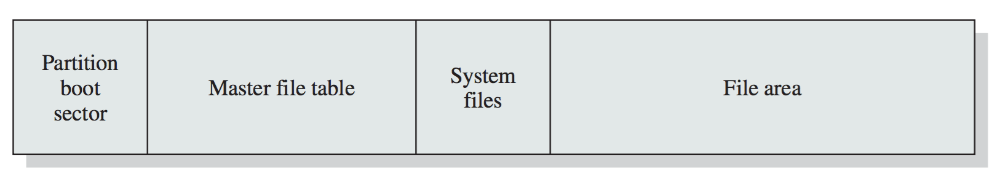

# Sections
- [General](#general)
- [Files](#files)
- [Process Management](#process-management)
- [Signals](#signals)
- [Pipes and Shared Memory](#pipes-and-shared-memory)
- [Network](#network)
  - [Sockets](#sockets)
  - [cURL](#curl)
- [Threads and Concurrency](#threads-and-concurrency)
  - [Spinlock](#spinlock)
  - [Atomic Types](#atomic-types)
- [Select, Poll, AIO, Libevent](#select-poll-aio-libevent)
- [Notes](#notes)
  - [Speedup](#speedup)
  - [Synchronization Patterns](#synchronization-patterns)
  - [Conditions for Deadlock](#conditions-for-deadlock)
  - [Valgrind](#valgrind)
  - [Helgrind](#helgrind)
  - [Consistency: Journalling](#consistency-journalling)
    - [ZFS (Sun/Oracle File System)](#zfs-sunoracle-file-system)
    - [APFS (Apple File System)](#apfs-apple-file-system)
    - [NTFS (Windows File System)](#ntfs-windows-file-system)

## General

```C
/*
F: allocate num_bytes memory in the heap
A: num_bytes of memory wanted to allocate
R: void* pointer to the memory block in heap
H: <stdlib.h>
E: errno is set on failure
*/
void* malloc( int num_bytes );
```
```C
/*
F: allocate (count * size) bytes memory in the heap
 : AND memory is initialized to ZERO
A: "count" number of objects, "size" of each object wanted to allocate
R: void* pointer to the memory block in heap
H: <stdlib.h>
E: errno is set on failure
*/
void* calloc( size_t count, size_t size );
```
```C
/*
F: allocate new_size bytes memory in the heap AND deallocates
 : the old ptr space (if required)
A: ptr to old memory (NULL allowed, new memory initialized), new_size
R: void* pointer to the updated memory block in heap
H: <stdlib.h>
E: errno is set on failure, input pointer is still valid if realloc fails
*/
void *realloc( void *ptr, size_t new_size );
```
```C
/*
F: free the memory space in heap
A: ptr to memory
H: <stdlib.h>
*/
void free( void* p );
```
```C
/*
F: Convert string s to int
A: string s
H: <stdlib.h>
*/
int atoi( const char *s );
```
```C
/*
F: Prints format string with given arguments
A: fmt: format string and corresponding parameters
      : d: signed decimal
      : lu: unsigned long
      : f: double
      : x: unsigned hex
      : s: string
      : n$: allows reordering of arguments as required
R: >0 for error
H: <stdlib.h>
*/
int printf( const char * fmt, ... );
```
```C
/*
F: Copies num_bytes over from source to destination
A: source, destination pointer, size num_bytes to be transferred
R: original value of destination
H: <string.h>
*/
void* memcpy( void *destination, const void *source, size_t num_bytes );
```
```C
/*
F: Writes num_bytes of (unsigned char) value to mem
A: mem pointer, value, num of bytes to be written
R: original value of destination
H: <string.h>
*/
void *memset( void *mem, int value, size_t num_bytes );
```
```C
/*
F: returns size of string not counting null terminator
A: string
R: length of string
H: <string.h>
*/
size_t strlen( const char * string );
```
```C
/*
F: compares string str1, str2 up to max_size character
A: str1, str2, max_size to be compared
R: >0 iff s1 > s2, 0 iff s1 == s2, 0< if s1 < s2
H: <string.h>
*/
int strncmp ( const char * str1, const char * str2, size_t max_size );
```
## Files

``` C

/*
F: opens the file for consumption using given flags
A: pathname ie path to file,
 : flags: one of O_RDONLY, O_WRONLY, or O_RDWR
        : O_CREAT: if pathname does not exist, create it
        : O_APPEND: append mode
        : O_TRUNC: file will be truncated iff exists
        : O_ASYNC: generate signal when file available
        : O_DIRECTORY: if pathname is not a directory, open fails
        : O_EXCL: with O_CREAT, FILE has to be created, or else EEXIST
        : O_NOFOLLOW: do not follow symlinks
        : O_NONBLOCK: when possible, open non-blocking-ly
R: file_descriptor OR -1 on error
H: <fcntl.h>
E: errno is set on failure
*/
int open( const char *pathname, int flags );
```
```C
/*
F: attempts to read count bytes into buffer
A: file_descriptor to read, buffer to read into, count bytes
R: number of bytes actually read OR -1 on error
H: <unistd.h>
E: errno is set on failure
*/
ssize_t read( int file_descriptor, void *buffer, size_t count );
```
```C
/*
F: writes upto count bytes from buffer to file represented by file_descriptor
A: file_descriptor to write to, buffer to read from, count bytes to write
R: number of bytes actually written OR -1 on error
H: <unistd.h>
E: errno is set on failure
*/
ssize_t write( int file_descriptor, const void *buffer, size_t count );
```
```C
/*
F: renames the file, moving between directories if required
A: old_pathname and new_pathname to rename
R: 0 on success, -1 on error
H: <stdio.h>
E: errno is set on failure
*/
int rename( const char *old_pathname, const char *new_pathname );
```
```C
/*
F: closes the file, any record locks are removed
A: file_descriptor to close
R: 0 on success, -1 on error
H: <unistd.h>
E: errno is set on failure
*/
int close( int file_descriptor );
```
```C
/*
F: opens the file for consumption (with mode) associates a stream with it.
A: pathname ie path to file,
 : mode:
        : r : read from beginning
        : r+: R/W from beginning
        : w : truncate to 0 length OR create file for write from beginning
        : w+: RW from beginning, create if not exist, truncate iff exist
        : a : write at end of file, create if not exist
        : a+: append for RW from end of file
        : b : binary file
R: FILE stream or NULL on error
H: <stdio.h>
E: errno is set on failure
*/
FILE* fopen( const char *pathname, const char *mode );
```
```C
/*
F: close stream f
A: f stream
R: 0 on success or EOF on error
H: <stdio.h>
E: errno is set on failure
*/
int fclose( FILE* f );
```
```C
/*
F: read nmemb items of data, each of size size from file into ptr
A: f stream, number of members nmemb, size of each object, and destination pointer buffer
R: number of bytes read
H: <stdio.h>
E: errno is set on failure
*/
size_t fread( void* buffer, size_t size, size_t nmemb, FILE* f );
```
```C
/*
F: write nmemb items of data, each of size size from ptr into file
A: f stream, number of members nmemb, size of each object, and source pointer
R: number of bytes written
H: <stdio.h>
E: errno is set on failure
*/
size_t fwrite( const void *ptr, size_t size, size_t nmemb, FILE* f);
```
```C
/*
F: Identical to printf but accepts file f to write to
A: File pointer f
 : fmt - format string and corresponding parameters
   : d: signed decimal
   : lu: unsigned long
   : f: double
   : x: unsigned hex
   : s: string
   : n$: allows reordering of arguments as required
R: >0 for error
H: <stdlib.h>
*/
int fprintf( FILE* f, const char* format, ... );
```
```C
/*
F: Scans file for format string
A: File pointer f
 : fmt - format string and corresponding parameters
   : d: signed decimal
   : lu: unsigned long
   : f: double
   : x: unsigned hex
   : s: string
   : n$: allows reordering of arguments as required
R: return the number of input items successfully matched and assigned or EOF on error
H: <stdio.h>
*/
int fscanf( FILE* f, const char* format, ... );
```
```C
/*
F: Convert File ptr to file descriptor
A: File pointer f
R: returns file descriptor for corresponding file
H: <stdio.h>
N: file still owned by File stream so call fclose still
*/
int fileno( FILE* f );
```
```C
/*
F: Seeks file pointer to designated location
A: File pointer f, relative offset from origin
 : origin:
    : SEEK_SET: start
    : SEEK_CUR: current
    : SEEK_END: end
R: returns file descriptor for corresponding file
H: <stdio.h>
*/
int fseek ( FILE * f, long int offset, int origin );
```
```C
/*
F: Deletes a pathname from filesystem
A: pathname of file or directory to be removed
R: 0 on success, -1 on error
H: <stdio.h>
E: errno is set on failure
*/
int remove( const char* pathname );
```
```C

/*
F: Apply/remove "advisory" lock on fd
A: file_descriptor
 : type:
    : LOCK_SH: shared lock to share between processes
    : LOCK_EX: one process at a time
    : LOCK_UN: remove an existing lock held by process
R: 0 on success, -1 on error
H: <sys/file.h>
E: errno is set on failure
*/
int flock( int file_descriptor, int type );
```
```C
/*
F: Apply the command (OR flock) on file
A: file_descriptor
 : command:
    : F_GETLK: determine if lock described by flockptr is blocked
    : F_SETLK: set the lock described by flockptr
    : F_SETLKW: blocking F_SETLK
R: 0 on success or ENUM, -1 on error
H: <fcntl.h>
E: errno is set on failure
N: do not mix lockf and fcntl
 : this can also be used to make sockets non-blocking as follows
U: sockfd = socket( PF_INET, SOCK_STREAM, 0 );
 : fcntl( sockfd, F_SETFL, O_NONBLOCK );
*/
int fcntl( int file_descriptor, int command, ... /* struct flock * flockptr */);

struct flock {
  short l_type; // F_RDLCK, F_WRLCK, or F_UNLCK
  short l_whence; // SEEK_SET, SEEK_CUR, or SEEK_END
  off_t l_start; // offset in bytes, relative to l_whence
  off_t l_len; // length, in bytes; 0 means lock to EOF
  pid_t l_pid; // returned with F_GETLK
};
```
```C
/*
F: apply, test or remove a POSIX lock on an open file
A: file_descriptor fd
 : len: can be positive or negative relative to current location
 : command:
    : F_LOCK: acquire exclusive lock on fd
    : F_TLOCK: try-lock for F_LOCK
    : F_ULOCK: unlock
    : F_TEST: check if unlocked, 0 if unlocked, else -1
R: 0 on success, -1 on error
H: <unistd.h>
E: errno is set on failure
N: do not mix lockf and fcntl
*/
int lockf( int file_descriptor, int command, off_t length );
```

```C
/*
Inotify API provides a mechanism for monitoring filesystem events, at file or directory level.
*/

/*
F: creates an inotify instance
A: NOTHING
R: inotify_instance's file_descriptor
H: <sys/inotify.h>
E: errno is set on failure
*/
int inotify_init( );
```
```C
/*
F: Adds a path to the "watch list" of an inotify fd
A: inotify fd, pathname of file or directory
  : mask
    : IN_ACCESS:	File accessed (read/execute)
    : IN_ATTRIB:	Metadata changed, such as permissions
    : IN_CLOSE_WRITE:	File opened for writing was closed
    : IN_CLOSE_NOWRITE:	File not opened for writing was closed
    : IN_CREATE:	File or directory created in watched directory
    : IN_DELETE:	File or directory deleted from watched directory
    : IN_DELETE_SELF:	Watched file or directory deleted
    : IN_MODIFY:	File modified (write, for example)
    : IN_OPEN:	File opened
    : IN_ALL_EVENTS:	Watch for all of the above (and a few more)
R: non negative watch descriptor wd OR -1 on error
H: <sys/inotify.h>
E: errno is set on failure
*/
int inotify_add_watch( int fd, const char* pathname, uint32_t mask );
```
```C
/*
F: Removes an item from the "watch list" of an inotify fd
A: inotify fd, watch descriptor wd
R: non negative watch descriptor OR -1 on error
H: <sys/inotify.h>
E: errno is set on failure
*/
int inotify_rm_watch( int fd, uint32_t wd );
```
```C
struct inotify_event {
  // Structure returned when you read inotify fd
  int wd; // watch descriptor

  uint32_t mask; // mask describing event

  // Unique cookie associating related events
  // rename shows up as 2 events
  uint32_t cookie;

  uint32_t len; // describes len of name

  char name[]; // optional name

  // note: we don't actually don't know the size of the struct
  // because of the name parameter, use ioctl as shown below
};
```
```C
/*
F: used to get size of inotify event before actually reading
A: inotify fd, FIONREAD for param2, value to be changed &numbytes
R: non negative watch descriptor OR -1 on error
H: <sys/inotify.h>
E: errno is set on failure
U: ioctl( fd, FIONREAD, &numbytes )
*/
int ioctl(int fd, unsigned long request, ...);
```

## Process Management

```C
/*
F: creates new process by duplicating the calling process
A: NOTHING
R: pid of child process returned in parent, 0 in child OR -1 on error
H: <unistd.h>
E: errno is set on failure
*/
pid_t fork( );
```
```C
/*
F: waits for state change in child
A: *status stores information, can be NULL
R: pid of terminated child returned in parent OR -1 on error
H: <unistd.h>
E: errno is set on failure
U: wait(&childStatus);
N: if parent does not wait, then child resources are not deallocated and
 : it becomes a zombie, which don't die until parent dies when they are
 : inherited by the "init" which waits and kills them
*/
pid_t wait( int* status );
```
```C
/*
F: waits for state change in pid
A: *status stores information, can be NULL
 : pid:
    :-1: wait for any child
    :>0: wait for pid
 : options: 0 is fine - notes
R: pid of terminated child returned in parent OR -1 on error
H: <unistd.h>
E: errno is set on failure
U: waitpid( pid, NULL, 0 );
N: if parent does not wait, then child resources are not deallocated and
 : it becomes a zombie, which don't die until parent dies when they are
 : inherited by the "init" which waits and kills them
*/
pid_t waitpid( pid_t pid, int status, int options );
```

```C
/*
F: causes normal process termination
A: status to be returned to parent: EXIT_SUCCESS or EXIT_FAILURE
R: status & 0377 is returned to parent, but does not truly "return"
H: <stdlib.h>
*/
void exit( int status );
```

## Signals

| **Signal** 	| **Comment** 	| **Value** 	| **Default Action** 	|
|:------------------|:-----------------------------------------------|:----------------|:-----------------------------------|
| `SIGHUP` 	| Hangup detected 	| 1 	| Terminate process 	|
| `SIGINT` 	| Keyboard interrupt (`Ctrl-C`) 	| 2 	| Terminate process 	|
| `SIGQUIT` 	| Quit from keyboard 	| 3 	| Terminate process, dump debug info 	|
| `SIGILL` 	| Illegal instruction 	| 4 	| Terminate process, dump debug info 	|
| `SIGKILL` 	| Kill signal 	| 9 	| Terminate process 	|
| `SIGSEGV` 	| Segmentation fault (invalid memory reference) 	| 11 	| Terminate process, dump debug info 	|
| `SIGTERM` 	| Termination signal 	| 15 	| Terminate process 	|
| `SIGCHLD` 	| Child stopped or terminated 	| 20,17,18 	| Ignore 	|
| `SIGCONT` 	| Continue if stopped 	| 19,18,25 	| Continue the process if stopped 	|
| `SIGSTOP` 	| Stop process 	| 18,20,24 	| Stop process 	|

```C
/*
F: send ANY signal to process
A: signal to send
 : pid:
    :  >0: send signal to process with process ID pid
    :   0: send signal to process in same group as caller
    :  -1: broadcast to all that it can
    : <-1: send signal to process with absolute process ID pid
R: 0 if signal sent, -1 on error
H: <signal.h>
E: errno is set on failure
*/
int kill( pid_t pid, int signal );
```

```C
/*
F: sends a signal to the calling process/thread
A: signal to send
R: 0 if signal sent, -1 on error
H: <signal.h>
E: errno is set on failure
*/
int raise( int signal ); /* Send signal to the current process */
```

```C
/*
F: basic usage of a singla handler
A: signal to handle, signal handler passed
H: <signal.h>
U: void sig_handler( int signal_num ); signal( SIGINT, sig_handler );
*/
void ( *signal(int signum, void (*handler)(int)) ) (int);//*```
```

```C
/*
F: wait until terminating signal arrives or one that triggers handler
A: NOTHING
H: <unistd.h>
*/
int pause(void)
```

```C
/*
F: Initialize an empty sigset_t
A: accepts signal_set set
R: 0 on completion, -1 on error
H: <signal.h>
E: errno is set on failure
*/
int sigemptyset( sigset_t set );
```
```C
/*
F: Add signal to signal set
A: sigset_t to add signal to
R: 0 on completion, -1 on error
H: <signal.h>
E: errno is set on failure
*/
int sigaddset( sigset_t set, int signal );
```
```C
/*
F: Add all SIGNALs from current POSIX to signal set
A: sigset_t to add signals to
R: 0 on completion, -1 on error
H: <signal.h>
E: errno is set on failure
*/
int sigfillset( sigset_t set );
```
```C
/*
F: Deletes signal from signal set
A: sigset_t to remove signal from
R: 0 on completion, -1 on error
H: <signal.h>
E: errno is set on failure
*/
int sigdelset( sigset_t set, int signal );
```
```C
/*
F: Checks if signal is in signal set
A: sigset_t to check signal presence
R: 1 if member, 0 if not, -1 on error
H: <signal.h>
E: errno is set on failure
*/
int sigismember( sigset_t set, int signal );
```
```C
/*
F: examine and change blocked signals
A: sigset_t * set to change, old_set OPTIONAL to get the old value
 : how:
    : SIG_BLOCK: signals in set are added to block list
    : SIG_SETMASK: signals in set are used to overwrite over the existing block list
    : SIG_UNBLOCK: signals in set are removed from block list
R: 0 on completion, -1 on error
H: <signal.h>
E: errno is set on failure
*/
int sigprocmask( int how, const sigset_t * set, sigset_t * old_set );
```

## Pipes and Shared Memory

```C
/*
F: creates a unidirectional data channel for IPC
A: array of exactly 2 file descriptors
R: 0 on completion, -1 on error
H: <unistd.h>
E: errno is set on failure
U: use pipe before forking to get the same fd's b/w child and parent
*/
int pipe( int file_descriptors[] );
```
```C
/*
F: create new shared memory segment
A: key: IPC_PRIVATE - notes
 : size: size of shared memory needed
 : shmflg:
    : IPC_CREAT: create new segment
    : IPC_EXCL: exclusive create segment
    : can also be OR'ed with UNIX type permissions
R: integer identifier of shared memory segment, -1 on error
H: <sys/shm.h> & <sys/ipc.h>
E: errno is set on failure
U: int shmid = shmget( IPC_PRIVATE, 32, IPC_CREAT | 0666  );
*/
int shmget( key_t key, size_t size, int shmflg );
```
```C
/*
F: attach a shared memory segment to current process's address space
A: shmid: shared memory segment's id returned by shmget
 : shmaddr: NULL - notes, auto selects
 : shmflg: 0 - notes
    : SHM_RDONLY: only READ
    : other flags exist, but we don't need to care
R: void pointer to shared memory segment, -1 on error
H: <sys/shm.h> & <sys/ipc.h>
E: errno is set on failure
U: void* mem = shmat( shmid, NULL, 0 );
*/
void* shmat( int shmid, const void* shmaddr, int shmflg );
```
```C
/*
F: detaches the shared memory segment from current process's address space
A: shmaddr: memory address to detach
R: 0 on sucess, -1 on error
H: <sys/shm.h> & <sys/ipc.h>
E: errno is set on failure
U: shmdt( mem );
*/
int shmdt( const void* shmaddr );
```
```C
/*
F: ONLY to delete the shared memory segment
A: shmid: shared memory id
 : cmd: IPC_RMID for deleting
 : buf: NULL - notes for DELETE
R: 0 on sucess, -1 on error
H: <sys/shm.h> & <sys/ipc.h>
E: errno is set on failure
U: shmctl( shmid, IPC_RMID, NULL );
*/
int shmctl( int shmid, int cmd, struct shmid_ds *buf );
```

```C
/*
F: ALTERNATE to create shared memory segment
A: address: NULL - notes
 : length: length of the mapping
 : protection:
      : PROT_READ: Pages may be read
      : PROT_WRITE: Pages may be written
      : PROT_EXECUTE: Pages may be executed
      : PROT_NONE: Pages may not be accessed
 : flag: MAP_SHARED for shared
 : fd: file descriptor of the file we wish to map
 : offset: offset from the start of the file
R: pointer to starting address of memory mapped to file OR (void *) -1 on error
H: <sys/mman.h>
E: errno is set on failure
N: PROT_NONE is used when you want to restrict the memory, and put "guards"
 : on the memory range.
*/
void* mmap( void* address, size_t length, int protection, int flag, int fd, off_t offset );
```
```C
/*
F: ALTERNATE update permissions for memory segment
A: address: NULL - notes
 : length: length of the mapping
 : prot: updated protection rules
      : PROT_READ: Pages may be read
      : PROT_WRITE: Pages may be written
      : PROT_EXECUTE: Pages may be executed
      : PROT_NONE: Pages may not be accessed
R: 0 on success OR -1 on error
H: <sys/mman.h>
E: errno is set on failure
*/
int mprotect( void* address, size_t length, int prot );
```
```C
/*
F: Flushes out changes in memory directly back to file
A: address: NULL - notes
 : length: length of the mapping
 : flags: MS_SYNC - notes
R: 0 on success OR -1 on error
H: <sys/mman.h>
E: errno is set on failure
*/
int msync( void* address, size_t length, int flags );
```
```C
/*
F: Unmap segment
A: address: NULL - notes
 : length: length of the mapping
R: 0 on success OR -1 on error
H: <sys/mman.h>
E: errno is set on failure
N: segment is generally automatically unmapped when process ends
*/
int munmap( void* address, size_t length );
```

## Network

### Sockets
```C
/*
F: Creates an endpoint for communication
A: domain: AF_INET - notes
 : type: specifies communication semantics
    : SOCK_STREAM: bidirectional byte stream
    : SOCK_DGRAM: datagrams
 : protocol: 0 - notes
R: file descriptor for new socket OR -1 on error
H: <sys/socket.h> AND <sys/types.h>
E: errno is set on failure
N: you can just close the socket with `close`
*/
int socket( int domain, int type, int protocol );
```
```C
/*
F: Byte order from host to network order
A: hostint32: 4byte argument
R: returns "network" byte-reordered argument
H: <arpa/inet.h>
*/
uint32_t htonl( uint32_t hostint32 );
```
```C
/*
F: Byte order from host to network order
A: hostint16: 2byte argument
R: returns "network" byte-reordered argument
H: <arpa/inet.h>
*/
uint16_t htons( uint16_t hostint16 );
```
```C
/*
F: Byte order from network to host order
A: netint32: 4byte argument
R: returns "host" byte-reordered argument
H: <arpa/inet.h>
*/
uint32_t ntohl( uint32_t netint32 );
```
```C
/*
F: Byte order from network to host order
A: netint32: 2byte argument
R: returns "host" byte-reordered argument
H: <arpa/inet.h>
*/
uint16_t ntohs( uint16_t netint16 );
```
```C
/*
U: addr.sin_addr.s_addr = htonl( INADDR_ANY );
 : use above to select any IP of the device
*/
struct sockaddr_in {
  sa_family_t sin_family; // AF_INET
  in_port_t sin_port; // port in network byte order
  struct in_addr sin_addr; // IPv4 address
};
```
```C
/*
U: struct addrinfo hints;
 : memset(&hints, 0, sizeof hints);
 : after that set each of the parameters below to the required value
*/
struct addrinfo {
  ...
  sa_family_t ai_family; // AF_INET
  int ai_socktype; // SOCK_STREAM or SOCK_DGRAM
  int ai_socktype; // AF_INET for IPv4
  ...
}
```
```C
/*
F: Creates an endpoint for communication
A: node: "url" or IP
 : service: port
 : hints: struct declared as above, using the default parameters
 : res: the complete addrinfo is stored in res, also declared as above
      : but without any of the default parameters
R: 0 on sucess OR NON_ZERO error code on error
H: <sys/socket.h> AND <sys/types.h> AND <netdb.h>
U: int result = getaddrinfo("www.example.com", "2520", &hints, &serverinfo);
 : struct sockaddr_in * sain = (struct sockaddr_in*) serverinfo->ai_addr;
*/
int getaddrinfo( const char *node, const char *service,
                  const struct addrinfo *hints, struct addrinfo **res );
```

```C
/*
F: Used on client side of things to connect to socket
A: sockfd: file descriptor from socket
 : addr: sockaddr returned from getaddrinfo
 : len: if self created: sizeof(addr) else res->ai_addrlen from prev step
R: 0 on sucess OR -1 on error
H: <sys/socket.h> AND <sys/types.h>
E: errno is set on failure
U: int status = connect(sockfd, res->ai_addr, res->ai_addrlen);
*/
int connect( int sockfd, struct sockaddr *addr, socklen_t len );
```
```C
/*
F: Used on server side of things to "create" a socket
A: sockfd: file descriptor from socket
 : addr: sockaddr_in to be cast using default params
 : len: sizeof(addr)
R: 0 on sucess OR -1 on error
H: <sys/socket.h> AND <sys/types.h>
E: errno is set on failure
U: bind( socketfd, (struct sockaddr*) &addr, sizeof( addr ));
*/
int bind( int sockfd, const struct sockaddr *addr, socklen_t addrlen );
```
```C
/*
F: Actually used to listen on server side
A: sockfd: file descriptor from socket, that was binded
 : backlog: maximum number of pending connections in queue
R: 0 on sucess OR -1 on error
H: <sys/socket.h> AND <sys/types.h>
E: errno is set on failure
U: listen( socketfd, 5 );
*/
int listen( int sockfd, int backlog );
```
```C
/*
F: Declares secondary socket for correspondence
A: sockfd: socket file descriptor that we are listening on
 : addr: client addr that gets updated by function, simply allocate sockaddr_in and pass
 : len: client addr size that gets updated by function, simply allocate int and pass
R: addr and len are changed, 0 on sucess OR -1 on error
H: <sys/socket.h> AND <sys/types.h>
E: errno is set on failure
U: newsockfd = accept( socktfd, (struct sockaddr*) &client_addr, &client_addr_size );
*/
int accept( int sockfd, struct sockaddr *addr, socklen_t *len );
```
```C
/*
F: Sends data to server side
Equivalent to: sendto(sockfd, buf, len, flags, NULL, 0);
*/
int send( int sockfd, const void* msg, int length, int flags );
```
```C
/*
F: Sends data from client side
Equivalent to: recvfrom(sockfd, buf, len, flags, NULL, NULL);
*/
int recv( int sockfd, void * buffer, int length, int flags );
```
```C
/*
F: Declares secondary socket for correspondence
A: sockfd: file descriptor of sending socket
 : msg: message that we want to send
 : len: (string) length of message
 : flags: 0 - notes
 : to: sockaddr of recieving socket
 : token: sizeof(to) or res->ai_addrlen
R: number of bytes sent on sucess OR -1 on error
H: <sys/socket.h> AND <sys/types.h>
E: errno is set on failure
*/
int sendto( int sfd, const void* msg, int len, unsigned int flags, const struct sockaddr* to, socklen_t token );
```
```C
/*
F: Declares secondary socket for correspondence
A: sockfd: file descriptor of socket want to recieve from
 : buffer: message that we recieved is updated here
 : len: max length of buffer we are accpeting
 : flags: 0 - notes
 : from: sockaddr of source
 : fromlength: sizeof(from) or res->ai_addrlen
R: length of message recieved on sucess OR -1 on error
H: <sys/socket.h> AND <sys/types.h>
E: errno is set on failure
*/
int recvfrom( int sfd, void* buffer, int len, unsigned int flags, struct sockaddr* from, int* fromlength );
```

### cURL
```C
/*
F: global init for everything curl
A: flags: CURL_GLOBAL_DEFAULT - notes
H: <curl/curl.h>
R: 0 on success, non-zero on error
N: Not thread safe, call EXACTLY ONCE
*/
CURLcode curl_global_init( long flags );
```
```C
/*
F: start a libcurl easy session
A: NOTHING
H: <curl/curl.h>
R: NON-NULL CURL handle on success, NULL on error
N: If you did not already call curl_global_init,
 : curl_easy_init does it automatically.
*/
CURL* curl_easy_init( void );
```
```C
/*
F: finish a libcurl easy session
A: handle: CURL handle from easy_init
H: <curl/curl.h>
R: void
*/
void curl_easy_cleanup( CURL* handle );
```
```C
/*
F: Allows to actually configure the curl call
A: handle: CURL handle from easy_init
 : option:
      : CURLOPT_URL: url to connect, character array
      : CURLOPT_WRITEFUNCTION: set write callback function, function pointer
      : CURLOPT_WRITEDATA: set write callback data, void *
      : CURLOPT_READFUNCTION: set read callback function, function pointer
      : CURLOPT_READDATA: set read callback data, void *
      : CURLOPT_PUT: Issue PUT request, 1L - notes
      : CURLOPT_POST: Issue POST request, 1L - notes
      : CURLOPT_HTTPGET: Issue GET request, 1L - notes
H: <curl/curl.h>
R: CURLE_OK(0), non-zero for error
U: curl_easy_setopt( curl, CURLOPT_URL, "https://example.com/" );
*/
CURLcode curl_easy_setopt( CURL *handle, CURLoption option, parameter );
```
```C
/*
F: Perform the configured curl call
A: handle: CURL handle from easy_init
H: <curl/curl.h>
R: 0 on success, non-zero for error
U: res = curl_easy_perform(curl);
*/
CURLcode curl_easy_perform( CURL * easy_handle );
```
```C
/*
F: Allows to request internal information from the curl session
A: handle: CURL handle from easy_init
 : info: address of parameters passed to allow them to be updated
    : CURLINFO_EFFECTIVE_URL: last used effective url, char * redirect_url;
    : CURLINFO_RESPONSE_CODE: http response code, int http_response_code;
    : CURLINFO_PRIVATE: get private data from request, const char *szUrl;
H: <curl/curl.h>
R: 0 on success, non-zero for error
U: res = curl_easy_perform(curl);
*/
CURLcode curl_easy_getinfo( CURL *curl, CURLINFO info, ... );
```
```C
/*
F: global cleanup for everything curl
A: void
H: <curl/curl.h>
R: void
N: also not thread safe
*/
void curl_global_cleanup( void );
```
```C
/*
F: starts a libcurl MULTI session
A: NOTHING
H: <curl/curl.h>
R: NON-NULL CURLM handle on success, NULL on error
*/
CURLM *curl_multi_init( void );
```
```C
/*
F: Adds easy_handle to MULTI stack
A: multi_handle from multi_init and easy_handle from easy_init
H: <curl/curl.h>
R: CURLMcode type
N: CURLMcode for `curl_multi_add_handle` not discussed in notes
*/
CURLMcode curl_multi_add_handle( CURLM *multi_handle, CURL *easy_handle );
```
```C
/*
F: Removes easy_handle to MULTI stack
A: multi_handle from multi_init and easy_handle from easy_init
H: <curl/curl.h>
R: CURLMcode type
N: can be removed while performing, but will halt the actual "perform"
 : CURLMcode for `curl_multi_add_handle` not discussed in notes
*/
CURLMcode curl_multi_remove_handle( CURLM *multi_handle, CURL *easy_handle );
```
```C
/*
F: Perform or check if data available from each easy_handle
A: pre-configured multi_handle
 : running_handles as an int that gets updated by reference, if 0 all done
H: <curl/curl.h>
R: CURLMcode type
N: can be called multiple times, without any restart behaviour
 : CURLMcode for `curl_multi_perform` not discussed in notes

*/
CURLMcode curl_multi_perform( CURLM *multi_handle, int *running_handles );
```
```C
/*
F: Block current thread until an "event" occurs
A: multi_handle: already running MULTI handle
 : extra_fds: NULL - notes
 : extra_nfds: 0 - notes
 : timeout_ms: max time to wait in milliseconds
 : numfds: gets updated by function as the number of "interesting events"
H: <curl/curl.h>
R: Does not return until event occurs, CURLMcode type
N: all callbacks still get executed
 : "you can ignore most of the parameters and just wait for something to happen"
 : CURLMcode for `curl_multi_wait` not discussed in notes
*/
CURLMcode curl_multi_wait(CURLM *multi_handle, struct curl_waitfd extra_fds[], unsigned int extra_nfds, int timeout_ms, int *numfds );
```
```C
/*
F: Allows to query status of easy handle
A: multi_handle: already running MULTI handle
 : msgs_in_queue: updated to the number of unread messages
H: <curl/curl.h>
R: Does not return until event occurs, CURLMcode type
N: Each easy handle has an associated status message as
 : well as a return code **Why both**? Well - one is about what the status
 : of the request is. The message could be, for example “done”, but does
 : that mean finished with success or finished with an error?
 : CURLMsg:
    : CURLMSG msg: CURLMSG_DONE - request completed
    : CURLCODE data.result: CURLE_OK if all good
    : first check m->msg for CURLMSG_DONE, then m->data.result for all good
*/
CURLMsg *curl_multi_info_read( CURLM *multi_handle, int *msgs_in_queue );
```
```C
/*
F: Setup CURLM for select
A: mh: that we want to select
 : rd_fd_set: that gets modified in place with the read watch fdset
 : wr_fd_set: that gets modified in place with the write watch fdset
 : ex_fd_set: that gets modified in place with the exception watch fdset
 : max_fd: that gets modified in place with the maximum file descriptor
H: <curl/curl.h>
R: CURLMcode type
*/
CURLMcode curl_multi_fdset( CURLM *mh, fd_set *rd_fd_set, fd_set *wr_fd_set, fd_set *ex_fd_set, int *max_fd );
```
```C
/*
F: Return timeout from CURLM for select
A: mh: that we want to select
 : timeout: that we want to get the value that gets modified in place
H: <curl/curl.h>
R: CURLMcode type
U: struct timeval timeout;
 : long timeo;
 :
 : curl_multi_timeout( cm, &timeo );
 : if(timeo < 0) {
 :   // no set timeout, use a default
 :   timeo = 980;
 : }
 :
 : timeout.tv_sec = timeo / 1000;
 : timeout.tv_usec = (timeo % 1000) * 1000;
*/
CURLMcode curl_multi_timeout( CURLM *multi_handle, long *timeout );
```
```C
/*
F: Cleans up and removes a whole MULTI stack
A: multi_handle from multi_init
H: <curl/curl.h>
R: CURLMcode return value, libcurl error otherwise
N: handles must be removed and cleaned up before calling multi_cleanup
 : CURLMcode for `curl_multi_cleanup` not discussed in notes
*/
CURLMcode curl_multi_cleanup( CURLM *multi_handle );
```
```C
/*
F: Write callback for a curl request
A: ptr: points to whatever data we recieved
 : size: ALWAYS 1
 : nmemb: size of the data we recieved
 : userdata: we can pass in some of our own data here
H: <curl/curl.h>
R: the spec requires that size_t returns equal the number of bytes
 : processed, otherwise its considered an error
*/
size_t write_callback( char *ptr, size_t size, size_t nmemb, void *userdata );
```
```C
/*
F: Read callback for a curl request
A: buffer: area where you put the data to send
 : size: size of each item
 : nitems: number of items
 : inputdata: we can pass in some of our own data here
H: <curl/curl.h>
R: number of bytes sucessfully put,
 : 0 signals EOF, and no more uploads will occur
*/
size_t read_callback( char *buffer, size_t size, size_t nitems, void *inputdata );
```

## Threads and Concurrency
```C
/*
F: Create a new thread
A: thread: pthread identifier for the new thread
 : attr: NULL - notes
 : start_routine: function that is called
 : arg: argument for start_routine
H: <pthread.h>
R: 0 on error, some error code on error and *thread is undefined
*/
pthread_create( pthread_t *thread, const pthread_attr_t *attr, void *(*start_routine)( void * ), void *arg );
```
```C
/*
F: Thread functions - start_routine
A: start_params: void pointer to the arguments
H: <pthread.h>
R: untyped pointer, can be anything
*/
void* do_something( void* start_params )
```
```C
/*
F: Initialise attributes
A: attr: address of pthread_attr_t to be setup with default values
H: <pthread.h>
R: attr is setup by reference, 0 on error, non-zero on error
N: Can be passed on to pthread_create as attr
*/
int pthread_attr_init(pthread_attr_t *attr);
```
```C
/*
F: Destroy attributes and free up memory
A: attr: to be destroyed
H: <pthread.h>
R: attr is destroyed by reference, 0 on error, non-zero on error
*/
int pthread_attr_destroy(pthread_attr_t *attr);
```
```C
/*
F: Wait until thread finishes
A: thread: to wait for
 : returnValue: we are going to supply a pointer that the join function  
 :              will update
H: <pthread.h>
R: UNKNOWN
*/
pthread_join( pthread_t thread, void **returnValue );
```
```C
/*
F: Detach thread from creating parent such that it cannot be joined on
A: thread: to detach
H: <pthread.h>
R: UNKNOWN
*/
pthread_detach( pthread_t thread );
```
```C
/*
F: Send a cancellation request to thread
A: thread: to cancel
H: <pthread.h>
R: UNKNOWN
*/
pthread_cancel( pthread_t thread );
```
```C
/*
F: Set cancellation type on calling thread
A: type: new type that we want to set to
       : PTHREAD_CANCEL_DEFERRED: default, acted on immediately
       : PTHREAD_CANCEL_ASYNCHRONOUS: thread responsible for checking
 : oldtype: argument updated with old type, we might not care
H: <pthread.h>
R: int: 0 on sucess, on error: non zero error number
*/
pthread_setcanceltype( int type, int *oldtype );
```
```C
/*
F: Test to see if calling thread is cancelled by parent
A: void
H: <pthread.h>
R: void
N: If it is indeed cancelled, the thread will quit then,
 : calling any cleanup handlers if necessary
*/
pthread_testcancel( );
```
```C
/*
F: Add cleanup handler to top of cleanup stack
A: routine: called when thread is cancelled, or pthread_exit (not return)
 : arg: arguments to be passed to routine when called
H: <pthread.h>
R: void
*/
pthread_cleanup_push( void (*routine)(void*), void *argument );
```
```C
/*
F: Remove cleanup handler from top of stack
A: execute: if execute is non zero, routine is executed and popped
H: <pthread.h>
R: void
*/
pthread_cleanup_pop( int execute );
```
```C
/*
F: Terminate calling thread with value
A: Value will be sent back to the parent thread
H: <pthread.h>
R: UNKNOWN
*/
pthread_exit( void *value );
```
```C
/*
F: Initialies mutex with attributes
A: mutex: to initialize
 : attr: NULL - notes
H: <pthread.h>
R: 0 on success, non-zero on error
N: `pthread_mutex_t mutex = PTHREAD_MUTEX_INITIALIZER;`
 : If attributes were initialised with pthread_mutexattr_init
 : then they have to be destroyed with pthread_mutexattr_destroy
*/
pthread_mutex_init( pthread_mutex_t *mutex, pthread_mutexattr_t *attributes );
```
```C
/*
F: Lock mutex for no other thread to use
A: mutex: to lock
H: <pthread.h>
R: 0 on success, non-zero on error
*/
pthread_mutex_lock( pthread_mutex_t *mutex );
```
```C
/*
F: Non-blocking mutex locking
A: mutex: to try locking
H: <pthread.h>
R: 0 on success, non-zero on error
*/
pthread_mutex_trylock( pthread_mutex_t *mutex );
```
```C
/*
F: Unlock mutex for another thread to use
A: mutex: to unlock
H: <pthread.h>
R: 0 on success, non-zero on error
*/
pthread_mutex_unlock( pthread_mutex_t *mutex );
```
```C
```C
/*
F: Destroy mutex
A: mutex: to destroy
H: <pthread.h>
R: 0 on success, non-zero on error
N: destroying a locked mutex is undefined behaviour
*/
pthread_mutex_destroy( pthread_mutex_t *mutex );
```
```C
/*
F: Initialies rwlock with attributes
A: rwlock: to initialize
 : attr: NULL - notes
H: <pthread.h>
R: 0 on success, non-zero error code on error
*/
pthread_rwlock_init( pthread_rwlock_t * rwlock, pthread_rwlockattr_t * attr );
```
```C
/*
F: Apply a read lock
A: rwlock: to lock for read
H: <pthread.h>
R: 0 on success, non-zero error code on error
*/
pthread_rwlock_rdlock( pthread_rwlock_t * rwlock );
```
```C
/*
F: lock a read-write lock for reading
A: rwlock: to lock for read
H: <pthread.h>
R: 0 on success, non-zero error code on error
N: function will fail if the equivalent call would have
 : blocked the calling thread
*/
pthread_rwlock_tryrdlock( pthread_rwlock_t * rwlock );
```
```C
/*
F: lock a read-write lock object for writing
A: rwlock: to lock for write
H: <pthread.h>
R: 0 on success, non-zero error code on error
*/
pthread_rwlock_wrlock( pthread_rwlock_t * rwlock );
```
```C
/*
F: lock a read-write lock object for writing
A: rwlock: to lock for write
H: <pthread.h>
R: 0 on success, non-zero error code on error
N: function will fail if the equivalent call would have
 : blocked the calling thread
*/
pthread_rwlock_trywrlock( pthread_rwlock_t * rwlock );
```
```C
/*
F: unlock a read-write lock
A: rwlock: to unlock
H: <pthread.h>
R: 0 on success, non-zero error code on error
N: Results are undefined if the read-write lock rwlock
 : is not held by the calling thread
*/
pthread_rwlock_unlock( pthread_rwlock_t * rwlock );
```
```C
/*
F: Destroy rwlock and release any resources
A: rwlock: to destroy
H: <pthread.h>
R: 0 on success, non-zero on error
*/
pthread_rwlock_destroy( pthread_rwlock_t * rwlock );
```

```C
/*
F: Initialise a semaphore
A: semaphore: to be initalised
 : shared: 1 for shared b/w processes
 : initial_value: number of threads that can be unblocked at the same time
H: <semaphore.h>
R: 0 on success, -1 on error
E: errno is set on failure
*/
sem_init( sem_t* semaphore, int shared, int initial_value);
```
```C
/*
F: Initialise a semaphore
A: semaphore: to be destroyed
H: <semaphore.h>
R: 0 on success, -1 on error
E: errno is set on failure
*/
sem_destroy( sem_t* semaphore );
```
```C
/*
F: Decrements the semaphore
A: semaphore: to be waited on
H: <semaphore.h>
R: 0 on success, -1 on error
E: errno is set on failure
N: if the semaphore's value is greater than zero then the decrement
 : proceeds and the function returns, otherwise it blocks
*/
sem_wait( sem_t* semaphore );
```
```C
/*
F: Same as sem_wait except it returns error if decrement cannot be done
A: semaphore: to be tried to wait on
H: <semaphore.h>
R: 0 on success, -1 on error
E: errno is set on failure
*/
sem_trywait( semt_t* semaphore );
```
```C
/*
F: Increments the semaphore
A: semaphore: to be incremented
H: <semaphore.h>
R: 0 on success, -1 on error
E: errno is set on failure
N: If the semaphore's value becomes greater than zero, then
 : another process or thread blocked in a sem_wait call will be woken
 : up and proceed to lock the semaphore.
*/
sem_post( sem_t* semaphore );
```

```C
/*
F: Initialies cv with attributes
A: cv: to initialize
 : attr: NULL - notes
H: <pthread.h>
R: 0 on success, non-zero error code on error
*/
pthread_cond_init( pthread_cond_t *cv, pthread_condattr_t *attr );
```
```C
/*
F: Wait on condition
A: cv: to initialize
 : mutex: mutex to be used for waiting
H: <pthread.h>
R: 0 on success, non-zero error code on error
N: routine should be called only while the mutex is locked
 : mutex is unlocked while condition is not satisfied
*/
pthread_cond_wait( pthread_cond_t *cv, pthread_mutex_t *mutex );
```
```C
/*
F: Signal on condition variable
A: cv: to initialize
H: <pthread.h>
R: 0 on success, non-zero error code on error
N: routine should be called only while the mutex is locked
*/
pthread_cond_signal( pthread_cond_t *cv );
```
```C
/*
F: Signal on ALL waiting threads
A: cv: to initialize
H: <pthread.h>
R: 0 on success, non-zero error code on error
*/
pthread_cond_broadcast( pthread_cond_t *cv );
```
```C
/*
F: Destroy condition variable and release any resources
A: cv: to destroy
H: <pthread.h>
R: 0 on success, non-zero on error
*/
pthread_cond_destroy( pthread_cond_t *cv );
```

#### Spinlock
Another common technique for protecting a critical section in Linux is the spinlock. This is a handy way to implement constant checking to acquire a lock. Unlike semaphores where the process is blocked if it fails to acquire the lock, a thread will constantly try to acquire the lock.

```C
spin_lock( &lock )
/* Critical Section */
spin_unlock( &lock )
```


### Atomic Types
Atomic operations are defined on integral or pointer types of length 1, 2, 4, or 8; replace type with that type.
```C
type __sync_lock_test_and_set( type *ptr, type value );

bool __sync_bool_compare_and_swap( type *ptr, type oldval, type newval );
```
```C
type __sync_val_compare_and_swap( type *ptr, type oldval, type newval );
```
The following functions perform the operation and return the old value:
```C
type __sync_fetch_and_add( type *ptr, type value );
```
```C
type __sync_fetch_and_sub( type *ptr, type value );
```
```C
type __sync_fetch_and_or( type *ptr, type value );
```
```C
type __sync_fetch_and_and( type *ptr, type value );
```
```C
type __sync_fetch_and_xor( type *ptr, type value );
```
```C
type __sync_fetch_and_nand( type *ptr, type value );
```
The following functions perform the operation and return the new value:
```C
type __sync_add_and_fetch( type *ptr, type value );
```
```C
type __sync_sub_and_fetch( type *ptr, type value );
```
```C
type __sync_or_and_fetch( type *ptr, type value );
```
```C
type __sync_and_and_fetch( type *ptr, type value );
```
```C
type __sync_xor_and_fetch( type *ptr, type value );
```
```C
type __sync_nand_and_fetch( type *ptr, type value );
```

## Select, Poll, AIO, `Libevent`

```C
/*
F: Efficiently monitor multiple file descriptors
A: nfds: maximum file descriptor + 1
 : readfds: watched to see if any of fds are ready to read
 : writefds: watched to see if any of fds are ready to write to
 : exceptfds: watched to see for "exceptional conditions"
 : timeout: longest time select waits before returning
H: <sys/select.h>
R: when select returns, all readfds not ready will be cleared, all  
 : writefds not ready will be cleared
 : on return, you have to go through all of the fd's to check if they're
 : ready, using FD_ISSET
 : -1 on ERROR, and
E: errno is set
N: can be used to create a fairly accurate timer by giving null to all
 : the parameters and setting just a timeout
*/
int select( int nfds, fd_set *readfds, fd_set *writefds, fd_set *exceptfds, struct timeval *timeout );
```
```C
/*
F: Initialise and clear the set
A: set: to clear
H: <sys/select.h>
R: 0 on success, non-zero on error
*/
void FD_ZERO( fd_set *set );
```
```C
/*
F: Add file descriptor to set
A: set: to add to
 :  fd: to add
H: <sys/select.h>
R: void
N: An fd_set can have up to 1024 file descriptors
*/
void FD_SET( int fd, fd_set *set );
```
```C
/*
F: Remove file descriptor from set
A: set: to add to
 :  fd: to remove
H: <sys/select.h>
R: void
*/
void FD_CLR( int fd, fd_set *set );
```
```C
/*
F: Test if file descriptor in set
A: set: to add to
 :  fd: to check
H: <sys/select.h>
R: void
*/
int FD_ISSET( int fd, fd_set *set ); /* Tests if fd is a part of the set */
```

```C
struct timeval {
  long tv_sec; // seconds
  long tv_usec; // microseconds
};
```
```C
/*
F: Literally select but with a different timeout paramter in nanoseconds insteaf of microseconds
A: mask: to atomically set the signal mask when we are also waiting for signals.
       : mask can be NULL and no change will be made to the signal mask
*/
int pselect( int nfds, fd_set *rd, fd_set *wr, fd_set *ex, const struct timespec *to, const sigset_t *mask );
```
```C
struct timespec {
  long tv_sec; // seconds
  long tv_nsec; // nanoseconds
};
```
```C
/*
F: Efficiently monitor multiple sockets
A: fds: array of sockets we want to monitor
 : nfds: number of items in the array
 : timeout: in milliseconds
H: <poll.h>
R: when poll returns, we will have to check each of the sockets to see if
 : their corresponding revents are ready by doing a logical "AND":
 : fds[0].revents & POLLIN
 : number of structures with revents, -1 on error with errno
*/
int poll( struct pollfd *fds, nfds_t nfds, int timeout );
```
```C
struct pollfd {
  int fd; // file descriptor
  short events; // requested events
  short revents; // returned events
};
```
```C
/*
H: <aiocb.h>
*/
struct aiocb {
  int aio_fildes; // file descriptor
  off_t aio_offset; // offset for I/O
  volatile void* aio_buf; // Buffer
  size_t aio_nbytes; // Number of bytes to transfer
  int aio_reqprio; // Request priority
  struct sigevent aio_sigevent; // Signal Info
  int aio_lio_opcode; // Operation for List I/O
};
```
```C
/*
A: sigev_notify can be one of:
                : SIGEV_NONE: Don’t do anything
                : SIGEV_SIGNAL: sigev_signo is gnerated
                : SIGEV_THREAD: sigev_notify_function starts with sigev_notify_attributes and uses the sigval signal_ptr as arguments
*/
struct sigevent {
  int sigev_notify; // Notify Type
  int sigev_signo; // Signal number
  union sigval sigev_value; // Notify argument
  void* (* sigev_notify_function) (union sigval); // Notify Function
  pthread_attr_t * sigev_notify_attributes; // Notify attributes
};
```
```C
/*
A union just means one or the other
*/
union sigval {
  int sival_int;
  void* sival_ptr;
};
```

```C
/*
F: Asynchronously enqueue read
A: aiocb is the aio callback struct defined as above
H: <aio.h>
R: 0 returned, -1 on error
E: errno is set on error
*/
int aio_read( struct aiocb* aiocb );
```
```C
/*
F: Asynchronously enqueue write
A: aiocb is the aio callback struct defined as above
H: <aio.h>
R: 0 returned, -1 on error
E: errno is set on error
*/
int aio_write( struct aiocb* aiocb );
```
```C
/*
F: Check status of aiocb
A: aiocb to check status of
H: <aio.h>
R: 0 when done, EINPROGRESS when in progress, -1 on error,
E: errno is set on failure
N: should probably really be called aio_status instead
*/
int aio_error( const struct aiocb* aiocb );
```
```C
/*
F: Check return value from aio read/write
A: aiocb to check for
H: <aio.h>
R: return value when done, -1 on error,
E: errno is set on failure
N: can only be called once aio is done, and once per every aio
 : polite to call so internal data structures can be freed
*/
ssize_t aio_return( const struct aiocb* aiocb );
```
```C
/*
F: Suspend until atleast 1 of a specified set of I/O requests completes.
A: list: array of aio control blocks
 : nent: number of entries
 : timespec: timeout
H: <aio.h>
R: 0 when success, -1 on timeout
*/
int aio_suspend( const struct aiocb *const list[], int nent, const struct timespec* timeout );
```
```C
/*
F: Cancel AIO request for file_descriptor
A: fd: file to cancel for
 : aiocb: to cancel, NULL to try to cancel all
H: <aio.h>
R: AIO_CANCELLED: The requested operation(s) have been cancelled.
 : AIO_NOTCANCELLED: At least one operation could not be cancelled.
 : -1: Something went wrong in cancelling; errno set.
 : AIO_ALLDONE: All operations finished before they could be cancelled.
E: errno is set on failure
*/
int aio_cancel( int fd, struct aiocb* aiocb );
```
```C
/*
F: Allows us to enqueue a list of aio requests in one go
A: mode: LIO_WAIT (wait for all) or LIO_NOWAIT
 : list: list of aio control blocks
       : aio_lio_opcode needs to be set to either of the following
       : LIO_READ, LIO_WRITE, or LIO_NOP
 : nent: number of entries
 : siegev: event that will fire once all requests are complete
H: <aio.h>
R: AIO_CANCELLED: The requested operation(s) have been cancelled.
 : AIO_NOTCANCELLED: At least one operation could not be cancelled.
 : -1: Something went wrong in cancelling; errno set.
 : AIO_ALLDONE: All operations finished before they could be cancelled.
E: errno is set on failure
*/
int lio_listio( int mode, struct aiocb * const list[ ], int nent, struct sigevent* sigev );
```
```C
/*
F: Configure libevent to use pthreads library and functions
R: 0 on sucess and -1 on error
*/
int evthread_use_pthreads( );
```
```C
/*
F: Create an event_base with default settings
*/
struct event_base* event_base_new( );
```
```C
/*
F: Create an event_base with configuration cfg
*/
struct event_base* event_base_new_with_config( const struct event_config* cfg );
```
```C
/*
F: Create a new event base config
*/
struct event_config* event_config_new( );
```
```C
/*
F: Free an event base config
*/
void event_config_free( struct event_config* cfg );
```
```C
/*
F: Free an event base
*/
void event_base_free( struct event_base* base );
```
```C
/*
F: format for an event callback function
 : void return type
 : what is basically what we were looking for
*/
typedef void (*event_callback_fn)( evutil_socket_t fd, short what, void* arg );
```
```C
/*
F: Declare new event
A: event_base: that this event will be associated with
 : fd: regular file descriptor
 : what: what type of event we want to be notified of
       : #define EV_TIMEOUT      0x01
       : #define EV_READ         0x02
       : #define EV_WRITE        0x04
       : #define EV_SIGNAL       0x08
       : #define EV_PERSIST      0x10
       : #define EV_ET           0x20 - EDGE TRIGGERED
       : these can be logically OR'ed
 : cb, arg are for callback
*/
struct event* event_new( struct event_base* b, evutil_socket_t fd, short what, event_callback_fn cb, void* arg );
```
```C
void event_free( struct event* event );
```
```C
/*
F: When we're ready to start watching we can add the event
A: timeval for timeout?
*/
int event_add( struct event* ev, const struct timeval* tv );
```
```C
/*
F: Remove even when we're done with it
*/
int event_del( struct event* ev );
```
```C
/*
F: Dispatch an event
A: base to dispatch
*/
int event_base_dispatch( struct event_base* base );
```
```C
/*
F: Dispatch an event with flags
A: base to dispatch
 : flags:
        : #define EVLOOP_ONCE             0x01 - wait for atleast 1
        : #define EVLOOP_NONBLOCK         0x02 - skip if not ready
        : #define EVLOOP_NO_EXIT_ON_EMPTY 0x04 - don't exit when done
N: Normal behaviour is to exit from the lopp when there are no more
 : events pending or active
*/
int event_base_loop( struct event_base *base, int flags );
```
```C
/*
F: If we use #define EVLOOP_NO_EXIT_ON_EMPTY 0x04
 : then we need a way to timeout
A: base to timeout, timeval with timeout stored
*/
int event_base_loopexit( struct event_base* base, const struct timeval* tv );
```
```C
/*
F: Allows us to break the event base loop
N: stop as soon as we’ve finished the
 : currently-being-processed active event
*/
int event_base_loopbreak( struct event_base* base );
```
```C
/*
F: global cleanup
*/
void libevent_global_shutdown( );
```
```C
/*
F: setup a buffer of events on an event base
A: base to setup buffered events on
 : fd of socket
 : options:
          : BEV_OPT_CLOSE_ON_FREE: close the socket when the
                                 : buffer event is deallocated
          : BEV_OPT_THREADSAFE: configure the buffer event to use locks,
                              : so it can be accessed concurrently
                              : from multiple threads.
R: Bufferent event struct pointer
*/
struct bufferevent* bufferevent_socket_new( struct event_base* base, evutil_socket_t fd, enum bufferevent_options options );
```
```C
/*
F: free buffer event struct
A: bev to deallocate/destruct
*/
void bufferevent_free( struct bufferevent* bev );
```
```C
/*
F: Data callback
A: bev to accept
 : ctx provided in cbarg
*/
typedef void ( *bufferevent_data_cb )( struct bufferevent* bev, void* ctx );
```
```C
/*
F: Event callback
A: bev to accept
 : events that we are interested in
 : ctx provided in cbarg
*/
typedef void ( *bufferevent_event_cb )( struct bufferevent* bev, short events, void* ctx );
```
```C
/*
F: Setup callbacks
A: bev to setup callbacks for
 : readcb: read callback
 : writecb: write callback
 : eventcb: event callback
 : cbarg: shared between all callbacks, can be NULL
R: void
*/
void bufferevent_setcb( struct bufferevent* bufev, bufferevent_data_cb readcb, bufferevent_data_cb writecb, bufferevent_event_cb eventcb, void* cbarg );
```
```C
/*
F: Connect
A: bev to configure
 : address to connect to
 : addrlen: sizeof address
*/
int bufferevent_socket_connect( struct bufferevent* bev, struct sockaddr* address, int addrlen );
```

## Notes:

### Speedup
$\text{speedup} \leq \frac{1}{S+\frac{1-S}{N}}$

### Synchronization Patterns

1. Signalling
    - One thread signals the other to continue
2. Rendezvous
    - All processes have to run in the same order simultaneously `A1+B1`, `A2+B2`
3. Mutual Exclusion
    - Only one thread in a critical section at a time
4. Multiplex
    - Up to `n` threads in a critical section at a time
5. Barrier
    - Generalized rezendevous - more than 2 threads meetup at a point before proceeding
    - Turnstile
6. Reusable Barrier
    - Repeatedly have threads rezendevous to some common point
    - Two Phase Barrier

### Conditions for Deadlock

1. **Mutual Exclusion**: A resource belongs to, at most, one process at a time.
2. **Hold-and-Wait**: A process that is currently holding some resources may request additional resources and may be forced to wait for them.
3. **No Preemption**: A resource cannot be “taken” from the process that holds it; only the process currently holding that resource may release it.
4. **Circular-Wait**: A cycle in the resource allocation graph.


### Valgrind

- **Definitely lost**: a clear memory leak. Fix it.
- **Indirectly lost**: a problem with a pointer based structure. Generally, fixing the definitely lost items should be enough to clear up the indirectly lost stuff. eg: head of linked list is lost, but you still rest of list is still indirectly accessible
- **Possibly lost**: the program is leaking memory unless weird things are going on with pointers where you’re pointing them to the middle of an allocated block.
- **Still reachable**: this is memory that was still allocated that might otherwise have been freed, but references to it exist so it at least wasn’t lost.
- **Suppressed**: you can configure the tool to ignore things and those will appear in the suppressed category.

### Helgrind

1. Misuses of the pthreads API
   - unlocked a non-locked lock
2. Lock ordering problems
3. Data races

### Consistency: Journalling
Tool to check for inconsistent disk state: Unix: `fsck`, Windows: `chkdsk`

#### ZFS (Sun/Oracle File System)

- state is always consistent on disk
- data is copied, then changed, then re-written
  - only when transaction is complete are references to the old pointers and block deleted

_If the disk becomes completely and totally full it is not possible to delete anything and make space, because there’s no place to allocate new blocks._

#### APFS (Apple File System)

- maintains a git diff, and stores changes instead of the actual file itself
- weakness against standard copy backup method for most users since it simply creates a pointer to the original file
- you can replay changes to get your file back which is really good

#### NTFS (Windows File System)

{ .responsive-img }

The Master File Table (MFT) contains information about all the files and folders. Following the that, a block is allocated to system files that contain some important system information:

1. **MFT2**: Mirror of the first few rows of the MFT (in case the original is damaged).

2. **Log File**: The journalling transaction log.

3. **Cluster Bitmap**: Bitmap showing which of the clusters are in use.

4. **Attribute Definition Table**: Attribute types supported on this volume.

NTFS uses journalling, where it stores what the current write transaction is trying to do, so that in case of a crash there is a way to recover. BUT, this means we could have an incomplete disk state, i.e. windows detected a recovered version of this document


The actual implementation of journalling works as follows :

1. Record the change(s) in the log file in the cache.
2. Modify the volume in the cache.
3. The cache manager flushes the log file to disk.
4. Only after the log file is flushed to disk, the cache manager flushes the volume changes.

What’s really interesting about this is that the changes are carried out in the background, that is to say, asynchronously.
