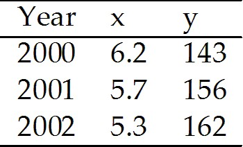

# **Chapter 1 What Is Economics?**

## 1.1 Definition of Economics

---
1\) In a world characterized by scarcity

A\) all goods are free.

B\) opportunity cost is zero.

C\) we are not limited by time.

D\) individuals need not work to obtain goods.

E\) people must make choices among alternatives.

---
---
Answer: E

Diff: 1 Type: MC

Topic: Definition of Economics

---
2\) Which of the following is the best definition of economics?

A\) the study of how a provincial government allocates tax dollars

B\) the study of how consumers spend their income

C\) the study of how producers decide what inputs to hire and what
outputs to produce

D\) the study of how individuals, businesses, governments, and entire
societies make choices as they cope with scarcity and the incentives
that influence and reconcile those choices

E\) the study of how consumers and producers meet each other at the
market

---
---
Answer: D

Diff: 1 Type: MC

Topic: Definition of Economics

---
3\) Which of the following is a microeconomic topic?

A\) the reasons why a consumer buys less honey

B\) the reasons why the average price level in a country falls

C\) the cause of increasing unemployment

D\) the effect of the government budget deficit on inflation

E\) the reasons why the labour force in a country decreases

---
---
Answer: A

Diff: 1 Type: MC

Topic: Definition of Economics

---
4\) The study of how wages are set for New Brunswick teachers is
classified as

A\) a macroeconomic topic.

B\) a microeconomic topic.

C\) economics of social interest.

D\) economics of private interest.

E\) normative economics.

---
---
Answer: B

Diff: 1 Type: MC

Topic: Definition of Economics

---
5\) Which of the following newspaper headlines concerns a macroeconomic
issue?

A\) Why are people buying more SUVs and fewer minivans?

B\) How would a tax on e-commerce affect chapters.indigo.ca?

C\) How would an unexpected freeze in Oxford, Nova Scotia change the
price of blueberries in the Maritimes?

D\) Why is Japan\'s economy stagnant?

E\) Why do grain producers purchase less pesticides?

---
---
Answer: D

Diff: 1 Type: MC

Topic: Definition of Economics

---
6\) The branch of economics that studies the choices of individuals and
businesses is

A\) macroeconomics.

B\) microeconomics.

C\) positive economics.

D\) normative economics.

E\) social economics.

---
---
Answer: B

Diff: 1 Type: MC

Topic: Definition of Economics

Source: Study Guide

---
7\) Each of the following would be considered a macroeconomic topic
*except*

A\) the reasons for a decrease in the unemployment rate.

B\) the cause of recessions.

C\) the effect of the government budget deficit on inflation.

D\) the determination of aggregate income.

E\) the selection of production techniques.

---
---
Answer: E

Diff: 2 Type: MC

Topic: Definition of Economics

---
8\) Complete the following sentence. Macroeconomics

A\) is primarily concerned with the operation of individual markets in
the economy.

B\) deals mainly with the economic behaviour of households.

C\) is the only part of economics to deal with government decisions.

D\) is primarily concerned with the behaviour of the stock market.

E\) is the study of the national economy and the global economy.

---
---
Answer: E

Diff: 2 Type: MC

Topic: Definition of Economics

---
9\) The determination of prices in individual markets is primarily a
concern of

A\) positive economics.

B\) negative economics.

C\) macroeconomics.

D\) microeconomics.

E\) descriptive economics.

---
---
Answer: D

Diff: 2 Type: MC

Topic: Definition of Economics

---
10\) Which one of the following topics does macroeconomics study?

A\) decisions of individual firms

B\) effects of government safety regulations on the price of cars

C\) the performance of the global economy

D\) prices of individual goods and services

E\) effects of taxes on the price of gasoline

---
---
Answer: C

Diff: 2 Type: MC

Topic: Definition of Economics

---
11\) Which one of the following topics does microeconomics study?

A\) reasons for a fall in the price of orange juice

B\) the effect of a rise in the Canadian dollar on Canada\'s exports

C\) effect of interest rates on national economic growth

D\) effect of the government budget deficit on employment

E\) determination of total production in a country

---
---
Answer: A

Diff: 2 Type: MC

Topic: Definition of Economics

---
12\) Complete the following sentence. Microeconomics is

A\) not concerned with factors of production.

B\) concerned with normative issues only.

C\) concerned with the size of the total amount of income earned by all
households in an economy.

D\) the branch of economics that studies the choices of individuals and
businesses.

E\) concerned exclusively with the role of the government in the economy.

---
---
Answer: D

Diff: 2 Type: MC

Topic: Definition of Economics

---
13\) Which of the following would be considered a microeconomic topic?

A\) the severity of a recession

B\) the cause of unemployment in the economy

C\) the effect of the government budget deficit on inflation

D\) the determination of aggregate income

E\) the study of how wages are set for mine workers

---
---
Answer: E

Diff: 2 Type: MC

Topic: Definition of Economics

---
14\) The branch of economics that studies the national economy and the
global economy is

A\) macroeconomics.

B\) microeconomics.

C\) Keynesian economics.

D\) positive economics.

E\) normative economics.

---
---
Answer: A

Diff: 1 Type: MC

Topic: Definition of Economics

---
15\) The fact that human wants cannot be fully satisfied with available
resources is called the problem of

A\) opportunity cost.

B\) scarcity.

C\) normative economics.

D\) marginal cost.

E\) the big tradeoff.

---
---
Answer: B

Diff: 1 Type: MC

Topic: Definition of Economics

---
16\) The problem of scarcity exists

A\) only in economies that lack incentives.

B\) only in economies that have incentives.

C\) in all economies.

D\) only when people are unemployed.

E\) now but will be eliminated with economic growth.

---
---
Answer: C

Diff: 2 Type: MC

Topic: Definition of Economics

---
17\) The inescapable economic fact is that

A\) there are unlimited wants and limited resources.

B\) there are unlimited resources, and we just have to figure out how to
allocate them.

C\) capitalists are always exploiting the workers.

D\) unions are always exploiting firms.

E\) capitalists and unions cannot work together.

---
---
Answer: A

Diff: 2 Type: MC

Topic: Definition of Economics

---
18\) An incentive \_\_\_\_\_\_\_\_.

A\) could be a reward but could not be a penalty

B\) could be a penalty but could not be a reward

C\) could be either a reward or a penalty

D\) is the opposite of a tradeoff

E\) occurs in the macroeconomy but not in the microeconomy

---
---
Answer: C

Type: MC

---
19\) Scarcity confronts \_\_\_\_\_\_\_\_.

A\) neither the poor nor the rich

B\) the rich but not the poor

C\) the poor but not the rich

D\) the rich and the poor

E\) families with incomes less than \$25,000 a year

---
---
Answer: D

Type: MC

## 1.2 Two Big Economic Questions

---
1\) The two big economic questions

A\) involve self-interest only.

B\) involve only social interest.

C\) involve neither self-interest nor social interest.

D\) do not arise from scarcity.

E\) involve both self-interest and social interest.

---
---
Answer: E

Diff: 1 Type: MC

Topic: Two Big Economic Questions

---
2\) The two big economic questions

A\) summarize the scope of economics.

B\) are \"what goods and services are produced?\" and \"how are goods and
services produced?\"

C\) have nothing to do with goods and services.

D\) do not consider for whom goods and services are produced.

E\) have nothing to do with the way goods and services are produced.

---
---
Answer: A

Diff: 1 Type: MC

Topic: Two Big Economic Questions

---
3\) The two big economic questions include all of the following *except*

A\) *what* to produce.

B\) *why* to produce.

C\) *how* to produce.

D\) *for whom* to produce.

E\) can choices made in the pursuit of self-interest also promote the
social interest.

---
---
Answer: B

Diff: 2 Type: MC

Topic: Two Big Economic Questions

---
4\) When a firm decides to produce more hybrid cars and fewer gas
guzzlers, it is answering the \_\_\_\_\_\_\_\_ question.

A\) \"how\"

B\) \"what\"

C\) \"who\"

D\) \"where\"

E\) \"when\"

---
---
Answer: B

Diff: 2 Type: MC

Topic: Two Big Economic Questions

---
5\) When a textile firm decides to produce more silk fabric and less
cotton fabric, it is answering the \_\_\_\_\_\_\_\_ question.

A\) \"who\"

B\) \"how\"

C\) \"what\"

D\) \"where\"

E\) \"when\"

---
---
Answer: C

Diff: 2 Type: MC

Topic: Two Big Economic Questions

---
6\) When a farmer decides to harvest tomatoes using machines instead of
migrant workers, the farmer is answering the \_\_\_\_\_\_\_\_ question.

A\) \"what\"

B\) \"how\"

C\) \"who\"

D\) \"where\"

E\) \"when\"

---
---
Answer: B

Diff: 2 Type: MC

Topic: Two Big Economic Questions

---
7\) Complete the following sentence. Capital is

A\) money in the bank.

B\) \"gifts of nature.\"

C\) tools, instruments, machines, buildings, and other constructions that
businesses use to produce goods and services.

D\) land.

E\) stocks and bonds.

---
---
Answer: C

Diff: 1 Type: MC

Topic: Two Big Economic Questions

---
8\) When a firm decides to produce computers using robots instead of
people, it is answering the \_\_\_\_\_\_\_\_ question.

A\) \"what\"

B\) \"where\"

C\) \"how\"

D\) \"who\"

E\) \"when\"

---
---
Answer: C

Diff: 2 Type: MC

Topic: Two Big Economic Questions

---
9\) To meet increased demand for its good, a firm decides to hire a few
high-skilled workers, rather than hire many low-skilled workers. The
firm is answering the \_\_\_\_\_\_\_\_ question.

A\) \"when\"

B\) \"what\"

C\) \"who\"

D\) \"where\"

E\) \"how\"

---
---
Answer: E

Diff: 2 Type: MC

Topic: Two Big Economic Questions

---
10\) An art museum decides to offer tours by having visitors listen to
CDs rather than have tour guides. The museum is answering the
\_\_\_\_\_\_\_\_ question.

A\) \"what\"

B\) \"who\"

C\) \"how\"

D\) \"where\"

E\) \"when\"

---
---
Answer: C

Diff: 2 Type: MC

Topic: Two Big Economic Questions

---
11\) To earn income, people sell the services of the factors of
production they own. Land earns \_\_\_\_\_\_\_\_; labour earns
\_\_\_\_\_\_\_\_; capital earns \_\_\_\_\_\_\_\_ and entrepreneurship
earns \_\_\_\_\_\_\_\_.

A\) profit; wages; rent; interest

B\) wages; interest; profit; rent

C\) rent; wages; interest; profit

D\) profit; interest; wages; rent

E\) interest; profit; rent; wages

---
---
Answer: C

Diff: 2 Type: MC

Topic: Two Big Economic Questions

---
12\) The fact that some people can afford to live in beautiful homes
while others are homeless is an example of an economy facing the
\_\_\_\_\_\_\_\_ question.

A\) \"what\"

B\) \"how\"

C\) \"for whom\"

D\) \"where\"

E\) \"when\"

---
---
Answer: C

Diff: 2 Type: MC

Topic: Two Big Economic Questions

---
13\) The fact that a hockey star earns \$3 million a year while a teacher
earns \$50,000 annually is an example of an economy facing the
\_\_\_\_\_\_\_\_ question.

A\) \"what\"

B\) \"how\"

C\) \"where\"

D\) \"for whom\"

E\) \"when\"

---
---
Answer: D

Diff: 2 Type: MC

Topic: Two Big Economic Questions

---
14\) Complete the following sentence. Entrepreneurship is

A\) defined as money.

B\) traded on the stock market.

C\) categorized as capital.

D\) the human resource that organizes labour, land and capital.

E\) categorized as the factor of production labour.

---
---
Answer: D

Diff: 2 Type: MC

Topic: Two Big Economic Questions

---
15\) Sue, who has a law degree, earns \$200,000 a year, while Chris, a
high-school dropout, earns \$5.00 an hour. This is an example of an
economy facing the \_\_\_\_\_\_\_\_ question.

A\) \"what\"

B\) \"how\"

C\) \"for whom\"

D\) \"where\"

E\) \"when\"

---
---
Answer: C

Diff: 2 Type: MC

Topic: Two Big Economic Questions

---
16\) A star athlete can afford a garage full of exotic cars while other
people can only afford to take a city bus for transportation. This is an
example of an economy facing the \_\_\_\_\_\_\_\_ question.

A\) \"what\"

B\) \"how\"

C\) \"for whom\"

D\) \"where\"

E\) \"when\"

---
---
Answer: C

Diff: 2 Type: MC

Topic: Two Big Economic Questions

---
17\) Complete the following sentence. Financial capital is

A\) one of the \"gifts of nature.\"

B\) the tools and machines that are used to produce goods and services.

C\) money, stocks, and bonds.

D\) used in the production of goods and services.

E\) land.

---
---
Answer: C

Diff: 1 Type: MC

Topic: Two Big Economic Questions

---
18\) Which factor of production earns the most income?

A\) capital

B\) land

C\) labour

D\) entrepreneurship

E\) the stock market

---
---
Answer: C

Diff: 2 Type: MC

Topic: Two Big Economic Questions

---
19\) What choices are best for the entire society?

A\) self-interest choices

B\) minority group choices

C\) social interest choices

D\) ethnic group choices

E\) regional interest choices

---
---
Answer: C

Diff: 1 Type: MC

Topic: Two Big Economic Questions

---
20\) Self-interest choices are

A\) those choices which are best for the person making them.

B\) never in the social interest.

C\) always in the social interest.

D\) those choices that are best for all residents of a region.

E\) choices that are agreed to by majority vote.

---
---
Answer: A

Diff: 3 Type: MC

Topic: Two Big Economic Questions

---
21\) The expansion of international trade, borrowing and lending, and
investment is

A\) the big tradeoff.

B\) industrial revolution.

C\) corporate revolution.

D\) globalization.

E\) antiglobalization.

---
---
Answer: D

Diff: 3 Type: MC

Topic: Two Big Economic Questions

---
22\) Which of the following relates factors of production to the sources
of income correctly?

A\) Land earns interest.

B\) Land earns rent.

C\) Labour earns rent.

D\) Capital earns profit.

E\) Entrepreneurship earns rent.

---
---
Answer: B

Diff: 1 Type: MC

Topic: Two Big Economic Questions

---
23\) Which statement about incomes earned by factors of production is
*false*?

A\) Land earns rent.

B\) Natural resources earn rent.

C\) Labour earns wages.

D\) Capital earns profit.

E\) Entrepreneurship earns profit.

---
---
Answer: D

Diff: 1 Type: MC

Topic: Two Big Economic Questions

---
24\) A tractor is an example of which of the following factors of
production?

A\) capital

B\) labour

C\) land

D\) entrepreneurship

E\) energy

---
---
Answer: A

Diff: 1 Type: MC

Topic: Two Big Economic Questions

---
25\) Which one of the following is an example of capital as a factor of
production?

A\) money held by Tim Hortons

B\) a Bell Canada bond

C\) an automobile factory owned by Ford

D\) a high school teacher

E\) natural gas

---
---
Answer: C

Diff: 1 Type: MC

Topic: Two Big Economic Questions

---
26\) Which of the following would an economist classify as capital?

A\) natural resources

B\) a deposit of silver

C\) entrepreneurship

D\) a computer

E\) land

---
---
Answer: D

Diff: 1 Type: MC

Topic: Two Big Economic Questions

---
27\) Which one of the following is labour?

A\) money

B\) a carpenter\'s hammer

C\) a shoe factory

D\) a bread-slicing machine

E\) a singer\'s voice

---
---
Answer: E

Diff: 1 Type: MC

Topic: Two Big Economic Questions

---
28\) Which one of the following would economists classify as land?

A\) an automotive plant in British Columbia

B\) rich agricultural soil in Saskatchewan

C\) an oil rig in the Atlantic Ocean

D\) an elementary school in Nova Scotia

E\) automobiles parked in a parking lot in Manitoba

---
---
Answer: B

Diff: 2 Type: MC

Topic: Two Big Economic Questions

---
29\) Which one of the following is an example of land?

A\) Bono\'s singing voice

B\) a computer program

C\) Lake Erie

D\) a road

E\) a dam

---
---
Answer: C

Diff: 1 Type: MC

Topic: Two Big Economic Questions

---
30\) Which one of the following is an example of a factor of production?

A\) an insurance policy

B\) a donut

C\) the skills of a welder

D\) an IBM stock certificate

E\) a computer game

---
---
Answer: C

Diff: 1 Type: MC

Topic: Two Big Economic Questions

---
31\) Which one of the following is an example of capital?

A\) money

B\) a carpenter

C\) pasture

D\) a bread-slicing machine

E\) a university professor

---
---
Answer: D

Diff: 1 Type: MC

Topic: Two Big Economic Questions

---
32\) The creation of a successful movie illustrates choices made in
self-interest that also achieve the social interest if \_\_\_\_\_\_\_\_.

A\) the movie has a higher attendance than any other movie produced that
year

B\) the movie is produced at the lowest possible cost, and the movie
gives the greatest possible benefit

C\) the movie addresses a social issue

D\) the movie is an Academy award winner because an Academy award winning
movie is most popular with the movie-going public

E\) the movie is produced in a country where workers typically earn less
than workers in North America

---
---
Answer: B

Diff: 1 Type: MC

Topic: Two Big Economic Questions

Source: MyEconLab

---
33\) The creation of a successful movie can influence the main questions
that economics seeks to answer. Choose the statement that is *false*.

A\) The movie influences the *how* question because the movie can create
new production techniques, which can be used in subsequent films.

B\) The movie influences the *for whom* question because the people who
earn higher incomes through the movie production buy more goods and
services.

C\) The movie influences the *when* question because movie crews work on
many different films and must be available for the entire production.

D\) The movie influences the *what* question because it can lead to
spinoff goods or a new movie genre, which can result in the production
of similar films.

E\) The movie influences the *how* question because it can use unknown
actors or Academy Award winners.

---
---
Answer: C

Diff: 1 Type: MC

Topic: Two Big Economic Questions

Source: MyEconLab

---
34\) Choose the correct statement.

A\) Canada produces more services than goods.

B\) Canada produces more goods than services.

C\) Canada produces an equal quantity of goods and services.

D\) China\'s production of services is a greater percentage of its total
production than Canada\'s.

E\) Canada\'s production of manufacturing is a greater percentage of its
total production than China\'s.

---
---
Answer: A

Type: MC

---
35\) In Canada \_\_\_\_\_\_\_\_ percent of the adult population have
completed high school and \_\_\_\_\_\_\_\_ percent have a university
degree.

A\) 23; 93

B\) 93; 53

C\) 93; 23

D\) 100; 53

E\) 53; 23

---
---
Answer: C

Type: MC

---
36\) Which of the following is *not* a factor of production?

A\) the water used to cool a nuclear power plant

B\) the effort of farmers raising cattle

C\) the wages paid to workers

D\) the management skill of a small business owner

E\) the land used by a farmer to grow wheat

---
---
Answer: C

Type: MC

## 1.3 The Economic Way of Thinking

---
1\) Opportunity cost is

A\) the value of your favourite activity.

B\) your value of leisure.

C\) the money you spend on food, shelter, and clothing.

D\) the marginal benefit from an activity.

E\) the highest-valued alternative that we give up to get something.

---
---
Answer: E

Diff: 2 Type: MC

Topic: The Economic Way of Thinking

---
2\) During the next hour John can choose one of the following three
activities: playing basketball, watching television, or reading a book.
The opportunity cost of reading a book

A\) depends on how much the book cost when it was purchased.

B\) is the value of playing basketball if John prefers that to watching
television.

C\) is the value of playing basketball *and* the value of watching
television.

D\) depends on how much John enjoys the book.

E\) is the value of watching television if John prefers playing
basketball to watching television.

---
---
Answer: B

Diff: 3 Type: MC

Topic: The Economic Way of Thinking

---
3\) Sally has to decide whether to study for her economics test or her
accounting test. If she chooses to study for accounting, her opportunity
cost of studying accounting is

A\) studying economics.

B\) less than the value of studying economics.

C\) not comparable to the value of studying economics.

D\) equal to the value of studying economics.

E\) the future lost wages that will occur if she fails her accounting
exam.

---
---
Answer: A

Diff: 2 Type: MC

Topic: The Economic Way of Thinking

---
4\) When the government of Alberta chooses to build more roads, the
required resources are no longer available to provide better health care
facilities. This situation illustrates the concept of

A\) marginal benefit.

B\) monetary cost.

C\) opportunity cost.

D\) human capital.

E\) entrepreneurship.

---
---
Answer: C

Type: MC

Topic: The Economic Way of Thinking

---
5\) The concept of opportunity cost

A\) is relevant only for European countries.

B\) suggests that individuals can achieve all they want.

C\) suggests a major increase in public education spending means a
reduced expansion in the public healthcare system.

D\) is relevant only for developed countries.

E\) is relevant only for developing countries.

---
---
Answer: C

Diff: 2 Type: MC

Topic: The Economic Way of Thinking

---
6\) Which one of the following is a necessary consequence of scarcity?

A\) no choices required

B\) high profits

C\) the requirement of making choices

D\) all wants are satisfied

E\) low profits

---
---
Answer: C

Diff: 1 Type: MC

Topic: The Economic Way of Thinking

---
7\) To make choices, people must

A\) be able to carry out complex mathematical calculations.

B\) have unlimited resources.

C\) be free from government constraint.

D\) have unlimited access to information at no cost.

E\) evaluate the values of alternative actions.

---
---
Answer: E

Diff: 2 Type: MC

Topic: The Economic Way of Thinking

---
8\) When the government chooses to use resources to build a dam, those
resources are no longer available to build a highway. This illustrates
the concept of

A\) a market.

B\) macroeconomics.

C\) opportunity cost.

D\) a \"how\" tradeoff.

E\) the big tradeoff.

---
---
Answer: C

Diff: 2 Type: MC

Topic: The Economic Way of Thinking

Source: Study Guide

---
9\) What is the definition of marginal benefit?

A\) the cost of an increase in an activity

B\) the sum of benefit and cost that arises from an increase in an
activity

C\) the cost of a decrease in an activity

D\) the benefit that arises from an increase in an activity

E\) the benefit that arises from a decrease in an activity

---
---
Answer: D

Diff: 2 Type: MC

Topic: The Economic Way of Thinking

---
10\) When asked in an interview what she missed the most because of the
time she spent training for the Olympics, a rower, who lived on her own,
answered \"a normal social life.\" She also revealed that she had given
up a job that paid \$30,000 per year to train fulltime. She received a
grant of \$8,000 per year from Sport Canada, but this failed to cover
all her training expenses. Her food and rent were \$5,000 per year and
training expenses were \$12,000 per year. Aside from the value of a
normal social life, what is the annual opportunity cost, expressed in
dollars, to this rower of \"Going for Gold\"?

A\) \$25,000

B\) \$4,000

C\) \$30,000

D\) \$39,000

E\) \$34,000

---
---
Answer: E

Diff: 3 Type: MC

Topic: The Economic Way of Thinking

---
11\) Saskatchewan had more hospitals than Ontario, despite having
one-tenth the population. The Saskatchewan government closed many of
these hospitals in spite of widespread local protests. Which one of the
following arguments is true?

A\) Since hospitals have positive benefits, they should never be closed.

B\) If Saskatchewan had more hospitals than Ontario, it must have had too
many hospitals.

C\) The Saskatchewan government must have thought the marginal benefit
from one of these hospitals exceeded its marginal cost.

D\) The Saskatchewan government must have thought the marginal benefit
from one of these hospitals was less then its marginal cost.

E\) The communities where these hospitals existed bore no costs from
these decisions, because they did not pay for any of the hospital
operating costs.

---
---
Answer: D

Diff: 3 Type: MC

Topic: The Economic Way of Thinking

---
12\) \"There can be too much of a good thing.\" This statement suggests
that

A\) choices made in self-interest cannot be applied to many economic
decisions.

B\) a good may be produced to the point where its marginal cost exceeds
its marginal benefit.

C\) certain goods and services such as education and health care are
inherently desirable and should be produced regardless of costs and
benefits.

D\) a good may be produced to the point where its marginal benefit
exceeds its marginal cost.

E\) a good may be produced to the point where its marginal benefit is
equal to its marginal cost.

---
---
Answer: B

Diff: 2 Type: MC

Topic: The Economic Way of Thinking

---
13\) Which of the following sayings best describes opportunity cost?

A\) \"Make hay while the sun shines.\"

B\) \"Love of money is the root of all evil.\"

C\) \"Boldly go where no one has gone before.\"

D\) \"There\'s no such thing as a free lunch.\"

E\) \"Baseball has been very good to me.\"

---
---
Answer: D

Diff: 2 Type: MC

Topic: The Economic Way of Thinking

Source: Study Guide

---
14\) If you take an additional class this term, you can graduate earlier.
This is an example of

A\) opportunity cost.

B\) total cost.

C\) the pursuit social interest.

D\) marginal benefit.

E\) social cost.

---
---
Answer: D

Diff: 2 Type: MC

Topic: The Economic Way of Thinking

---
15\) Marginal benefit is the

A\) total benefit from an activity.

B\) additional benefit from a decrease in an activity.

C\) additional benefit from an increase in an activity.

D\) opportunity cost of a decrease in an activity.

E\) opportunity cost of an increase in an activity.

---
---
Answer: C

Diff: 1 Type: MC

Topic: The Economic Way of Thinking

Source: Study Guide

---
16\) Complete the following sentence. Marginal cost is

A\) the total cost of an activity.

B\) the cost of a decrease in an activity.

C\) the cost of an increase in an activity.

D\) the opportunity cost of a decrease in an activity.

E\) equal to marginal benefit.

---
---
Answer: C

Diff: 1 Type: MC

Topic: The Economic Way of Thinking

---
17\) The big tradeoff is the tradeoff between

A\) taxes and transfers.

B\) equality and efficiency.

C\) current consumption and a higher future standard of living.

D\) guns and butter.

E\) personal security and private property.

---
---
Answer: B

Diff: 1 Type: MC

Topic: The Economic Way of Thinking

Source: Study Guide

---
18\) Monika will choose to eat a seventh pizza slice if

A\) the marginal benefit from the seventh slice is greater than its
marginal cost.

B\) the marginal benefit from the seventh slice is less than its marginal
cost.

C\) the total benefit from all seven slices is greater than their total
cost.

D\) the total benefit from all seven slices is less than their total
cost.

E\) she has enough money to pay for it.

---
---
Answer: A

Diff: 2 Type: MC

Topic: The Economic Way of Thinking

Source: Study Guide

---
19\) Before starring as Tony Stark in *Iron Man*, Robert Downey Jr. had
played in 45 movies that had average first-weekend box office revenues
of a bit less than \$5 million. *Iron Man* grossed \$102 million in its
first weekend. The success of *Iron Man* \_\_\_\_\_\_\_\_ the
opportunity cost of hiring Robert Downey Jr.

Movie producers now have \_\_\_\_\_\_\_\_ incentive to hire Robert
Downey Jr.

A\) increases; less

B\) decreases; less

C\) decreases; more

D\) increases; more

E\) decreases; zero

---
---
Answer: D

Diff: 1 Type: MC

Topic: The Economic Way of Thinking

Source: MyEconLab

---
20\) The night before a history test, you decide to go to the movies
instead of reviewing your notes. You get 60 percent on your test
compared with the 75 percent that you normally score. You
\_\_\_\_\_\_\_\_ a tradeoff \_\_\_\_\_\_\_\_, and the opportunity cost
of your evening at the movies was \_\_\_\_\_\_\_\_.

A\) faced; between a higher test score and an evening at the movies; the
15 percent fall in your grade

B\) did not face; because your roommates agreed you should go to the
movies and not study; zero

C\) did not face; because you made the best choice; zero

D\) faced; between a higher test score and an evening at the movies; the
mark of 60 percent on your test

E\) did not face; most students get 60 percent on history tests; the mark
of 60 percent on your test

---
---
Answer: A

Diff: 1 Type: MC

Topic: The Economic Way of Thinking

Source: MyEconLab

---
21\) A university decides to change its late night bus service between
the campus and student housing from a fare-based service to a free
service. This statement means that the incentive to ride the bus
\_\_\_\_\_\_\_\_ and the opportunity cost of a bus ride
\_\_\_\_\_\_\_\_. The university\'s decision is a \_\_\_\_\_\_\_\_
decision.

A\) changes; decreases; microeconomic

B\) changes; decreases; macroeconomic

C\) remains the same; remains the same; macroeconomic

D\) remains the same; remains the same; microeconomic

E\) changes; increases; microeconomic

---
---
Answer: A

Diff: 1 Type: MC

Topic: The Economic Way of Thinking

Source: MyEconLab

*\
Use the information below to answer the following question.*

**Fact 1.1.1** **Costs Soar for London Olympics**

The regeneration of East London, the site of the 2012 Olympic Games, is
set to add extra £1.5 billion to taxpayers\' bill.

*The Times*, London, July 6, 2006

---
22\) Refer to Fact 1.1.1. The cost of regenerating East London
\_\_\_\_\_\_\_\_ an opportunity cost of hosting the 2012 Olympic Games
\_\_\_\_\_\_\_\_.

A\) is not; because few people attending the 2012 Olympics will spend
much time outside Olympic venues

B\) is; if the costs of the East London regeneration is equal to a
significant percentage of the total amount spent by London taxpayers to
host the 2012 Olympics

C\) is; if the regeneration of East London would not occur unless London
hosted the 2012 Olympics

D\) is not; because regenerating East London is an unnecessary expense

E\) is; if the property taxes of people living in East London increase

---
---
Answer: C

Diff: 1 Type: MC

Topic: The Economic Way of Thinking

Source: MyEconLab

---
23\) You have the choice of going on vacation to Florida for one week,
staying at work for the week, or spending the week doing fix-up projects
around your house. If you decide to go to Florida, the opportunity cost
of the trip is \_\_\_\_\_\_\_\_.

A\) working *and* doing fix-up projects

B\) working *or* doing fix-up projects, depending on which you would have
done otherwise

C\) working, because you would be giving up dollars

D\) nothing because you will enjoy the trip to Florida

E\) variable depending on the weather you leave behind in Canada

---
---
Answer: B

Type: MC

---
24\) Laura is a manager for HP. When Laura must decide whether to produce
a few additional printers, she is choosing at the margin when she
compares \_\_\_\_\_\_\_\_.

A\) the total revenue from sales of printers to the total cost of
producing all the printers

B\) the extra revenue from selling a few additional printers to the extra
costs of producing the printers

C\) the extra revenue from selling a few additional printers to the
average cost of producing the additional printers

D\) the revenue from selling HP\'s printers as compared to printers from
competing companies, such as Lexmark

E\) the cost of producing HP\'s printers as compared to printers from
competing companies, such as Lexmark

---
---
Answer: B

Type: MC

---
25\) Which of the following creates an incentive to increase the amount
of an activity?

A\) an increase in the marginal cost of the activity and a decrease in
the marginal benefit from the activity

B\) a decrease in the marginal cost of the activity and an increase in
the marginal benefit from the activity

C\) constant marginal cost and constant marginal benefit from the
activity

D\) an increase in the marginal cost of the activity and an equal
increase in the marginal benefit from the activity

E\) a decrease in the marginal cost of the activity and an equal decrease
in the marginal benefit from the activity

---
---
Answer: B

Type: MC

## 1.4 Economics as Social Science and Policy Tool

---
1\) Statements about \"what ought to be\" are called

A\) positive statements.

B\) normative statements.

C\) economic statements.

D\) scientific statements.

E\) hypotheses.

---
---
Answer: B

Diff: 1 Type: MC

Topic: Economics as Social Science and Policy Tool

---
2\) Statements about \"what is\" are called

A\) positive statements.

B\) normative statements.

C\) economic statements.

D\) scientific statements.

E\) hypotheses.

---
---
Answer: A

Diff: 1 Type: MC

Topic: Economics as Social Science and Policy Tool

---
3\) Which of the following statements is normative?

A\) Scientists should not make normative statements.

B\) Warts are caused by handling toads.

C\) As e-book prices fall, people buy more of them.

D\) If income increases, sales of luxury goods fall.

E\) There is more caffeine in a cup of tea than in a cup of coffee.

---
---
Answer: A

Diff: 2 Type: MC

Topic: Economics as Social Science and Policy Tool

Source: Study Guide

---
4\) A positive statement is

A\) about what ought to be.

B\) about what is.

C\) always true.

D\) capable of evaluation as true or false by observation and
measurement.

E\) B and D.

---
---
Answer: E

Diff: 1 Type: MC

Topic: Economics as Social Science and Policy Tool

Source: Study Guide

---
5\) A positive statement is

A\) always true.

B\) always false.

C\) about what ought to be.

D\) what is currently believed about the way the world operates.

E\) an opinion that cannot be verified.

---
---
Answer: D

Diff: 1 Type: MC

Topic: Economics as Social Science and Policy Tool

---
6\) A normative statement is

A\) about what should be.

B\) about what is.

C\) always true.

D\) always false.

E\) capable of evaluation, as true or false, by observation and
measurement.

---
---
Answer: A

Diff: 1 Type: MC

Topic: Economics as Social Science and Policy Tool

---
7\) \"The rich should face higher income tax rates than the poor.\" This
is an example of

A\) a normative statement.

B\) a positive statement.

C\) a negative statement.

D\) economic reasoning.

E\) neither a normative nor a positive statement.

---
---
Answer: A

Diff: 2 Type: MC

Topic: Economics as Social Science and Policy Tool

---
8\) Which of the following is an example of a positive statement?

A\) Canada should cut back on its use of carbon-based fuels such as coal
and oil.

B\) Increasing the minimum wage results in more unemployment.

C\) Every Canadian should have equal access to health care.

D\) The Bank of Canada ought to cut the interest rate.

E\) Canada should have lower tax rates for wealthier Canadians.

---
---
Answer: B

Diff: 2 Type: MC

Topic: Economics as Social Science and Policy Tool

---
9\) Complete the following sentence. Economic *models*

A\) do not answer questions about the economic world.

B\) include most of the details of the economic world.

C\) describe some aspect of the economic world, but include only those
features needed for the purpose at hand.

D\) answer questions that arise from normative statements.

E\) were first developed in the 1970s.

---
---
Answer: C

Diff: 2 Type: MC

Topic: Economics as Social Science and Policy Tool

---
10\) The scientific purpose of simplifying assumptions in an economic
model is to

A\) avoid confronting difficult issues.

B\) eliminate the need for further testing of the implications of the
model.

C\) abstract from the complexities of the real world those issues that
are not important for the issues under examination.

D\) eliminate the possibility of personal bias in the model.

E\) add necessary hypotheses to the problem.

---
---
Answer: C

Diff: 2 Type: MC

Topic: Economics as Social Science and Policy Tool

---
11\) Model *A* is superior to model *B* if

A\) it contains more real world detail than model *B*.

B\) it contains fewer unrealistic assumptions than model *B*.

C\) its predictions correspond more closely to the facts than the
predictions of model *B*.

D\) it is preferred by a majority of researchers in a public opinion
poll.

E\) it is scientifically \"elegant.\"

---
---
Answer: C

Diff: 2 Type: MC

Topic: Economics as Social Science and Policy Tool

---
12\) In choosing among alternative models, economists generally have the
strongest preference for models that

A\) have assumptions that are close to exact replicas of reality.

B\) are detailed and complex, with every available fact and figure
included.

C\) have few assumptions and are as simple as possible, even if they
cannot predict very well.

D\) predict better than any other that is available.

E\) have assumptions that are complicated.

---
---
Answer: D

Type: MC

Topic: Economics as Social Science and Policy Tool

---
13\) A normative statement is a statement regarding

A\) what is usually the case.

B\) the assumptions of an economic model.

C\) what ought to be.

D\) the predictions of an economic model.

E\) what is.

---
---
Answer: C

Diff: 1 Type: MC

Topic: Economics as Social Science and Policy Tool

Source: Study Guide

---
14\) \"The rich face higher income tax rates than the poor\" is an
example of a

A\) a normative statement.

B\) a positive statement.

C\) a predictive statement.

D\) a theoretical statement.

E\) an analytical statement.

---
---
Answer: B

Diff: 1 Type: MC

Topic: Economics as Social Science and Policy Tool

---
15\) An economic model is tested by

A\) examining the realism of its assumptions.

B\) comparing its predictions with the facts.

C\) comparing its complexity to other models that deal with similar
issues.

D\) the Testing Committee of the Canadian Economic Association.

E\) comparing its descriptions and examining the realism of its
assumptions.

---
---
Answer: B

Diff: 2 Type: MC

Topic: Economics as Social Science and Policy Tool

---
16\) Which of the following is a positive statement?

A\) Low rents restrict the supply of housing.

B\) Low rents are better for a city than high rents.

C\) Housing costs too much.

D\) Owners of apartment buildings ought to be free to charge whatever
rent they want.

E\) Government should control the rents that apartment owners charge.

---
---
Answer: A

Diff: 2 Type: MC

Topic: Economics as Social Science and Policy Tool

Source: Study Guide

---
17\) \"The rich face higher income tax rates than the poor, which is not
good since it is the rich who provide jobs for the poor.\" This is an
example of

A\) a normative statement.

B\) a positive statement.

C\) a negative statement.

D\) a theoretical statement.

E\) a descriptive statement.

---
---
Answer: A

Diff: 2 Type: MC

Topic: Economics as Social Science and Policy Tool

---
18\) An economic model is

A\) tested by examining the realism of its assumptions.

B\) useful if it predicts well, even if its assumptions are not
realistic.

C\) tested by the Testing Committee of the Canadian Economic Association.

D\) not useful unless it predicts with 100 percent accuracy.

E\) not useful because it simplifies real problems.

---
---
Answer: B

Diff: 1 Type: MC

Topic: Economics as Social Science and Policy Tool

---
19\) Select the best statement about economic models.

A\) An economic model must always be correct in its predictions or it
must be discarded.

B\) An economic model is evaluated based on the realism of its
assumptions.

C\) An economic model should not generate predictions about actual events
in the real world, since it discusses only abstract events.

D\) An economic model will be discarded if its predictions are often in
conflict with the facts.

E\) Economic models are all false.

---
---
Answer: D

Diff: 2 Type: MC

Topic: Economics as Social Science and Policy Tool

---
20\) To disentangle cause and effect, economists use economic models and
use \_\_\_\_\_\_\_\_ to test the predictions of those models.

A\) the *what*, *how*, and *for* *whom* questions

B\) positive statements and normative statements

C\) personal economic policy, business economic policy, and government
economic policy

D\) natural experiments, statistical investigations, and economic
experiments

E\) marginal benefit and marginal cost

---
---
Answer: D

Diff: 2 Type: MC

Topic: Economics as Social Science and Policy Tool

Source: MyEconLab

---
21\) Which of the following statements are positive?

1\. The federal government should increase production of biofuels.

2\. Air travel has increased since September 11.

3\. The greatest number of accidents are caused by drunk drivers.

4\. We ought to have a cure for cancer.

A\) statements 1 and 4 are positive

B\) statements 2 and 3 are positive

C\) statements 1 and 2 are positive

D\) statements 3 and 4 are positive

E\) statements 2 and 4 are positive

---
---
Answer: B

Diff: 2 Type: MC

Topic: Economics as Social Science and Policy Tool

Source: MyEconLab

---
22\) Which of the following statements are true regarding \"positive\"
statements?

I. They describe what \"ought to be.\"

II\. They describe what is believed about how the world appears.

III\. They can be tested as to their truthfulness.

A\) I and II

B\) II and III

C\) I and III

D\) I, II and III

E\) None of the statements are true.

---
---
Answer: B

Type: MC

---
23\) Which of the following is a normative statement?

A\) Next year\'s inflation rate will be under 4 percent.

B\) Consumers will buy more gasoline over the December holiday period
than they bought during the summer holiday period even if the price of
gas is 10 cents a litre higher than it was during the summer.

C\) Government cuts in welfare spending impose an unfair hardship on the
poor.

D\) A wheat shortage or surplus is always the result of federal
government policies.

E\) Hurricane Irene caused more damage in the United States than
Hurricane Katrina.

---
---
Answer: C

Type: MC

## 1.5 Appendix: Graphing Data

*Use the figure below to answer the following questions.*

**Figure 1A.1.5**

---
1\) The graphs in Figure 1A.1.5 are examples of

A\) dot graphs.

B\) graphs that show no relationship between x and y.

C\) dot diagrams.

D\) scatter diagrams.

E\) none of the above.

---
---
Answer: D

Diff: 1 Type: MC

Topic: Appendix: Graphing Data

---
2\) Refer to Figure 1A.1.5. Which graph or graphs indicates a positive
relationship between *x* and *y*?

A\) (a)

B\) (b)

C\) (c)

D\) (d)

E\) (a) and (d)

---
---
Answer: A

Diff: 2 Type: MC

Topic: Appendix: Graphing Data

---
3\) Refer to Figure 1A.1.5. Which graph or graphs indicates a negative
relationship between *x* and *y*?

A\) (a)

B\) (b)

C\) (c)

D\) (d)

E\) (b) and (d)

---
---
Answer: B

Diff: 2 Type: MC

Topic: Appendix: Graphing Data

---
4\) Refer to Figure 1A.1.5. Which graph or graphs indicates no
relationship between *x* and *y*?

A\) (a)

B\) (b)

C\) (c)

D\) (c) and (d)

E\) (a) and (b)

---
---
Answer: D

Diff: 3 Type: MC

Topic: Appendix: Graphing Data

---
5\) Consider graph (a) of Figure 1A.1.5. Which one of the following
statements is *true*?

A\) *x* and *y* are negatively related.

B\) *x* and *y* are unrelated.

C\) *x* and *y* are positively related.

D\) *x* and *y* move in opposite directions.

E\) both A and D are correct.

---
---
Answer: C

Diff: 2 Type: MC

Topic: Appendix: Graphing Data

---
6\) Consider graph (b) of Figure 1A.1.5. Which one of the following
statements is *true*?

A\) *x* and *y* are negatively related.

B\) *x* and *y* are unrelated.

C\) *x* and *y* are positively related.

D\) *x* and *y* move in opposite directions.

E\) both A and D are correct.

---
---
Answer: E

Diff: 3 Type: MC

Topic: Appendix: Graphing Data

---
7\) Consider graph (d) of Figure 1A.1.5. Which one of the following
statements is *true*?

A\) *x* and *y* are negatively related.

B\) *x* and *y* are unrelated.

C\) *x* and *y* are positively related.

D\) *x* and *y* move in opposite directions.

E\) both A and D.

---
---
Answer: B

Diff: 3 Type: MC

Topic: Appendix: Graphing Data

## 1.6 Appendix: Graphs Used in Economic Models

---
1\) If variables *x* and *y* move up and down together, they are

A\) positively related.

B\) negatively related.

C\) conversely related.

D\) unrelated.

E\) trendy.

---
---
Answer: A

Diff: 2 Type: MC

Topic: Appendix: Graphs Used in Economic Models

Source: Study Guide

---
2\) Two variables are positively related if

A\) increases in one are associated with decreases in the other.

B\) increases in one are associated with increases in the other.

C\) decreases in one are associated with increases in the other.

D\) any change in one causes an increase in the other.

E\) any change in one causes a decrease in the other.

---
---
Answer: B

Diff: 2 Type: MC

Topic: Appendix: Graphs Used in Economic Models

---
3\) Two variables are negatively related if

A\) increases in one are associated with decreases in the other.

B\) increases in one are associated with increases in the other.

C\) both variables are less than zero.

D\) any change in one causes an increase in the other.

E\) any change in one causes a decrease in the other.

---
---
Answer: A

Diff: 2 Type: MC

Topic: Appendix: Graphs Used in Economic Models

---
4\) The relationship between two variables that are positively related is
shown graphically by a line that

A\) slopes upward to the right.

B\) is horizontal.

C\) slopes downward to the right.

D\) is vertical.

E\) is above the *x*-axis and to the right of the *y*-axis.

---
---
Answer: A

Diff: 2 Type: MC

Topic: Appendix: Graphs Used in Economic Models

---
5\) The relationship between two variables that are negatively related is
shown graphically by a line that

A\) slopes upward to the right.

B\) is horizontal.

C\) slopes downward to the right.

D\) is vertical.

E\) is below the *x*-axis and to the left of the *y*-axis.

---
---
Answer: C

Diff: 2 Type: MC

Topic: Appendix: Graphs Used in Economic Models

*Use the figure below to answer the following question.*

**Figure 1A.2.1**

---
6\) Refer to Figure 1A.2.1. The variables *x* and *y*

A\) are negatively related.

B\) have a nonlinear relationship.

C\) have a negative linear relationship.

D\) are unrelated.

E\) are positively related.

---
---
Answer: E

Diff: 2 Type: MC

Topic: Appendix: Graphs Used in Economic Models

---
7\) In Figure 1A.2.1, the value of *y* is 5 when *x* is

A\) 4.

B\) 5.

C\) 6.

D\) 7.

E\) 8.

---
---
Answer: D

Diff: 1 Type: MC

Topic: Appendix: Graphs Used in Economic Models

---
8\) Refer to Figure 1A.2.1. If *x* decreases from 5 to 4, *y*

A\) decreases from 4 to 3.

B\) decreases from 4 to 3 1/2.

C\) decreases from 4 to 2.

D\) increases from 4 to 5.

E\) increases from 3 1/2 to 4.

---
---
Answer: B

Diff: 1 Type: MC

Topic: Appendix: Graphs Used in Economic Models

---
9\) Refer to Figure 1A.2.1. When *y* increases from 5 to 6, *x*

A\) increases from 5 to 6.

B\) increases from 7 to 8.

C\) increases from 7 to 9.

D\) decreases from 9 to 7.

E\) increases from 7 to 7 1/2.

---
---
Answer: C

Diff: 1 Type: MC

Topic: Appendix: Graphs Used in Economic Models

*Use the figure below to answer the following question.*

**Figure 1A.2.2**

---
10\) In Figure 1A.2.2, the variables *x* and *y*

A\) move in the same direction.

B\) are negatively related.

C\) are always equal.

D\) are unrelated

E\) are positively related.

---
---
Answer: B

Diff: 1 Type: MC

Topic: Appendix: Graphs Used in Economic Models

---
11\) The relationship between two variables that move in opposite
directions is shown graphically by a line that is

A\) positively sloped.

B\) relatively steep.

C\) relatively flat.

D\) negatively sloped.

E\) curved.

---
---
Answer: D

Diff: 1 Type: MC

Topic: Appendix: Graphs Used in Economic Models

Source: Study Guide

*\
Use the figure below to answer the following questions.*

**Figure 1A.2.3**

---
12\) Refer to Figure 1A.2.3. If you were told that economic theory
predicts that higher levels of the rate of interest (*x*) lead to lower
levels of sales of houses (*y*), which graph would you pick to represent
this economic relationship?

A\) (a) or (d)

B\) (d)

C\) (b)

D\) (c)

E\) (a)

---
---
Answer: E

Diff: 2 Type: MC

Topic: Appendix: Graphs Used in Economic Models

---
13\) Refer to Figure 1A.2.3. If your theory predicted that a rise in the
wage rate (*x*) leads to a rise in the amount of labour supplied in the
economy (*y*), which graph would you use to represent this relationship?

A\) (a) or (c)

B\) (d)

C\) (c)

D\) (b)

E\) (a)

---
---
Answer: D

Diff: 2 Type: MC

Topic: Appendix: Graphs Used in Economic Models

---
14\) Refer to Figure 1A.2.3. Which of the graphs shows a positive
relationship between *x* and *y*?

A\) (a)

B\) (b)

C\) (c)

D\) (d)

E\) both (b) and (d)

---
---
Answer: B

Diff: 1 Type: MC

Topic: Appendix: Graphs Used in Economic Models

---
15\) Refer to Figure 1A.2.3. Which one of the graphs shows a negative
relationship between *x* and *y*?

A\) (a)

B\) (b)

C\) (c)

D\) (d)

E\) both (a) and (d)

---
---
Answer: A

Diff: 1 Type: MC

Topic: Appendix: Graphs Used in Economic Models

---
16\) Refer to Figure 1A.2.3. Suppose our theory predicted that for low
levels of quantity produced (*x*) a firm\'s profits (*y*) were low, for
medium levels of output their profits were high, and for high levels of
output their profits were low again. Which one of the graphs would
represent this relationship?

A\) (a)

B\) (b)

C\) (c)

D\) (d)

E\) none of the graphs

---
---
Answer: E

Diff: 2 Type: MC

Topic: Appendix: Graphs Used in Economic Models

*\
Use the figure below to answer the following questions.*

**Figure 1A.2.4**

---
17\) Which curve or curves in Figure 1A.2.4 shows a positive relationship
between unemployment and inflation?

A\) *A*

B\) *A* and *B*

C\) *B*, *C*, and *D*

D\) *A* and *C*

E\) none of the curves.

---
---
Answer: E

Diff: 1 Type: MC

Topic: Appendix: Graphs Used in Economic Models

---
18\) Which curve or curves in Figure 1A.2.4 shows no relationship between
unemployment and inflation?

A\) *A*

B\) *A* and *B*

C\) *B*, *C*, and *D*

D\) *A* and *C*

E\) *B* and *D*

---
---
Answer: A

Diff: 1 Type: MC

Topic: Appendix: Graphs Used in Economic Models

---
19\) Which curve or curves in Figure 1A.2.4 shows a negative relationship
between unemployment and inflation?

A\) *A*

B\) *A* and *B*

C\) *B*, *C*, and *D*

D\) *A* and *D*

E\) *B* and *C*

---
---
Answer: C

Diff: 1 Type: MC

Topic: Appendix: Graphs Used in Economic Models

*Use the table below to answer the following question.*

**Table 1A.2.1**

---
20\) The data in Table 1A.2.1 shows that

A\) *x* and *y* have a negative relationship.

B\) *x* and *y* have a positive relationship.

C\) there is no relationship between *x* and *y*.

D\) there is first a negative and then a positive relationship between
*x* and *y*.

E\) there is first a positive and then a negative relationship between
*x* and *y*.

---
---
Answer: A

Diff: 2 Type: MC

Topic: Appendix: Graphs Used in Economic Models

Source: Study Guide

*\
Use the figure below to answer the following questions.*

**Figure 1A.2.5**

---
21\) Refer to Figure 1A.2.5. Which one of the following statements is
true?

A\) *x* and *y* are positively related at all points between *A* and *D*.

B\) *x* and *y* are negatively related at all points between points *B*
and *D*.

C\) *y* reaches a maximum at point *C*.

D\) *y* reaches a minimum at point *C*.

E\) *x* and *y* are unrelated.

---
---
Answer: C

Diff: 1 Type: MC

Topic: Appendix: Graphs Used in Economic Models

*Use the table below to answer the following question.*

**Table 1A.2.2**

  ----- --- --- --- ---- ----
  *y*   4   6   8   10   12
  *z*   1   2   3   4    5
  ----- --- --- --- ---- ----

---
22\) Refer to Table 1A.2.2. What type of relationship exists between *y*
and *z*?

A\) negative

B\) positive

C\) inverse

D\) No consistent relationship exists.

E\) first a positive relationship, then a negative one

---
---
Answer: B

Diff: 2 Type: MC

Topic: Appendix: Graphs Used in Economic Models

*\
Use the table below to answer the following questions.*

**Table 1A.2.3**

  ----- ---- ---- --- --- ----
  *w*   2    4    6   8   10
  *u*   15   12   9   6   3
  ----- ---- ---- --- --- ----

---
23\) Refer to Table 1A.2.3. What type of relationship exists between *w*
and *u*?

A\) positive

B\) negative

C\) direct

D\) No consistent relationship exists.

E\) first a positive relationship, then a negative one

---
---
Answer: B

Diff: 2 Type: MC

Topic: Appendix: Graphs Used in Economic Models

*\
Use the figure below to answer the following question.*

**Figure 1A.2.6**

---
24\) Refer to Figure 1A.2.6. Consider the values for *x* and *y* given in
the following table:

  ----- ---- --- --- --- ----
  *x*   2    4   6   8   10
  *y*   12   8   5   3   2
  ----- ---- --- --- --- ----

Which one of the graphs in Figure A1.13 represents the relationship
between *x* and *y*?

A\) (a)

B\) (b)

C\) (c)

D\) (d)

E\) (a) and (b)

---
---
Answer: D

Diff: 1 Type: MC

Topic: Appendix: Graphs Used in Economic Models

## 1.7 Appendix: The Slope of a Relationship

---
1\) The change in the value of the variable measured on the *y*- axis
divided by the change in the value of the variable measures on the
*x*-axis is

A\) increasing.

B\) slope.

C\) decreasing.

D\) constant.

E\) a maximum or minimum.

---
---
Answer: B

Diff: 1 Type: MC

Topic: Appendix: The Slope of a Relationship

---
2\) The slope of a horizontal line is

A\) positive.

B\) negative.

C\) zero.

D\) infinite.

E\) initially positive and then negative.

---
---
Answer: C

Diff: 1 Type: MC

Topic: Appendix: The Slope of a Relationship

---
3\) The slope of a straight line

A\) is the same at every point.

B\) increases as the variable on the *x*-axis increases if the slope is
positive.

C\) decreases as the variable on the *x*-axis increases if the slope is
negative.

D\) is the same at every point only if the line is horizontal.

E\) depends on where you measure the slope.

---
---
Answer: A

Diff: 1 Type: MC

Topic: Appendix: The Slope of a Relationship

*\
Use the figure below to answer the following questions.*

**Figure 1A.3.1**

---
4\) In Figure 1A.3.1, if household income increases by \$1 000, household
expenditure will

A\) increase by \$1 333.

B\) decrease by \$1 333.

C\) remain unchanged.

D\) increase by \$1 000.

E\) increase by \$750.

---
---
Answer: E

Diff: 2 Type: MC

Topic: Appendix: The Slope of a Relationship

Source: Study Guide

---
5\) The slope of the line in Figure 1A.3.1 is

A\) 0.50.

B\) 0.75.

C\) 1.00

D\) 1.25.

E\) 1.50.

---
---
Answer: B

Diff: 2 Type: MC

Topic: Appendix: The Slope of a Relationship

*\
Use the figure below to answer the following question.*

**Figure 1A.3.2**

---
6\) Refer to Figure 1A.3.2. The slope across the arc between *A* and *B*
is

A\) 1/2.

B\) 2/3.

C\) 1.

D\) 2.

E\) 3.

---
---
Answer: A

Diff: 2 Type: MC

Topic: Appendix: The Slope of a Relationship

*\
Use the figure below to answer the following questions.*

**Figure 1A.3.3**

---
7\) Figure 1A.3.3 illustrates two variables, *x* and *y*, which are

A\) negatively related, with a decreasing slope as *x* increases.

B\) negatively related, with an increasing slope as *x* increases.

C\) positively related, with a decreasing slope as *x* increases.

D\) positively related, with an increasing slope as *x* increases.

E\) positively related, with slope first increasing then decreasing.

---
---
Answer: C

Diff: 2 Type: MC

Topic: Appendix: The Slope of a Relationship

---
8\) In Figure 1A.3.3, the slope across arc *AB* is

A\) 1/2.

B\) 1.

C\) 3/2.

D\) 5/2.

E\) 5/3.

---
---
Answer: D

Diff: 2 Type: MC

Topic: Appendix: The Slope of a Relationship

---
9\) In Figure 1A.3.3 the relationship between *x* and *y* as *x*
increases is

A\) positive with decreasing slope.

B\) negative with decreasing slope.

C\) negative with increasing slope.

D\) positive with increasing slope.

E\) positive with slope first increasing then decreasing.

---
---
Answer: A

Diff: 3 Type: MC

Topic: Appendix: The Slope of a Relationship

Source: Study Guide

---
10\) What is the slope across the arc between *B* and *C* in Figure
1A.3.3?

A\) 1/2.

B\) 2/3

C\) 1

D\) 2

E\) 3

---
---
Answer: C

Diff: 2 Type: MC

Topic: Appendix: The Slope of a Relationship

Source: Study Guide

*\
Use the figure below to answer the following questions.*

**Figure 1A.3.4**

---
11\) Figure 1A.3.4 illustrates two variables, *x* and *y*, which are

A\) negatively related, with slope becoming closer to 0 as *x* increases
from 2 to 16.

B\) negatively related, with slope becoming farther from 0 as *x*
increases from 2 to 16.

C\) positively related, with slope becoming closer to 0 as *x* increases
from 2 to 16.

D\) positively related, with slope becoming farther from 0 as *x*
increases from 2 to 16.

E\) positively related, with the slope unchanging as *x* increases from 2
to 16.

---
---
Answer: A

Diff: 2 Type: MC

Topic: Appendix: The Slope of a Relationship

---
12\) In Figure 1A.3.4, the slope across arc *AB* is

A\) 2/3.

B\) -1.

C\) -3/2.

D\) -3.

E\) -9/4.

---
---
Answer: C

Diff: 2 Type: MC

Topic: Appendix: The Slope of a Relationship

---
13\) In Figure 1A.3.4, the slope across arc *BC* is

A\) -2/3.

B\) -3/2.

C\) -2.

D\) -4/3.

E\) -3/4.

---
---
Answer: E

Diff: 2 Type: MC

Topic: Appendix: The Slope of a Relationship

---
14\) Refer to Figure 1A.3.4. In Figure 1A.3.4, the slope at point *B*

A\) lies between -2/3 and -1.

B\) lies between -3/4 and -3/2.

C\) lies between -2/3 and -4/3.

D\) lies between 1 and 3/2.

E\) is greater than 3/2.

---
---
Answer: B

Diff: 2 Type: MC

Topic: Appendix: The Slope of a Relationship

*Use the figure below to answer the following questions.*

**Figure 1A.3.5**

---
15\) Refer to Figure 1A.3.5. Which one of the following statements is
true?

A\) The slope is less between points *A* and *B* than between points *B*
and *C*.

B\) The slope is greater between points *B* and *C* than between points
*A* and *B*.

C\) The slope at *C* is 0.

D\) The slope at *C* is 1.

E\) The slope at *C* is negative.

---
---
Answer: C

Diff: 2 Type: MC

Topic: Appendix: The Slope of a Relationship

---
16\) Refer to Figure 1A.3.5. In Figure 1A.3.5, the slope across arc *BC*
is

A\) 1/3.

B\) 1/2.

C\) 1.

D\) 2.

E\) 5/6.

---
---
Answer: A

Diff: 2 Type: MC

Topic: Appendix: The Slope of a Relationship

---
17\) Refer to Figure 1A.3.5. In Figure 1A.3.5, the slope across arc *CD*
is

A\) 1/2.

B\) 1.

C\) -1/2.

D\) -1.

E\) -5/8.

---
---
Answer: D

Diff: 2 Type: MC

Topic: Appendix: The Slope of a Relationship

*Use the table below to answer the following question.*

**Table 1A.3.1**

  ----- --- --- --- ---- ----
  *y*   4   6   8   10   12
  *z*   1   2   3   4    5
  ----- --- --- --- ---- ----

---
18\) Refer to Table 1A.3.1. Assuming *y* is plotted on the vertical axis,
the slope of the line is

A\) constant at -2.

B\) -2 when *x* is between 1 and 3.

C\) -2 when *x* is between 1 and 3, and then +2 when *x* is between 4 and
5.

D\) -2 when *x* is between 4 and 5.

E\) constant at +2.

---
---
Answer: E

Diff: 2 Type: MC

Topic: Appendix: The Slope of a Relationship

*\
Use the table below to answer the following questions.*

**Table 1A.3.2**

  ----- ---- ---- --- --- ----
  *w*   2    4    6   8   10
  *u*   15   12   9   6   3
  ----- ---- ---- --- --- ----

---
19\) In Table 1A.3.2, suppose that *w* is measured along the *x*-axis.
The slope of the line relating *w* and *u* is

A\) positive with a decreasing slope.

B\) negative with a decreasing slope.

C\) positive with an increasing slope.

D\) negative with a constant slope.

E\) positive with a constant slope.

---
---
Answer: D

Diff: 2 Type: MC

Topic: Appendix: The Slope of a Relationship

Source: Study Guide

---
20\) Refer to Table 1A.3.2. Suppose that *w* is measured along the
*x*-axis. The slope of the line relating *w* and *u* is

A\) +3.

B\) -3.

C\) -2/3.

D\) +3/2.

E\) -3/2.

---
---
Answer: E

Diff: 2 Type: MC

Topic: Appendix: The Slope of a Relationship

Source: Study Guide

*\
Use the table below to answer the following questions.*

**Table 1A.3.3**

  ----- ---- --- --- --- --- --- --- --- --- ---
  *x*   0    1   2   3   4   5   6   7   9   9
  *y*   10   8   6   4   2   0   2   4   6   8
  ----- ---- --- --- --- --- --- --- --- --- ---

---
21\) Refer to Table 1A.3.3. If we were to draw a graph of this
relationship, when would the slope be positive?

A\) never

B\) only if *x* is less than 5

C\) only if *x* equals 5

D\) only if *x* is greater than 5

E\) We do not have enough information to tell.

---
---
Answer: D

Diff: 3 Type: MC

Topic: Appendix: The Slope of a Relationship

---
22\) Refer to Table 1A.3.3. When *x* equals 5, the slope is

A\) 5.

B\) -2.

C\) +2.

D\) 0.

E\) infinite.

---
---
Answer: D

Diff: 3 Type: MC

Topic: Appendix: The Slope of a Relationship

---
23\) Refer to Table 1A.3.3. When *x* equals 5,

A\) *y* is at a maximum.

B\) *y* is at a minimum.

C\) the slope is positive.

D\) the slope is negative.

E\) the slope is first positive and then becomes negative.

---
---
Answer: B

Diff: 2 Type: MC

Topic: Appendix: The Slope of a Relationship

---
24\) At all points along a straight line, slope is

A\) positive.

B\) negative.

C\) constant.

D\) zero.

E\) infinity.

---
---
Answer: C

Diff: 1 Type: MC

Topic: Appendix: The Slope of a Relationship

Source: Study Guide

*Use the figure below to answer the following question.*

**Figure 1A.3.6**

---
25\) What is the slope of the line in Figure A1.3.6?

A\) 2

B\) 1/2.

C\) 3

D\) 1/3

E\) -3

---
---
Answer: C

Diff: 1 Type: MC

Topic: Appendix: The Slope of a Relationship

Source: Study Guide

*\
Use the figure below to answer the following question.*

**Figure 1A.3.7**

---
26\) The slope of the line in Figure 1A.3.7 is

A\) 1.

B\) -1.

C\) 1/2.

D\) 2.

E\) dependent on where you measure it.

---
---
Answer: C

Diff: 1 Type: MC

Topic: Appendix: The Slope of a Relationship

*\
Use the figure below to answer the following question.*

**Figure 1A.3.8**

---
27\) The slope of the line in Figure 1A.3.8 is

A\) 3/2.

B\) 2/3.

C\) -3/2.

D\) -2/3.

E\) none of the above.

---
---
Answer: D

Diff: 1 Type: MC

Topic: Appendix: The Slope of a Relationship

*\
Use the figure below to answer the following questions.*

**Figure 1A.3.9**

---
28\) Refer to Figure 1A.3.9. Which one of the graphs shows a line with a
zero slope?

A\) (a)

B\) (b)

C\) (c)

D\) (d)

E\) (a), (b), and (c)

---
---
Answer: D

Diff: 1 Type: MC

Topic: Appendix: The Slope of a Relationship

---
29\) Refer to Figure 1A.3.9. Which one of the graphs shows a line with an
infinite slope?

A\) (a)

B\) (b)

C\) (c)

D\) (d)

E\) (b) and (c)

---
---
Answer: C

Diff: 1 Type: MC

Topic: Appendix: The Slope of a Relationship

*Use the figure below to answer the following questions.*

**Figure 1A.3.10**

---
30\) Refer to Figure 1A.3.10. The figure shows a relationship between two
variables, *x* and *y*. The slope at point *A* is

A\) 2

B\) -2

C\) 0.25

D\) -0.25

E\) -4

---
---
Answer: B

Diff: 1 Type: MC

Topic: Appendix: The Slope of a Relationship

Source: MyEconLab

---
31\) Refer to Figure 1A.3.10. The figure shows a relationship between two
variables, *x* and *y*. The slope at point *B* is

A\) 2

B\) -2

C\) 0.25

D\) -0.25

E\) 0.5

---
---
Answer: D

Diff: 1 Type: MC

Topic: Appendix: The Slope of a Relationship

Source: MyEconLab

*Use the figure below to answer the following question.*

**Figure 1A.3.11**

---
32\) Refer to Figure 1A.3.11. The graph shows a \_\_\_\_\_\_\_\_
relationship. The absolute value of the slope of the relationship
\_\_\_\_\_\_\_\_ as the value of *x* increases.

A\) positive; increases

B\) positive; decreases

C\) negative; decreases

D\) negative; increases

E\) negative; does not change

---
---
Answer: D

Diff: 1 Type: MC

Topic: Appendix: The Slope of a Relationship

Source: MyEconLab

## 1.8 Appendix: Graphing Relationships Among More Than Two Variables

---
1\) To graph a relationship among three variables we

A\) hold two variables constant to graph the third variable.

B\) hold one variable constant and graph the relationship between the
other two variables.

C\) graph each of the three variables using a separate set of axes.

D\) must be able to draw in three dimensions.

E\) must be able to allow all three variables to vary simultaneously in
one graph.

---
---
Answer: B

Diff: 2 Type: MC

Topic: Appendix: Graphing Relationships Among More Than Two Variables

*Use the table below to answer the following questions.*

**Table 1A.4.1**

  ----- ----- ----- ---- ----- ----- ----- ----- ----- -----
  *x*   120   100   80   140   120   100   160   140   120
  *y*   10    12    14   10    12    14    10    12    14
  *z*   4     4     4    5     5     5     6     6     6
  ----- ----- ----- ---- ----- ----- ----- ----- ----- -----

---
2\) Given the data in Table 1A.4.1, holding *z* constant, the graph of
*x* and *y*

A\) is a negatively sloped line.

B\) is a positively sloped line.

C\) reaches a maximum.

D\) reaches a minimum.

E\) does not have a constant slope.

---
---
Answer: A

Diff: 3 Type: MC

Topic: Appendix: Graphing Relationships Among More Than Two Variables

---
3\) Given the data in Table 1A.4.1, holding *y* constant, the graph of
*x* and *z*

A\) is a negatively sloped line.

B\) is a positively sloped line.

C\) reaches a maximum.

D\) reaches a minimum.

E\) shows that *x* and *z* are not related.

---
---
Answer: B

Diff: 3 Type: MC

Topic: Appendix: Graphing Relationships Among More Than Two Variables

---
4\) Consider the data in Table 1A.4.1. Suppose *z* increases from 4 to 5.
What will happen to the graph of the relationship between *x* and *y*?

A\) It will shift to the right.

B\) It will shift to the left.

C\) It will become positively sloped.

D\) both A and C

E\) both B and C

---
---
Answer: A

Diff: 3 Type: MC

Topic: Appendix: Graphing Relationships Among More Than Two Variables

*\
Use the figure below to answer the following question.*

**Figure 1A.4.1**

---
5\) Given the data in the following table, which one of the graphs in
Figure 1A.4.1 correctly represents the relationship among *x*, *y*, and
*z*?

  ----- ----- ----- ---- ----- ----- ----- ----- ----- -----
  *x*   120   100   80   140   120   100   160   140   120
  *y*   10    12    14   10    12    14    10    12    14
  *z*   4     4     4    5     5     5     6     6     6
  ----- ----- ----- ---- ----- ----- ----- ----- ----- -----

A\) (a)

B\) (b)

C\) (c)

D\) (d)

E\) (b) and (c)

---
---
Answer: D

Diff: 3 Type: MC

Topic: Appendix: Graphing Relationships Among More Than Two Variables

*\
Use the figure below to answer the following question.*

**Figure 1A.4.2**

---
6\) Given the data in the following table, which one of the graphs in
Figure 1A.4.2 correctly represents the relationship among *x*, *y*, and
*z*?

  ----- ----- ----- ---- ----- ----- ----- ----- ----- -----
  *x*   120   100   80   140   120   100   160   140   120
  *y*   10    12    14   10    12    14    10    12    14
  *z*   4     4     4    5     5     5     6     6     6
  ----- ----- ----- ---- ----- ----- ----- ----- ----- -----

A\) (a)

B\) (b)

C\) (c)

D\) (d)

E\) (a) and (d)

---
---
Answer: C

Diff: 3 Type: MC

Topic: Appendix: Graphing Relationships Among More Than Two Variables

*\
Use the table below to answer the following questions.*

**Table 1A.4.2**

---
7\) Table 1A.4.2 shows that,

A\) the number of boxes of strawberries purchased is negatively related
to the price of strawberries, holding income constant.

B\) the number of boxes of strawberries purchased is negatively related
to income, holding the price of strawberries constant.

C\) the price of strawberries is negatively related to family income,
holding purchases of strawberries constant.

D\) B and C.

E\) A and B.

---
---
Answer: A

Diff: 3 Type: MC

Topic: Appendix: Graphing Relationships Among More Than Two Variables

---
8\) Given the data in Table 1A.4.2, holding income constant, the graph
relating the price of strawberries, measured on the *y*-axis and the
purchases of strawberries, measured on the *x*-axis

A\) is a vertical line.

B\) is a horizontal line.

C\) is a positively sloped line.

D\) is a negatively sloped line.

E\) reaches a minimum.

---
---
Answer: D

Diff: 3 Type: MC

Topic: Appendix: Graphing Relationships Among More Than Two Variables

Source: Study Guide

---
9\) Given the data in Table 1A.4.2, suppose family income decreases from
\$400 to \$300 per week. Then the graph relating the price of
strawberries, measured on the *y*-axis and the number of boxes of
strawberries purchased, measured on the *x*-axis will

A\) become negatively sloped.

B\) become positively sloped.

C\) shift rightward.

D\) shift leftward.

E\) no longer exist.

---
---
Answer: D

Diff: 3 Type: MC

Topic: Appendix: Graphing Relationships Among More Than Two Variables

Source: Study Guide

---
10\) Given the data in Table 1A.4.2, holding price constant, the graph of
the purchases of strawberries, measured on the *x*-axis and family
income, measured on the *y*-axis is a

A\) vertical line.

B\) horizontal line.

C\) positively sloped line.

D\) negatively sloped line.

E\) positively or negatively sloped line, depending on the price that is
held constant.

---
---
Answer: C

Diff: 3 Type: MC

Topic: Appendix: Graphing Relationships Among More Than Two Variables

Source: Study Guide

*\
Use the figure below to answer the following question.*

**Figure 1A.4.3**

---
11\) In Figure 1A.4.3, *x* is

A\) positively related to *y* and negatively related to *z*.

B\) positively related to both *y* and *z*.

C\) negatively related to *y* and positively related to *z*.

D\) negatively related to both *y* and *z*.

E\) greater than *z*.

---
---
Answer: C

Diff: 3 Type: MC

Topic: Appendix: Graphing Relationships Among More Than Two Variables

Source: Study Guide

---
12\) In Figure 1A.4.3, a decrease in the value of *z* results in,
*ceteris paribus*,

A\) a decrease in the value of *x*.

B\) an increase in the value of *x*.

C\) an increase in the value of *y*.

D\) no change in the value of *y*.

E\) no change in the value of *x*.

---
---
Answer: A

Diff: 3 Type: MC

Topic: Appendix: Graphing Relationships Among More Than Two Variables

Source: Study Guide

*\
Use the figure below to answer the following question.*

**Figure 1A.4.4**

---
13\) Complete the following sentence. In Figure 1A.4.4, *z* is

A\) positively related to *x* and negatively related to *y*.

B\) negatively related to *x* and positively related to *y*.

C\) positively related to both *x* and *y*.

D\) negatively related to both *x* and *y*.

E\) related to *y* but not related to *x*.

---
---
Answer: B

Diff: 3 Type: MC

Topic: Appendix: Graphing Relationships Among More Than Two Variables

---
14\) To graph a relationship among more than two variables, what
assumption is necessary?

A\) normative

B\) positive

C\) linear

D\) independence of variables

E\) *ceteris paribus*

---
---
Answer: E

Diff: 1 Type: MC

Topic: Appendix: Graphing Relationships Among More Than Two Variables

Source: Study Guide

---
15\) Consider the following information on cola sales by number of cases
for a typical university residence floor:

Temp. Price (dollars per case)

[(°C) 10.00 12.50 15.00 17.50]{.underline}

15 50 40 30 20

20 60 50 40 30

25 70 60 50 40

30 80 70 60 50

35 90 80 70 60

Cola sales and cola prices are

A\) inversely related.

B\) positively related.

C\) not affected by the temperature.

D\) unrelated.

E\) negatively related at low temperatures, but positively related at
high temperatures.

---
---
Answer: A

Diff: 2 Type: MC

Topic: Appendix: Graphing Relationships Among More Than Two Variables

---
16\) Consider the following information on cola sales by number of cases
for a typical university residence floor:

Temp. Price (dollars per case)

[(°C) 10.00 12.50 15.00 17.50]{.underline}

15 50 40 30 20

20 60 50 40 30

25 70 60 50 40

30 80 70 60 50

35 90 80 70 60

Cola sales and temperature are

A\) inversely related.

B\) positively related.

C\) not affected by the price.

D\) unrelated.

E\) negatively related at low prices, but positively related at high
prices.

---
---
Answer: B

Diff: 2 Type: MC

Topic: Appendix: Graphing Relationships Among More Than Two Variables

*\
Use the figure below to answer the following questions.*

**Figure 1A.4.5**

---
17\) Consider the following information on cola sales by number of cases
for a typical university residence floor:

Temp. Price (dollars per case)

[(°C) 10.00 12.50 15.00 17.50]{.underline}

15 50 40 30 20

20 60 50 40 30

25 70 60 50 40

30 80 70 60 50

35 90 80 70 60

Refer to Figure 1A.4.5. Which line shows the relationship of cola sales
and its price when the temperature is 30°C?

A\) *A*

B\) *B*

C\) *C*

D\) *D*

E\) *E*

---
---
Answer: D

Diff: 2 Type: MC

Topic: Appendix: Graphing Relationships Among More Than Two Variables

---
18\) Consider the following information on cola sales by number of cases
for a typical university residence floor:

Temp. Price (dollars per case)

[(°C) 10.00 12.50 15.00 17.50]{.underline}

15 50 40 30 20

20 60 50 40 30

25 70 60 50 40

30 80 70 60 50

35 90 80 70 60

Refer to Figure 1A.4.5. Which line shows the relationship of cola sales
and the temperature when the price of a case is \$15.00?

A\) *A*

B\) *B*

C\) *C*

D\) *D*

E\) none of the above.

---
---
Answer: E

Diff: 3 Type: MC

Topic: Appendix: Graphing Relationships Among More Than Two Variables

---
19\) Consider the following information on cola sales by number of cases
for a typical university residence floor:

Temp. Price (dollars per case)

[(°C) 10.00 12.50 15.00 17.50]{.underline}

15 50 40 30 20

20 60 50 40 30

25 70 60 50 40

30 80 70 60 50

35 90 80 70 60

Refer to Figure 1A.4.5. Which one of the following represents what
happens when the temperature rises from 20°C to 25°C?

A\) The curve shifts from *A* to *B*.

B\) The curve shifts from *C* to *B*.

C\) The curve shifts from *B* to *C*.

D\) The curve shifts along line *B*.

E\) The curve shifts along line *C*.

---
---
Answer: C

Diff: 3 Type: MC

Topic: Appendix: Graphing Relationships Among More Than Two Variables

---
20\) The Latin term *ceteris paribus* means

A\) \"Innocent until proven guilty.\"

B\) \"Fallacies are composed.\"

C\) \"Compositions are fallacious.\"

D\) \"The whole is not the sum of the parts.\"

E\) \"If all other relevant things remain the same.\"

---
---
Answer: E

Diff: 1 Type: MC

Topic: Appendix: Graphing Relationships Among More Than Two Variables

Source: Study Guide

*Use the table below to answer the following question.*

**Table 1A.4.3**

+---------------------+---------+---------+---------------------------+---------+
|                     |         |         | **Ice cream consumption** |         |
|                     |         |         |                           |         |
|                     |         |         | (litres per day)          |         |
+---------------------+---------+---------+---------------------------+---------+
| **Price**           | 0       | 10      | 20                        | 30      |
|                     |         |         |                           |         |
| (dollars per scoop) | degrees | degrees | degrees                   | degrees |
+---------------------+---------+---------+---------------------------+---------+
| **0.50**            | **12**  | **18**  | **25**                    | **50**  |
|                     |         |         |                           |         |
| **1.00**            | **10**  | **12**  | **18**                    | **37**  |
|                     |         |         |                           |         |
| **1.50**            | **7**   | **10**  | **13**                    | **27**  |
|                     |         |         |                           |         |
| **2.00**            | **5**   | **7**   | **10**                    | **20**  |
|                     |         |         |                           |         |
| **2.50**            | **3**   | **5**   | **7**                     | **14**  |
+---------------------+---------+---------+---------------------------+---------+

---
21\) Refer to Table 1A.4.3. The table shows some data on the quantity of
ice cream consumed at different prices and in different weather
conditions. To draw a graph of the relationship between the quantity of
the ice cream consumed and the price of ice cream, we must
\_\_\_\_\_\_\_\_.

A\) decrease the temperature as the price rises

B\) pick the temperature that prevailed when the price was \$1.00.

C\) increase the temperature as the price rises

D\) hold the temperature constant at any of the four levels shown

E\) hold the price constant at any of the five levels shown

---
---
Answer: D

Diff: 3 Type: MC

Topic: Appendix: Graphing Relationships Among More Than Two Variables

Source: MyEconLab

## 1.9 Appendix: Mathematical Note

*Use the figure below to answer the following question.*

**Figure 1A.5.1**

---
1\) The equation of the line in Figure 1A.5.1 is

A\) *y* = 1.5 - 0.5*x*.

B\) *y* =1.5 + 2*x*.

C\) *y* = 1.5 + 0.5*x*.

D\) *y* = -3 + 2*x*.

E\) dependent on where you measure it.

---
---
Answer: C

Diff: 1 Type: MC

Topic: Appendix: Mathematical Note

*\
Use the figure below to answer the following question.*

**Figure 1A.5.2**

---
2\) If the line in Figure 1A.5.2 were to continue down to the *x*-axis,
what would the value of *x* be when *y* is zero?

A\) 0

B\) 2

C\) 2/3

D\) -2/3

E\) -3/2.

---
---
Answer: D

Diff: 2 Type: MC

Topic: Appendix: Mathematical Note

Source: Study Guide

---
3\) If the equation of a straight line is *y* = 6 + 3*x*, then the slope
is

A\) -3 and the *y*-intercept is 6.

B\) -3 and the *y*-intercept is -2.

C\) 3 and the *y*-intercept is 6.

D\) 3 and the *y*-intercept is -2.

E\) 3 and the *y*-intercept is -6.

---
---
Answer: C

Diff: 1 Type: MC

Topic: Appendix: Mathematical Note

Source: Study Guide

---
4\) If the equation of a straight line is *y* = 8 - 2*x*, then the slope
is

A\) -2 and the *x*-intercept is -4.

B\) -2 and the *x*-intercept is 4.

C\) -2 and the *x*-intercept is 8.

D\) 2 and the *x*-intercept is -4.

E\) 2 and the *x*-intercept is 4.

---
---
Answer: B

Diff: 1 Type: MC

Topic: Appendix: Mathematical Note

Source: Study Guide

---
5\) The equation of a line is *y* = 4 + 2*x*. What is the *y*-intercept
of this line?

A\) 4

B\) -2

C\) -1/2

D\) 1/4

E\) 0

---
---
Answer: A

Diff: 1 Type: MC

Topic: Appendix: Mathematical Note

---
6\) The equation of a line is *y* = 4 + 2*x*. What is the *x*-intercept
of this line?

A\) 4

B\) -2

C\) -1/2

D\) 1/4

E\) 0

---
---
Answer: B

Diff: 2 Type: MC

Topic: Appendix: Mathematical Note

---
7\) The equation of a line is *y* = 4 + 2*x*. What is the slope of this
line?

A\) 4

B\) 2

C\) 1/2

D\) 1/4

E\) 0

---
---
Answer: B

Diff: 1 Type: MC

Topic: Appendix: Mathematical Note

*\
Use the figure below to answer the following questions.*

**Figure 1A.5.3**

---
8\) The equation of a line is *y* = 4 + 2*x*. Which one of the graphs in
Figure 1A.5.3 represents this line?

A\) (a)

B\) (b)

C\) (c)

D\) (d)

E\) none of the graphs

---
---
Answer: E

Diff: 2 Type: MC

Topic: Appendix: Mathematical Note

*\
Use the figure below to answer the following question.*

**Figure 1A.5.4**

---
9\) Refer to Figure 1A.5.4. The graph shows the relationship between two
variables, *x* and *y*. This relationship is described by the equation
\_\_\_\_\_\_\_\_.

A\) *y* = 5*x*2 + 10

B\) *y* = 10*x* + 5

C\) *y* = -5*x* + 10

D\) *y* = 5*x* + 10

E\) *x* = 10 + 5*y*

---
---
Answer: D

Diff: 2 Type: MC

Topic: Appendix: Mathematical Note

Source: MyEconLab

*\
Use the figure below to answer the following question.*

**Figure 1A.5.5**

---
10\) Refer to Figure 1A.5.5. The graph shows the relationship between two
variables, *x* and *y*. Which of the following equations describes this
relationship?

A\) *y* = 3*x* + 15

B\) *y* = -3*x* + 15

C\) *y* = -3*x2* + 15

D\) *y* = 15*x* + 3

E\) *x* = 15*y* + 3

---
---
Answer: A

Diff: 2 Type: MC

Topic: Appendix: Mathematical Note

Source: MyEconLab

---
11\) Which of the following equations describes a straight line with a
*y*-intercept of -2 and a slope of -5?

A\) *y* = -5 - 2*x*

B\) *y* = -2

C\) *y* = -2 - 5*x*

D\) *y* = -5*x*

E\) *x* = -2 - 5*y*

---
---
Answer: C

Diff: 2 Type: MC

Topic: Appendix: Mathematical Note

Source: MyEconLab
