# **Chapter 2 The Economic Problem**

## 2.1 Production Possibilities and Opportunity Cost

---
1\) The production possibilities frontier

A\) is the boundary between attainable and unattainable levels of
production.

B\) is the boundary between what we want to consume and what we want to
produce.

C\) shows how production increases as prices rise.

D\) shows prices at which production is possible and impossible.

E\) illustrates why there need not be any scarcity in the world.

---
---
Answer: A

Diff: 1 Type: MC

Topic: Production Possibilities and Opportunity Cost

---
2\) Which one of the following concepts is *not* illustrated by a
production possibilities frontier?

A\) scarcity

B\) monetary exchange

C\) opportunity cost

D\) attainable and unattainable points

E\) the tradeoff between producing one good versus another

---
---
Answer: B

Diff: 2 Type: MC

Topic: Production Possibilities and Opportunity Cost

---
3\) A point inside a production possibilities frontier

A\) indicates some unused or misallocated resources.

B\) is unattainable.

C\) is preferred to a point on the production possibilities frontier.

D\) indicates a point of production efficiency.

E\) illustrates the idea of opportunity cost.

---
---
Answer: A

Diff: 1 Type: MC

Topic: Production Possibilities and Opportunity Cost

---
4\) Which one of the following concepts is illustrated by a production
possibilities frontier?

A\) profit

B\) consumption

C\) investment

D\) monetary exchange

E\) the tradeoff between producing one good versus another

---
---
Answer: E

Diff: 1 Type: MC

Topic: Production Possibilities and Opportunity Cost

---
5\) If Sam is producing at a point inside his production possibilities
frontier, then he

A\) can increase production of both goods with zero opportunity cost.

B\) is fully using all his resources and allocating his resources to
their best use.

C\) must be doing the best he can with limited resources.

D\) is unaffected by costs and technology.

E\) has a high opportunity cost of moving from this point.

---
---
Answer: A

Diff: 2 Type: MC

Topic: Production Possibilities and Opportunity Cost

---
6\) If Sam is producing at a point on his production possibilities
frontier, then he

A\) cannot produce any more of either good.

B\) is unaffected by costs and technology.

C\) can produce more of both goods.

D\) is not subject to scarcity.

E\) can increase the production of one good only by decreasing the
production of the other.

---
---
Answer: E

Diff: 2 Type: MC

Topic: Production Possibilities and Opportunity Cost

*\
Use the figure below to answer the following questions.*

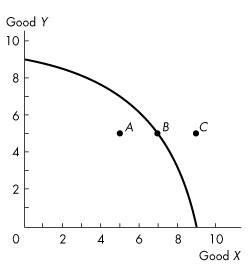

**Figure 2.1.1**

---
7\) Refer to the production possibilities frontier in Figure 2.1.1. Which
one of the following is true about point *A*?

A\) It is unattainable.

B\) While no more of good *Y* can be produced, more of good *X* can be
produced.

C\) It is preferred to point *B*.

D\) Resources are either unused or misallocated or both.

E\) It is attainable only if the amount of capital goods is increased.

---
---
Answer: D

Diff: 1 Type: MC

Topic: Production Possibilities and Opportunity Cost

---
8\) Complete the following sentence. In Figure 2.1.1,

A\) movement from *A* to *B* would require a technological advance.

B\) point *B* is a point of production efficiency.

C\) some resources must be unused at point *C*.

D\) the concept of decreasing opportunity cost is illustrated.

E\) movement from C to B would require a technological improvement.

---
---
Answer: B

Diff: 2 Type: MC

Topic: Production Possibilities and Opportunity Cost

---
9\) Refer to the production possibilities frontier in Figure 2.1.1, which
one of the following is true about point *C*?

A\) It is attainable only if we consume more of good *X.*

B\) It is unattainable.

C\) It is attainable only if we consume less of good *Y.*

D\) It is attainable only if we consume less of good *X*.

E\) It is attainable only if we consume more of good *Y.*

---
---
Answer: B

Diff: 2 Type: MC

Topic: Production Possibilities and Opportunity Cost

---
10\) If Harold can increase production of good *X* without decreasing
production of any other good, then Harold

A\) is producing on his production possibilities frontier.

B\) is producing outside his production possibilities frontier.

C\) is producing inside his production possibilities frontier.

D\) must have a linear production possibilities frontier.

E\) must prefer good *X* to any other good.

---
---
Answer: C

Diff: 2 Type: MC

Topic: Production Possibilities and Opportunity Cost

---
11\) If Harold must decrease production of some other good to increase
production of good *X*, then Harold

A\) is producing on his production possibilities frontier.

B\) is producing outside his production possibilities frontier.

C\) is producing inside his production possibilities frontier.

D\) must prefer good X to any other good.

E\) has too few capital goods.

---
---
Answer: A

Type: MC

Topic: Production Possibilities and Opportunity Cost

---
12\) A situation in which resources are either unused or misallocated or
both is represented in a production possibilities frontier diagram by

A\) any point on either the horizontal or the vertical axis.

B\) a point above or to the right of the production possibilities
frontier.

C\) a point outside the production possibilities frontier.

D\) a point inside the production possibilities frontier.

E\) a point on or inside the production possibilities frontier.

---
---
Answer: D

Diff: 1 Type: MC

Topic: Production Possibilities and Opportunity Cost

---
13\) A production possibilities frontier is negatively sloped because

A\) more goods are purchased as price falls.

B\) of opportunity cost.

C\) some resources are unused.

D\) there is not enough capital in the economy.

E\) of increasing consumption.

---
---
Answer: B

Diff: 2 Type: MC

Topic: Production Possibilities and Opportunity Cost

---
14\) Ted chooses to study for his economics exam instead of going to the
concert. The concert he will miss is Ted\'s \_\_\_\_\_\_\_\_ of studying
for the exam.

A\) monetary cost

B\) absolute cost

C\) opportunity cost

D\) discretionary cost

E\) comparative cost

---
---
Answer: C

Diff: 1 Type: MC

Topic: Production Possibilities and Opportunity Cost

---
15\) Opportunity cost of an action is

A\) the best choice that can be made.

B\) the highest-valued alternative forgone.

C\) the money cost.

D\) the comparative cost.

E\) the absolute cost.

---
---
Answer: B

Diff: 1 Type: MC

Topic: Production Possibilities and Opportunity Cost

---
16\) The concept of opportunity cost

A\) cannot be explained by using a production possibilites frontier.

B\) explains that goods are swapped for other goods.

C\) implies that when a person is more efficient in the production of one
good, he should produce that good and exchange it for some good that he
is relatively less efficient at producing.

D\) implies that a double coincidence of wants must be present for
exchange to take place.

E\) implies that because productive resources are scarce, we must give up
some of one good to acquire more of another.

---
---
Answer: E

Diff: 2 Type: MC

Topic: Production Possibilities and Opportunity Cost

---
17\) On a graph of a production possibilities frontier, opportunity cost
is represented by

A\) a point on the horizontal axis.

B\) a point on the vertical axis.

C\) a ray through the origin.

D\) the slope of the production possibilities frontier.

E\) the *x*-axis intercept.

---
---
Answer: D

Diff: 2 Type: MC

Topic: Production Possibilities and Opportunity Cost

---
18\) Production efficiency is achieved when

A\) the production possibilities frontier shifts outward at an even pace.

B\) there are no more tradeoffs.

C\) all resources are equally productive in all activities.

D\) resources are not equally productive in all activities.

E\) we produce goods and services at the lowest possible cost.

---
---
Answer: E

Diff: 2 Type: MC

Topic: Production Possibilities and Opportunity Cost

---
19\) A tradeoff exists when

A\) we move from a point within the production possibilities frontier
(*PPF*) to a point on the *PPF*.

B\) we move from a point on the *PPF* to a point within the *PPF*.

C\) the *PPF* shifts outward.

D\) we move along the *PPF*.

E\) the *PPF* shifts towards the origin.

---
---
Answer: D

Diff: 2 Type: MC

Topic: Production Possibilities and Opportunity Cost

---
20\) Which of the following quotations best illustrates a tradeoff?

A\) \"If the firm reorganized its production process, it could produce
more widgets *and* more gadgets.\"

B\) \"The firm should sell more gadgets, even if it means less widget
sales.\"

C\) \"The more and more gadgets the firm produces, the bigger the fall in
widget production.\"

D\) \"If the firm invests more in capital equipment, it can expand sales
next year.\"

E\) \"The firm has been able to lower costs due to its extensive
experience in building widgets.\"

---
---
Answer: C

Diff: 2 Type: MC

Topic: Production Possibilities and Opportunity Cost

---
21\) A medical clinic has 10 workers. Each worker can produce a maximum
of either 2 units of medical services or 5 units of secretarial services
a day. The production possibilities frontier of this firm would show

A\) increasing opportunity cost.

B\) decreasing opportunity cost.

C\) constant opportunity cost.

D\) zero opportunity cost.

E\) infinite opportunity cost.

---
---
Answer: C

Diff: 2 Type: MC

Topic: Production Possibilities and Opportunity Cost

---
22\) A medical clinic has 10 workers. Each worker can produce a maximum
of either 2 units of medical services or 5 units of secretarial services
a day. The opportunity cost of one more unit of medical services is

A\) 2 units of secretarial services.

B\) 5 units of secretarial services.

C\) 0.4 units of secretarial services.

D\) 2.5 units of secretarial services

E\) dependent on the level of services.

---
---
Answer: D

Diff: 2 Type: MC

Topic: Production Possibilities and Opportunity Cost

---
23\) A medical clinic has 10 workers. Each worker can produce a maximum
of either 2 units of medical services or 5 units of secretarial services
a day. One day, the firm decides it would like to produce 10 units of
medical services and 30 units of secretarial services. This output level
is

A\) efficient.

B\) unattainable.

C\) inefficient.

D\) costless.

E\) is attainable if the firm reduces the number of its workers.

---
---
Answer: B

Diff: 2 Type: MC

Topic: Production Possibilities and Opportunity Cost

---
24\) A medical clinic has 10 workers. Each worker can produce a maximum
of either 2 units of medical services or 5 units of secretarial services
a day. One day, the firm decides it would like to produce 16 units of
medical services and 5 units of secretarial services. This output level
is

A\) efficient.

B\) unattainable.

C\) inefficient.

D\) costless.

E\) attainable and efficient.

---
---
Answer: C

Diff: 2 Type: MC

Topic: Production Possibilities and Opportunity Cost

---
25\) The bowed-out (concave) shape of a production possibilities frontier

A\) is due to the equal usefulness of resources in all activities.

B\) is due to capital accumulation.

C\) is due to technological change.

D\) reflects the existence of increasing opportunity cost.

E\) reflects the existence of decreasing opportunity cost.

---
---
Answer: D

Diff: 2 Type: MC

Topic: Production Possibilities and Opportunity Cost

---
26\) If opportunity costs are increasing, then the production
possibilities frontier

A\) will be bowed out and have a positive slope.

B\) will be positively sloped.

C\) will be linear and have a negative slope.

D\) will be bowed out and have a negative slope.

E\) reflects the fact that available resources are equally useful in all
production activities.

---
---
Answer: D

Diff: 1 Type: MC

Topic: Production Possibilities and Opportunity Cost

---
27\) The fact that resources are not equally productive in all activities

A\) implies that a production possibilities frontier will be bowed
outward.

B\) implies that gains from specialization and trade are unlikely.

C\) follows from the law of demand.

D\) implies a linear production possibilities frontier.

E\) implies that an economy should not produce certain goods.

---
---
Answer: A

Diff: 2 Type: MC

Topic: Production Possibilities and Opportunity Cost

---
28\) If additional units of any good could be produced at a *constant*
opportunity cost, the production possibilities frontier would be

A\) bowed inward.

B\) bowed outward.

C\) positively sloped.

D\) negatively sloped.

E\) linear.

---
---
Answer: E

Diff: 2 Type: MC

Topic: Production Possibilities and Opportunity Cost

---
29\) The existence of *increasing* opportunity cost

A\) explains why specialization is frequently useful.

B\) explains why resources are scarce.

C\) explains the bowed-out shape of the production possibilities
frontier.

D\) follows from the existence of property rights.

E\) explains why some societies produce inside their production
possibilities frontier.

---
---
Answer: C

Diff: 2 Type: MC

Topic: Production Possibilities and Opportunity Cost

*Use the figure below to answer the following questions.*

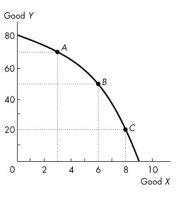

**Figure 2.1.2**

---
30\) Refer to the production possibilities frontier in Figure 2.1.2. If 6
units of *X* are currently being produced, then

A\) 40 units of *Y* cannot be produced unless production of *X* is
decreased.

B\) 40 units of *Y* cannot be produced unless production of *X* is
increased.

C\) 60 units of *Y* can be produced with some resources *not* fully used.

D\) 50 units of *Y* must be produced, regardless of resource utilization.

E\) 50 units of *Y* can be produced if all resources are used and
assigned to the task for which they are the best match.

---
---
Answer: E

Diff: 1 Type: MC

Topic: Production Possibilities and Opportunity Cost

---
31\) Refer to the production possibilities frontier in Figure 2.1.2.
Suppose that 50 units of *Y* are currently being produced. Then

A\) 7 units of *X* are being produced.

B\) 6 units of *X* can be produced if all resources are used and assigned
to the task for which they are the best match.

C\) 9 units of *X* can be produced if all resources are used and assigned
to the task for which they are the best match.

D\) resources are not being fully utilized.

E\) 6 units of *X* are being produced.

---
---
Answer: B

Diff: 1 Type: MC

Topic: Production Possibilities and Opportunity Cost

---
32\) Refer to the production possibilities frontier in Figure 2.1.2. At
point *A*, the opportunity cost of producing 3 more units of *X*

A\) is 30 units of *Y*.

B\) is 3 units of *X*.

C\) is 20 units of *Y*.

D\) is 10 units of *Y*.

E\) cannot be determined from the diagram.

---
---
Answer: C

Diff: 2 Type: MC

Topic: Production Possibilities and Opportunity Cost

---
33\) Refer to the production possibilities frontier in Figure 2.1.2. At
point *A*, the opportunity cost of increasing production of *Y* to 80
units is

A\) 10 units of *Y*.

B\) 80 units of *Y*.

C\) 2 units of *X*.

D\) 3 units of *X*.

E\) 1 unit of *X*.

---
---
Answer: D

Diff: 2 Type: MC

Topic: Production Possibilities and Opportunity Cost

---
34\) Refer to the production possibilities frontier in Figure 2.1.2. At
point *C*, the opportunity cost of producing one more unit of *X* is

A\) 1 unit of *Y*.

B\) 1 unit of *X*.

C\) 8 units of *X*.

D\) 20 units of *X*.

E\) 20 units of *Y*.

---
---
Answer: E

Diff: 2 Type: MC

Topic: Production Possibilities and Opportunity Cost

---
35\) Refer to the production possibilities frontier in Figure 2.1.2. At
point *C*, what is the opportunity cost of increasing the production of
*Y* from 20 to 50 units?

A\) 6 units of *X*

B\) 2 units of *X*

C\) 8 units of *X*

D\) 20 units of *Y*

E\) 30 units of *Y*

---
---
Answer: B

Diff: 2 Type: MC

Topic: Production Possibilities and Opportunity Cost

---
36\) Consider the production possibilities frontier in Figure 2.1.2, and
assume that everything that is produced is also consumed. Which of the
following statements is *false*?

A\) Resources are not equally useful in all activities.

B\) Points inside the frontier indicate unused or misallocated resources.

C\) Starting at point *A*, an increase in the production of *Y* will
shift the frontier outward.

D\) The opportunity cost of producing *Y* increases as production of *Y*
increases.

E\) The opportunity cost of producing *X* increases as production of *X*
increases.

---
---
Answer: C

Diff: 2 Type: MC

Topic: Production Possibilities and Opportunity Cost

---
37\) As we increase the production of *X*, we find we must give up larger
and larger amounts of *Y* per unit of *X*. Select the best statement.

A\) This illustrates increasing opportunity cost.

B\) As a result, we should not specialize in the production of *X*.

C\) The production possibilities frontier for *X* and *Y* is a straight
line.

D\) Good *Y* will be more highly regarded by consumers than good *X*.

E\) We must be inside the production possibilities frontier.

---
---
Answer: A

Diff: 2 Type: MC

Topic: Production Possibilities and Opportunity Cost

*\
Use the figure below to answer the following questions.*

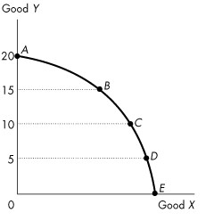

**Figure 2.1.3**

---
38\) Figure 2.1.3 illustrates Mary\'s production possibilities frontier.
If Mary wants to move from point *B* to point *C*,

A\) it will be necessary to improve technology.

B\) it will be necessary to increase the accumulation of capital.

C\) it will be necessary to give up some of good *X* to obtain more of
good *Y*.

D\) it will be necessary to give up some of good *Y* to obtain more of
good *X*.

E\) she can accomplish this without any opportunity cost.

---
---
Answer: D

Diff: 1 Type: MC

Topic: Production Possibilities and Opportunity Cost

---
39\) Figure 2.1.3 illustrates Mary\'s production possibilities frontier.
If Mary wants to move from point *D* to point *C*,

A\) it will be necessary to improve technology.

B\) it will be necessary to increase the accumulation of capital.

C\) it will be necessary to give up some of good *X* to obtain more of
good *Y*.

D\) it will be necessary to give up some of good *Y* to obtain more of
good *X*.

E\) she can accomplish this without any opportunity cost.

---
---
Answer: C

Diff: 1 Type: MC

Topic: Production Possibilities and Opportunity Cost

---
40\) Refer to the production possibilities frontier in Figure 2.1.3. The
opportunity cost of moving from *C* to *B* will be

A\) greater than moving from *D* to *C* but less than moving from *B* to
*A*.

B\) less than moving from *D* to *C* but greater than moving from *B* to
*A*.

C\) the same as moving from *D* to *C* or moving from *B* to *A*.

D\) greater than moving either from *D* to *C* or from *B* to *A*.

E\) neither greater than moving from *D* to *C* nor moving from *B* to
*A*.

---
---
Answer: A

Diff: 2 Type: MC

Topic: Production Possibilities and Opportunity Cost

---
41\) Refer to the production possibilities frontier in Figure 2.1.3. The
fact that less of *X* must be given up when moving from *D* to *C* than
when moving from *B* to *A* indicates

A\) decreasing opportunity cost.

B\) increasing opportunity cost.

C\) comparative advantage in the production of *X*.

D\) the consequences of technological improvement.

E\) unemployed resources at *D*.

---
---
Answer: B

Diff: 2 Type: MC

Topic: Production Possibilities and Opportunity Cost

*Use the table below to answer the following questions.*

**Table 2.1.1**

The following table gives points on the production possibilities
frontier for goods *X* and *Y*.

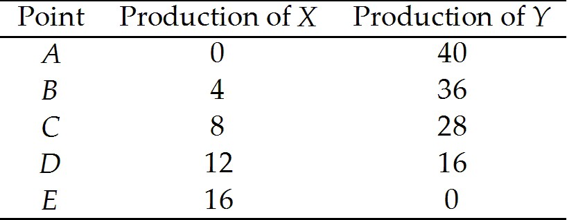

---
42\) Refer to Table 2.1.1. What does point *C* mean?

A\) If 8 units of *X* are produced, then at least 28 units of *Y* can be
produced.

B\) If 8 units of *X* are produced, then at most 28 units of *Y* can be
produced.

C\) If 28 units of *Y* are produced, then more than 8 units of *X* can be
produced.

D\) If 8 units of *X* are produced, then only 36 units of *Y* can be
produced.

E\) There is unemployment at this point.

---
---
Answer: B

Diff: 1 Type: MC

Topic: Production Possibilities and Opportunity Cost

---
43\) Refer to Table 2.1.1. The opportunity cost of increasing the
production of *X* from 8 to 12 units is

A\) 4 units of *X*.

B\) 4 units of *Y*.

C\) 8 units of *Y*.

D\) 12 units of *Y*.

E\) 16 units of *Y*.

---
---
Answer: D

Diff: 2 Type: MC

Topic: Production Possibilities and Opportunity Cost

---
44\) Refer to Table 2.1.1. The opportunity cost of increasing the
production of *Y* from 16 to 36 units is

A\) 4 units of *X*.

B\) 8 units of *X*.

C\) 12 units of *X*.

D\) 16 units of *X*.

E\) 20 units of *Y*.

---
---
Answer: B

Diff: 2 Type: MC

Topic: Production Possibilities and Opportunity Cost

---
45\) The economy illustrated by the data in Table 2.1.1 exhibits

A\) decreasing opportunity cost.

B\) constant opportunity cost in the production of *X*.

C\) constant opportunity cost in the production of *Y*.

D\) increasing opportunity cost.

E\) initially increasing, then decreasing opportunity cost.

---
---
Answer: D

Diff: 2 Type: MC

Topic: Production Possibilities and Opportunity Cost

---
46\) From the data in Table 2.1.1, the production of 7 units of *X* and
28 units of *Y* is

A\) unattainable.

B\) attainable but leaves some resources unused or misallocated or both.

C\) on the *PPF* between points *C* and *D*.

D\) on the *PPF* between points *B* and *C*.

E\) outside the PPF.

---
---
Answer: B

Diff: 2 Type: MC

Topic: Production Possibilities and Opportunity Cost

---
47\) Refer to Table 2.1.1. As we increase the production of *X*,

A\) the amount of *Y* that is given up for each additional unit of *X*
decreases.

B\) the output of *Y* increases.

C\) the opportunity cost of each additional unit of *X* increases.

D\) unemployment increases.

E\) the amount of *X* increases at an increasing rate.

---
---
Answer: C

Diff: 1 Type: MC

Topic: Production Possibilities and Opportunity Cost

---
48\) From the data in Table 2.1.1 we can infer that

A\) the economy illustrated has a comparative advantage in the production
of *Y*.

B\) the economy illustrated has a comparative advantage in the production
of *X*.

C\) the opportunity cost of producing an additional unit of *Y* increases
as the production of *Y* increases.

D\) the opportunity cost of producing an additional unit of *Y* decreases
as the production of *Y* increases.

E\) none of the above.

---
---
Answer: C

Diff: 2 Type: MC

Topic: Production Possibilities and Opportunity Cost

---
49\) The diagram of the production possibilities frontier corresponding
to the data in Table 2.1.1 would be

A\) negatively sloped and linear.

B\) negatively sloped and bowed inward.

C\) negatively sloped and bowed outward.

D\) positively sloped for *X* and negatively sloped for *Y*.

E\) a horizontal line.

---
---
Answer: C

Diff: 2 Type: MC

Topic: Production Possibilities and Opportunity Cost

---
50\) From the data in Table 2.1.1, the production of 10 units of *X* and
28 units of *Y* is

A\) unattainable.

B\) attainable but leaves some resources misallocated.

C\) on the production possibilities frontier between points *C* and *D*.

D\) inside the *PPF*.

E\) possible if we reduce the amount of capital goods.

---
---
Answer: A

Diff: 2 Type: MC

Topic: Production Possibilities and Opportunity Cost

*\
Use the table below to answer the following questions.*

**Table 2.1.2**

Production Possibilities

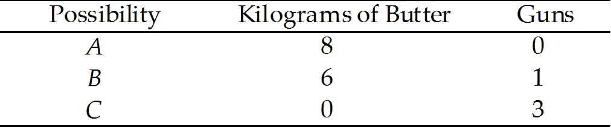

---
51\) Refer to Table 2.1.2. In moving from combination *B* to combination
*C*, the opportunity cost of producing *one* additional unit of guns is

A\) 2 kilograms of butter.

B\) 1/2 kilogram of butter.

C\) 6 kilograms of butter.

D\) 1/6 kilogram of butter.

E\) 3 kilograms of butter.

---
---
Answer: E

Diff: 3 Type: MC

Topic: Production Possibilities and Opportunity Cost

---
52\) Refer to Table 2.1.2. According to this production possibilities
frontier,

A\) a combination of 6 kilograms of butter and 1 gun leaves some
resources unused.

B\) a combination of 0 butter and 4 guns is attainable.

C\) resources are equally useful in all activities.

D\) the opportunity cost of producing guns increases as more guns are
produced.

E\) the opportunity cost of producing guns decreases as more guns are
produced.

---
---
Answer: D

Diff: 1 Type: MC

Topic: Production Possibilities and Opportunity Cost

*\
Use the table below to answer the following questions.*

**Table 2.1.3**

Production possibilities for a society that produces only two

goods --- hockey sticks and maple leaves.

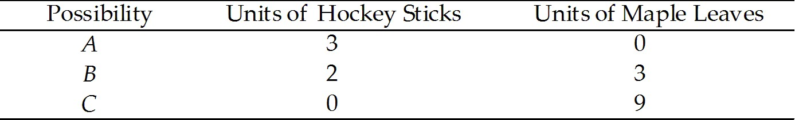

---
53\) Refer to Table 2.1.3. In moving from combination *C* to combination
*B*, the opportunity cost of producing *one* additional hockey stick is

A\) 2 maple leaves.

B\) 1/2 maple leaves.

C\) 6 maple leaves.

D\) 1/6 maple leaves.

E\) 3 maple leaves.

---
---
Answer: E

Diff: 2 Type: MC

Topic: Production Possibilities and Opportunity Cost

*Use the table below to answer the following question.*

**Table 2.1.4**

Consider the following production possibilities for A. Student for the
typical week:

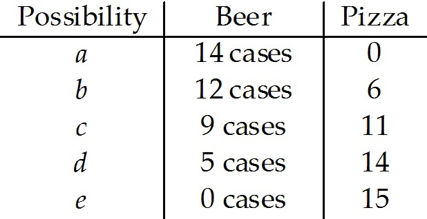

---
54\) Refer to Table 2.1.4. Complete the following sentence. The
production possibilities frontier in the table shows

A\) increasing opportunity cost.

B\) learning-by-doing.

C\) constant opportunity cost.

D\) under-utilization of resources.

E\) decreasing opportunity cost.

---
---
Answer: A

Diff: 2 Type: MC

Topic: Production Possibilities and Opportunity Cost

---
55\) The slope of the production possibilities frontier curve indicates

A\) opportunity cost.

B\) comparative advantage.

C\) absolute advantage.

D\) marginal benefit.

E\) preferences.

---
---
Answer: A

Diff: 2 Type: MC

Topic: Production Possibilities and Opportunity Cost

---
56\) As we move down the bowed-out production possibilities frontier,
opportunity cost

A\) increases.

B\) decreases.

C\) remains constant.

D\) initially decreases, then increases.

E\) decreases but at an increasing rate.

---
---
Answer: A

Diff: 1 Type: MC

Topic: Production Possibilities and Opportunity Cost

*Use the figure below to answer the following questions.*

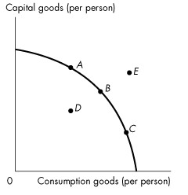

**Figure 2.1.4**

---
57\) Refer to the production possibilities frontier in Figure 2.1.4.
Which point is unattainable?

A\) *A*

B\) *B*

C\) *C*

D\) *D*

E\) *E*

---
---
Answer: E

Diff: 1 Type: MC

Topic: Production Possibilities and Opportunity Cost

*\
Use the figure below to answer the following question.*

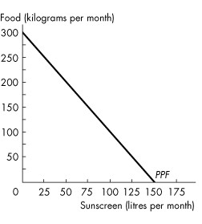

**Figure 2.1.5**

---
58\) The graph in Figure 2.1.5 shows Sunland\'s *PPF* for food and
sunscreen. Sunland faces \_\_\_\_\_\_\_\_ opportunity cost of food and
\_\_\_\_\_\_\_\_ opportunity of sunscreen, which can be seen by the
shape of the *PPF*.

A\) an increasing; a decreasing

B\) a constant; a constant

C\) a decreasing; an increasing

D\) an increasing; an increasing

E\) a decreasing; a decreasing

---
---
Answer: B

Type: MC

Topic: Production Possibilities and Opportunity Cost

*\
Use the figure below to answer the following question.*

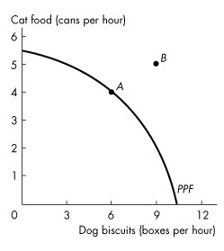

**Figure 2.1.6**

---
59\) Figure 2.1.6 shows the production possibilities frontier for a firm
that produces pet food. Point *A* is \_\_\_\_\_\_\_\_ and point *B* is
\_\_\_\_\_\_\_\_. This *PPF* \_\_\_\_\_\_\_\_ illustrate scarcity
because \_\_\_\_\_\_\_\_.

A\) unattainable; attainable; does; because the firm cannot attain the
points outside the frontier

B\) attainable; unattainable; does not; the firm can produce any quantity
it wants if it is willing to pay a high enough price

C\) unattainable; attainable; does not; the firm can produce any quantity
it wants if it is willing to pay a high enough price

D\) attainable; unattainable; does; the firm cannot produce points
outside the frontier and as the firm moves along the *PPF*, it cannot
produce more dog biscuits without producing less cat food

E\) attainable; unattainable; does not; it is downward sloping

---
---
Answer: D

Type: MC

Topic: Production Possibilities and Opportunity Cost

---
60\) When producing at a point of production efficiency,
\_\_\_\_\_\_\_\_.

A\) our choice of goods to produce can be either on or inside the
production possibilities frontier

B\) we can satisfy all our wants

C\) the opportunity cost of producing goods other than those measured on
the axes of the production possibilities frontier is zero

D\) we face a tradeoff and incur an opportunity cost

E\) resources are either unused or misallocated

---
---
Answer: D

Type: MC

---
61\) Jane produces only corn and cloth. If her preferences for corn and
cloth change, then \_\_\_\_\_\_\_\_.

A\) her *PPF* becomes steeper

B\) her *PPF* becomes flatter

C\) her *PPF* becomes straighter

D\) the world *PPF* shifts outward

E\) her *PPF* does not change

---
---
Answer: E

Type: MC

## 2.2 Using Resources Efficiently

---
1\) Complete the following sentence. Marginal cost

A\) is the opportunity cost of producing one more unit of a good or
service.

B\) is unrelated to the production possibilities frontier.

C\) always equals marginal benefit.

D\) remains constant.

E\) is always greater then marginal benefit.

---
---
Answer: A

Diff: 1 Type: MC

Topic: Using Resources Efficiently

---
2\) The quantity of shoes produced is measured along the *x*-axis of a
bowed-outward production possibilities frontier and the quantity of
shirts produced is measured along the *y*-axis. As you move down towards
the right along the production possibilities frontier, the marginal cost
of

A\) a pair of shoes decreases.

B\) a pair of shoes increases.

C\) a shirt remains constant.

D\) a shirt increases or decreases but we don\'t know for sure.

E\) a pair of shoes and a shirt is equal at the midpoint between the
*x*-axis and the *y*-axis.

---
---
Answer: B

Diff: 2 Type: MC

Topic: Using Resources Efficiently

---
3\) Which of the following is true regarding marginal benefit?

I. The marginal benefit curve shows the benefit firms receive by
producing another

unit of a good.

II\. Marginal benefit increases as more and more of a good is consumed.

III\. Marginal benefit is the maximum amount a person is willing to pay
to

obtain one more unit of a good.

A\) I only

B\) I and II

C\) I and III

D\) III only

E\) I, II, and III

---
---
Answer: D

Diff: 3 Type: MC

Topic: Using Resources Efficiently

---
4\) To describe preferences, economists use the concept of

A\) opportunity cost.

B\) scarcity.

C\) marginal benefit.

D\) marginal cost.

E\) none of the above.

---
---
Answer: C

Diff: 1 Type: MC

Topic: Using Resources Efficiently

---
5\) Complete the following sentence. As you consume more and more of a
good,

A\) marginal benefit increases.

B\) marginal benefit decreases.

C\) marginal benefit always equals marginal cost.

D\) marginal benefit increases or decreases depending on where you are on
the production possibilities frontier.

E\) the price of the good falls.

---
---
Answer: B

Diff: 1 Type: MC

Topic: Using Resources Efficiently

---
6\) The marginal benefit curve for a good

A\) shows the benefit a firm receives from producing one more unit of
that good.

B\) shows the most a consumer is willing to pay for one more unit of that
good.

C\) is upward-sloping.

D\) is bowed outward.

E\) none of the above.

---
---
Answer: B

Diff: 1 Type: MC

Topic: Using Resources Efficiently

*\
Use the figure below to answer the following questions.*

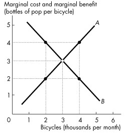

**Figure 2.2.1**

---
7\) In Figure 2.2.1, the curve labeled *B* shows

A\) the bottles of pop that people are *willing* to forgo to get another
bicycle.

B\) the bicycles that people are *willing* to forgo to get another bottle
of pop.

C\) the bottles of pop that people *must* forgo to get another bicycle.

D\) that the benefits of producing more bicycles is greater than the
benefits of producing more pop.

E\) that the benefits of producing more pop is greater than the benefits
of producing more bicycles.

---
---
Answer: A

Diff: 1 Type: MC

Topic: Using Resources Efficiently

---
8\) In Figure 2.2.1, when 2,000 bicycles are produced each month

A\) the marginal benefit from another bicycle is greater than the
marginal cost of another bicycle.

B\) more bicycles must be produced to reach the efficient level of
output.

C\) fewer bicycles must be produced to reach the efficient level of
output.

D\) the economy is efficient at this level of production of bicycles.

E\) both A and B.

---
---
Answer: E

Diff: 2 Type: MC

Topic: Using Resources Efficiently

---
9\) In Figure 2.2.1, the curve labelled *A* is the \_\_\_\_\_\_\_\_ curve
and the curve labelled *B* is the \_\_\_\_\_\_\_\_ curve.

A\) marginal cost; marginal benefit

B\) marginal cost; trade

C\) marginal benefit; trade

D\) production possibilities; trade

E\) marginal benefit; marginal cost

---
---
Answer: A

Diff: 1 Type: MC

Topic: Using Resources Efficiently

---
10\) In Figure 2.2.1, when 4,000 bicycles are produced each month

A\) the marginal benefit from another bicycle is greater than the
marginal cost of another bicycle.

B\) more bicycles must be produced to reach the efficient level of
output.

C\) fewer bicycles must be produced to reach the efficient level of
output.

D\) the economy is very efficient at this level of production of
bicycles.

E\) both A and B.

---
---
Answer: C

Diff: 2 Type: MC

Topic: Using Resources Efficiently

---
11\) A marginal benefit curve measures

A\) comparative advantage.

B\) willingness to pay.

C\) absolute advantage.

D\) opportunity cost.

E\) expenditure.

---
---
Answer: B

Diff: 1 Type: MC

Topic: Using Resources Efficiently

---
12\) Allocative efficiency refers to a situation where

A\) opportunity costs are equal.

B\) we cannot produce more of any one good without giving up some other
good.

C\) goods and services are produced at the lowest possible cost and in
the quantities that provide the greatest possible benefit.

D\) opportunity cost is zero.

E\) none of the above.

---
---
Answer: C

Diff: 1 Type: MC

Topic: Using Resources Efficiently

---
13\) As production of food increases, marginal benefit from food

A\) increases and marginal cost increases.

B\) increases and marginal cost decreases.

C\) decreases and marginal cost increases.

D\) decreases and marginal cost decreases.

E\) decreases and marginal cost is zero.

---
---
Answer: C

Diff: 1 Type: MC

Topic: Using Resources Efficiently

---
14\) Suppose the production possibilities frontier for skirts and pants
is a straight line. As the production of skirts increases, the marginal
benefit from skirts

A\) increases and marginal cost is constant.

B\) is constant and marginal cost decreases.

C\) decreases and marginal cost increases.

D\) decreases and marginal cost decreases.

E\) decreases and marginal cost is constant.

---
---
Answer: E

Diff: 1 Type: MC

Topic: Using Resources Efficiently

---
15\) With allocative efficiency, for each good produced,

A\) marginal benefit equals marginal cost.

B\) marginal benefit is at its maximum.

C\) marginal benefit exceeds marginal cost by as much as possible.

D\) marginal cost exceeds marginal benefit by as much as possible.

E\) marginal cost is at its minimum.

---
---
Answer: A

Diff: 1 Type: MC

Topic: Using Resources Efficiently

---
16\) Marginal benefit from a good or service is the benefit received from
consuming \_\_\_\_\_\_\_\_. It is measured by the most that people are
willing to pay for \_\_\_\_\_\_\_\_.

A\) goods that you prefer; an additional unit of it

B\) goods that you prefer; more of it

C\) one more unit of it; an additional unit of it

D\) one more unit of it; more of it

E\) as much as is available; the total amount consumed

---
---
Answer: C

Type: MC

Topic: Using Resources Efficiently

*\
Use the table below to answer the following questions.*

**Table 2.2.1**

+-------------------+-----------+------------------+
| ***Ethanol***     |           | **Food crops**   |
|                   |           |                  |
| (barrels per day) |           | (tonnes per day) |
+-------------------+-----------+------------------+
| ***70***          | ***and*** | ***0***          |
+-------------------+-----------+------------------+
| ***64***          | ***and*** | ***1***          |
+-------------------+-----------+------------------+
| ***54***          | ***and*** | ***2***          |
+-------------------+-----------+------------------+
| ***40***          | ***and*** | ***3***          |
+-------------------+-----------+------------------+
| ***22***          | ***and*** | ***4***          |
+-------------------+-----------+------------------+
| ***0***           | ***and*** | ***5***          |
+-------------------+-----------+------------------+

---
17\) Refer to Table 2.2.1. Marginal benefit from food crops

A\) equals the marginal cost of food crops.

B\) remains constant as the quantity of food crops increases from 1 tonne
a day to 2 tonnes a day.

C\) cannot be calculated from the table.

D\) increases as the quantity of food crops increases from 1 tonne a day
to 2 tonnes a day.

E\) equals 70 barrels of ethanol.

---
---
Answer: C

Type: MC

Topic: Using Resources Efficiently

---
18\) The principle of decreasing marginal benefit implies that the
\_\_\_\_\_\_\_\_.

A\) additional benefit from obtaining one more unit of a good or service
decreases as more of that good or service is consumed

B\) additional benefit from obtaining one more unit of a good or service
increases as more of that good or service is consumed

C\) total benefit from obtaining more of a good or service decreases as
more is consumed

D\) total benefit from obtaining more of a good or service remains the
same as more is consumed

E\) additional benefit from producing one more unit of a good or service
decreases as more of that good or service is produced

---
---
Answer: A

Type: MC

---
19\) The most anyone is willing to pay for another purse is \$30.
Currently the price of a purse is \$40, and the cost of producing
another purse is \$50. The marginal benefit from a purse is
\_\_\_\_\_\_\_\_.

A\) \$40

B\) \$50

C\) \$10

D\) \$20

E\) \$30

---
---
Answer: E

Type: MC

## 2.3 Economic Growth

---
1\) A technological improvement is represented by

A\) an outward shift of the production possibilities frontier.

B\) a movement along the production possibilities frontier.

C\) a point inside the production possibilities frontier.

D\) a point outside the production possibilities frontier.

E\) a movement from a point inside the production possibilities frontier
to a point on the production possibilities frontier.

---
---
Answer: A

Diff: 1 Type: MC

Topic: Economic Growth

---
2\) In general, if country *A* is accumulating capital at a faster rate
than country *B*, then country *A*

A\) will soon have a comparative advantage in the production of most
goods.

B\) is using a larger proportion of resources to produce consumption
goods.

C\) will have a production possibilities frontier that is shifting out
faster than country *B*\'s.

D\) will have a higher rate of inflation than country *B*.

E\) will have more unemployment than country *B*.

---
---
Answer: C

Diff: 2 Type: MC

Topic: Economic Growth

---
3\) The principal reason that production possibilities have grown more
rapidly in Hong Kong than in Canada over the last 50 years is because

A\) of cheap Hong Kong labour.

B\) of foreign aid to Hong Kong.

C\) Hong Kong has fewer workers.

D\) Hong Kong has more natural resources.

E\) Hong Kong has devoted a larger proportion of its resources to capital
accumulation.

---
---
Answer: E

Diff: 2 Type: MC

Topic: Economic Growth

---
4\) Which one of the following would cause a production possibilities
frontier to shift *outward*?

A\) an increase in the stock of capital

B\) an increase in the production of consumption goods

C\) bad weather

D\) a decision to fully utilize unemployed resources

E\) a decrease in the population

---
---
Answer: A

Diff: 1 Type: MC

Topic: Economic Growth

---
5\) The development of new goods and better ways of producing goods and
services is

A\) capital accumulation.

B\) technological change.

C\) the big tradeoff.

D\) allocative efficiency.

E\) none of the above.

---
---
Answer: B

Diff: 1 Type: MC

Topic: Economic Growth

---
6\) The growth of capital resources, including human capital is

A\) technological change.

B\) capital accumulation.

C\) depreciation.

D\) opportunity cost.

E\) none of the above.

---
---
Answer: B

Diff: 1 Type: MC

Topic: Economic Growth

---
7\) Which one of the following would likely shift a production
possibilities frontier *inward*?

A\) technological change.

B\) a drought.

C\) a decrease in the price of natural resources.

D\) all of the above

E\) None of the above, because production possibilities frontiers do not
shift inward.

---
---
Answer: B

Diff: 2 Type: MC

Topic: Economic Growth

*\
Use the figure below to answer the following questions.*

**Figure 2.3.1**

---
8\) Refer to the production possibilities frontier in Figure 2.3.1. The
production possibilities frontier will shift rightward most rapidly if
current production is at

A\) *A*.

B\) *B*.

C\) *C*.

D\) *D*.

E\) *E*.

---
---
Answer: A

Diff: 2 Type: MC

Topic: Economic Growth

---
9\) A production possibilities frontier will shift outward FOR ALL OF THE
FOLLOWING REASONS *EXCEPT*

A\) a technological improvement.

B\) an increase in the stock of capital.

C\) an increase in the labour force.

D\) opportunity cost is increasing.

E\) none of the above.

---
---
Answer: D

Diff: 1 Type: MC

Topic: Economic Growth

---
10\) A movement *along* the production possibilities frontier will result
from

A\) technological change.

B\) change in the stock of capital.

C\) change in the labour force.

D\) all of the above.

E\) none of the above.

---
---
Answer: E

Diff: 1 Type: MC

Topic: Economic Growth

---
11\) The opportunity cost of pushing the production possibilities
frontier outward is

A\) capital accumulation.

B\) technological change.

C\) reduced current consumption.

D\) the gain in future consumption.

E\) all of the above.

---
---
Answer: C

Diff: 2 Type: MC

Topic: Economic Growth

---
12\) In general, the higher the proportion of resources devoted to
technological research in an economy, the

A\) greater will be current consumption.

B\) faster the production possibilities frontier will shift outward.

C\) faster the production possibilities frontier will shift inward.

D\) closer it will come to having a comparative advantage in the
production of all goods.

E\) more bowed out will be the shape of the production possibilities
frontier.

---
---
Answer: B

Diff: 2 Type: MC

Topic: Economic Growth

---
13\) Consider a country that has two industries. In the north, they grow
wild rice, which requires a lot of rainfall. In the south, they grow
wheat, which requires just a moderate amount of rainfall (too much
rainfall is bad for wheat production). One year, there is a record
rainfall. This will result in

A\) a parallel shift inward of the production possibilities frontier.

B\) a parallel shift outward of the production possibilities frontier.

C\) the production possibilities frontier swiveling, with the wild rice
intercept increasing, and the wheat intercept decreasing.

D\) the production possibilities frontier swiveling, with the wild rice
intercept decreasing, and the wheat intercept increasing.

E\) none of the above.

---
---
Answer: C

Diff: 3 Type: MC

Topic: Economic Growth

---
14\) Suppose a hurricane causes extensive devastation, destroying houses,
roads, schools and factories. What would be the effect of this hurricane
on a production possibilities frontier consisting of consumption goods
and capital goods?

A\) It would shift outward at all points.

B\) It would shift inward at all points.

C\) There would be a movement along the existing production possibilities
frontier towards a less capital-intensive point.

D\) There would be a movement along the existing production possibilities
frontier towards a more capital-intensive point.

E\) There would be a movement from the existing production possibilities
frontier inwards towards a point with unused or misallocated resources.

---
---
Answer: B

Diff: 2 Type: MC

Topic: Economic Growth

---
15\) The depletion of fish stocks in Eastern Canada, with its
accompanying unemployment, will lead to a

A\) movement from the existing production possibilities frontier to a
point inside the production possibilities frontier.

B\) shift inward of the existing production possibilities frontier and
production at a point on the new *PPF*.

C\) shift outward of the existing production possibilities frontier.

D\) movement along the existing production possibilities frontier to a
point of less fish production.

E\) shift inward of the existing production possibilities frontier plus a
movement to a point inside the new production possibilities frontier.

---
---
Answer: E

Diff: 3 Type: MC

Topic: Economic Growth

---
16\) Which of the following quotations illustrates economic growth?

A\) \"The firm should lower the price it charges for widgets and
gadgets.\"

B\) \"The firm should sell more gadgets, even if it means less widget
sales.\"

C\) \"The more and more gadgets the firm produces, the bigger the fall in
widget production.\"

D\) \"If the firm invests more in capital equipment, it can expand
production next year.\"

E\) \"The firm has been able to lower costs due to its extensive
experience in building widgets.\"

---
---
Answer: D

Diff: 2 Type: MC

Topic: Economic Growth

---
17\) Economic growth \_\_\_\_\_\_\_\_ overcome scarcity because
\_\_\_\_\_\_\_\_.

A\) does; with economic growth the *PPF* rotates outward and eventually
becomes a horizontal line

B\) does; we will eventually reach the point where we have too much

C\) does not; we can produce more goods and services but it is still
impossible to satisfy all our wants

D\) does not; economic growth requires capital accumulation and
technological change

E\) does; with economic growth the *PPF* rotates outward and eventually
becomes a vertical line

---
---
Answer: C

Type: MC

Topic: Economic Growth

---
18\) In 1960, the production possibilities per person in Canada were
\_\_\_\_\_\_\_\_ than those in Hong Kong. Canada devoted
\_\_\_\_\_\_\_\_ of its resources to accumulating capital and the
remainder to consumption. Hong Kong devoted \_\_\_\_\_\_\_\_ of its
resources to accumulating capital and the remainder to consumption.
Because Hong Kong devoted a \_\_\_\_\_\_\_\_ fraction of its resources
to accumulating capital, its production possibilities have
\_\_\_\_\_\_\_\_.

A\) smaller; one-fifth; one-third; greater; expanded more quickly

B\) smaller; one-third; one-fifth; smaller; not expanded as quickly

C\) greater; one-third; one-fifth; smaller; not expanded as quickly

D\) greater; one-fifth; one-third; greater; expanded more quickly

E\) greater; one-half; one-quarter; smaller; not expanded as quickly

---
---
Answer: D

Type: MC

Topic: Economic Growth

---
19\) The production possibilities frontier shifts outward when
\_\_\_\_\_\_\_\_.

A\) tastes and preferences change

B\) the quantity of money in the economy grows

C\) prices rise

D\) human capital accumulates

E\) the political party in power changes

---
---
Answer: D

Type: MC

---
20\) Consider a production possibilities frontier with corn production
measured on the vertical axis and car production measured on the
horizontal axis. Unusually good weather for growing corn shifts
\_\_\_\_\_\_\_\_.

A\) the horizontal intercept of the *PPF* rightward and the vertical
intercept of the *PPF* upward [ ]{.underline}

B\) the horizontal intercept of the *PPF* rightward but does not shift
the vertical intercept of the *PPF*

C\) the vertical intercept of the PPF upward but does not shift the
horizontal intercept of the PPF

D\) neither the horizontal intercept nor the vertical intercept of the
*PPF*

E\) the vertical intercept of the *PPF* downward and the horizontal
intercept of the *PPF* leftward

---
---
Answer: C

Type: MC

## 2.4 Gains from Trade

---
1\) Individuals *A* and *B* can both produce good *X*. We say that *A*
has a comparative advantage in the production of good *X* if

A\) *A* has a lower opportunity cost of producing *X* than *B*.

B\) *A* has a higher opportunity cost of producing X than B.

C\) *A* can produce more units of *X* in a given time period than *B*.

D\) *A* can produce *X* using newer technology than *B*.

E\) *A* can produce less units of *X* in a given time period than *B*.

---
---
Answer: A

Diff: 3 Type: MC

Topic: Gains from Trade

---
2\) Individuals *A* and *B* can both produce goods *X* and *Y*.
Individual *A* has a comparative advantage in the production of *X* if

A\) *A* is faster than *B* at producing *X*.

B\) the amount by which *A* must reduce production of *Y* is less than
the amount by which *B* must reduce production of *Y* to produce an
additional unit of *X*.

C\) *B* has superior knowledge about how to produce *X*.

D\) *A* has a preference to consume *X*.

E\) the amount by which *A* must reduce production of *Y* is more than
the amount by which *B* must reduce production of *Y* to produce an
additional unit of *X*.

---
---
Answer: B

Diff: 2 Type: MC

Topic: Gains from Trade

---
3\) Debra has an absolute advantage in producing a good when she

A\) has a comparative advantage in producing that good.

B\) can produce the good at lower opportunity cost than anyone else.

C\) can produce more of that good than anyone else, using the same
quantity of inputs.

D\) has exclusive rights to sell that good.

E\) has better technology than anyone else.

---
---
Answer: C

Diff: 2 Type: MC

Topic: Gains from Trade

---
4\) A person who has an absolute advantage in the production of all goods
will

A\) also have a comparative advantage in the production of all goods.

B\) not be able to gain from specialization and trade.

C\) produce all goods at the lowest opportunity cost.

D\) not have a comparative advantage in the production of any goods.

E\) have a comparative advantage in the production of only some goods and
not others.

---
---
Answer: E

Diff: 2 Type: MC

Topic: Gains from Trade

*\
Use the information below to answer the following questions.*

**Fact 2.4.1**

In an eight-hour day, Andy can produce either 24 loaves of bread or 8
kilograms of butter. In an eight-hour day, Rolfe can produce either 8
loaves of bread or 8 kilograms of butter.

---
5\) Given Fact 2.4.1, the opportunity cost of producing 1 loaf of bread
is

A\) 20 minutes (1/3 hour) for Andy and 1 hour for Rolfe.

B\) 1/3 kilogram of butter for Andy and 1 kilogram of butter for Rolfe.

C\) 3 kilograms of butter for Andy and 1 kilogram of butter for Rolfe.

D\) 8 kilograms of butter for both Andy and Rolfe.

E\) not calculable from the given information.

---
---
Answer: B

Diff: 2 Type: MC

Topic: Gains from Trade

---
6\) From Fact 2.4.1, we know that

A\) Andy has the lower opportunity cost of producing bread, while Andy
and Rolfe have equal opportunity costs of producing butter.

B\) Andy has the lower opportunity cost of producing both bread and
butter.

C\) Andy has the lower opportunity cost of producing bread, while Rolfe
has the lower opportunity cost of producing butter.

D\) Andy has the lower opportunity cost of producing butter, while Rolfe
has the lower opportunity cost of producing bread.

E\) Andy has the higher opportunity cost of producing both bread and
butter.

---
---
Answer: C

Diff: 3 Type: MC

Topic: Gains from Trade

---
7\) Refer to Fact 2.4.1. Which one of the following statements is true?

A\) Andy has an absolute advantage in butter production.

B\) Rolfe has an absolute advantage in butter production.

C\) Andy has a comparative advantage in bread production.

D\) Andy has a comparative advantage in butter production.

E\) Rolfe has a comparative advantage in bread production.

---
---
Answer: C

Diff: 3 Type: MC

Topic: Gains from Trade

---
8\) Refer to Fact 2.4.1. The opportunity cost of producing 1 kilogram of
butter is

A\) 20 minutes (1/3 hour) for Andy and 1 hour for Rolfe.

B\) 1 hour for Andy and 1 hour for Rolfe.

C\) 3 loaves of bread for Andy and 1/3 loaf of bread for Rolfe.

D\) 3 loaves of bread for Andy and 1 loaf of bread for Rolfe.

E\) 8 loaves of bread for Rolfe and 24 loaves of bread for Andy.

---
---
Answer: D

Diff: 2 Type: MC

Topic: Gains from Trade

---
9\) Given Fact 2.4.1, Andy and Rolfe

A\) can gain from trade if Andy specializes in butter production and
Rolfe specializes in bread production.

B\) can gain from trade if Andy specializes in bread production and Rolfe
specializes in butter production.

C\) cannot gain from trade.

D\) can trade, but only Rolfe will gain.

E\) can trade, but only Andy will gain.

---
---
Answer: B

Diff: 3 Type: MC

Topic: Gains from Trade

---
10\) Consider Fact 2.4.1. After specialization, *total* consumption will

A\) depend on the preferences of Andy and Rolfe.

B\) be 8 loaves of bread and 24 kilograms of butter.

C\) be 32 loaves of bread and 16 kilograms of butter.

D\) be 8 loaves of bread and 8 kilograms of butter.

E\) be 24 loaves of bread and 8 kilograms of butter.

---
---
Answer: E

Diff: 2 Type: MC

Topic: Gains from Trade

*\
Use the information below to answer the following questions.*

**Fact 2.4.2**

Agnes can produce either 1 unit of *X* or 1 unit of *Y* in an hour,
while Brenda can produce either 2 units of *X* or 4 units of *Y* in an
hour.

---
11\) Refer to Fact 2.4.2. Which one of the following statements is true?

A\) Brenda has an absolute advantage over Agnes in the production of both
goods.

B\) Agnes has a comparative advantage in the production of *Y*.

C\) Brenda has a comparative advantage in the production of *X*.

D\) Brenda will not gain from trade.

E\) Agnes will not gain from trade.

---
---
Answer: A

Diff: 3 Type: MC

Topic: Gains from Trade

---
12\) Given Fact 2.4.2, the opportunity cost of producing a unit of *X* is

A\) 1 unit of *Y* for Agnes and 2 units of *Y* for Brenda.

B\) 1 unit of *Y* for Agnes and 1/2 unit of *Y* for Brenda.

C\) 1 hour for Agnes and 1/2 hour for Brenda.

D\) 1 hour for Agnes and 2 hours for Brenda.

E\) 1 hour for Agnes and 1/4 hour for Brenda.

---
---
Answer: A

Diff: 2 Type: MC

Topic: Gains from Trade

---
13\) Given Fact 2.4.2, the opportunity cost of producing a unit of *Y* is

A\) 1 unit of *Y* for Agnes and 2 units of *Y* for Brenda.

B\) 1 unit of *Y* for Agnes and 1/2 unit of *Y* for Brenda.

C\) 1 hour for Agnes and 1/2 hour for Brenda.

D\) 1 hour for Agnes and 2 hours for Brenda.

E\) 1 unit of *X* for Agnes and 1/2 unit of *X* for Brenda.

---
---
Answer: E

Diff: 2 Type: MC

Topic: Gains from Trade

---
14\) Complete the following sentence. Given Fact 2.4.2,

A\) there will be gains from trade, no matter what Brenda and Agnes
specialize in, as long as they specialize.

B\) there will be gains from trade only if Agnes specializes in the
production of *Y* and Brenda in *X*.

C\) there will be gains from trade only if Agnes becomes faster at
producing *X*.

D\) there will be no gains from trade because Agnes has an absolute
advantage.

E\) there will be gains from trade if Agnes specializes in the production
of *X* and Brenda in *Y*.

---
---
Answer: E

Diff: 2 Type: MC

Topic: Gains from Trade

---
15\) Given Fact 2.4.2, what would be the total output of *X* and *Y* in
an eight-hour day if Agnes and Brenda each specialized in producing the
good in which they have a comparative advantage?

A\) 3 units of *X* and 5 units of *Y*

B\) 8 units of *X* and 16 units of *Y*

C\) 8 units of *X* and 32 units of *Y*

D\) 24 units of *X* and 40 units of *Y*

E\) 16 units of *X* and 8 units of *Y*

---
---
Answer: C

Diff: 3 Type: MC

Topic: Gains from Trade

---
16\) Any two individuals will gain from exchange

A\) unless one has an absolute advantage in producing all goods.

B\) if each specializes in the production of the good for which he has
the higher opportunity cost.

C\) unless they have the same opportunity costs for producing all goods.

D\) unless they have different opportunity costs for producing all goods.

E\) unless they have the same absolute advantage in producing all goods.

---
---
Answer: C

Diff: 3 Type: MC

Topic: Gains from Trade

*\
Use the figure below to answer the following questions.*

**Table 2.4.1**

The planets of Vulcan and Romulus each produce goods *X* and *Y*.

The following table gives points on their production possibilities
frontiers.

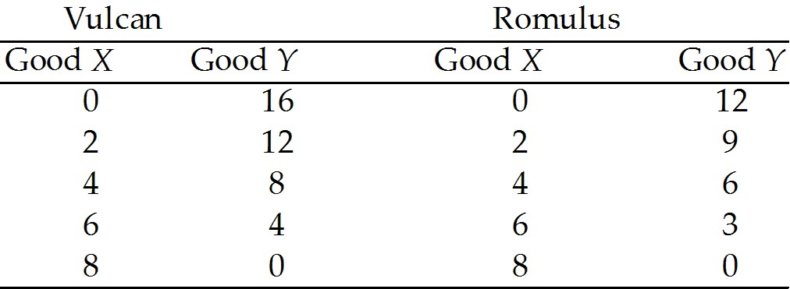

---
17\) Refer to Table 2.4.1. Which one of the following is true?

A\) Romulus has both an absolute advantage and a comparative advantage in
the production of *Y*.

B\) Romulus has both an absolute advantage and a comparative advantage in
the production of *X*.

C\) Vulcan has a comparative advantage in the production of *X*.

D\) Romulus has a comparative advantage in the production of *X*.

E\) Vulcan should specialize in the production of *X*.

---
---
Answer: D

Diff: 3 Type: MC

Topic: Gains from Trade

---
18\) Refer to Table 2.4.1. Which one of the following is true?

A\) The opportunity cost of producing more of good *X* is the same for
both planets.

B\) The opportunity cost of producing more of good *Y* is the same for
both planets.

C\) The opportunity cost of producing more of good *X* is lower in
Vulcan.

D\) The opportunity cost of producing more of good *Y* is lower in
Vulcan.

E\) Vulcans are smarter than Romulans.

---
---
Answer: D

Diff: 3 Type: MC

Topic: Gains from Trade

---
19\) Refer to Table 2.4.1. For Vulcan, the opportunity cost of producing
an additional unit of *X* is

A\) 4 units of *Y*.

B\) 2 units of *Y*.

C\) 2/3 units of *Y*.

D\) 1 unit of *Y*.

E\) dependent upon how many units of *X* are already produced.

---
---
Answer: B

Diff: 2 Type: MC

Topic: Gains from Trade

---
20\) Refer to Table 2.4.1. For Romulus, the opportunity cost of producing
an additional unit of *X* is

A\) 4 units of *Y*.

B\) 2 units of *Y*.

C\) 2/3 units of *Y*.

D\) 1 unit of *Y*.

E\) 3/2 units of *Y*.

---
---
Answer: E

Diff: 2 Type: MC

Topic: Gains from Trade

---
21\) Refer to Table 2.4.1. For Romulus, the opportunity cost of producing
an additional unit of *Y* is

A\) 2/3 units of *X*.

B\) 1/2 unit of *X*.

C\) 2 units of *X*.

D\) 3 units of *X*.

E\) 3/2 units of *Y*.

---
---
Answer: A

Diff: 2 Type: MC

Topic: Gains from Trade

---
22\) Refer to Table 2.4.1. For Vulcan, the opportunity cost of producing
an additional unit of *Y* is

A\) 2/3 units of *X*.

B\) 1/2 units of *X*.

C\) 2 units of *X*.

D\) 3 units of *X*.

E\) 4 units of *X*.

---
---
Answer: B

Diff: 2 Type: MC

Topic: Gains from Trade

---
23\) Refer to Table 2.4.1. Each country will gain from trade if

A\) Romulus specializes in both goods.

B\) Vulcan specializes in both goods.

C\) they both continue to produce both goods.

D\) Vulcan specializes in good *X* and Romulus specializes in good *Y.*

E\) Romulus specializes in good *X* and Vulcan specializes in good *Y*.

---
---
Answer: E

Diff: 3 Type: MC

Topic: Gains from Trade

---
24\) If individuals *A* and *B* can both produce only goods *X* and *Y*
and *A* does *not* have a comparative advantage in the production of
either *X* or *Y*, then we know

A\) *B* has an absolute advantage in the production of *X* and *Y*.

B\) *A* and *B* have the same opportunity costs for *X* and for *Y*.

C\) *B* has a comparative advantage in the production of both *X* and
*Y*.

D\) the gains from trade will be large but only in one direction.

E\) *A* must have lower opportunity costs of production for both goods.

---
---
Answer: B

Diff: 3 Type: MC

Topic: Gains from Trade

---
25\) Consider the following household. In 5 hours, Bob can cook 5 meals
or clean 6 rooms. In 5 hours, Mary can cook 30 meals or clean 10 rooms.
Select the best statement.

A\) Bob has an absolute advantage in the production of both goods.

B\) Since Mary is better at producing both goods, she should produce
both.

C\) Bob has a comparative advantage in cooking.

D\) Mary should specialize in cooking.

E\) none of the above

---
---
Answer: D

Diff: 3 Type: MC

Topic: Gains from Trade

*Use the table below to answer the following questions.*

**Table 2.4.2**

Production for one week by Sheila and Bruce

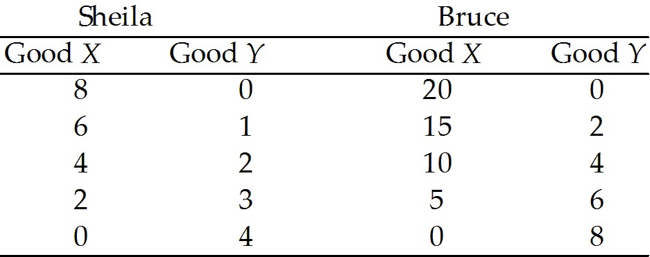

---
26\) Given the information in Table 2.4.2, can Sheila and Bruce gain by
specialization?

A\) Yes, but only if Bruce gets paid more than Sheila.

B\) No, not under the given circumstances.

C\) It depends on the wages each earns.

D\) Only if they are married to each other.

E\) Yes, if each specializes in the good in which he has a comparative
advantage.

---
---
Answer: E

Diff: 2 Type: MC

Topic: Gains from Trade

---
27\) Given the information in Table 2.4.2, which one of the following is
true?

A\) Sheila should specialize in good X.

B\) Bruce should specialize in good X.

C\) The opportunity cost to Bruce of an additional unit of X is 0.4 units
of Y.

D\) A and B.

E\) B and C.

---
---
Answer: E

Diff: 3 Type: MC

Topic: Gains from Trade

---
28\) Suppose John and Joe each have different production possibility
frontiers; John specializes in cloth and Joe specializes in corn.
John\'s island unexpectedly has exceptionally good weather, and suddenly
he is twice as productive in the production of *both* corn and cloth.
Select the best statement.

A\) This is an example of unemployed resources becoming employed.

B\) As a result, John will have an absolute advantage in both corn and
cloth.

C\) As a result, it is possible that John and Joe will switch what they
specialize in.

D\) There will be no change in what John and Joe specialize in, because
John\'s comparative advantage has not changed.

E\) There will be a change in what John and Joe specialize in, because
John\'s opportunity cost of production will have risen.

---
---
Answer: D

Diff: 3 Type: MC

Topic: Gains from Trade

---
29\) It pays for people to specialize and trade with each other because

A\) otherwise they would not survive.

B\) they can take advantage of the fact they have an absolute advantage
in the production of something.

C\) this way they can consume outside their production possibilities
frontier.

D\) this way the strong can exploit the weak.

E\) all of the above.

---
---
Answer: C

Diff: 2 Type: MC

Topic: Gains from Trade

---
30\) There are two goods, *X* and *Y*. If the opportunity cost of
producing good *X* is lower for Pam than for Gino, then

A\) Pam has an absolute advantage in the production of *X*.

B\) Gino has an absolute advantage in the production of *Y*.

C\) Pam has a comparative advantage in the production of *X*.

D\) Gino has a comparative advantage in the production of *Y*.

E\) C and D.

---
---
Answer: E

Diff: 3 Type: MC

Topic: Gains from Trade

---
31\) Mexico and Canada produce both oil and apples using labour only. A
barrel of oil is produced with 4 hours of labour in Mexico and 8 hours
of labour in Canada. A bushel of apples is produced with 8 hours of
labour in Mexico and 12 hours of labour in Canada. Canada has

A\) an absolute advantage in oil production.

B\) an absolute advantage in apple production.

C\) a comparative advantage in oil production.

D\) a comparative advantage in apple production.

E\) none of the above.

---
---
Answer: D

Diff: 3 Type: MC

Topic: Gains from Trade

---
32\) In Portugal, the opportunity cost of a bale of wool is 3 bottles of
wine. In England, the opportunity cost of 1 bottle of wine is 3 bales of
wool. Given this information,

A\) England has an absolute advantage in wine production.

B\) Portugal has an absolute advantage in wool production.

C\) Portugal has a comparative advantage in wine production.

D\) Portugal has a comparative advantage in wool production.

E\) no trade will occur.

---
---
Answer: C

Diff: 3 Type: MC

Topic: Gains from Trade

---
33\) To gain from comparative advantage, countries must not only trade,
they must also

A\) save.

B\) invest.

C\) engage in research and development.

D\) engage in capital accumulation.

E\) specialize.

---
---
Answer: E

Diff: 1 Type: MC

Topic: Gains from Trade

---
34\) In one hour, Sue can produce 50 caps or 10 jackets and Tessa can
produce 70 caps or 7 jackets. Sue\'s opportunity cost of producing a cap
is \_\_\_\_\_\_\_\_ jackets and Tessa\'s opportunity cost of producing a
cap is \_\_\_\_\_\_\_\_ jackets.

\_\_\_\_\_\_\_\_ has a comparative advantage in producing caps.

If Sue and Tessa each specialize in producing the good in which they
have a comparative advantage and trade 1 jacket for 7 caps,
\_\_\_\_\_\_\_\_.

A\) 0.2; 0.10; Sue; Tessa gains but Sue loses

B\) 5.0; 10.0; Tessa; Sue loses but Tessa gains

C\) 5.0; 10.0; Sue; both Sue and Tessa gain

D\) 0.2; 0.10; Tessa; both Sue and Tessa gain

E\) 0.2; 0.10; Sue; both Sue and Tessa gain

---
---
Answer: D

Type: MC

Topic: Gains from Trade

---
35\) Tom takes 20 minutes to cook an egg and 5 minutes to make a
sandwich. Jerry takes 15 minutes to cook an egg and 3 minutes to make a
sandwich. If Tom and Jerry specialize and trade eggs and sandwiches with
each other \_\_\_\_\_\_\_\_.

A\) Tom benefits but Jerry does not

B\) Jerry benefits but Tom does not

C\) neither Tom nor Jerry benefit

D\) either Tom or Jerry benefit but we don\'t have enough information to
know which one benefits

E\) both of them benefit

---
---
Answer: E

Type: MC

---
36\) Tom takes 20 minutes to cook an egg and 5 minutes to make a
sandwich. Jerry takes 15 minutes to cook an egg and 3 minutes to make a
sandwich. Both individuals gain if \_\_\_\_\_\_\_\_.

A\) Jerry produces eggs and trades them to Tom for sandwiches

B\) Jerry produces sandwiches and trades them to Tom for eggs

C\) they trade with each other regardless of who produces sandwiches and
who produces eggs

D\) the opportunity cost of producing an egg is greater than the
opportunity cost of producing a sandwich

E\) the opportunity cost of producing a sandwich is greater than the
opportunity cost of producing an egg

---
---
Answer: B

Type: MC

## 2.5 Economic Coordination

---
1\) Trade is organized using the social institutions of

A\) firms.

B\) property rights.

C\) money.

D\) markets.

E\) all of the above.

---
---
Answer: E

Diff: 3 Type: MC

Topic: Economic Coordination

---
2\) Markets

I. enable buyers and sellers to get information

II\. are defined by economists as geographical locations where trade
occurs.

III\. have evolved because they facilitate trade.

Which of the above statements are correct?

A\) I only

B\) III only

C\) I and III only

D\) II and III only

E\) I, II and III

---
---
Answer: C

Type: MC

Topic: Economic Coordination

---
3\) A property right is

A\) any commodity or token that is generally acceptable as a means of
payment.

B\) an economic unit that hires factors of production and organizes those
factors to produce and sell goods and services.

C\) any arrangement that enables buyers and sellers to get information
and to do business with each other.

D\) a social arrangement that governs the ownership, use, and disposable
of anything that people value.

E\) a medium of exchange.

---
---
Answer: D

Type: MC

Topic: Economic Coordination

---
4\) The flows in the market economy that go from firms to households are
\_\_\_\_\_\_\_\_.

The flows in the market economy that go from households to firms are
\_\_\_\_\_\_\_\_.

A\) all flowing through goods markets; all flowing through factor markets

B\) the real flows of goods and services and the income flows of wages,
rent, interest and profits; the real flows of labour, land, capital and
entrepreneurship and the flow of expenditure on goods and services

C\) the income flows of wages, rent, interest, and profits and the flow
of expenditure on goods and services; the real flows of goods and
services and the real flows of labour, land, capital and
entrepreneurship

D\) the real flows of goods and services and the real flows of labour,
land, capital and entrepreneurship; the income flows of wages, rent,
interest, and profits and the flow of expenditure on goods and services

E\) all flowing through factor markets; all flowing through goods markets

---
---
Answer: B

Type: MC

Topic: Economic Coordination

---
5\) The main functions of markets include

A\) promoting the social interest, but not the self-interest.

B\) selling goods but not factors of production.

C\) enabling buyers and sellers to get information about each other.

D\) establishing a physical location for business transactions.

E\) promoting the self-interest but not the social interest.

---
---
Answer: C

Type: MC

Topic: Economic Coordination

---
6\) In an economy lacking property rights, it would be \_\_\_\_\_\_\_\_
to realize the gains from trade and there would be \_\_\_\_\_\_\_\_
specialization compared to an economy with property rights.

A\) more difficult; less

B\) more difficult; more

C\) easier; less

D\) easier; more

E\) none of the above

---
---
Answer: A

Type: MC

---
7\) Intellectual property \_\_\_\_\_\_\_\_.

A\) includes land and buildings

B\) includes stocks and bonds and money in the bank

C\) is the intangible product of creative effort

D\) is protected by copyrights and patents

E\) both C and D are correct

---
---
Answer: E

Type: MC
