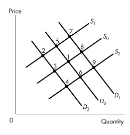

# **Chapter 3 Demand and Supply**

## 3.1 Markets and Prices

---
1\) The relative price of a good is all of the following *except*

A\) the ratio of one price to another.

B\) an opportunity cost.

C\) the money price of the good divided by a price index.

D\) the same as the money price of a good.

E\) determined in a market.

---
---
Answer: D

Diff: 2 Type: MC

Topic: Markets and Prices

---
2\) How many sides does a market have?

A\) one side - buyers

B\) one side - sellers

C\) two sides - buyers and sellers

D\) three sides - buyers, sellers, and the government

E\) two sides - domestic and foreign

---
---
Answer: C

Diff: 1 Type: MC

Topic: Markets and Prices

---
3\) Which market is an example of a market for goods?

A\) labour market

B\) haircut market

C\) manufactured input market

D\) apple market

E\) energy market

---
---
Answer: D

Diff: 1 Type: MC

Topic: Markets and Prices

---
4\) Which market is an example of a market for services?

A\) orange market

B\) tennis lessons market

C\) manufactured input market

D\) energy market

E\) labour market

---
---
Answer: B

Diff: 1 Type: MC

Topic: Markets and Prices

---
5\) Which market is an example of a resource market?

A\) furniture market

B\) apple market

C\) automobile market

D\) haircut market

E\) labour market

---
---
Answer: E

Diff: 1 Type: MC

Topic: Markets and Prices

---
6\) The demand and supply model determines

A\) relative prices.

B\) money prices.

C\) supply prices.

D\) demand prices.

E\) absolute prices.

---
---
Answer: A

Diff: 1 Type: MC

Topic: Markets and Prices

*Use the table below to answer the following questions.*

**Table 3.1.1**

---
7\) Refer to Table 3.1.1. In 2010, the relative price of coffee in terms
of tea is

A\) 1.25.

B\) 1.10.

C\) 1.00.

D\) 0.88.

E\) 1.14.

---
---
Answer: E

Diff: 2 Type: MC

Topic: Markets and Prices

---
8\) Refer to Table 3.1.1. In 2012, the relative price of coffee in terms
of cola is

A\) 1.25.

B\) 1.00.

C\) 0.67.

D\) 1.56.

E\) unknown without more information.

---
---
Answer: A

Diff: 2 Type: MC

Topic: Markets and Prices

---
9\) Refer to Table 3.1.1. In 2012, the relative price of cola in terms of
tea is

A\) 1.00.

B\) 1.20.

C\) 0.83.

D\) 1.25.

E\) unknown without more information.

---
---
Answer: C

Diff: 2 Type: MC

Topic: Markets and Prices

---
10\) Refer to Table 3.1.1. Between 2010 and 2011, the price of coffee
relative to the price of tea \_\_\_\_\_\_\_\_ while the price of coffee
relative to the price of cola \_\_\_\_\_\_\_\_.

A\) rose; rose

B\) rose; fell

C\) fell; rose

D\) fell; fell

E\) fell; stayed constant

---
---
Answer: B

Diff: 2 Type: MC

Topic: Markets and Prices

---
11\) Refer to Table 3.1.1. Between 2011 and 2012, the price of coffee
relative to the price of tea \_\_\_\_\_\_\_\_ while the price of coffee
relative to the price of cola \_\_\_\_\_\_\_\_.

A\) rose; rose

B\) rose; fell

C\) fell; rose

D\) fell; fell

E\) fell; stayed constant

---
---
Answer: D

Diff: 2 Type: MC

Topic: Markets and Prices

---
12\) A market where no single buyer or seller can influence the price is

A\) a buyer\'s market.

B\) a seller\'s market.

C\) a competitive market.

D\) an output market.

E\) an input market.

---
---
Answer: C

Diff: 1 Type: MC

Topic: Markets and Prices

---
13\) A relative price is

A\) the ratio of one price to another.

B\) an opportunity cost.

C\) a quantity of a \"basket\" of goods and services forgone.

D\) determined by demand and supply.

E\) all of the above.

---
---
Answer: E

Diff: 2 Type: MC

Topic: Markets and Prices

Source: Study Guide

---
14\) William Gregg owned a mill in South Carolina. In December 1862, he
placed a notice in the *Edgehill Advertister* announcing his willingness
to exchange cloth for food and other items. Here is an extract:

1 yard of cloth for 1 pound of bacon

2 yards of cloth for 1 pound of butter

4 yards of cloth for 1 pound of wool

8 yards of cloth for 1 bushel of salt

If the money price of bacon was 20¢ a pound and the money price of salt
was \$2.00 a bushel, people would \_\_\_\_\_\_\_\_.

A\) buy bacon and trade it for cloth because they could buy 8 yards of
cloth for only \$1.60, and use that cloth to obtain a bushel of salt

B\) not buy bacon and trade it for cloth because they would have to buy 8
yards of cloth for \$1.60 and then give Mr. Gregg an extra \$0.40 to buy
a bushel of salt

C\) buy bacon and trade it for cloth and then trade the cloth for salt
because salt is more important for life than either cloth or bacon

D\) not buy bacon and trade it for cloth because the relative price of 1
bushel of salt is only 1/8 yard of cloth

E\) buy bacon and trade it for cloth because cloth is more expensive than
bacon

---
---
Answer: A

Diff: 2 Type: MC

Topic: Markets and Prices

Source: MyEconLab

---
15\) The opportunity cost of good A in terms of good B is equal to the

A\) money price of good A minus the money price of good B.

B\) money price of good B minus the money price of good A.

C\) ratio of the money price of good A to the money price of good B.

D\) ratio of the money price of good B to the money price of good A.

E\) money price of good A plus the money price of good B.

---
---
Answer: C

Type: MC

---
16\) Suppose the price of a football is \$20.00 and the price of a
basketball is \$10.00. The \_\_\_\_\_\_\_\_ of a football is
\_\_\_\_\_\_\_\_.

A\) relative price; 2 basketballs per football

B\) relative price; 1/2 basketball per football

C\) opportunity cost; \$15.00

D\) opportunity cost; \$10.00

E\) relative price; \$10

---
---
Answer: A

Type: MC

## 3.2 Demand

---
1\) The law of demand states that, other things remaining the same,

A\) the higher the price of a good, the smaller is the quantity demanded.

B\) the higher the price of a good, the smaller is the quantity supplied.

C\) price and quantity supplied are positively related.

D\) as income increases, willingness to pay for the last unit increases.

E\) the higher the price of a good, the greater is the quantity demanded.

---
---
Answer: A

Diff: 1 Type: MC

Topic: Demand

---
2\) Which one of the following events shifts the demand curve for grape
jelly to the right?

A\) an increase in income if grape jelly is a normal good

B\) a decrease in the price of strawberry preserves, a substitute for
grape jelly

C\) a decrease in the price of grape jelly

D\) an increase in the price of peanut butter, a complement of grape
jelly

E\) a decrease in the population

---
---
Answer: A

Diff: 2 Type: MC

Topic: Demand

---
3\) The demand curve slopes downward to the right because

A\) an increase in income leads to increased consumption.

B\) of the law of supply.

C\) of the law of demand.

D\) of comparative advantage.

E\) as income rises, the quantity demanded increases.

---
---
Answer: C

Diff: 1 Type: MC

Topic: Demand

---
4\) An increase in the price of ground beef

A\) increases the demand for chicken, a substitute for ground beef.

B\) increases the demand for hamburger buns, a complement of ground beef.

C\) increases the quantity demanded of ground beef.

D\) decreases the quantity demanded of ground beef.

E\) both A and D.

---
---
Answer: E

Diff: 2 Type: MC

Topic: Demand

---
5\) An increase in income

A\) increases the demand for turnips if a turnip is an inferior good.

B\) increases the demand for turnips if a turnip is a normal good.

C\) increases the supply of turnips.

D\) decreases the demand for turnips if turnips have a very low price.

E\) decreases the supply of turnips.

---
---
Answer: B

Diff: 2 Type: MC

Topic: Demand

---
6\) A turnip is an inferior good if

A\) an increase in the price of a turnip decreases the quantity of
turnips that consumers want to buy.

B\) an increase in income decreases the demand for turnips.

C\) an increase in income increases the demand for turnips.

D\) turnips violate the law of demand.

E\) turnips are a low quality good.

---
---
Answer: B

Diff: 2 Type: MC

Topic: Demand

---
7\) If a turnip is an inferior good, then, *ceteris paribus*, an increase
in the price of a turnip will

A\) decrease the demand for turnips.

B\) increase the demand for turnips.

C\) decrease the supply of turnips.

D\) increase the supply of turnips.

E\) none of the above.

---
---
Answer: E

Diff: 3 Type: MC

Topic: Demand

---
8\) Suppose income increases. Choose the correct statement.

A\) The equilibrium price of turnips falls if a turnip is an inferior
good.

B\) The equilibrium price of turnips rises if a turnip is an inferior
good.

C\) The equilibrium quantity of turnips decreases if a turnip is an
inferior good.

D\) The supply of turnips decreases whether or not a turnip is an
inferior good.

E\) Both A and C.

---
---
Answer: E

Diff: 3 Type: MC

Topic: Demand

*\
Use the figure below to answer the following questions.*

**Figure 3.2.1**

---
9\) Point *A* in Figure 3.2.1 indicates that

A\) \$1 is the least that consumers are willing to pay for the 4,000th
apple.

B\) consumers will not be in equilibrium if the price of an apple is \$1.

C\) consumers will only pay \$1 for any apple.

D\) if the price is \$1, consumers will plan to buy 4,000 apples.

E\) if the price is more than \$1, consumers will buy 9,000 apples.

---
---
Answer: D

Diff: 2 Type: MC

Topic: Demand

---
10\) Which one of the following statements best characterizes point *B*
in Figure 3.2.1?

A\) Producers would be unwilling to sell the 9,000th apple for less than
\$0.50.

B\) The most that consumers would be willing to pay for the 9,000th apple
is \$0.50.

C\) At a price of \$0.50, consumers will be unwilling to buy any apples.

D\) At a price of \$0.50, there will be an apple shortage.

E\) At point *B*, the market is in equilibrium.

---
---
Answer: B

Diff: 2 Type: MC

Topic: Demand

---
11\) Given Figure 3.2.1, under what condition are consumers willing to
buy more than 9,000 apples per week?

A\) if the price is above \$1

B\) if the price is between \$1 and \$0.50

C\) if the price is below \$0.50

D\) if the price is between \$1 and \$1.50

E\) if the price is \$0.75

---
---
Answer: C

Diff: 2 Type: MC

Topic: Demand

---
12\) Which one of the following would result in a movement from point *A*
to point *B* in Figure 3.2.1?

A\) a fall in the price of apples

B\) a rise in the price of oranges

C\) an increase in population size

D\) public concern about chemicals sprayed on apples

E\) a rise in the price of bananas

---
---
Answer: A

Diff: 2 Type: MC

Topic: Demand

*\
Use the figure below to answer the following questions.*

**Figure 3.2.2**

---
13\) Which one of the following would result in the demand curve shifting
from *D*1 to *D*2 in Figure 3.2.2?

A\) an increase in the supply of pizza

B\) a rise in the price of hamburgers, a substitute for pizza

C\) a rise in the price of pizza

D\) a fall in the price of pizza

E\) a rise in the price of Coke, a complement of pizza

---
---
Answer: B

Diff: 2 Type: MC

Topic: Demand

---
14\) Refer to Figure 3.2.2. Which one of the following represents a
decrease in quantity demanded?

A\) a shift from *D*1 to *D*2

B\) a shift from *D*2 to *D*1

C\) a movement from *A* to *B*

D\) a movement from *B* to *A*

E\) none of the above

---
---
Answer: D

Diff: 2 Type: MC

Topic: Demand

---
15\) Refer to Figure 3.2.2. If consumers\' income increases,

A\) the quantity of pizzas demanded increases.

B\) the demand curve for pizzas shifts from *D*1 to *D*2 if a pizza is a
normal good.

C\) the supply of pizzas increases.

D\) the quantity of pizzas supplied decreases.

E\) a movement from point *A* to point *B* on *D*1 occurs.

---
---
Answer: B

Diff: 2 Type: MC

Topic: Demand

---
16\) The price of good *A* rises, and the demand curve for good *B*
shifts leftward. We can conclude that

A\) *A* and *B* are substitutes.

B\) *A* and *B* are complements.

C\) *A* and *B* are complements in production.

D\) *B* is an inferior good.

E\) *B* is a normal good.

---
---
Answer: B

Diff: 2 Type: MC

Topic: Demand

---
17\) The price of good *X* falls and the demand for good *Y* decreases.
We can conclude that

A\) X and *Y* are complements.

B\) X and *Y* are independent of each other.

C\) X is an inferior good.

D\) X is a normal good.

E\) X and *Y* are substitutes.

---
---
Answer: E

Diff: 2 Type: MC

Topic: Demand

---
18\) Which one of the following would lead to an increase in the demand
for hamburgers?

A\) a new fad hamburger diet

B\) a decrease in population size

C\) a rise in the price of French fries, a complement of hamburgers

D\) a decrease in consumer income if hamburgers are a normal good

E\) a news report that hamburgers can cause skin diseases

---
---
Answer: A

Diff: 2 Type: MC

Topic: Demand

---
19\) Which of the following \"other things\" are *not* held constant
along a demand curve?

A\) income

B\) prices of related goods

C\) the price of the good itself

D\) preferences

E\) expected future income and credit

---
---
Answer: C

Diff: 1 Type: MC

Topic: Demand

Source: Study Guide

---
20\) Good *A* is a normal good if

A\) a rise in the price of a complement causes the demand for *A* to
decrease.

B\) income and the demand for *A* are negatively related.

C\) a rise in the price of a substitute causes the demand for *A* to
increase.

D\) the demand for *A* increases when income rises.

E\) good *A* satisfies the law of demand.

---
---
Answer: D

Diff: 1 Type: MC

Topic: Demand

---
21\) A decrease in quantity demanded is represented by a

A\) rightward shift of the supply curve.

B\) rightward shift of the demand curve.

C\) leftward shift of the demand curve.

D\) movement upward and to the left along the demand curve.

E\) movement downward and to the right along the demand curve.

---
---
Answer: D

Diff: 1 Type: MC

Topic: Demand

Source: Study Guide

---
22\) Some sales managers are talking shop. Which of the following
quotations refers to a movement along the demand curve?

A\) \"Since our competitors raised their prices, our sales have
doubled.\"

B\) \"It has been an unusually mild winter; our sales of wool scarves are
down from last year.\"

C\) \"We decided to cut our prices, and the increase in our sales has
been remarkable.\"

D\) \"The Green movement has sparked an increase in our sales of
biodegradable products.\"

E\) None of the above.

---
---
Answer: C

Diff: 2 Type: MC

Topic: Demand

Source: Study Guide

---
23\) Some sales managers are talking shop. Which one of the following
quotations refers to a rightward shift of the demand curve?

A\) \"Since our competitors raised their prices, our sales have
doubled.\"

B\) \"It has been an unusually harsh winter; our sales of wool scarves
are up from last year.\"

C\) \"We decided to cut our prices, and the increase in our sales has
been remarkable.\"

D\) \"The Green movement has sparked an increase in our sales of
biodegradable products.\"

E\) All of the above *except* C.

---
---
Answer: E

Diff: 2 Type: MC

Topic: Demand

---
24\) Some sales managers are talking shop. Which one of the following
quotations refers to a leftward shift of the demand curve?

A\) \"Since our competitors raised their prices, our sales have
doubled.\"

B\) \"It has been an unusually mild winter; our sales of wool scarves are
down from last year.\"

C\) \"We decided to cut our prices, and the increase in our sales has
been remarkable.\"

D\) \"The Green movement has sparked an increase in our sales of
biodegradable products.\"

E\) None of the above.

---
---
Answer: B

Diff: 2 Type: MC

Topic: Demand

---
25\) If Hamburger Helper is an inferior good, then, *ceteris paribus*, a
decrease in income will lead to

A\) a leftward shift of the demand curve for Hamburger Helper.

B\) a rightward shift of the demand curve for Hamburger Helper.

C\) a movement up along the demand curve for Hamburger Helper.

D\) a movement down along the demand curve for Hamburger Helper.

E\) an initial movement up and then down along the demand curve for
Hamburger Helper.

---
---
Answer: B

Diff: 2 Type: MC

Topic: Demand

Source: Study Guide

---
26\) Consider the market for cell phones. Suppose the price of a cell
phone falls. Explain the effect of this event on the quantity of cell
phones demanded and on the demand for cell phones.

A\) The quantity of cell phones demanded is unchanged and the demand for
cell phones increases.

B\) The quantity of cell phones demanded decreases and the demand for
cell phones is unchanged.

C\) The quantity of cell phones demanded increases and the demand for
cell phones is unchanged.

D\) The quantity of cell phones demanded increases and the demand for
cell phones also increases.

E\) The quantity of cell phones demanded is unchanged and the demand for
cell phones decreases.

---
---
Answer: C

Diff: 2 Type: MC

Topic: Demand

Source: MyEconLab

---
27\) People buy more of good 1 when the price of good 2 rises. Good 1 and
good 2 are

A\) complements.

B\) substitutes.

C\) normal goods.

D\) inferior goods.

E\) substitutes in production

---
---
Answer: B

Type: MC

---
28\) Oatmeal is a normal good and cold cereal is a substitute for
oatmeal. Raisins are a complement of oatmeal. Which of the following
increases the demand for oatmeal?

A\) an increase in the price of raisins

B\) a decrease in income

C\) a decrease in population

D\) an increase in the price of cold cereal

E\) an increase in the supply of oatmeal

---
---
Answer: D

Type: MC

## 3.3 Supply

---
1\) The law of supply tells us that other things remaining the same, as
the

A\) price of gasoline falls, the quantity of gasoline supplied decreases.

B\) price of gasoline rises, the quantity of gasoline supplied decreases.

C\) supply of gasoline increases, the price of gasoline falls.

D\) cost of producing gasoline falls, the supply of gasoline will
increase.

E\) cost of producing gasoline increases, the price of gasoline rises.

---
---
Answer: A

Diff: 2 Type: MC

Topic: Supply

---
2\) The supply curve of a good slopes upward to the right because of

A\) technological improvements over time.

B\) the law of supply.

C\) the law of demand.

D\) the existence of substitutes in production.

E\) the fact that prices tend to rise over time.

---
---
Answer: B

Diff: 1 Type: MC

Topic: Supply

---
3\) An increase in supply is shown by

A\) a movement down along the supply curve.

B\) a movement up along the supply curve.

C\) a rightward shift of the supply curve.

D\) a leftward shift of the supply curve.

E\) an initial movement up and then down along the same supply curve.

---
---
Answer: C

Diff: 1 Type: MC

Topic: Supply

---
4\) If goods *X* and *Y* are substitutes in production, then a rise in
the price of good *X*

A\) increases the demand for good *Y*.

B\) decreases the demand for good *Y*.

C\) increases the supply of good *Y*.

D\) decreases the supply of good *Y*.

E\) might change the supply of *Y*; it depends on whether *X* and *Y* are
also substitutes.

---
---
Answer: D

Diff: 2 Type: MC

Topic: Supply

---
5\) If a producer can use its factors of production to produce either
good *A* or good *B*, then a rise in the price of *A*

A\) increases the supply of *B*.

B\) decreases the supply of *A*.

C\) increases the supply of *A*.

D\) decreases the supply of *B*.

E\) both C and D.

---
---
Answer: D

Diff: 3 Type: MC

Topic: Supply

---
6\) The fact that a fall in the price of a good results in a decrease in
the quantity of the good supplied illustrates

A\) the law of supply.

B\) the law of demand.

C\) a change in supply.

D\) the nature of an inferior good.

E\) technological improvement.

---
---
Answer: A

Diff: 1 Type: MC

Topic: Supply

Source: Study Guide

---
7\) Which one of the following would *not* shift the supply curve of good
*X* to the right?

A\) a fall in the price of the factors of production used in producing
*X*

B\) an improvement in technology used in the production of *X*

C\) a rise in the price of *X*

D\) an increase in the price of *Y*, a complement in production of *X*

E\) a fall in the price of *Y*, a substitute in production of *X*

---
---
Answer: C

Diff: 2 Type: MC

Topic: Supply

---
8\) A decrease in the quantity supplied is shown by a

A\) movement down along the supply curve.

B\) movement up along the supply curve.

C\) rightward shift of the supply curve.

D\) leftward shift of the supply curve.

E\) rightward shift of the demand curve.

---
---
Answer: A

Diff: 1 Type: MC

Topic: Supply

---
9\) Which one of the following will shift the supply curve of good *X*
leftward?

A\) a decrease in the wages of workers employed to produce *X*

B\) an increase in the cost of machinery used to produce *X*

C\) a technological improvement in the production of *X*

D\) a situation where quantity demanded exceeds quantity supplied

E\) a decrease in the cost of capital used to produce X

---
---
Answer: B

Diff: 2 Type: MC

Topic: Supply

Source: Study Guide

---
10\) Which of the following will shift the supply curve of good X
rightward?

A\) a decrease in the wages of workers employed to produce good X

B\) an increase in the cost of capital used to produce good X

C\) an increase in the price of energy

D\) a decrease in the number of suppliers of good X

E\) the price of *Y*, a substitute in production for good *X*, rises

---
---
Answer: A

Diff: 2 Type: MC

Topic: Supply

---
11\) If a factor of production can be used to produce either good *A* or
good *B*, then *A* and *B* are

A\) substitutes in production.

B\) complements in production.

C\) substitutes.

D\) complements.

E\) normal goods.

---
---
Answer: A

Diff: 1 Type: MC

Topic: Supply

Source: Study Guide

---
12\) A rise in the price of a good

A\) decreases demand for the good.

B\) creates a movement up along the supply curve.

C\) creates a movement down along the demand curve.

D\) increases the supply of the good.

E\) increases preferences for the good.

---
---
Answer: B

Diff: 1 Type: MC

Topic: Supply

---
13\) If the number of suppliers of good *Y* increases, then

A\) a movement up along the supply curve of good *Y* will occur.

B\) a movement down along the supply curve of good *Y* will occur.

C\) the supply curve of good *Y* shifts rightward.

D\) the supply curve of good *Y* shifts leftward.

E\) the supply curve of good *Y* will remain unchanged.

---
---
Answer: C

Diff: 1 Type: MC

Topic: Supply

---
14\) A shift of the supply curve for rutabagas occurs if there is

A\) a change in preferences for rutabagas.

B\) a change in the price of a related good that is a substitute for
rutabagas.

C\) a change in income.

D\) a change in the price of rutabagas.

E\) none of the above.

---
---
Answer: E

Diff: 2 Type: MC

Topic: Supply

Source: Study Guide

---
15\) Some producers are chatting over a beer. Which one of the following
quotations refers to a movement along the supply curve?

A\) \"Wage increases have forced us to raise our prices.\"

B\) \"Our new, sophisticated equipment will enable us to undercut our
competitors.\"

C\) \"Raw material prices have sky-rocketed; we will have to pass the
cost on to our customers.\"

D\) \"We anticipate a big increase in demand. Our product price should
rise, so we are planning for an increase in output.\"

E\) \"New competitors in the industry are causing prices to fall.\"

---
---
Answer: D

Diff: 2 Type: MC

Topic: Supply

Source: Study Guide

---
16\) Some producers are chatting over a beer. Which one of the following
quotations refers to a rightward shift of the supply curve?

A\) \"Wage increases have forced us to raise our prices.\"

B\) \"Our new, sophisticated equipment will enable us to undercut our
competitors.\"

C\) \"Raw material prices have sky-rocketed; we will have to pass the
cost on to our customers.\"

D\) \"We anticipate a big increase in demand. Our product price should
rise, so we are planning for an increase in output.\"

E\) Both A and C.

---
---
Answer: B

Diff: 2 Type: MC

Topic: Supply

---
17\) Some producers are chatting over a beer. Which one of the following
quotations refers to a leftward shift of the supply curve?

A\) \"Wage increases have forced us to raise our prices.\"

B\) \"Our new, sophisticated equipment will enable us to undercut our
competitors.\"

C\) \"Raw material prices have sky-rocketed; we will have to pass the
cost on to our customers.\"

D\) \"We anticipate a big increase in demand. Our product price should
rise, so we are planning for an increase in output.\"

E\) Both A and C.

---
---
Answer: E

Diff: 2 Type: MC

Topic: Supply

---
18\) A decrease in the quantity supplied of a good is shown by

A\) a movement down along the supply curve.

B\) a leftward shift of the supply curve.

C\) a movement up along the supply curve.

D\) a rightward shift of the supply curve.

E\) an initial rightward shift and then leftward shift of the supply
curve.

---
---
Answer: A

Diff: 1 Type: MC

Topic: Supply

---
19\) Which of the following decreases the supply of popcorn?

A\) a decrease in the price of popcorn

B\) an increase in the price of popcorn

C\) a technological advance in the production of popcorn

D\) a decrease in the demand for popcorn

E\) a decrease in the number of popcorn producers

---
---
Answer: E

Type: MC

---
20\) Which of the following shifts the supply curve for good X leftward?

A\) a situation in which the quantity demanded of X exceeds the quantity
supplied of X

B\) an increase in the cost of the machinery used to produce X

C\) a technological advance in the production of X

D\) a decrease in the wages of workers employed to produce X

E\) a situation in which the quantity supplied of X exceeds the quantity
demanded of X

---
---
Answer: B

Type: MC

## 3.4 Market Equilibrium

*Use the table below to answer the following questions.*

**Table 3.4.1**

+--------------------+---------------------------+---------------------------+
| Price              | Quantity Demanded (units) | Quantity Supplied (units) |
|                    |                           |                           |
| (dollars per unit) |                           |                           |
+--------------------+---------------------------+---------------------------+
| 1                  | 1,100                     | 50                        |
+--------------------+---------------------------+---------------------------+
| 2                  | 800                       | 200                       |
+--------------------+---------------------------+---------------------------+
| 3                  | 600                       | 420                       |
+--------------------+---------------------------+---------------------------+
| 4                  | 500                       | 500                       |
+--------------------+---------------------------+---------------------------+
| 5                  | 420                       | 580                       |
+--------------------+---------------------------+---------------------------+
| 6                  | 350                       | 640                       |
+--------------------+---------------------------+---------------------------+
| 7                  | 320                       | 680                       |
+--------------------+---------------------------+---------------------------+
| 8                  | 300                       | 700                       |
+--------------------+---------------------------+---------------------------+

---
1\) Refer to Table 3.4.1. At a price of \$3 a unit

A\) the market is in equilibrium.

B\) there is a 180-unit surplus.

C\) there is a 180-unit shortage.

D\) there is a tendency for the price to rise.

E\) C and D.

---
---
Answer: E

Diff: 2 Type: MC

Topic: Market Equilibrium

---
2\) In Table 3.4.1, the equilibrium price is

A\) \$7 a unit.

B\) \$5 a unit.

C\) \$4 a unit.

D\) \$3 a unit.

E\) \$1 a unit.

---
---
Answer: C

Diff: 1 Type: MC

Topic: Market Equilibrium

---
3\) In Table 3.4.1, the equilibrium quantity is

A\) 200 units.

B\) 320 units.

C\) 420 units.

D\) 500 units.

E\) none of the above; there is no equilibrium.

---
---
Answer: D

Diff: 1 Type: MC

Topic: Market Equilibrium

---
4\) Refer to Table 3.4.1. The equilibrium quantity is 420 units if

A\) the price is fixed at \$3 a unit.

B\) the price is fixed at \$4 a unit.

C\) the price is fixed at \$5 a unit.

D\) both A and C are correct.

E\) none of the above.

---
---
Answer: E

Diff: 2 Type: MC

Topic: Market Equilibrium

---
5\) Refer to Table 3.4.1. A shortage occurs if

A\) the price is \$7 a unit.

B\) the price is \$4 a unit.

C\) the price is \$5 a unit.

D\) the price is below \$4 a unit.

E\) the price is \$6 a unit.

---
---
Answer: D

Diff: 1 Type: MC

Topic: Market Equilibrium

---
6\) Refer to Table 3.4.1. A surplus occurs if

A\) the price is \$2 a unit.

B\) the price is \$3 a unit.

C\) the price is above \$4 a unit.

D\) the price is \$1 a unit.

E\) the price is \$4 a unit.

---
---
Answer: C

Diff: 1 Type: MC

Topic: Market Equilibrium

---
7\) Refer to Table 3.4.1. If the price is \$7, then the surplus is

A\) 360 units.

B\) 400 units.

C\) 160 units.

D\) zero units.

E\) 290 units.

---
---
Answer: A

Diff: 1 Type: MC

Topic: Market Equilibrium

---
8\) Refer to Table 3.4.1. If the price is \$3, then the shortage is

A\) zero units.

B\) 1,050 units.

C\) 180 units.

D\) 600 units.

E\) 160 units.

---
---
Answer: C

Diff: 1 Type: MC

Topic: Market Equilibrium

*Use the figure below to answer the following questions.*

**Figure 3.4.1**

---
9\) At price *P*3 in Figure 3.4.1,

A\) this market is in equilibrium.

B\) there is a shortage in the amount of *Q*5 - *Q*1.

C\) there is a tendency for the price to rise.

D\) equilibrium quantity is *Q*5.

E\) there is a surplus in the amount of *Q*5 - *Q*1.

---
---
Answer: E

Diff: 3 Type: MC

Topic: Market Equilibrium

---
10\) At price *P*2 in Figure 3.4.1, which one of the following is *not*
true?

A\) This market is in equilibrium.

B\) The quantity demanded is equal to the quantity supplied.

C\) The quantity demanded is *Q*1.

D\) There is no surplus.

E\) The quantity supplied is *Q*3.

---
---
Answer: C

Diff: 1 Type: MC

Topic: Market Equilibrium

---
11\) At price *P*1 in Figure 3.4.1

A\) there is a surplus in the amount of *Q*4 - *Q*2.

B\) there is a shortage in the amount of *Q*4 - *Q*2.

C\) there is a tendency for the price to fall.

D\) the equilibrium quantity is *Q*2.

E\) the equilibrium quantity is *Q*4.

---
---
Answer: B

Diff: 2 Type: MC

Topic: Market Equilibrium

---
12\) At price *P*1 in Figure 3.4.1,

A\) producers can sell all they plan to sell.

B\) consumers can buy all they want.

C\) producers are unwilling to sell any goods.

D\) a surplus exists.

E\) both sides of the market are able to carry out their desired
transactions.

---
---
Answer: A

Diff: 2 Type: MC

Topic: Market Equilibrium

*\
Use the figure below to answer the following questions.*

**Figure 3.4.2**

---
13\) The equilibrium price in the market illustrated by Figure 3.4.2 is

A\) \$2 a unit.

B\) \$4 a unit.

C\) \$6 a unit.

D\) \$8 a unit.

E\) \$10 a unit.

---
---
Answer: C

Diff: 1 Type: MC

Topic: Market Equilibrium

---
14\) Refer to Figure 3.4.2. When the price is \$10 a unit

A\) consumers will buy only 100 units of output.

B\) consumers will buy 500 units of output.

C\) consumers will buy nothing.

D\) a shortage occurs.

E\) the surplus is zero.

---
---
Answer: A

Diff: 1 Type: MC

Topic: Market Equilibrium

---
15\) At a price of \$10 a unit in Figure 3.4.2

A\) there is a surplus of 200 units.

B\) there is a shortage of 200 units.

C\) there is a surplus of 400 units.

D\) there is a shortage of 400 units.

E\) quantity will rise.

---
---
Answer: C

Diff: 1 Type: MC

Topic: Market Equilibrium

---
16\) At a price of \$4 a unit in Figure 3.4.2

A\) the equilibrium quantity is 400 units.

B\) there is a surplus of 200 units.

C\) the quantity supplied is 400 units.

D\) there is a shortage of 200 units.

E\) the quantity demanded is 200 units.

---
---
Answer: D

Diff: 1 Type: MC

Topic: Market Equilibrium

---
17\) Which one of the following correctly describes how price adjustment
eliminates a surplus?

A\) As the price rises, the quantity demanded decreases and the quantity
supplied increases.

B\) As the price rises, the quantity demanded increases and the quantity
supplied decreases.

C\) As the price falls, the quantity demanded decreases and the quantity
supplied increases.

D\) As the price falls, the quantity demanded increases and the quantity
supplied decreases.

E\) As the price falls, the demand for substitutes decreases, which
eliminates the surplus.

---
---
Answer: D

Diff: 2 Type: MC

Topic: Market Equilibrium

---
18\) Which one of the following correctly describes how price adjustment
eliminates a shortage?

A\) As the price rises, the quantity demanded decreases and the quantity
supplied increases.

B\) As the price rises, the quantity demanded increases and the quantity
supplied decreases.

C\) As the price falls, the quantity demanded decreases and the quantity
supplied increases.

D\) As the price falls, the quantity demanded increases and the quantity
supplied decreases.

E\) As the price falls, the quantity demanded increases and the quantity
supplied increases.

---
---
Answer: A

Diff: 2 Type: MC

Topic: Market Equilibrium

---
19\) If the price is above the equilibrium price, then

A\) none of the good will be sold.

B\) the price must rise further to reach the new market equilibrium.

C\) a surplus exists.

D\) a shortage exists.

E\) price will not change; producers will cut back production until the
market is in equilibrium.

---
---
Answer: C

Diff: 1 Type: MC

Topic: Market Equilibrium

---
20\) A shortage will exist if

A\) the price is above the equilibrium price.

B\) the price is below the equilibrium price.

C\) there are not enough producers.

D\) there are not enough consumers.

E\) demand decreases.

---
---
Answer: B

Diff: 1 Type: MC

Topic: Market Equilibrium

---
21\) The price of a good will tend to fall if

A\) there is a surplus at the current price.

B\) the current price is below the equilibrium price.

C\) the quantity supplied exceeds the quantity demanded at the current
price.

D\) both A and C are true.

E\) none of the above are true.

---
---
Answer: D

Diff: 2 Type: MC

Topic: Market Equilibrium

---
22\) If the market for Twinkies is in equilibrium, then

A\) Twinkies must be a normal good.

B\) producers would like to sell more at the current price.

C\) consumers would like to buy more at the current price.

D\) there is a surplus.

E\) the equilibrium quantity equals the quantity demanded.

---
---
Answer: E

Diff: 1 Type: MC

Topic: Market Equilibrium

Source: Study Guide

---
23\) A shortage is the amount by which quantity

A\) demanded exceeds quantity supplied.

B\) supplied exceeds quantity demanded.

C\) demanded increases when the price rises.

D\) demanded exceeds the equilibrium quantity.

E\) supplied exceeds the equilibrium quantity.

---
---
Answer: A

Diff: 1 Type: MC

Topic: Market Equilibrium

Source: Study Guide

---
24\) Complete the following sentence. A surplus

A\) exists if the price is above the equilibrium price.

B\) is the amount by which the quantity demanded exceeds the quantity
supplied.

C\) is the amount by which the quantity demanded exceeds the equilibrium
quantity.

D\) is the amount by which the quantity supplied exceeds the equilibrium
quantity.

E\) will lead to rising prices.

---
---
Answer: A

Diff: 2 Type: MC

Topic: Market Equilibrium

---
25\) When a shortage occurs, there is a tendency for the

A\) price to fall.

B\) price to remain unchanged.

C\) price to rise.

D\) quantity demanded to increase.

E\) quantity supplied to decrease.

---
---
Answer: C

Diff: 1 Type: MC

Topic: Market Equilibrium

*\
Refer to the table below for the following question.*

**Table 3.4.2**

+----------------------+--------------------+--------------------+
| Price                | Quantity demanded  | Quantity supplied  |
|                      |                    |                    |
| (dollars per bottle) | (bottles per week) | (bottles per week) |
+----------------------+--------------------+--------------------+
| 2                    | 180                | 60                 |
|                      |                    |                    |
| 6                    | 140                | 100                |
|                      |                    |                    |
| 10                   | 100                | 140                |
|                      |                    |                    |
| 14                   | 60                 | 180                |
|                      |                    |                    |
| 18                   | 20                 | 220                |
+----------------------+--------------------+--------------------+

---
26\) Refer to Table 3.4.2. The table shows the demand and supply
schedules for shampoo. If the price is \$6 a bottle, there is a
\_\_\_\_\_\_\_\_ of shampoo. So the price of a bottle of shampoo
\_\_\_\_\_\_\_\_, the quantity demanded \_\_\_\_\_\_\_\_ and the
quantity supplied \_\_\_\_\_\_\_\_. The market moves to equilibrium.

A\) shortage; rises; decreases; increases

B\) shortage; falls; decreases; increases

C\) surplus; rises; increases; decreases

D\) surplus; falls; increases; decreases

E\) shortage; rises; increases; decreases

---
---
Answer: A

Diff: 1 Type: MC

Topic: Market Equilibrium

Source: MyEconLab

---
27\) If the quantity of textbooks supplied is 10,000 per year and the
quantity of textbooks demanded is 8,000 per year, there is a
\_\_\_\_\_\_\_\_ in the market and the price will \_\_\_\_\_\_\_\_.

A\) shortage; rise

B\) shortage; fall

C\) surplus; rise

D\) surplus; fall

E\) surplus; either rise or fall depending on whether supply increases to
meet the surplus

---
---
Answer: D

Type: MC

---
28\) If the market for Twinkies is in equilibrium, then

A\) Twinkies must be a normal good.

B\) producers would like to sell more at the current price.

C\) consumers would like to buy more at the current price.

D\) the quantity supplied equals the quantity demanded.

E\) the supply of Twinkies will never increase and the demand for
Twinkies will never decrease.

---
---
Answer: D

Type: MC

## 3.5 Predicting Changes in Price and Quantity

---
1\) Since 1980, there has been a dramatic increase in the number of
working mothers. Based on this information alone, we can predict that
the market for child care services has experienced

A\) an increase in demand.

B\) a decrease in demand.

C\) an increase in quantity demanded.

D\) a decrease in quantity supplied.

E\) an increase in supply.

---
---
Answer: A

Diff: 2 Type: MC

Topic: Predicting Changes in Price and Quantity

Source: Study Guide

*Use the figure below to answer the following questions.*

**Figure 3.5.1**

---
2\) If the demand curve is *D2* in Figure 3.5.1,

A\) the equilibrium price is *P2* and the equilibrium quantity is *Q2*.

B\) the equilibrium price is *P2* and the equilibrium quantity is *Q0*.

C\) there is a shortage in the amount of *Q2* -- *Q0*.

D\) a rise in price will shift the demand curve to *D3*.

E\) price will rise.

---
---
Answer: A

Diff: 1 Type: MC

Topic: Predicting Changes in Price and Quantity

---
3\) Initially, the demand curve for good *A* is *D*2 in Figure 3.5.1.
Suppose good *B* is a substitute for good *A*. If the price of *B* falls

A\) the price of *A* will rise.

B\) there will be a surplus of good *A* at *P*2.

C\) the demand curve for good *A* will shift from *D*2 to *D*3.

D\) the equilibrium quantity of good *A* will increase.

E\) all of the above are true *except* B.

---
---
Answer: B

Diff: 2 Type: MC

Topic: Predicting Changes in Price and Quantity

---
4\) Initially, the demand curve for good *A* is *D*2 in Figure 3.5.1. If
income increases and *A* is a normal good, we would expect to see a
movement from point *A* to point

A\) *B*.

B\) *C*.

C\) *D*.

D\) *E*.

E\) *C* and back to point *A*.

---
---
Answer: B

Diff: 1 Type: MC

Topic: Predicting Changes in Price and Quantity

---
5\) The price of a good will rise if

A\) demand for the good decreases.

B\) supply of the good decreases.

C\) there is a surplus of the good.

D\) the price of a substitute for the good decreases.

E\) the good is an inferior good and income increases.

---
---
Answer: B

Diff: 2 Type: MC

Topic: Predicting Changes in Price and Quantity

---
6\) The price of a good will fall if

A\) there is a shortage of the good.

B\) if demand for the good increases.

C\) there is a surplus of the good.

D\) if the supply of the good decreases.

E\) if demand for the good does not change.

---
---
Answer: C

Diff: 2 Type: MC

Topic: Predicting Changes in Price and Quantity

---
7\) The price of a good will fall if

A\) demand for the good increases.

B\) supply of the good decreases.

C\) supply of the good increases.

D\) demand for the good remains constant.

E\) supply of the good remains constant.

---
---
Answer: C

Diff: 2 Type: MC

Topic: Predicting Changes in Price and Quantity

---
8\) Suppose we observe a rise in the price of good *A* and an increase in
the quantity of good *A* bought and sold. Which one of the following is
a likely explanation?

A\) The law of demand is violated.

B\) The demand for *A* decreased.

C\) The demand for *A* increased.

D\) The supply of *A* increased.

E\) The supply of *A* decreased.

---
---
Answer: C

Diff: 2 Type: MC

Topic: Predicting Changes in Price and Quantity

---
9\) Suppose we observe a rise in the price of good *A* and a decrease in
the quantity of good *A* bought and sold. Which one of the following is
a likely explanation?

A\) The law of supply is violated.

B\) The demand for *A* decreased.

C\) The demand for *A* increased.

D\) The supply of *A* increased.

E\) The supply of *A* decreased.

---
---
Answer: E

Diff: 2 Type: MC

Topic: Predicting Changes in Price and Quantity

---
10\) Suppose we observe a fall in the price of good *A* and an increase
in the quantity of good *A* bought and sold. Which one of the following
is a likely explanation?

A\) The law of supply is violated.

B\) The demand for *A* decreased.

C\) The demand for *A* increased.

D\) The supply of *A* increased.

E\) The supply of *A* decreased.

---
---
Answer: D

Diff: 2 Type: MC

Topic: Predicting Changes in Price and Quantity

---
11\) Suppose we observe a fall in the price of good *A* and a decrease in
the quantity of good *A* bought and sold. Which one of the following is
a likely explanation?

A\) The law of demand is violated.

B\) The demand for *A* decreased.

C\) The demand for *A* increased.

D\) The supply of *A* increased.

E\) The supply of *A* decreased.

---
---
Answer: B

Diff: 2 Type: MC

Topic: Predicting Changes in Price and Quantity

---
12\) When the demand for good *A* increases,

A\) the equilibrium price and equilibrium quantity will increase.

B\) the equilibrium price will rise but the equilibrium quantity will
decrease.

C\) the equilibrium price and equilibrium quantity will decrease.

D\) the equilibrium price will decrease but the equilibrium quantity will
increase.

E\) a surplus will result.

---
---
Answer: A

Diff: 1 Type: MC

Topic: Predicting Changes in Price and Quantity

---
13\) When the supply of good *A* decreases,

A\) the equilibrium price and the equilibrium quantity will increase.

B\) the equilibrium price will increase but the equilibrium quantity will
decrease.

C\) the equilibrium price and the equilibrium quantity will decrease.

D\) the equilibrium price will decrease but the equilibrium quantity will
increase.

E\) a surplus will result.

---
---
Answer: B

Diff: 1 Type: MC

Topic: Predicting Changes in Price and Quantity

---
14\) If *A* is an inferior good and consumer income rises, the demand for
*A*

A\) increases and the equilibrium price and the equilibrium quantity
increase.

B\) increases and the equilibrium price rises but the equilibrium
quantity decreases.

C\) decreases and the equilibrium price and the equilibrium quantity
decrease.

D\) decreases and the equilibrium price falls but the equilibrium
quantity increases.

E\) decreases and the equilibrium price rises; as a result, the
equilibrium quantity decreases.

---
---
Answer: C

Diff: 2 Type: MC

Topic: Predicting Changes in Price and Quantity

---
15\) If *A* and *B* are substitutes and the price of *A* rises, we will
observe

A\) an increase in the equilibrium price and the equilibrium quantity of
*B*.

B\) a decrease in the equilibrium price and the equilibrium quantity of
*B*.

C\) an increase in the equilibrium price but a decrease in the
equilibrium quantity of *B*.

D\) a decrease in equilibrium price but an increase in the equilibrium
quantity of *B*.

E\) none of the above.

---
---
Answer: A

Diff: 2 Type: MC

Topic: Predicting Changes in Price and Quantity

---
16\) If *A* and *B* are substitutes and the cost of a factor of
production used in the production of *A* increases, then the price of

A\) *B* falls but the price of *A* rises.

B\) *B* rises but the price of *A* falls.

C\) *A* falls, and the price of *B* will stay unchanged.

D\) *A* and *B* fall.

E\) *A* and *B* rise.

---
---
Answer: E

Diff: 3 Type: MC

Topic: Predicting Changes in Price and Quantity

---
17\) If *A* and *B* are substitutes in production and the price of *A*
falls, the supply of *B*

A\) increases and the price of *B* rises.

B\) increases and the price of *B* falls.

C\) decreases and the price of *B* falls.

D\) decreases and the price of *B* rises.

E\) does not change.

---
---
Answer: B

Diff: 3 Type: MC

Topic: Predicting Changes in Price and Quantity

---
18\) If *A* and *B* are complements in production and the price of *A*
falls, the supply of *B*

A\) increases and the price of *B* rises.

B\) increases and the price of *B* falls.

C\) decreases and the price of *B* falls.

D\) decreases and the price of *B* rises.

E\) does not change.

---
---
Answer: D

Diff: 3 Type: MC

Topic: Predicting Changes in Price and Quantity

---
19\) Crude oil is a very important factor of production used in the
production of gasoline. If the price of crude oil rises, we would expect
the

A\) price of gasoline to rise due to an increase in demand.

B\) price of gasoline to fall due to an increase in demand.

C\) price of gasoline to rise due to a decrease in supply.

D\) equilibrium quantity of gasoline to fall due to an increase in
supply.

E\) equilibrium quantity of gasoline to rise due to an increase in
demand.

---
---
Answer: C

Diff: 2 Type: MC

Topic: Predicting Changes in Price and Quantity

---
20\) If demand increases and supply decreases, then the

A\) equilibrium quantity increases but the effect on the equilibrium
price is unknown.

B\) equilibrium quantity decreases but the effect on the equilibrium
price is unknown.

C\) equilibrium price falls but the effect on the equilibrium quantity is
unknown.

D\) equilibrium price rises but the effect on the equilibrium quantity is
unknown.

E\) effect on both equilibrium price and quantity is unknown.

---
---
Answer: D

Diff: 2 Type: MC

Topic: Predicting Changes in Price and Quantity

---
21\) If demand decreases and supply increases, then the

A\) equilibrium quantity increases but the effect on the equilibrium
price is unknown.

B\) equilibrium quantity decreases but the effect on the equilibrium
price is unknown.

C\) equilibrium price falls but the effect on equilibrium quantity is
unknown.

D\) equilibrium price rises but the effect on equilibrium quantity is
unknown.

E\) effect on both equilibrium price and quantity is unknown.

---
---
Answer: C

Diff: 2 Type: MC

Topic: Predicting Changes in Price and Quantity

---
22\) If we observe a rise in the equilibrium price of good *A*, we know
that either the demand for *A* has

A\) increased or the supply of *A* has decreased or both.

B\) increased or the supply of *A* has increased or both.

C\) decreased or the supply of *A* has increased or both.

D\) decreased or the supply of *A* has decreased or both.

E\) none of the above.

---
---
Answer: A

Diff: 2 Type: MC

Topic: Predicting Changes in Price and Quantity

---
23\) If we observe a fall in the equilibrium price of good *A*, we know
that either the demand for *A* has

A\) increased or the supply of *A* has decreased or both.

B\) increased or the supply of *A* has increased or both.

C\) decreased or the supply of *A* has increased or both.

D\) decreased or the supply of *A* has decreased or both.

E\) none of the above.

---
---
Answer: C

Diff: 2 Type: MC

Topic: Predicting Changes in Price and Quantity

---
24\) If we observe an increase in the equilibrium quantity of good *A*,
we know that

A\) either the demand for *A* has increased or the supply of *A* has
decreased or both.

B\) either the demand for *A* has increased or the supply of *A* has
increased or both.

C\) either the demand for *A* has decreased or the supply of *A* has
increased or both.

D\) either the demand for *A* has decreased or the supply of *A* has
decreased or both.

E\) none of the above.

---
---
Answer: B

Diff: 2 Type: MC

Topic: Predicting Changes in Price and Quantity

---
25\) If we observe a decrease in the equilibrium quantity of good *A*, we
know that

A\) either the demand for *A* has increased or the supply of *A* has
decreased or both.

B\) either the demand for *A* has increased or the supply of *A* has
increased or both.

C\) either the demand for *A* has decreased or the supply of *A* has
increased or both.

D\) either the demand for *A* has decreased or the supply of *A* has
decreased or both.

E\) none of the above.

---
---
Answer: D

Diff: 2 Type: MC

Topic: Predicting Changes in Price and Quantity

---
26\) Which of the following will definitely result in an increase in the
equilibrium price?

A\) an increase in both demand and supply

B\) a decrease in both demand and supply

C\) an increase in demand combined with a decrease in supply

D\) a decrease in demand combined with an increase in supply

E\) an increase in supply combined with a decrease in demand

---
---
Answer: C

Diff: 2 Type: MC

Topic: Predicting Changes in Price and Quantity

Source: Study Guide

---
27\) Which one of the following will definitely lower the equilibrium
price?

A\) an increase in both demand and supply

B\) a decrease in both demand and supply

C\) an increase in demand combined with a decrease in supply

D\) a decrease in demand combined with an increase in supply

E\) a decrease in supply combined with an increase in demand

---
---
Answer: D

Diff: 2 Type: MC

Topic: Predicting Changes in Price and Quantity

---
28\) Which one of the following will definitely decrease the equilibrium
quantity?

A\) an increase in both demand and supply

B\) a decrease in both demand and supply

C\) an increase in demand combined with a decrease in supply

D\) a decrease in demand combined with an increase in supply

E\) none of the above

---
---
Answer: B

Diff: 2 Type: MC

Topic: Predicting Changes in Price and Quantity

---
29\) A technological improvement in the production of good *A*

A\) decreases the supply of *A*.

B\) increases the demand for *A*.

C\) decreases the equilibrium price of *A* and decreases the equilibrium
quantity.

D\) decreases the quantity demanded of *A*.

E\) increases the supply of *A*.

---
---
Answer: E

Diff: 2 Type: MC

Topic: Predicting Changes in Price and Quantity

---
30\) Which of the following events leads to a rise in the price of
oranges?

A\) a rise in the price of apples if apples and oranges are substitutes

B\) a scientific discovery that oranges cause hair loss

C\) a decrease in income if oranges are a normal good

D\) good growing weather in Florida

E\) a technological improvement in the production of oranges

---
---
Answer: A

Diff: 2 Type: MC

Topic: Predicting Changes in Price and Quantity

---
31\) If *A* and *B* are complements and the cost of a factor of
production used in the production of *A* decreases, then the price of

A\) both *A* and *B* will rise.

B\) both *A* and *B* will fall.

C\) *A* will fall and the price of *B* will rise.

D\) *A* will rise and the price of *B* will fall.

E\) *A* will fall and the price of *B* will remain unchanged.

---
---
Answer: C

Diff: 3 Type: MC

Topic: Predicting Changes in Price and Quantity

Source: Study Guide

---
32\) If both demand and supply increase, then the equilibrium price

A\) and equilibrium quantity increases.

B\) falls but the equilibrium quantity increases.

C\) could either rise or fall, but the equilibrium quantity increases.

D\) rises and the equilibrium quantity could either increase or decrease.

E\) falls and the equilibrium quantity could either increase or decrease.

---
---
Answer: C

Diff: 2 Type: MC

Topic: Predicting Changes in Price and Quantity

---
33\) There have been severe problems in the Atlantic fishing industry,
with large falls in the fish stocks. As a result,

A\) the price of fish will fall.

B\) the quantity of fish sold will increase as fishermen will catch more
to make up for the shortage.

C\) the equilibrium price and the equilibrium quantity will fall or rise
depending on how large the fall in fish stocks.

D\) both the equilibrium price and the equilibrium quantity will rise, as
consumers will desire even more fish, because they are scarce.

E\) the fall in the fish stocks will lead to a shortage, and a rise in
the equilibrium price and a decrease in the equilibrium quantity.

---
---
Answer: E

Diff: 2 Type: MC

Topic: Predicting Changes in Price and Quantity

---
34\) There have been severe falls in the fish stocks in the Atlantic
fishing industry. As a result, we would expect

A\) an increase in the demand for meat (e.g., beef), because meat is a
complement of fish.

B\) a fall in the price of fish, leading to a decrease in the demand for
meat, because meat and fish are substitutes.

C\) a fall in the price of fish, leading to an increase in the demand for
meat, because meat and fish are substitutes.

D\) an increase in the demand for meat, because meat is a substitute for
fish.

E\) a rise in the price of fish, leading to a decrease in the demand for
meat, because meat and fish are complements.

---
---
Answer: D

Diff: 3 Type: MC

Topic: Predicting Changes in Price and Quantity

---
35\) If Canadians suddenly develop a strong urge to escape the cold
winter by taking vacations in Hawaii, the

A\) price of a vacation in Hawaii rises and the quantity demanded of
Hawaiian vacations decreases.

B\) price of a skiing vacation in the mountains rises.

C\) initial result of the change is a surplus of vacations in Hawaii,
leading to a price rise.

D\) price of airline tickets falls as ticket agents make deals in
response to this change.

E\) price of luggage will rise, because luggage and vacations are
complements.

---
---
Answer: E

Diff: 2 Type: MC

Topic: Predicting Changes in Price and Quantity

---
36\) The Genius Software Company has developed an amazing new software
package to be used only with Einstein Computers. As a result, the
equilibrium price of

A\) all computers rises.

B\) rival software packages falls leading to an overall increase in the
equilibrium quantity of these packages.

C\) all software packages rises.

D\) Einstein computers rises, accompanied by an increase in the
equilibrium quantity.

E\) Einstein computers rises, leading to a decrease in the equilibrium
quantity.

---
---
Answer: D

Diff: 2 Type: MC

Topic: Predicting Changes in Price and Quantity

*\
Use the information below to answer the following questions.*

**Fact 3.5.1**

The market for coffee is initially in equilibrium. Pepsi is a substitute
for coffee; cream is a complement of coffee. Consider the market for
coffee. Assume that all *ceteris paribus* assumptions continue to hold
*except* for the event listed.

---
37\) Refer to Fact 3.5.1. If coffee is a normal good, then a decrease in
income will

A\) increase the price and the quantity demanded of coffee.

B\) increase the price and the quantity supplied of coffee.

C\) decrease the price and the quantity demanded of coffee.

D\) decrease the price and the quantity supplied of coffee.

E\) cause none of the above.

---
---
Answer: D

Diff: 3 Type: MC

Topic: Predicting Changes in Price and Quantity

Source: Study Guide

---
38\) Refer to Fact 3.5.1. An increase in the price of Pepsi, a substitute
for coffee will

A\) increase the price and the quantity demanded of coffee.

B\) increase the price and the quantity supplied of coffee.

C\) decrease the price and the quantity demanded of coffee.

D\) decrease the price and the quantity supplied of coffee.

E\) cause none of the above.

---
---
Answer: B

Diff: 3 Type: MC

Topic: Predicting Changes in Price and Quantity

Source: Study Guide

---
39\) Refer to Fact 3.5.1. A technological improvement lowers the cost of
producing coffee. At the same time, preferences for coffee decrease. The
equilibrium quantity of coffee

A\) increases.

B\) decreases.

C\) remains the same.

D\) increases or decreases depending on whether the price of coffee falls
or rises.

E\) increases, decreases, or remains the same depending on the relative
shifts of the demand and supply curves.

---
---
Answer: E

Diff: 2 Type: MC

Topic: Predicting Changes in Price and Quantity

Source: Study Guide

---
40\) Refer to Fact 3.5.1. If there is an increase in the wages of farm
workers who harvest coffee beans, the equilibrium quantity of coffee

A\) increases.

B\) decreases.

C\) remains the same.

D\) increases or decreases depending on the slope of the supply and
demand curves.

E\) increases or decreases depending on the relative shifts of the supply
and demand curves.

---
---
Answer: B

Diff: 2 Type: MC

Topic: Predicting Changes in Price and Quantity

---
41\) Refer to Fact 3.5.1. The price of cream falls. Simultaneously, there
is an increase in the wages of farm workers who harvest coffee beans.
The equilibrium quantity of coffee

A\) increases.

B\) decreases.

C\) remains the same.

D\) increases or decreases depending on the slope of the supply and
demand curves.

E\) increases, decreases, or remains the same depending on the relative
shifts of the supply and demand curves.

---
---
Answer: E

Diff: 2 Type: MC

Topic: Predicting Changes in Price and Quantity

---
42\) Refer to Fact 3.5.1. A new study comes out, revealing that drinking
Pepsi increases your ability to study. The equilibrium quantity of
coffee

A\) increases.

B\) decreases.

C\) remains the same.

D\) increases or decreases depending on the slope of the supply and
demand curves.

E\) increases or decreases depending on the relative shifts of the supply
and demand curves.

---
---
Answer: B

Diff: 3 Type: MC

Topic: Predicting Changes in Price and Quantity

---
43\) Farm land can be used to produce either cattle or corn. If the
demand for cattle increases, then the

A\) demand for corn increases.

B\) supply of corn increases.

C\) demand for corn decreases.

D\) supply of corn decreases.

E\) both B and C.

---
---
Answer: D

Diff: 3 Type: MC

Topic: Predicting Changes in Price and Quantity

---
44\) When the price of good *A* rises, the supply curve of good *B*
shifts rightward. Which of the following statements are true?

A\) *A* and *B* are substitutes.

B\) *A* and *B* are complements.

C\) *A* and *B* are substitutes in production.

D\) *A* and *B* are complements in production.

E\) *A* is a factor used in the production of *B*.

---
---
Answer: D

Diff: 3 Type: MC

Topic: Predicting Changes in Price and Quantity

---
45\) \"As domestic car prices have increased, consumers have found
foreign cars to be a better bargain. Consequently, domestic car sales
have fallen and foreign car sales have risen.\" Based on this
information alone, there has been a

A\) shift in the demand curves for both domestic and foreign cars.

B\) shift in the supply curves for both domestic and foreign cars.

C\) movement along the demand curves for both domestic and foreign cars.

D\) movement along the demand curve for domestic cars and a shift of the
demand curve for foreign cars.

E\) shift of the demand curve for domestic cars and a movement along the
demand curve for foreign cars.

---
---
Answer: D

Diff: 2 Type: MC

Topic: Predicting Changes in Price and Quantity

*\
Use the figure below to answer the following questions.*

**Figure 3.5.2**

Original equilibrium at 1.

---
46\) Refer to Figure 3.5.2, which represents the market for beans. If the
price of peas, a substitute for beans rises, what is the new *beans*
equilibrium, *ceteris paribus*?

A\) 8

B\) 3

C\) 9

D\) 5

E\) 6

---
---
Answer: A

Diff: 3 Type: MC

Topic: Predicting Changes in Price and Quantity

---
47\) Refer to Figure 3.5.2, which represents the market for beer. If the
price of pizza, a complement of beer rises, what is the new *beer*
equilibrium, *ceteris paribus*?

A\) 8

B\) 3

C\) 9

D\) 5

E\) 6

---
---
Answer: B

Diff: 3 Type: MC

Topic: Predicting Changes in Price and Quantity

---
48\) Refer to Figure 3.5.2, which represents the market for beans. If the
price of peas, a substitute for beans in production, rises, what is the
new *beans* equilibrium, *ceteris paribus*?

A\) 8

B\) 3

C\) 9

D\) 5

E\) 6

---
---
Answer: D

Diff: 3 Type: MC

Topic: Predicting Changes in Price and Quantity

---
49\) Refer to Figure 3.5.2, which represents the market for cow manure.
If the price of milk, a complement in production of manure, rises, what
is the new manure equilibrium, *ceteris paribus*?

A\) 8

B\) 3

C\) 9

D\) 5

E\) 6

---
---
Answer: E

Diff: 3 Type: MC

Topic: Predicting Changes in Price and Quantity

---
50\) Refer to Figure 3.5.2, which represents the market for beans. If the
price of peas, a substitute for beans *and* a substitute in production,
rises, what is the new *beans* equilibrium, *ceteris paribus*?

A\) 2

B\) 3

C\) 9

D\) 4

E\) 7

---
---
Answer: E

Diff: 3 Type: MC

Topic: Predicting Changes in Price and Quantity

---
51\) Refer to Figure 3.5.2, which represents the market for beans. If the
price of peas, a substitute for beans, rises, *and* the cost of
producing beans decreases, what is the new *beans* equilibrium, *ceteris
paribus*?

A\) 2

B\) 3

C\) 9

D\) 4

E\) 7

---
---
Answer: C

Diff: 3 Type: MC

Topic: Predicting Changes in Price and Quantity

---
52\) Refer to Figure 3.5.2, which represents the market for tacos. A new
scientific study reveals that tacos cause bad breath. Simultaneously,
the cost of producing tacos decreases. What is the new equilibrium,
*ceteris paribus*?

A\) 2

B\) 3

C\) 9

D\) 4

E\) 7

---
---
Answer: D

Diff: 3 Type: MC

Topic: Predicting Changes in Price and Quantity

---
53\) Refer to Figure 3.5.2, which represents the market for tacos. A new
scientific study reveals that tacos cause bad breath. Simultaneously,
the cost of producing tacos increases. What is the new equilibrium,
*ceteris paribus*?

A\) 2

B\) 3

C\) 9

D\) 4

E\) 7

---
---
Answer: A

Diff: 3 Type: MC

Topic: Predicting Changes in Price and Quantity

*\
Use the table below to answer the following questions.*

**Table 3.5.1**

The Market for Car-Seat Heaters

+----------------------+---------------------+---------------------+
| Price                | Quantity Demanded   | Quantity Supplied   |
|                      |                     |                     |
| (dollars per heater) | (heaters per month) | (heaters per month) |
+----------------------+---------------------+---------------------+
| 40                   | 500                 | 300                 |
|                      |                     |                     |
| 50                   | 450                 | 350                 |
|                      |                     |                     |
| 60                   | 400                 | 400                 |
|                      |                     |                     |
| 70                   | 350                 | 450                 |
|                      |                     |                     |
| 80                   | 300                 | 500                 |
|                      |                     |                     |
| 90                   | 250                 | 550                 |
|                      |                     |                     |
| 100                  | 200                 | 600                 |
+----------------------+---------------------+---------------------+

---
54\) Refer to Table 3.5.1. The equilibrium price is \$\_\_\_\_\_\_\_\_
and the equilibrium quantity is \_\_\_\_\_\_\_\_ heaters per month.

A\) 80; 500

B\) 80; 300

C\) 50; 450

D\) 50; 350

E\) 60; 400

---
---
Answer: E

Diff: 1 Type: MC

Topic: Predicting Changes in Price and Quantity

---
55\) Refer to Table 3.5.1. If the price is set at \$80, there will be a

A\) shortage of 200 units and price will rise.

B\) shortage of 200 units and demand will fall.

C\) surplus of 200 units and demand will rise.

D\) surplus of 200 units and supply will fall.

E\) surplus of 200 units and price will fall.

---
---
Answer: E

Diff: 2 Type: MC

Topic: Predicting Changes in Price and Quantity

---
56\) Refer to Table 3.5.1. Suppose the cost of production rises, causing
supply to decrease by 100 units at each price. The new equilibrium price
is \$\_\_\_\_\_\_\_\_ and equilibrium quantity is \_\_\_\_\_\_\_\_
units.

A\) 70; 450

B\) 70; 350

C\) 50; 450

D\) 50; 350

E\) 60; 400

---
---
Answer: B

Diff: 2 Type: MC

Topic: Predicting Changes in Price and Quantity

---
57\) Refer to Table 3.5.1. Suppose a problem develops with car-seat
heaters - they malfunction and occasionally cause serious burns. As a
result, demand decreases by 100 heaters at each price. The new
equilibrium price is \$\_\_\_\_\_\_\_\_ and the new equilibrium quantity
is \_\_\_\_\_\_\_\_ heaters per month.

A\) 70; 450

B\) 70; 350

C\) 50; 450

D\) 50; 350

E\) 60; 400

---
---
Answer: D

Diff: 2 Type: MC

Topic: Predicting Changes in Price and Quantity

---
58\) Refer to Table 3.5.1. Suppose a problem develops with car-seat
heaters - they malfunction and occasionally cause serious burns. As a
result, demand decreases by 100 heaters at each price. Simultaneously,
the cost of production rises, and supply decreases by 100 heaters at
each price. The new equilibrium price is \$\_\_\_\_\_\_\_\_ and the new
equilibrium quantity is \_\_\_\_\_\_\_\_ heaters per month.

A\) 70; 450

B\) 70; 350

C\) 50; 450

D\) 50; 350

E\) 60; 300

---
---
Answer: E

Diff: 2 Type: MC

Topic: Predicting Changes in Price and Quantity

*\
Use the figure below to answer the following questions.*

**Table 3.5.2**

Demand and Supply Schedules for Cups of Coffee each day at CoolU

+-------------------+--------------------------+--------------------------+
| Price             | Quantity Demanded        | Quantity Supplied        |
|                   |                          |                          |
| (dollars per cup) | (cups of coffee per day) | (cups of coffee per day) |
+-------------------+--------------------------+--------------------------+
| 0.70              | 1,200                    | 0                        |
|                   |                          |                          |
| 0.80              | 1,100                    | 200                      |
|                   |                          |                          |
| 0.90              | 1,000                    | 400                      |
|                   |                          |                          |
| 1.00              | 900                      | 600                      |
|                   |                          |                          |
| 1.10              | 800                      | 800                      |
|                   |                          |                          |
| 1.20              | 700                      | 1,000                    |
|                   |                          |                          |
| 1.30              | 600                      | 1,200                    |
|                   |                          |                          |
| 1.40              | 500                      | 1,400                    |
|                   |                          |                          |
| 1.50              | 400                      | 1,600                    |
+-------------------+--------------------------+--------------------------+

---
59\) Refer to Table 3.5.2. The equilibrium price is \$\_\_\_\_\_\_\_\_
and the equilibrium quantity is \_\_\_\_\_\_\_\_ cups a day.

A\) 1.30; 1200

B\) 0.90; 1000

C\) 1.10; 900

D\) 1.10; 800

E\) 1.00; 800

---
---
Answer: D

Diff: 1 Type: MC

Topic: Predicting Changes in Price and Quantity

---
60\) Refer to Table 3.5.2. If the price is set at \$0.80 per cup, there
is a \_\_\_\_\_\_\_\_ leading to a price \_\_\_\_\_\_\_\_.

A\) shortage; rise

B\) shortage; fall

C\) surplus; rise

D\) surplus; fall

E\) equilibrium; rise

---
---
Answer: A

Diff: 1 Type: MC

Topic: Predicting Changes in Price and Quantity

---
61\) Refer to Table 3.5.2. If the price is set at \$1.30 per cup, there
is a \_\_\_\_\_\_\_\_ leading to a price \_\_\_\_\_\_\_\_.

A\) shortage; rise

B\) shortage; fall

C\) surplus; rise

D\) surplus; fall

E\) equilibrium; rise

---
---
Answer: D

Diff: 1 Type: MC

Topic: Predicting Changes in Price and Quantity

---
62\) Refer to Table 3.5.2. A premature frost destroys half the coffee
trees. This change would be represented as a

A\) leftward shift of the demand curve.

B\) rightward shift of the demand curve.

C\) leftward shift of the supply curve.

D\) rightward shift of the supply curve.

E\) movement down along the supply curve.

---
---
Answer: C

Diff: 2 Type: MC

Topic: Predicting Changes in Price and Quantity

---
63\) Refer to Table 3.5.2. A premature frost destroys half the coffee
trees and the supply of coffee is cut in half. The new equilibrium price
is \$\_\_\_\_\_\_\_\_ and the new equilibrium quantity is
\_\_\_\_\_\_\_\_ cups a day.

A\) 1.30; 600

B\) 1.50; 400

C\) 0.90; 400

D\) 1.20; 700

E\) 1.30; 500

---
---
Answer: A

Diff: 2 Type: MC

Topic: Predicting Changes in Price and Quantity

---
64\) Refer to Table 3.5.2. Professor Hyper publishes a new study, showing
that coffee raises the test performance of students. Students double
their demand for coffee. This change would be represented as a

A\) leftward shift of the demand curve.

B\) rightward shift of the demand curve.

C\) leftward shift of the supply curve.

D\) rightward shift of the supply curve.

E\) movement up along the demand curve.

---
---
Answer: B

Diff: 2 Type: MC

Topic: Predicting Changes in Price and Quantity

---
65\) Refer to Table 3.5.2. Professor Hyper publishes a new study, showing
that coffee raises the test performance of students. Students double
their demand for coffee and the quantity of coffee demanded at each
price doubles. The new equilibrium price is \$\_\_\_\_\_\_\_\_, and the
new equilibrium quantity is \_\_\_\_\_\_\_\_ cups a day.

A\) 1.20; 1,000

B\) 1.30; 1,200

C\) 1.50; 1,600

D\) 1.40; 1,400

E\) none of the above

---
---
Answer: B

Diff: 2 Type: MC

Topic: Predicting Changes in Price and Quantity

---
66\) Refer to Table 3.5.2. Professor Hyper publishes a new study, showing
that coffee raises the test performance of students. Students double
their demand for coffee and the quantity of coffee demanded at each
price doubles. In addition, a premature frost destroys half the coffee
trees and the supply of coffee is cut in half. The new equilibrium price
is \$\_\_\_\_\_\_\_\_ and the new equilibrium quantity is
\_\_\_\_\_\_\_\_ cups a day.

A\) 1.10; 400

B\) 1.10; 1,600

C\) 1.10; 800

D\) 1.50; 800

E\) 1.50; 400.

---
---
Answer: D

Diff: 3 Type: MC

Topic: Predicting Changes in Price and Quantity

*\
Use the table below to answer the following questions.*

**Table 3.5.3**

Demand and supply schedules for designer sport t-shirts at CoolU

+-----------------------+----------------------+----------------------+
| Price                 | Quantity Supplied    | Quantity Demanded    |
|                       |                      |                      |
| (dollars per t-shirt) | (t-shirts per month) | (t-shirts per month) |
+-----------------------+----------------------+----------------------+
| 3                     | 150                  | 300                  |
|                       |                      |                      |
| 4                     | 160                  | 280                  |
|                       |                      |                      |
| 5                     | 170                  | 260                  |
|                       |                      |                      |
| 6                     | 180                  | 240                  |
|                       |                      |                      |
| 7                     | 190                  | 220                  |
|                       |                      |                      |
| 8                     | 200                  | 200                  |
|                       |                      |                      |
| 9                     | 210                  | 180                  |
|                       |                      |                      |
| 10                    | 220                  | 160                  |
|                       |                      |                      |
| 11                    | 230                  | 140                  |
|                       |                      |                      |
| 12                    | 240                  | 120                  |
+-----------------------+----------------------+----------------------+

---
67\) Refer to Table 3.5.3. The equilibrium price is \$\_\_\_\_\_\_\_\_
and the equilibrium quantity is \_\_\_\_\_\_\_\_ t-shirts per month.

A\) 6; 200

B\) 7; 220

C\) 8; 180

D\) 8; 220

E\) 8; 200

---
---
Answer: E

Diff: 1 Type: MC

Topic: Predicting Changes in Price and Quantity

---
68\) Refer to Table 3.5.3. Suppose that the price of a designer sport
t-shirt is \$6. The market has \_\_\_\_\_\_\_\_ leading to
\_\_\_\_\_\_\_\_.

A\) an equilibrium; no change in the price

B\) a shortage; a fall in the price

C\) a shortage; a rise in the price

D\) a surplus; a fall in the price

E\) a surplus; a rise in the price

---
---
Answer: C

Diff: 2 Type: MC

Topic: Predicting Changes in Price and Quantity

---
69\) Refer to Table 3.5.3. Suppose that the price of a designer sport
t-shirt is \$10. The market has \_\_\_\_\_\_\_\_ leading to
\_\_\_\_\_\_\_\_.

A\) an equilibrium; no change in the price

B\) a shortage; a fall in the price

C\) a shortage; a rise in the price

D\) a surplus; a fall in the price

E\) a surplus; a rise in the price

---
---
Answer: D

Diff: 1 Type: MC

Topic: Predicting Changes in Price and Quantity

---
70\) Refer to Table 3.5.3. In a television interview, Joe Cool shows off
his designer sport t-shirt, setting off a new craze that doubles
business at the sportswear establishments. This would be represented as
a

A\) movement up along the demand curve.

B\) rightward shift of the demand curve.

C\) leftward shift of the demand curve.

D\) rightward shift of the supply curve.

E\) leftward shift of the supply curve.

---
---
Answer: B

Diff: 1 Type: MC

Topic: Predicting Changes in Price and Quantity

---
71\) Refer to Table 3.5.3. In a television interview, Joe Cool shows off
his designer sport t-shirt, setting off a new craze that doubles
business at the sportswear establishments. The quantity of t-shirts
demanded doubles at each price. The new equilibrium price is
\$\_\_\_\_\_\_\_\_ and the new equilibrium quantity is \_\_\_\_\_\_\_\_
t-shirts per month.

A\) 12; 240

B\) 8; 400

C\) 16; 400

D\) 12; 120

E\) 16; 200

---
---
Answer: A

Diff: 2 Type: MC

Topic: Predicting Changes in Price and Quantity

---
72\) Refer to Table 3.5.3. A new store opens up on the edge of campus,
Great Wild North Sportswear, which has the capacity to do as much
business as all the existing businesses. The quantity of t-shirts
supplied doubles at each price. This would be represented as a

A\) movement up along the demand curve.

B\) rightward shift of the demand curve.

C\) leftward shift of the demand curve.

D\) rightward shift of the supply curve.

E\) leftward shift of the supply curve.

---
---
Answer: D

Diff: 2 Type: MC

Topic: Predicting Changes in Price and Quantity

---
73\) Refer to Table 3.5.3. A new store opens up on the edge of campus,
Great Wild North Sportswear, which has the capacity to do as much
business as all the existing businesses. The quantity of t-shirts
supplied doubles at each price. The new equilibrium price is
\$\_\_\_\_\_\_\_\_ and the new equilibrium quantity is \_\_\_\_\_\_\_\_
t-shirts per month.

A\) 8; 400

B\) 3; 300

C\) 0; 400

D\) 16; 200

E\) 4; 400

---
---
Answer: B

Diff: 3 Type: MC

Topic: Predicting Changes in Price and Quantity

---
74\) Refer to Table 3.5.3. A new store opens up on the edge of campus,
Great Wild North Sportswear, which has the capacity to do as much
business as all the existing businesses. The quantity of t-shirts
supplied doubles at each price. In addition, in a television interview,
Joe Cool shows off his designer sport t-shirt, setting off a new craze
that doubles business at the local sportswear establishments. The
quantity of t-shirts demanded doubles at each price. The new equilibrium
price is \$\_\_\_\_\_\_\_\_ and the new equilibrium quantity is
\_\_\_\_\_\_\_\_ t-shirts per month.

A\) 8; 400

B\) 8; 200

C\) 3; 400

D\) 12; 240

E\) 16; 400

---
---
Answer: A

Diff: 3 Type: MC

Topic: Predicting Changes in Price and Quantity

*\
Use the table below to answer the following questions.*

**Table 3.5.4**

Quantities demanded and supplied in equilibrium

before and after a drought strikes potato farms

[Potatoes]{.underline} [Hamburgers]{.underline} [Rice]{.underline}

[before]{.underline} [after]{.underline} [before]{.underline}
[after]{.underline} [before]{.underline} [after]{.underline}

Region 1 100 30 50 20 3 50

Region 2 10 5 4 50 50 60

---
75\) Refer to Table 3.5.4. In Region 1, potatoes and hamburgers are

A\) substitutes.

B\) complements.

C\) normal goods.

D\) unrelated goods.

E\) inferior goods.

---
---
Answer: B

Diff: 3 Type: MC

Topic: Predicting Changes in Price and Quantity

---
76\) In Table 3.5.4 potatoes and rice are

A\) substitutes in Region 1 and complements in Region 2.

B\) substitutes in Region 2 and complements in Region 1.

C\) complements in both regions.

D\) substitutes in both regions.

E\) unrelated goods in both regions.

---
---
Answer: D

Diff: 3 Type: MC

Topic: Predicting Changes in Price and Quantity

---
77\) \"As fewer people buy computers, the demand for Internet service
will decrease and the price of Internet service will increase. The rise
in the price of Internet service will increase the supply of Internet
service.\" This statement is \_\_\_\_\_\_\_\_ because \_\_\_\_\_\_\_\_.

A\) false; the decrease in the demand for Internet service creates a
surplus and to eliminate the surplus, supply increases

B\) true; when the demand for Internet service increases, the supply of
Internet service increases so that the price of Internet service does
not increase

C\) true, when the demand for Internet service increases, the supply of
Internet service increases too so that no surplus occurs

D\) true; the increase in the price of Internet service increases the
supply of Internet service to eliminate the shortage

E\) false; a decrease in demand for Internet service does not increase
the price of Internet service and an increase in the price of Internet
service does not increase the supply of Internet service

---
---
Answer: E

Diff: 3 Type: MC

Topic: Predicting Changes in Price and Quantity

Source: MyEconLab

---
78\) The following events occur one at a time:

I. The price of crude oil rises.

II\. The price of a car rises.

III\. All speed limits on highways are abolished.

IV\. Robots cut car production costs.

The quantity of gasoline supplied \_\_\_\_\_\_\_\_.

A\) increases when all speed limits on highways are abolished

B\) increases when the price of crude oil rises

C\) decreases when robots cut car production costs

D\) increases when the price of a car rises

E\) decreases when the price of crude oil rises

---
---
Answer: A

Diff: 3 Type: MC

Topic: Predicting Changes in Price and Quantity

Source: MyEconLab

---
79\) What will happen to the equilibrium price and quantity of coffee if
it is discovered to help prevent colds and, at the same time, Brazil and
Vietnam emerge in the global market as massive producers of coffee?

A\) The equilibrium price will fall and the effect on the equilibrium
quantity is uncertain.

B\) The equilibrium price will rise and the effect on the equilibrium
quantity is uncertain.

C\) The equilibrium quantity will decrease and the equilibrium price will
rise.

D\) The equilibrium quantity will increase and the equilibrium price will
remain unchanged.

E\) The equilibrium quantity will increase and the effect on the
equilibrium price is uncertain.

---
---
Answer: E

Type: MC

---
80\) All shredded wheat producers have decided to add a new ingredient,
the \"crunch enhancer\" to shredded wheat. Crunch enhancer keeps cereals
crisper longer in milk and, as a result, consumers decide they like
shredded wheat more than before. What happens to the supply and demand
curves for shredded wheat now that it costs more to produce and
consumers like it better?

A\) The supply and demand curves both shift rightward.

B\) The supply curve shifts rightward and the demand curve remains
unchanged.

C\) The supply curve shifts leftward and the demand curve shifts
rightward.

D\) The supply curve shifts leftward and the demand curve remains
unchanged.

E\) Neither curve changes but a movement occurs up along the demand curve
and a movement occurs up along the supply curve.

---
---
Answer: C

Type: MC

## 3.6 Mathematical Note

---
1\) The demand curve for knobs is *P* = 75 - 6*QD* and the supply curve
for knobs is *P* = 35 + 2*QS*. What is the equilibrium price of a knob?

A\) \$5

B\) \$10

C\) \$40

D\) \$45

E\) None of the above.

---
---
Answer: D

Diff: 2 Type: MC

Topic: Mathematical Note: Demand, Supply, and Equilibrium

Source: Study Guide

---
2\) The *y*- axis intercept of the supply curve is 40 and the slope is 6.
The equation of the supply curve is \_\_\_\_\_\_\_\_.

A\) *P* = 3 + 40*QS*

B\) *P* = 40 + 6*QS*

C\) *P* = 40 - 6*QS*

D\) *QS* = 40 + 6*P*

E\) *QS* = 40 - 6*P*

---
---
Answer: B

Diff: 2 Type: MC

Topic: Mathematical Note: Demand, Supply, and Equilibrium

Source: MyEconLab

---
3\) The *y*- axis intercept of the demand curve is 60 and the slope is -
8. The equation of the demand curve is \_\_\_\_\_\_\_\_.

A\) *P* = 8 - 60*QD*

B\) *P* = 60 - 8*QD*

C\) *QD* = 60 - 8*P*

D\) *P* = 60 + 8*QD*

E\) *QD* = 60 + 8*P*

---
---
Answer: B

Diff: 2 Type: MC

Topic: Mathematical Note: Demand, Supply, and Equilibrium

Source: MyEconLab

---
4\) The demand curve is *P* = 700 - 10*QD*. The supply curve is *P* = 400
+ 5*QS.* At market equilibrium, the equilibrium quantity is
\_\_\_\_\_\_\_\_ and the equilibrium price is \_\_\_\_\_\_\_\_.

A\) 20; 500

B\) 5; 0.05

C\) 0.05; 5

D\) 500; 20

E\) 300; 15

---
---
Answer: A

Diff: 2 Type: MC

Topic: Mathematical Note: Demand, Supply, and Equilibrium

Source: MyEconLab

---
5\) The demand curve is *P* = 700 - 20*QD*. The supply curve is *P* = 300
+ 20*QS.* At market equilibrium, the equilibrium quantity is
\_\_\_\_\_\_\_\_ and the equilibrium price is \_\_\_\_\_\_\_\_.

A\) 10; 500

B\) 500; 10

C\) 0.10; 20

D\) 20; 0.10

E\) 400; 40

---
---
Answer: A

Diff: 2 Type: MC

Topic: Mathematical Note: Demand, Supply, and Equilibrium

Source: MyEconLab

---
6\) The demand curve is *P* = 800 - 25*QD*. The supply curve is *P* = 500
+ 25*QS.* At market equilibrium, the equilibrium quantity is
\_\_\_\_\_\_\_\_ and the equilibrium price is \_\_\_\_\_\_\_\_.

A\) 25; 0.17

B\) 650; 6.0

C\) 0.17; 25

D\) 6.0; 650

E\) 1,300; zero

---
---
Answer: D

Diff: 2 Type: MC

Topic: Mathematical Note: Demand, Supply, and Equilibrium

Source: MyEconLab
