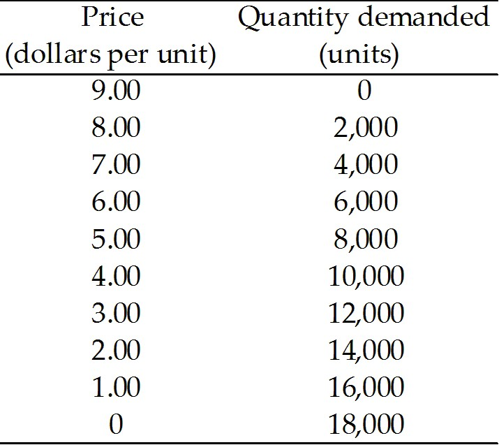
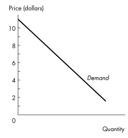
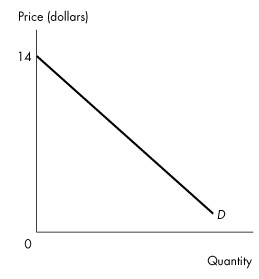
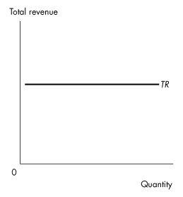
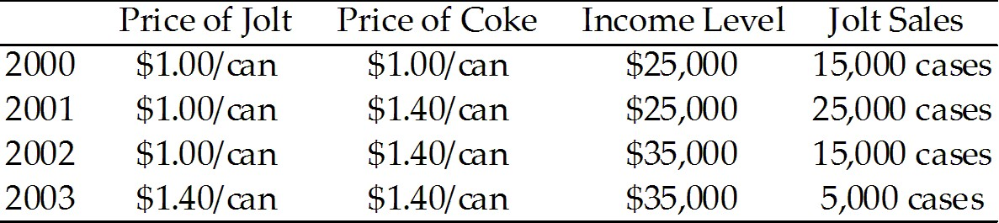
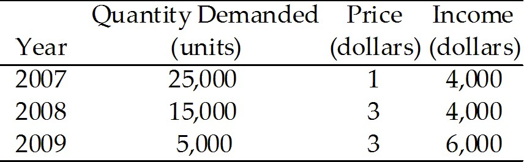
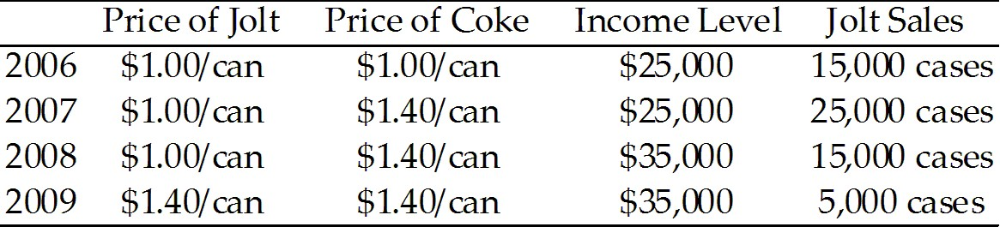
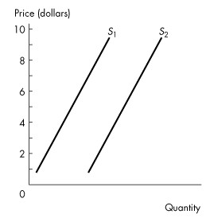

# **Chapter 4 Elasticity**

## 4.1 Price Elasticity of Demand

---
1\) A price elasticity of demand of 2 means that a 10 percent increase in
price will result in a

A\) 2 percent decrease in quantity demanded.

B\) 20 percent decrease in quantity demanded.

C\) 5 percent decrease in quantity demanded.

D\) 2 percent increase in quantity demanded.

E\) 20 percent increase in quantity demanded.

---
---
Answer: B

Diff: 2 Type: MC

Topic: Price Elasticity of Demand

---
2\) The price elasticity of demand is a units-free measure of the
responsiveness of the \_\_\_\_\_\_\_\_ when all other influences on
buying plans remain the same.

A\) quantity demanded to a change in the price of a substitute or
complement

B\) quantity demanded to a change in income

C\) quantity demanded of a good to a change in its price

D\) price to a change in quantity demanded

E\) none of the above

---
---
Answer: C

Diff: 1 Type: MC

Topic: Price Elasticity of Demand

---
3\) The concept used by economists to indicate the responsiveness of the
quantity demanded of a good to a change in its price is the

A\) cross elasticity of demand.

B\) income elasticity of demand.

C\) substitute elasticity of demand.

D\) price elasticity of demand.

E\) elasticity of supply.

---
---
Answer: D

Diff: 1 Type: MC

Topic: Price Elasticity of Demand

---
4\) If a 10 percent rise in price leads to an 8 percent decrease in
quantity demanded, the price elasticity of demand is

A\) 0.8.

B\) 1.25.

C\) 8.

D\) 0.125.

E\) 80.

---
---
Answer: A

Diff: 2 Type: MC

Topic: Price Elasticity of Demand

---
5\) If a large percentage drop in the price level results in a small
percentage increase in the quantity demanded,

A\) demand is inelastic.

B\) demand is elastic.

C\) demand is unit elastic.

D\) the price elasticity of demand is close to infinity.

E\) the price elasticity of demand is zero.

---
---
Answer: A

Diff: 2 Type: MC

Topic: Price Elasticity of Demand

---
6\) The price of apples falls by 5 percent and quantity of apples
demanded increases by 6 percent. We conclude that the demand for apples
is

A\) perfectly elastic.

B\) unit elastic.

C\) elastic.

D\) perfectly inelastic.

E\) inelastic.

---
---
Answer: C

Diff: 2 Type: MC

Topic: Price Elasticity of Demand

---
7\) The price of oranges rises by 3 percent and quantity of oranges
demanded decreases by 3 percent. We conclude that the demand for oranges
is

A\) inelastic.

B\) elastic.

C\) perfectly inelastic.

D\) perfect elastic.

E\) unit elastic.

---
---
Answer: E

Diff: 2 Type: MC

Topic: Price Elasticity of Demand

---
8\) The price of plums falls by 7 percent and quantity of plums demanded
increases by 6.75 percent. We conclude that the demand for plums is

A\) inelastic.

B\) perfectly elastic.

C\) perfectly inelastic.

D\) elastic.

E\) unit elastic.

---
---
Answer: A

Diff: 2 Type: MC

Topic: Price Elasticity of Demand

---
9\) The price of good *A* falls by 10 percent and quantity of good *A*
demanded does not change. We conclude that the demand for good *A* is

A\) perfectly elastic.

B\) inelastic.

C\) perfectly inelastic.

D\) elastic.

E\) unit elastic.

---
---
Answer: C

Diff: 2 Type: MC

Topic: Price Elasticity of Demand

---
10\) Which one of the following illustrates an inelastic demand?

A\) A 10 percent rise in price leads to a 5 percent decrease in quantity
demanded.

B\) A 10 percent rise in price leads to a 20 percent decrease in quantity
demanded.

C\) A price elasticity of demand equal to infinity.

D\) A price elasticity of demand equal to 1.0.

E\) A price elasticity of demand equal to 2.0.

---
---
Answer: A

Diff: 2 Type: MC

Topic: Price Elasticity of Demand

---
11\) Which one of the following illustrates an elastic demand?

A\) A 10 percent rise in price leads to a 5 percent decrease in quantity
demanded.

B\) A 10 percent rise in price leads to a 20 percent decrease in quantity
demanded.

C\) A price elasticity of demand equal to 0.2.

D\) A price elasticity of demand equal to 1.0.

E\) A price elasticity of demand equal to zero.

---
---
Answer: B

Diff: 2 Type: MC

Topic: Price Elasticity of Demand

---
12\) If a 12 percent fall in price results in an 8 percent increase in
quantity demanded, the price elasticity of demand equals

A\) 0.96.

B\) 0.12.

C\) 0.67.

D\) 1.5.

E\) 0.8.

---
---
Answer: C

Diff: 2 Type: MC

Topic: Price Elasticity of Demand

---
13\) The demand for good *A* is unit elastic if

A\) a 5 percent fall in the price of *A* results in an infinite increase
in the quantity of *A* demanded.

B\) a 5 percent rise in the price of *A* results in a 10 percent decrease
in the quantity of *A* demanded.

C\) any increase in the price of *A* results in a 1 percent decrease in
the quantity of *A* demanded.

D\) a 5 percent rise in the price of *A* results in no change in the
quantity of *A* demanded.

E\) a 5 percent rise in the price of *A* results in a 5 percent decrease
in the quantity of *A* demanded.

---
---
Answer: E

Diff: 2 Type: MC

Topic: Price Elasticity of Demand

---
14\) Demand is inelastic if

A\) a small change in price results in a large change in quantity
demanded.

B\) the quantity demanded is very responsive to a change in price.

C\) the price elasticity of demand is 0.2.

D\) the price does not change when supply increases.

E\) a 10 percent change in price results in a 1 percent change in the
quantity supplied.

---
---
Answer: C

Diff: 2 Type: MC

Topic: Price Elasticity of Demand

---
15\) If the demand curve for a good is a horizontal line, then the good
has

A\) zero income elasticity.

B\) price elasticity of demand equal to zero.

C\) infinite price elasticity of demand.

D\) a price elasticity of demand that is likely to rise in the short run.

E\) a price elasticity of demand that is likely to fall in the short run.

---
---
Answer: C

Diff: 2 Type: MC

Topic: Price Elasticity of Demand

---
16\) If a 10 percent rise in the price of goods leads to a 10 percent
decrease in quantity demanded, the demand curve for this good

A\) is vertical.

B\) is horizontal.

C\) has slope equal to 1.

D\) is a straight line with slope equal to 10.

E\) none of the above.

---
---
Answer: E

Diff: 2 Type: MC

Topic: Price Elasticity of Demand

---
17\) A unit elastic demand

A\) means that the ratio of a change in quantity demanded to a change in
price is equal to 1.

B\) means that the ratio of a percentage change in quantity demanded to a
percentage change in price is equal to 1.

C\) means that the ratio of a change in price to a change in quantity
demanded is equal to 1.

D\) is illustrated by a horizontal demand curve.

E\) is illustrated by a vertical demand curve.

---
---
Answer: B

Diff: 2 Type: MC

Topic: Price Elasticity of Demand

---
18\) Suppose a rise in the price of a good from \$6.50 to \$7.50 leads to
a decrease in the quantity demanded from 10,500 to 9,500 units. In this
range of demand, the price elasticity of demand is

A\) 14.

B\) 7.

C\) 1,000.

D\) 1.

E\) 0.7.

---
---
Answer: E

Diff: 2 Type: MC

Topic: Price Elasticity of Demand

---
19\) A fall in the price of a good from \$11.50 to \$8.50 results in an
increase in the quantity demanded from 19,200 to 20,800 units. The price
elasticity of demand is

A\) 0.27.

B\) 3.75.

C\) 0.08.

D\) 8.0.

E\) 30.

---
---
Answer: A

Diff: 2 Type: MC

Topic: Price Elasticity of Demand

---
20\) A fall in the price of a good from \$10.50 to \$9.50 results in an
increase in the quantity demanded from 18,800 to 21,200 units. The price
elasticity of demand is

A\) 0.8.

B\) 1.25.

C\) 1.2.

D\) 8.0.

E\) 2.4.

---
---
Answer: C

Diff: 2 Type: MC

Topic: Price Elasticity of Demand

---
21\) Suppose the quantity of root beer demanded decreases from 105,000
litres per week to 95,000 litres per week when the price rises by 5
percent. The price elasticity of demand

A\) is 2.0.

B\) is 0.5.

C\) is 10.

D\) is inelastic.

E\) cannot be computed unless we know the original price and the new
price.

---
---
Answer: A

Diff: 2 Type: MC

Topic: Price Elasticity of Demand

---
22\) Suppose that the price elasticity of demand for bottled water in
Sackville, New Brunswick is 1.5, while the price elasticity of demand
for bottled water in Prince Albert, Saskatchewan is 0.93. This implies
that the demand in Sackville is \_\_\_\_\_\_\_\_ and demand in Prince
Albert is \_\_\_\_\_\_\_\_.

A\) unit elastic; unit elastic

B\) perfectly elastic; inelastic

C\) inelastic; elastic

D\) elastic; inelastic

E\) elastic; unit elastic

---
---
Answer: D

Diff: 2 Type: MC

Topic: Price Elasticity of Demand

---
23\) Suppose the government of Nova Scotia wants to reduce the
consumption of electricity by 5 percent. The price elasticity of demand
for electricity is 0.40. You advise the Nova Scotia government to

A\) raise the price of electricity by 12.5 percent.

B\) raise the price of electricity by 2 percent.

C\) lower the price of electricity by 12.5 percent.

D\) stay away from the market for electricity and let the market
mechanism fix the problem.

E\) lower the price of electricity by 2 percent.

---
---
Answer: A

Diff: 2 Type: MC

Topic: Price Elasticity of Demand

---
24\) Suppose the Lethbridge Computer Company decides to increase the
quantity of computers it sells by 6 percent. If the price elasticity of
demand is 3.5, the company must

A\) raise the price of a computer by 1.714 percent.

B\) raise the price of a computer by 0.21 percent.

C\) lower the price of a computer by 0.21 percent.

D\) lower the price of a computer by 1.714 percent.

E\) lower the price of a computer by 0.58 percent.

---
---
Answer: D

Diff: 2 Type: MC

Topic: Price Elasticity of Demand

---
25\) If the demand for salmon in Cape Breton Nova Scotia is unit elastic,
the price elasticity of demand for salmon equals

A\) 1.0.

B\) 100.0.

C\) 0.10.

D\) zero.

E\) 10.0.

---
---
Answer: A

Diff: 2 Type: MC

Topic: Price Elasticity of Demand

---
26\) At a price of \$15, Jack\'s quantity demanded of good *A* is the
same as when the price rises to \$16. Jack\'s demand for good *A* is

A\) elastic.

B\) inelastic.

C\) perfectly elastic.

D\) unit elastic.

E\) perfectly inelastic.

---
---
Answer: E

Diff: 2 Type: MC

Topic: Price Elasticity of Demand

---
27\) Which one of the following will yield a measured price elasticity of
demand of 5.0? A 10 percent rise in price results in a

A\) 10 percent decrease in quantity demanded.

B\) 5 percent decrease in quantity demanded.

C\) 2 percent decrease in quantity demanded.

D\) 50 percent decrease in quantity demanded.

E\) 0.5 percent decrease in quantity demanded.

---
---
Answer: D

Diff: 2 Type: MC

Topic: Price Elasticity of Demand

*\
Use the table below to answer the following questions.*

**Table 4.1.1**

Demand schedule for good *A*.

---
28\) Refer to Table 4.1.1. The price elasticity of demand when the price
rises from \$6 a unit to \$7 a unit is

A\) 1.0.

B\) 2.0.

C\) 2.6.

D\) 0.5.

E\) 1.3.

---
---
Answer: C

Diff: 2 Type: MC

Topic: Price Elasticity of Demand

---
29\) Refer to Table 4.1.1. Demand is unit elastic when the price falls
from

A\) \$8 to \$7.

B\) \$7 to \$6.

C\) \$6 to \$5.

D\) \$5 to \$4.

E\) \$4 to \$3.

---
---
Answer: D

Diff: 2 Type: MC

Topic: Price Elasticity of Demand

---
30\) Refer to Table 4.1.1. If the price of good *A* falls from \$4 to
\$3,

A\) total revenue will increase.

B\) total revenue will remain constant.

C\) demand is elastic in this range.

D\) demand is unit elastic in this range.

E\) demand is inelastic in this range.

---
---
Answer: E

Diff: 2 Type: MC

Topic: Price Elasticity of Demand

---
31\) For which one of the following will demand be the most price
inelastic?

A\) milk

B\) Happy Cow brand milk

C\) Happy Cow brand milk in Regina

D\) Happy Cow brand milk at Ralph\'s Grocery Store in Regina

E\) All of the above will exhibit the same price elasticity of demand

---
---
Answer: A

Diff: 2 Type: MC

Topic: Price Elasticity of Demand

---
32\) For which one of the following is demand likely to be most
inelastic?

A\) diamonds

B\) insulin for a diabetic

C\) potatoes

D\) gasoline

E\) books

---
---
Answer: B

Diff: 2 Type: MC

Topic: Price Elasticity of Demand

---
33\) Demand will be more inelastic the

A\) higher the income level.

B\) lower the income level.

C\) longer the passage of time after a price increase.

D\) fewer good substitutes that are available.

E\) larger the fraction of income spent on the good.

---
---
Answer: D

Diff: 2 Type: MC

Topic: Price Elasticity of Demand

---
34\) Demand will be more elastic the

A\) higher the income level.

B\) lower the income level.

C\) longer the passage of time after a price increase.

D\) fewer substitutes are available.

E\) smaller the fraction of income spent on the good.

---
---
Answer: C

Diff: 2 Type: MC

Topic: Price Elasticity of Demand

*\
Use the figure below to answer the following question.*

**Figure 4.1.1**

---
35\) Figure 4.1.1 illustrates a linear demand curve. Comparing the price
elasticity in the \$2 to \$3 price range with the elasticity in the \$8
to \$9 range, we can conclude

A\) that demand is more elastic in the \$8 to \$9 price range.

B\) that demand is more elastic in the \$2 to \$3 price range.

C\) that the price elasticity of demand is the same in both price ranges.

D\) nothing without numerical information about quantities.

E\) that the price elasticity of demand is zero in both price ranges
because the demand curve is a straight-line demand curve.

---
---
Answer: A

Diff: 2 Type: MC

Topic: Price Elasticity of Demand

*\
Use the figure below to answer the following questions.*

**Figure 4.1.2**

---
36\) Figure 4.1.2 illustrates a linear demand curve. If the price falls
from \$13 to \$11,

A\) total revenue increases.

B\) total revenue decreases.

C\) total revenue remains unchanged.

D\) total revenue initially increases then decreases.

E\) total revenue initially decreases then increases.

---
---
Answer: A

Diff: 2 Type: MC

Topic: Price Elasticity of Demand

---
37\) Figure 4.1.2 illustrates a linear demand curve. If the price falls
from \$4 to \$2,

A\) total revenue increases.

B\) total revenue decreases.

C\) total revenue remains unchanged.

D\) the quantity demanded increases by more than 10 percent.

E\) the percentage change in quantity demanded is more than the
percentage change in price.

---
---
Answer: B

Diff: 2 Type: MC

Topic: Price Elasticity of Demand

---
38\) The quantity of apples demanded decreases by 8 percent when the
price rises by 8 percent. The demand for apples is

A\) unit elastic.

B\) inelastic.

C\) elastic.

D\) perfectly elastic.

E\) perfectly inelastic.

---
---
Answer: A

Diff: 1 Type: MC

Topic: Price Elasticity of Demand

---
39\) A perfectly vertical demand curve indicates that the price
elasticity of demand for the good is

A\) zero.

B\) greater than zero but less than 1.

C\) 1.

D\) greater than 1.

E\) negative.

---
---
Answer: A

Diff: 1 Type: MC

Topic: Price Elasticity of Demand

Source: Study Guide

---
40\) Factors that influence the elasticity of demand include

A\) the closeness of substitutes.

B\) the price of complements but not the price of substitutes.

C\) income.

D\) preferences.

E\) the price of substitutes and complements.

---
---
Answer: A

Diff: 2 Type: MC

Topic: Price Elasticity of Demand

---
41\) A given percentage rise in the price of a good is likely to result
in a larger percentage decrease in the quantity of the good demanded

A\) the shorter the passage of time.

B\) the larger the proportion of income spent on it.

C\) the harder it is to obtain good substitutes.

D\) all of the above.

E\) none of the above.

---
---
Answer: B

Diff: 2 Type: MC

Topic: Price Elasticity of Demand

Source: Study Guide

---
42\) Suppose a fall in the price of a good from \$10 to \$8 leads to an
increase in quantity demanded from 20 to 24 units. The price elasticity
of demand is

A\) 1.

B\) 9/11.

C\) 11/9.

D\) 2.0.

E\) 4.5/11.

---
---
Answer: B

Diff: 2 Type: MC

Topic: Price Elasticity of Demand

---
43\) For which one of the following will demand be the most price
elastic?

A\) daily newspapers

B\) Ontario newspapers

C\) Toronto newspapers

D\) The *Toronto Star*

E\) Each of the above will exhibit the same price elasticity of demand

---
---
Answer: D

Diff: 2 Type: MC

Topic: Price Elasticity of Demand

---
44\) Suppose this coming winter France will have unusually bad weather,
and that next year\'s wine crop will be substantially reduced. Select
the best statement.

A\) The French wine supply will increase as price rises.

B\) If the demand for French wine is elastic, wine producers will
experience an increase in total revenue.

C\) The initial change in the market will create a surplus of French
wine.

D\) In the final equilibrium, price and quantity will be higher.

E\) none of the above

---
---
Answer: E

Diff: 2 Type: MC

Topic: Price Elasticity of Demand

*\
Use the table below to answer the following question.*

**Table 4.1.2**

+--------------------+--------------+
| **Price**          | **Quantity** |
|                    |              |
| **per Volleyball** | **Demanded** |
+--------------------+--------------+
| \$19               | 55           |
+--------------------+--------------+
| \$21               | 45           |
+--------------------+--------------+

---
45\) Refer to Table 4.1.2. The table shows two points on the demand curve
for volleyballs. What is the price elasticity of demand between these
two points?

A\) 2.5.

B\) 2.0.

C\) 0.5.

D\) 0.4.

E\) none of the above

---
---
Answer: B

Diff: 2 Type: MC

Topic: Price Elasticity of Demand

Source: Study Guide

---
46\) If the price elasticity of demand is 2, then a 1 percent fall in
price

A\) doubles the quantity demanded.

B\) decreases the quantity demanded by half.

C\) increases the quantity demanded by 2 percent.

D\) decreases the quantity demanded by 2 percent.

E\) increases the quantity demanded by 0.5 percent.

---
---
Answer: C

Diff: 1 Type: MC

Topic: Price Elasticity of Demand

Source: Study Guide

---
47\) The demand for a good will be more price inelastic,

A\) the higher is its price.

B\) the larger is the percentage of income spent on it.

C\) the longer is the passage of time.

D\) the smaller the supply of the good.

E\) the fewer substitutes are available for the good.

---
---
Answer: E

Diff: 1 Type: MC

Topic: Price Elasticity of Demand

---
48\) A union leader who claims that \"higher wages increase living
standards without causing unemployment\" believes that the demand for
labour is

A\) income elastic.

B\) income inelastic.

C\) perfectly elastic.

D\) perfectly inelastic.

E\) unit elastic.

---
---
Answer: D

Diff: 2 Type: MC

Topic: Price Elasticity of Demand

Source: Study Guide

---
49\) Business people speak about price elasticity of demand without using
the actual term. Which one of the following statements reflects elastic
demand for a good?

A\) \"A price cut won\'t help me. It won\'t increase sales, and I\'ll
just get less money for each unit.\"

B\) \"I don\'t think a price cut will make any difference to my bottom
line. What I may gain from selling more I would lose on the lower
price.\"

C\) \"My customers are real bargain hunters. Since I set my prices just a
few cents below my competitors, customers have flocked to the store, and
sales are booming.\"

D\) \"With the recent economic recovery, people have more income to spend
and sales are booming, even at the previous prices.\"

E\) none of the above

---
---
Answer: C

Diff: 2 Type: MC

Topic: Price Elasticity of Demand

Source: Study Guide

---
50\) If a rise in price results in a decrease in total revenue, then the
price elasticity of demand is

A\) negative.

B\) zero.

C\) greater than zero but less than 1.

D\) equal to 1.

E\) greater than 1.

---
---
Answer: E

Diff: 2 Type: MC

Topic: Price Elasticity of Demand

---
51\) Suppose that Simon Fraser University decides to raise tuition fees
to increase the total revenue it receives from students. This policy
works only if the demand for a Simon Fraser University education is

A\) unit elastic.

B\) inelastic.

C\) elastic.

D\) greater than the demand for a University of Western Ontario
education.

E\) perfectly elastic.

---
---
Answer: B

Diff: 2 Type: MC

Topic: Price Elasticity of Demand

---
52\) The demand for a good is perfectly elastic when the price elasticity
of demand is

A\) equal to infinity.

B\) between infinity and 1.

C\) equal to 1.

D\) between 1 and zero.

E\) equal to zero.

---
---
Answer: A

Diff: 1 Type: MC

Topic: Price Elasticity of Demand

---
53\) When the price elasticity of demand is \_\_\_\_\_\_\_\_, demand for
the good is perfectly inelastic.

A\) equal to infinity

B\) greater than 1

C\) equal to 1

D\) between 1 and zero

E\) equal to zero

---
---
Answer: E

Diff: 1 Type: MC

Topic: Price Elasticity of Demand

---
54\) When the price elasticity of demand is \_\_\_\_\_\_\_\_, demand for
the good is elastic.

A\) equal to infinity

B\) greater than 1

C\) equal to 1

D\) between 1 and zero

E\) equal to zero

---
---
Answer: B

Diff: 1 Type: MC

Topic: Price Elasticity of Demand

---
55\) When the price elasticity of demand is \_\_\_\_\_\_\_\_, demand for
the good is unit elastic.

A\) equal to infinity

B\) greater than 1

C\) equal to 1

D\) between 1 and zero

E\) equal to zero.

---
---
Answer: C

Diff: 1 Type: MC

Topic: Price Elasticity of Demand

---
56\) When the price elasticity of demand is \_\_\_\_\_\_\_\_, demand for
the good is inelastic.

A\) equal to infinity

B\) greater than 1

C\) equal to 1

D\) between 1 and zero

E\) equal to zero

---
---
Answer: D

Diff: 1 Type: MC

Topic: Price Elasticity of Demand

---
57\) The price elasticity of demand for airplane travel one year in
advance of the departure date is most likely to be

A\) equal to infinity.

B\) equal to zero.

C\) between zero and 1.

D\) equal to 1.

E\) greater than 1.

---
---
Answer: E

Diff: 2 Type: MC

Topic: Price Elasticity of Demand

---
58\) The price elasticity of demand for airplane travel one week in
advance of the departure date is most likely to be

A\) equal to infinity.

B\) equal to zero.

C\) between zero and 1.

D\) equal to 1.

E\) greater than 1.

---
---
Answer: C

Diff: 2 Type: MC

Topic: Price Elasticity of Demand

---
59\) If a price decrease results in an increase in total revenue, then
demand is

A\) inelastic.

B\) unit elastic.

C\) perfectly inelastic.

D\) equal to supply.

E\) elastic.

---
---
Answer: E

Diff: 1 Type: MC

Topic: Price Elasticity of Demand

---
60\) Suppose Swiss Chalet in Moncton knows that the demand for their
half-chicken meals is elastic. If the manager wants to increase total
revenue from half-chicken meal sales, he should

A\) lower the price of a half-chicken meal.

B\) not change the price of a half-chicken meal.

C\) raise the price of a half-chicken meal.

D\) decrease the supply of half-chicken meals.

E\) hire fewer employees.

---
---
Answer: A

Diff: 2 Type: MC

Topic: Price Elasticity of Demand

---
61\) As a result of a poor growing season, the supply curve of apples
shifted leftward, the equilibrium price of apples rose, and total
revenue fell. This suggests that the price elasticity of demand for
apples is

A\) perfectly inelastic.

B\) elastic.

C\) inelastic.

D\) unit elastic.

E\) perfectly elastic.

---
---
Answer: B

Diff: 2 Type: MC

Topic: Price Elasticity of Demand

---
62\) Suppose the Nunavut government decides to repair Iqaluit roads. One
way to generate sufficient funds for this plan is to increase taxes on
gasoline. The government will be able to raise total revenue from
gasoline sales only if the demand for gasoline is

A\) perfectly elastic.

B\) equal to the supply of gasoline.

C\) unit elastic.

D\) inelastic.

E\) elastic.

---
---
Answer: D

Diff: 2 Type: MC

Topic: Price Elasticity of Demand

---
63\) Which of the following will have the most elastic demand?

A\) frozen desserts

B\) ice cream

C\) strawberry ice cream

D\) a banana split made with strawberry and chocolate ice cream

E\) a banana split with with Nestle strawberry and chocolate ice cream

---
---
Answer: E

Diff: 2 Type: MC

Topic: Price Elasticity of Demand

---
64\) Suppose your annual income is \$65 000 and your favourite TV Guide
magazine costs you \$28 a year. Your demand for the TV Guide magazine is
likely to be

A\) perfectly elastic.

B\) inelastic.

C\) unit elastic.

D\) elastic.

E\) elastic \-- the same as your demand for all other goods.

---
---
Answer: B

Diff: 2 Type: MC

Topic: Price Elasticity of Demand

---
65\) The longer the time that has elapsed since a price change the more
time consumers will have to respond to price changes. As a result,
demand becomes

A\) zero.

B\) more inelastic.

C\) more elastic.

D\) perfectly inelastic.

E\) unit elastic.

---
---
Answer: C

Diff: 2 Type: MC

Topic: Price Elasticity of Demand

---
66\) The price of gasoline rises by 25 percent and remains fixed at the
new higher level. Choose the correct statement.

A\) The demand for gasoline will increase after consumers adjust their
consumption behaviour to the new higher price.

B\) The demand for gasoline will decrease after consumers adjust their
consumption behaviour to the new higher price.

C\) Initially after the price change, the price elasticity of demand will
be less elastic than it will be a few years after the price change.

D\) The price elasticity of demand for gasoline will decrease in the
future.

E\) Initially after the price change, the price elasticity of demand will
be more elastic than it will be a few years after the price change.

---
---
Answer: C

Diff: 3 Type: MC

Topic: Price Elasticity of Demand

---
67\) The demand for a good is price elastic if

A\) a rise in price results in an increase in total revenue.

B\) a fall in price results in a decrease in total revenue.

C\) a rise in price results in a decrease in total revenue.

D\) the good is a necessity.

E\) the demand for the good is very insensitive to changes in price.

---
---
Answer: C

Diff: 1 Type: MC

Topic: Price Elasticity of Demand

---
68\) The demand for a good is price inelastic if

A\) a rise in price results in an increase in total revenue.

B\) a rise in price results in a decrease in total revenue.

C\) an increase in income results in a decrease in total revenue.

D\) an increase in income results in an increase in total revenue.

E\) the good is a luxury.

---
---
Answer: A

Diff: 1 Type: MC

Topic: Price Elasticity of Demand

---
69\) If the demand for a good is unit elastic, then a 5 percent increase
in price results in

A\) a 5 percent increase in total revenue.

B\) a 5 percent decrease in total revenue.

C\) no change in total revenue.

D\) an increase in total revenue greater than 5 percent.

E\) an increase in total revenue less than 5 percent.

---
---
Answer: C

Diff: 2 Type: MC

Topic: Price Elasticity of Demand

---
70\) Total revenue from the sale of a good will decrease if

A\) income increases and the good is normal.

B\) its price rises and demand is elastic.

C\) its price rises and demand is inelastic.

D\) income falls and the good is an inferior good.

E\) its price falls and demand is elastic.

---
---
Answer: B

Diff: 1 Type: MC

Topic: Price Elasticity of Demand

---
71\) If Saudi Arabia argues that an increase in the supply of oil will
decrease total revenue, then Saudi Arabia believes the demand for oil is

A\) income inelastic.

B\) income elastic.

C\) elastic.

D\) inelastic.

E\) unit elastic.

---
---
Answer: D

Diff: 2 Type: MC

Topic: Price Elasticity of Demand

---
72\) Suppose there is an increase in the cost of resources used in the
production of good *A*. Then

A\) if the price of *A* rises, we know the demand for *A* is elastic.

B\) if the total revenue from sales of *A* rises, we know the demand for
*A* is elastic.

C\) if the total revenue from sales of *A* falls, we know the demand for
*A* is elastic.

D\) total revenue will increase because the price of *A* must rise.

E\) total revenue must fall because the quantity bought and sold of *A*
must fall.

---
---
Answer: C

Diff: 2 Type: MC

Topic: Price Elasticity of Demand

---
73\) When the price of peanut butter rises by 4 percent, total revenue
decreases by 8 percent. The demand for peanut butter

A\) is elastic.

B\) is inelastic.

C\) is unit elastic.

D\) has a price elasticity equal to 1/2.

E\) has a price elasticity equal to 2.

---
---
Answer: A

Diff: 2 Type: MC

Topic: Price Elasticity of Demand

Source: Study Guide

---
74\) If price elasticity of demand is zero, then as the price falls

A\) total revenue does not change.

B\) quantity demanded does not change.

C\) quantity demanded falls to zero.

D\) total revenue increases from zero.

E\) None of the above occurs.

---
---
Answer: B

Diff: 2 Type: MC

Topic: Price Elasticity of Demand

Source: Study Guide

---
75\) A technological breakthrough lowers the cost of photocopiers. If the
demand for photocopiers is price inelastic, we predict that photocopier
sales

A\) fall and total revenue increases.

B\) fall and total revenue decreases.

C\) rise and total revenue increases.

D\) rise and total revenue decreases.

E\) rise, but changes in total revenue will depend on elasticity of
supply.

---
---
Answer: D

Diff: 1 Type: MC

Topic: Price Elasticity of Demand

Source: Study Guide

---
76\) A decrease in tuition fees will decrease the university\'s total
revenue if the price elasticity of demand for university education is

A\) negative.

B\) greater than zero but less than 1.

C\) equal to 1.

D\) greater than 1.

E\) less than the elasticity of supply.

---
---
Answer: B

Diff: 2 Type: MC

Topic: Price Elasticity of Demand

Source: Study Guide

---
77\) The demand for orange juice is price elastic. A severe frost, which
destroys large quantities of oranges will

A\) lower the equilibrium price but increase total consumer spending on
juice.

B\) decrease the equilibrium quantity and decrease total consumer
spending on juice.

C\) decrease both the equilibrium quantity and the price of juice.

D\) raise the equilibrium price as well as total consumer spending for
juice.

E\) raise the equilibrium price but leave total consumer spending for
juice constant.

---
---
Answer: B

Diff: 2 Type: MC

Topic: Price Elasticity of Demand

Source: Study Guide

---
78\) Tina and Brian work for the same recording company. Tina claims they
would be better off by raising the price of their CDs, while Brian
claims they would be better off by lowering the price. We can conclude
that

A\) Tina thinks the demand for CDs has price elasticity of demand zero
and Brian thinks price elasticity of demand equals 1.

B\) Tina thinks the demand for CDs has price elasticity of demand equal
to 1 and Brian thinks price elasticity of demand equals zero.

C\) Tina thinks the demand for CDs is price elastic and Brian thinks it
is price inelastic.

D\) Tina thinks the demand for CDs is price inelastic and Brian thinks it
is price elastic.

E\) Tina and Brian should stick to singing and forget about economics.

---
---
Answer: D

Diff: 2 Type: MC

Topic: Price Elasticity of Demand

Source: Study Guide

*Use the figure below to answer the following question.*

**Figure 4.1.3**

---
79\) Given the relationship shown in Figure 4.1.3 between total revenue
from the sale of a good and the quantity of the good sold, then

A\) this is an inferior good.

B\) this is a normal good.

C\) the price elasticity of demand is zero.

D\) demand for this good is perfectly elastic.

E\) the price elasticity of demand is 1.

---
---
Answer: E

Diff: 2 Type: MC

Topic: Price Elasticity of Demand

Source: Study Guide

---
80\) If the Canucks lower ticket prices and find that total revenue does
not change, then the price elasticity of demand for tickets is

A\) zero.

B\) greater than zero but less than 1.

C\) equal to 1.

D\) greater than 1.

E\) negative.

---
---
Answer: C

Diff: 2 Type: MC

Topic: Price Elasticity of Demand

---
81\) A good has a price elasticity of demand equal to 2. If new imports
lower its price from \$1.20 to \$0.80, the percentage change in quantity
demanded will be

A\) an increase of 80 percent.

B\) a decrease of 80 percent.

C\) a decrease of 40 percent.

D\) an increase of 2 percent.

E\) an increase of 40 percent.

---
---
Answer: A

Diff: 2 Type: MC

Topic: Price Elasticity of Demand

---
82\) Total revenue is more likely to rise when the price rises if

A\) there are few substitutes for the good.

B\) a high proportion of income is spent on the good.

C\) some extended period of time passes.

D\) all of the above.

E\) none of the above.

---
---
Answer: A

Diff: 2 Type: MC

Topic: Price Elasticity of Demand

---
83\) Total revenue is more likely to rise when the price falls if

A\) there are few substitutes for the good.

B\) a low proportion of income is spent on the good.

C\) some extended period of time passes.

D\) all of the above.

E\) none of the above.

---
---
Answer: C

Diff: 2 Type: MC

Topic: Price Elasticity of Demand

---
84\) If the demand for good *Z* is perfectly inelastic, then the demand
curve for good *Z* is

A\) vertical.

B\) horizontal.

C\) upward sloping.

D\) downward sloping.

E\) initially upward sloping and then downward sloping.

---
---
Answer: A

Diff: 2 Type: MC

Topic: Price Elasticity of Demand

---
85\) Suppose the demand curve for good X is horizontal. This shows that
the demand for good X is

A\) unit elastic.

B\) inelastic.

C\) perfectly elastic.

D\) perfect inelastic.

E\) elastic.

---
---
Answer: C

Diff: 2 Type: MC

Topic: Price Elasticity of Demand

---
86\) If the price elasticity of demand is zero, then demand is

A\) elastic.

B\) inelastic.

C\) perfectly inelastic.

D\) perfectly elastic.

E\) unit elastic.

---
---
Answer: C

Diff: 2 Type: MC

Topic: Price Elasticity of Demand

*\
Use the table below to answer the following question.*

**Table 4.1.3**

---
87\) Refer to Table 4.1.3. The price elasticity of demand for Jolt is

A\) 1.

B\) 2.5.

C\) 3.0.

D\) 0.33.

E\) cannot be calculated because income is not constant.

---
---
Answer: C

Diff: 2 Type: MC

Topic: Price Elasticity of Demand

---
88\) Suppose a rise of 8 percent in the price of bison meat in
Saskatchewan reduces the consumption of bison meat by 24 percent. Such a
price rise will induce consumers to spend

A\) more of their income on bison.

B\) the same amount of their income on bison as before.

C\) less of their income on bison.

D\) more on products that are complements of bison.

E\) zero dollars on bison meat.

---
---
Answer: C

Diff: 2 Type: MC

Topic: Price Elasticity of Demand

*\
Use the table below to answer the following question.*

**Table 4.1.4**

+--------------------+------------------------------+
| **Price**          | **Quantity Demanded**        |
|                    |                              |
| (dollars per chip) | (millions of chips per year) |
+--------------------+------------------------------+
| **200**            | **50**                       |
+--------------------+------------------------------+
| **250**            | **45**                       |
+--------------------+------------------------------+
| **300**            | **40**                       |
+--------------------+------------------------------+
| **350**            | **35**                       |
+--------------------+------------------------------+
| **400**            | **30**                       |
+--------------------+------------------------------+

---
89\) Refer to Table 4.1.4. The table shows the demand schedule for
computer chips. As the price rises from \$200 a chip to \$300 a chip,
total revenue \_\_\_\_\_\_\_\_. So at a price of \$250 a chip, demand is
\_\_\_\_\_\_\_\_.

A\) falls; inelastic

B\) rises; inelastic

C\) falls; rises

D\) rises; elastic

E\) rises; unit elastic

---
---
Answer: B

Type: MC

Topic: Price Elasticity of Demand

Source: MyEconLab

*Use the table below to answer the following question.*

**Table 4.1.5**

+---------------------+-----------------------+
| **Price**           | **Quantity demanded** |
|                     |                       |
| (dollars per night) | (rooms per night)     |
+---------------------+-----------------------+
| **200**             | **10,000**            |
+---------------------+-----------------------+
| **250**             | **8,000**             |
+---------------------+-----------------------+
| **400**             | **5,000**             |
+---------------------+-----------------------+
| **500**             | **4,000**             |
+---------------------+-----------------------+
| **800**             | **2,500**             |
+---------------------+-----------------------+

---
90\) Refer to Table 4.1.5. The demand for hotel rooms is \_\_\_\_\_\_\_\_
because \_\_\_\_\_\_\_\_.

A\) inelastic; if the price is set low enough, total revenue will
decrease

B\) elastic; if the price is set high enough, total revenue will decrease

C\) unit elastic; a price cut leaves total revenue unchanged. Total
revenue never reaches a maximum

D\) decreasing as the price falls; the demand curve for hotel rooms is a
straight-line demand curve

E\) inelastic; if the price is set low enough, total revenue will
increase

---
---
Answer: C

Type: MC

Topic: Price Elasticity of Demand

Source: MyEconLab

---
91\) When the price of a good increased by 5 percent, the quantity
demanded of it decreased 10 percent. The price elasticity of demand is
\_\_\_\_\_\_\_\_. A price rise will \_\_\_\_\_\_\_\_ total revenue.

A\) 2.0; decrease

B\) 0.5; decrease

C\) 2.0; increase

D\) 0.5; increase

E\) -2.0; decrease

---
---
Answer: A

Type: MC

Topic: Price Elasticity of Demand

Source: MyEconLab

---
92\) When the price of a good increased by 6 percent, the quantity
demanded of it decreased 3 percent. Most likely, this good
\_\_\_\_\_\_\_\_ and \_\_\_\_\_\_\_\_.

A\) is a necessity; has poor substitutes

B\) has poor substitutes; is a luxury

C\) is a necessity; has good substitutes

D\) is a luxury; is narrowly defined

E\) is a luxury; has experienced a recent price change

---
---
Answer: A

Type: MC

Topic: Price Elasticity of Demand

Source: MyEconLab

---
93\) The price elasticity of demand for purses is measured in

A\) dollars.

B\) purses.

C\) dollars per purse.

D\) purses per dollar.

E\) none of the above.

---
---
Answer: E

Type: MC

---
94\) The price elasticity of demand depends on

A\) the units used to measure price and the units used to measure
quantity.

B\) the units used to measure price but not the units used to measure
quantity.

C\) the units used to measure quantity but not the units used to measure
price.

D\) neither the units used to measure price nor the units used to measure
quantity.

E\) the relative price of the good.

---
---
Answer: D

Type: MC

---
95\) When the quantity of coal is measured in kilograms instead of
pounds, the demand for coal becomes

A\) more elastic.

B\) less elastic.

C\) neither more nor less elastic.

D\) perfectly elastic.

E\) perfectly inelastic.

---
---
Answer: C

Type: MC

---
96\) The price elasticity of demand for oranges \_\_\_\_\_\_\_\_ if the
quantity is measured in pounds instead of kilograms and \_\_\_\_\_\_\_\_
if the price is measured in dollars instead of cents.

A\) changes; changes

B\) changes; does not change

C\) does not change; changes

D\) does not change; does not change

E\) increases; decreases

---
---
Answer: D

Type: MC

## 4.2 More Elasticities of Demand

*Use the table below to answer the following questions.*

**Table 4.2.1**

---
1\) Consider the information in Table 4.2.1. Select the best statement.

A\) The income elasticity of demand is -2.5.

B\) The income elasticity of demand is 2.5.

C\) The income elasticity of demand is -3.33.

D\) The income elasticity of demand is 3.33.

E\) We cannot calculate the income elasticity of demand because both
income and price are changing at the same time.

---
---
Answer: A

Diff: 2 Type: MC

Topic: More Elasticities of Demand

---
2\) The income elasticity of demand equals the percentage change in
\_\_\_\_\_\_\_\_ other things remaining the same.

A\) price divided by the percentage change in income

B\) price divided by the percentage change in quantity demanded

C\) income divided by the percentage change in quantity demanded

D\) quantity demanded divided by the percentage change in price

E\) quantity demanded divided by the percentage change in income

---
---
Answer: E

Diff: 1 Type: MC

Topic: More Elasticities of Demand

---
3\) If the quantity of carrots demanded increases by a small percentage
when income increases by a large amount, we know that the demand for
carrots is

A\) price elastic.

B\) price inelastic.

C\) income inferior.

D\) income elastic.

E\) income inelastic.

---
---
Answer: E

Diff: 1 Type: MC

Topic: More Elasticities of Demand

---
4\) If the quantity of carrots demanded increases by a large percentage
when income increases by a small amount, we know that the demand for
carrots is

A\) price elastic.

B\) price inelastic.

C\) income inferior.

D\) income inelastic.

E\) income elastic.

---
---
Answer: E

Diff: 1 Type: MC

Topic: More Elasticities of Demand

---
5\) Which one of the following must be true if demand is income
inelastic?

A\) A large percentage increase in income will result in a small
percentage increase in quantity demanded.

B\) A small percentage increase in income will result in a large
percentage increase in quantity demanded.

C\) An increase in income will decrease the quantity demanded.

D\) The good is an inferior good.

E\) A percentage rise in price increases the quantity demanded by a
smaller percentage.

---
---
Answer: A

Diff: 1 Type: MC

Topic: More Elasticities of Demand

---
6\) Which one of the following must be true if demand is income elastic?

A\) A large percentage increase in income will result in a small
percentage increase in quantity demanded.

B\) A small percentage increase in income will result in a large
percentage increase in quantity demanded.

C\) An increase in income will decrease the quantity demanded.

D\) The good is an inferior good.

E\) A percentage change in price will lead to a larger percentage change
in quantity demanded.

---
---
Answer: B

Diff: 1 Type: MC

Topic: More Elasticities of Demand

---
7\) If a turnip is an inferior good then

A\) a small decrease in income decreases the quantity of turnips demanded
at the current price by a large amount.

B\) a large decrease in income decreases the quantity of turnips demanded
at the current price by a small amount.

C\) an increase in income increases the quantity demanded at the current
price.

D\) an increase in income decreases the quantity demanded at the current
price.

E\) turnips taste awful.

---
---
Answer: D

Diff: 2 Type: MC

Topic: More Elasticities of Demand

---
8\) If a turnip is a normal good then

A\) a small decrease in income increases the quantity of turnips demanded
at the current price by a large amount.

B\) a large decrease in income increases the quantity of turnips demanded
at the current price by a small amount.

C\) an increase in income increases the quantity demanded at the current
price.

D\) an increase in income decreases the quantity demanded at the current
price.

E\) an increase in price decreases the quantity demanded.

---
---
Answer: C

Diff: 2 Type: MC

Topic: More Elasticities of Demand

---
9\) Fred\'s income increases from \$1,950 per week to \$2,050 per week.
As a result, he decides to increase the number of movies he attends each
month by 10 percent. Fred\'s demand for movies is

A\) price elastic.

B\) price inelastic.

C\) income elastic.

D\) income inelastic.

E\) income inferior.

---
---
Answer: C

Diff: 2 Type: MC

Topic: More Elasticities of Demand

---
10\) Fred\'s income increases from \$840 per week to \$1,160 per week. As
a result, he decides to purchase 24 percent more bubble gum each week.
The income elasticity of Fred\'s demand for bubble gum is

A\) 0.32.

B\) 1.33.

C\) 24.

D\) 0.24.

E\) 0.75.

---
---
Answer: E

Diff: 2 Type: MC

Topic: More Elasticities of Demand

---
11\) Fred\'s income increases from \$800 per week to \$1,200 per week. As
a result, he decides to purchase 40 percent more bubble gum each week.
The income elasticity of Fred\'s demand for bubble gum is

A\) 0.40.

B\) 40.

C\) 1.0.

D\) 0.12.

E\) 10.

---
---
Answer: C

Diff: 2 Type: MC

Topic: More Elasticities of Demand

---
12\) Suppose that a 20 percent increase in income increases the quantity
of good *A* demanded from 19,200 to 20,800 units. The income elasticity
of demand for good *A* is

A\) 0.05.

B\) 0.8.

C\) 0.4.

D\) 1.2.

E\) 2.0.

---
---
Answer: C

Diff: 2 Type: MC

Topic: More Elasticities of Demand

---
13\) If a 10 percent increase in income results in a 5 percent increase
in quantity demanded, what is the income elasticity of demand?

A\) 0.5

B\) -0.5

C\) 2.0

D\) -2.0

E\) 1.5

---
---
Answer: A

Diff: 1 Type: MC

Topic: More Elasticities of Demand

Source: Study Guide

---
14\) If a 10 percent *increase* in income results in a 10 percent
*decrease* in the consumption of widgets, then

A\) the price elasticity of demand for widgets equals 1.

B\) the income elasticity of demand for widgets is negative.

C\) the income elasticity of demand for widgets equals 1.

D\) widgets are a normal good.

E\) the price elasticity demand for widgets is negative.

---
---
Answer: B

Diff: 2 Type: MC

Topic: More Elasticities of Demand

---
15\) Luxury goods tend to have income elasticities of demand that are

A\) greater than 1.

B\) greater than zero but less than 1.

C\) less than the income elasticities of demand for necessary goods.

D\) negative.

E\) first positive and then negative as income increases.

---
---
Answer: A

Diff: 2 Type: MC

Topic: More Elasticities of Demand

Source: Study Guide

---
16\) If a 4 percent decrease in income (at a constant price) results in a
2 percent decrease in the consumption of dweedles then

A\) the income elasticity of demand for dweedles is negative.

B\) dweedles are a necessity and a normal good.

C\) dweedles are a luxury and a normal good.

D\) dweedles are an inferior good.

E\) both A and D.

---
---
Answer: B

Diff: 2 Type: MC

Topic: More Elasticities of Demand

Source: Study Guide

---
17\) The cross elasticity of demand between any two goods is defined as
the

A\) percentage change in the quantity demanded of one good divided by the
percentage change in the price of the other good.

B\) change in the price elasticity of demand for one good divided by the
change in the price elasticity of demand for the other good.

C\) percentage change in the quantity of a good demanded divided by the
percentage change in its price.

D\) percentage change in the quantity of a good demanded divided by the
percentage change in income.

E\) percentage change in the price of one good divided by the percentage
change in the price of the other good.

---
---
Answer: A

Diff: 1 Type: MC

Topic: More Elasticities of Demand

---
18\) If the cross elasticity of demand between goods *A* and *B* is
positive, then

A\) the demands for *A* and *B* are both price elastic.

B\) the demands for *A* and *B* are both price inelastic.

C\) *A* and *B* are complements.

D\) *A* and *B* are substitutes.

E\) *A* and *B* are independent goods.

---
---
Answer: D

Diff: 1 Type: MC

Topic: More Elasticities of Demand

---
19\) If the cross elasticity of demand between goods *A* and *B* is
negative, then

A\) the demands for *A* and *B* are both price elastic.

B\) the demands for *A* and *B* are both price inelastic.

C\) *A* and *B* are complements.

D\) *A* and *B* are substitutes.

E\) *A* and *B* are independent goods.

---
---
Answer: C

Diff: 1 Type: MC

Topic: More Elasticities of Demand

---
20\) If the cross elasticity of demand between beef and bison is 1.5,
then a 3 percent increase in the price of beef will lead to

A\) a 4.5 percent increase in the quantity of bison demanded.

B\) a 4.5 percent decrease in the quantity of bison demanded.

C\) a 2 percent increase in the quantity of bison demanded.

D\) a 2 percent decrease in the quantity of bison demanded.

E\) a 0.5 percent increase in the quantity of bison demanded.

---
---
Answer: A

Diff: 2 Type: MC

Topic: More Elasticities of Demand

---
21\) If the quantity of chicken demanded increases by 1.25 percent when
the price of beef increases by 2.5 percent, the cross elasticity of
demand between chicken and beef is

A\) 3.125.

B\) -3.125.

C\) -0.5.

D\) 2.0.

E\) 0.5.

---
---
Answer: E

Diff: 2 Type: MC

Topic: More Elasticities of Demand

---
22\) An economic measure that indicates when the demands for two or more
goods are related is

A\) the income elasticity of demand.

B\) the price elasticity of demand.

C\) the substitute elasticity of demand.

D\) the cross elasticity of demand.

E\) the normal elasticity of demand.

---
---
Answer: D

Diff: 1 Type: MC

Topic: More Elasticities of Demand

---
23\) If a rise in the price of good *B* increases the demand for good
*A*, then

A\) *A* and *B* are substitutes.

B\) *A* and *B* are complements.

C\) the cross elasticity of demand between *A* and *B* is negative.

D\) *A* is a resource used in the production of *B*.

E\) the demand for *A* is price elastic.

---
---
Answer: A

Diff: 2 Type: MC

Topic: More Elasticities of Demand

---
24\) If an increase in the supply of good *A* increases the demand for
good *B*, then

A\) the demands for *A* and *B* are independent.

B\) the elasticity of supply for good *A* is greater than 1.

C\) *A* and *B* are complements.

D\) *A* and *B* are substitutes.

E\) the demand for *A* is price elastic.

---
---
Answer: C

Diff: 2 Type: MC

Topic: More Elasticities of Demand

---
25\) If an increase in the supply of good *A* decreases the demand for
good *B*, then

A\) the demands for *A* and *B* are independent.

B\) the elasticity of supply for good *A* is greater than 1.

C\) *A* and *B* are complements.

D\) *A* and *B* are substitutes.

E\) the demand for *A* is price elastic.

---
---
Answer: D

Diff: 2 Type: MC

Topic: More Elasticities of Demand

---
26\) A rise in the price of good *A* shifts the

A\) demand curve for good *B* rightward if the cross elasticity of demand
between *A* and *B* is negative.

B\) demand curve for good *B* rightward if the cross elasticity of demand
between *A* and *B* is positive.

C\) supply curve of *B* rightward if the cross elasticity of demand
between *A* and *B* is negative.

D\) supply curve of *B* rightward if the cross elasticity of demand
between *A* and *B* is positive.

E\) demand curve for *B* rightward if the income elasticity of demand for
*B* is positive.

---
---
Answer: B

Diff: 2 Type: MC

Topic: More Elasticities of Demand

---
27\) If the cross elasticity of demand between peanut butter and jelly is
negative, then

A\) a rise in the price of peanut butter results in a rise in the
equilibrium price of jelly.

B\) a rise in the price of peanut butter results in a fall in the
equilibrium price of jelly.

C\) a rise in the price of peanut butter has no effect on the equilibrium
price of jelly.

D\) a fall in the price of peanut butter results in a fall in the
equilibrium price of jelly.

E\) peanut butter and jelly are substitutes.

---
---
Answer: B

Diff: 3 Type: MC

Topic: More Elasticities of Demand

---
28\) Suppose a fall from \$110 to \$90 in the price of playing golf on a
public golf course results in an increase in the quantity of golf balls
demanded (at the current price of golf balls) from 9,950 units to 10,050
units. The cross elasticity of demand of playing golf with respect to
the price of golf balls is

A\) -0.05.

B\) -0.1.

C\) 0.01.

D\) 0.08.

E\) 0.05.

---
---
Answer: A

Diff: 2 Type: MC

Topic: More Elasticities of Demand

---
29\) A fall in the price of *X* from \$6 to \$4 results in an increase in
the quantity of *Y* demanded (at the current price of *Y*) from 900 to
1,100 units. What is the cross elasticity of demand between *X* and *Y*?

A\) 0.5

B\) -0.5

C\) 2

D\) -2

E\) Either A or B, depending on whether *X* and *Y* are substitutes or
complements.

---
---
Answer: B

Diff: 2 Type: MC

Topic: More Elasticities of Demand

---
30\) If good *A* is a substitute for good *B*, then the cross elasticity
of demand is

A\) 12.

B\) infinity.

C\) positive.

D\) zero.

E\) less than zero.

---
---
Answer: C

Diff: 2 Type: MC

Topic: More Elasticities of Demand

---
31\) If good *A* is a complement of good *B*, then the cross elasticity
of demand is

A\) 12.

B\) infinity.

C\) positive.

D\) zero.

E\) negative.

---
---
Answer: E

Diff: 2 Type: MC

Topic: More Elasticities of Demand

*\
Use the table below to answer the following questions.*

**Table 4.2.2**

---
32\) Refer to Table 4.2.2. The cross elasticity of demand for Jolt with
respect to the price of Coke is

A\) 0.75.

B\) 1.5.

C\) 0.40.

D\) 10.

E\) cannot be calculated because income is not constant.

---
---
Answer: B

Diff: 3 Type: MC

Topic: More Elasticities of Demand

---
33\) Refer to Table 4.2.2. The income elasticity of demand for Jolt is

A\) +0.67.

B\) -0.67.

C\) +1.5.

D\) -1.5.

E\) cannot be calculated because the price of Coke is not constant.

---
---
Answer: D

Diff: 2 Type: MC

Topic: More Elasticities of Demand

---
34\) Refer to Table 4.2.2. All of the following statements regarding Jolt
are true *except*

A\) it has an elastic demand.

B\) it is an inferior good.

C\) it is a substitute for Coke.

D\) it has a negative cross elasticity of demand with respect to Coke.

E\) none of the above.

---
---
Answer: D

Diff: 2 Type: MC

Topic: More Elasticities of Demand

---
35\) The cross elasticity of demand for good A with respect to the price
of good *B* is -1.5. A 10 percent rise in the price of good *B* will
lead to

A\) an increase of 1.5 percent in the quantity of *A* demanded.

B\) an increase of 15 percent in the quantity of *A* demanded.

C\) a decrease of 15 percent in the quantity of *A* demanded.

D\) an increase of 6.7 percent in the quantity of *A* demanded.

E\) a decrease of 6.7 percent in the quantity of *A* demanded.

---
---
Answer: C

Diff: 2 Type: MC

Topic: More Elasticities of Demand

---
36\) A good has an income elasticity of +0.5. An increase in income from
\$15,000 to \$25,000 will lead to a

A\) 2.5 percent increase in the quantity demanded of the good.

B\) 5 percent increase in the quantity demanded of the good.

C\) 5 percent decrease in the quantity demanded of the good.

D\) 25 percent decrease in the quantity demanded of the good.

E\) 25 percent increase in the quantity demanded of the good.

---
---
Answer: E

Diff: 2 Type: MC

Topic: More Elasticities of Demand

---
37\) Business people speak about cross elasticity of demand without using
the actual term. Which one of the following statements reflects cross
elasticity of demand?

A\) \"A price cut won\'t help me. It won\'t increase sales, and I\'ll
just get less money for each unit.\"

B\) \"I don\'t think a price cut will make any difference to my bottom
line. What I may gain from selling more I would lose on the lower
price.\"

C\) \"My customers are real bargain hunters. Since I set my prices just a
few cents below my competitors, customers have flocked to the store and
sales are booming.\"

D\) \"With the recent economic recovery, people have more income to spend
and sales are booming, even at the previous prices.\"

E\) \"Since the price of gasoline fell at the neighbouring station, my
milk sales have been booming.\"

---
---
Answer: E

Diff: 2 Type: MC

Topic: More Elasticities of Demand

---
38\) Business people speak about income elasticity of demand without
using the actual term. Which one of the following statements reflects
income elasticity of demand?

A\) \"A price cut won\'t help me. It won\'t increase sales, and I\'ll
just get less money for each unit.\"

B\) \"I don\'t think a price cut will make any difference to my bottom
line. What I may gain from selling more I would lose on the lower
price.\"

C\) \"My customers are real bargain hunters. Since I set my prices just a
few cents below my competitors, customers have flocked to the store and
sales are booming.\"

D\) \"With the recent economic recovery, people have more income to spend
and sales are booming, even at the previous prices.\"

E\) both A and B

---
---
Answer: D

Diff: 2 Type: MC

Topic: More Elasticities of Demand

---
39\) A negative value for

A\) price elasticity of supply implies an upward-sloping supply curve.

B\) cross elasticity of demand implies that the goods are complements.

C\) price elasticity of demand implies an inferior good.

D\) income elasticity of demand implies a normal good.

E\) income elasticity of demand implies an error in your calculation.

---
---
Answer: B

Diff: 2 Type: MC

Topic: More Elasticities of Demand

Source: Study Guide

---
40\) If Mr. Brown\'s income increases by 12 percent and as a result his
quantity demanded of music downloads increases by 4 percent, Mr.
Brown\'s income elasticity of demand for music downloads is

A\) 3.0.

B\) 0.33.

C\) -0.33.

D\) -3.0.

E\) 48.0.

---
---
Answer: B

Diff: 2 Type: MC

Topic: More Elasticities of Demand

---
41\) When the price of a bicycle falls from \$220 to \$180 and other
things remain the same

I. the quantity of bicycles demanded increases from 150 to 250 an hour.

II\. the quantity of skateboards demanded decreases from 125 to 75 an
hour.

III\. the quantity of bicycle helmets demanded increases from 170 to 230
an hour.

Bicycle helmets and bicycles are \_\_\_\_\_\_\_\_ because a fall in the
price of a bicycle brings \_\_\_\_\_\_\_\_ in the quantity demanded of
bicycle helmets. The cross elasticity of demand for bicycle helmets with
respect to bicycles is \_\_\_\_\_\_\_\_.

A\) complements; an increase; -1.5

B\) substitutes; a decrease; 1.5

C\) substitutes; an increase; -0.67

D\) complements; a decrease; 0.67

E\) complements; an increase; 1.5

---
---
Answer: A

Type: MC

Topic: More Elasticities of Demand

Source: MyEconLab

---
42\) When Erika\'s income increases by 6 percent, her demand for tickets
to professional hockey games increases by 3 percent. Erika\'s demand for
tickets is income \_\_\_\_\_\_\_\_. For Erika, hockey tickets are
\_\_\_\_\_\_\_\_ good.

A\) elastic; a normal

B\) inelastic; an inferior

C\) elastic; an inferior

D\) inelastic; a normal

E\) inelastic; a normative

---
---
Answer: D

Type: MC

Topic: More Elasticities of Demand

Source: MyEconLab

---
43\) When the price of a bicycle falls from \$220 to \$180 and other
things remain the same

I. the quantity demanded of bicycles increases from 150 to 250 an hour

II\. the quantity demanded of skateboards decreases from 125 to 75 an
hour

III\. the quantity demanded of bicycle helmets increases from 170 to 230
an hour.

Skateboards and bicycles are \_\_\_\_\_\_\_\_ because a fall in the
price of a bicycle brings \_\_\_\_\_\_\_\_ in the quantity demanded of
skateboards. The cross elasticity of demand for skateboards with respect
to bicycles is \_\_\_\_\_\_\_\_.

A\) complements; an increase; -0.4

B\) complements; a decrease; 0.4

C\) substitutes; an increase; -2.5

D\) substitutes; a decrease; 2.5

E\) substitutes; a decrease; 0.4

---
---
Answer: D

Type: MC

Topic: More Elasticities of Demand

Source: MyEconLab

---
44\) Suppose Clyde always eats ice cream and chocolate syrup together. If
the price of syrup increases by 10 percent, and the cross elasticity of
demand is -2, the quantity of ice cream demanded

A\) increases by 5 percent.

B\) increases by 20 percent.

C\) decreases by 5 percent.

D\) decreases by 20 percent.

E\) decreases by 2 percent.

---
---
Answer: D

Type: MC

---
45\) If the cross elasticity of demand between two goods is -0.56, then a
fall in the price of one good leads to a \_\_\_\_\_\_\_\_ shift in the
\_\_\_\_\_\_\_\_ curve of the other good.

A\) rightward; demand

B\) rightward; supply

C\) leftward; demand

D\) leftward; supply

E\) rightward; demand curve and the supply

---
---
Answer: A

Type: MC

---
46\) In the nation of Transporta, the income elasticity of demand for
used cars is -2.66. If incomes in this nation increase by 10 percent,

A\) the quantity of used cars demanded increase by 26.6 percent.

B\) used cars will be normal goods.

C\) the quantity of used cars demanded decrease by 26.6 percent.

D\) the demand curve for used cars shifts rightward.

E\) the supply curve of used cars shifts rightward.

---
---
Answer: C

Type: MC

---
47\) All normal goods have

A\) an income elasticity of demand greater than 1.0.

B\) a price elasticity of demand greater than 1.0.

C\) a negative price elasticity of demand.

D\) a positive income elasticity of demand.

E\) a negative cross elasticity of demand

---
---
Answer: A

Type: MC

## 4.3 Elasticity of Supply

---
1\) The elasticity of supply is a units-free measure of the
responsiveness of the

A\) quantity demanded to a change in supply.

B\) quantity supplied to a change in demand.

C\) quantity supplied to a change in price.

D\) price of one good to a change in the quantity supplied of a second
good.

E\) quantity supplied of one good to a change in the price of another
good.

---
---
Answer: C

Diff: 1 Type: MC

Topic: Elasticity of Supply

---
2\) Supply is elastic if

A\) a small percentage change in price results in a large percentage
change in quantity supplied.

B\) a large percentage change in price results in a small percentage
change in quantity supplied.

C\) a small percentage change in demand results in a large percentage
change in quantity supplied.

D\) the good is an inferior good.

E\) the good is a normal good.

---
---
Answer: A

Diff: 1 Type: MC

Topic: Elasticity of Supply

---
3\) If a large percentage fall in the price of good *A* results in a
small percentage decrease in the quantity supplied, then

A\) demand is elastic.

B\) demand is inelastic.

C\) demand is income inelastic.

D\) supply is inelastic.

E\) supply is elastic.

---
---
Answer: D

Diff: 1 Type: MC

Topic: Elasticity of Supply

*\
Use the figure below to answer the following question.*

**Figure 4.3.1**

---
4\) The two supply curves in Figure 4.3.1 are parallel. Between \$7 to
\$8,

A\) *S*1 is more elastic than *S*2.

B\) *S*1 is more inelastic than *S*2.

C\) *S*1 and *S*2 have the same elasticity.

D\) *S*1 is steeper than *S*2.

E\) *S*1 is flatter than *S*2.

---
---
Answer: A

Diff: 3 Type: MC

Topic: Elasticity of Supply

---
5\) If a rise in the price of good *A* from \$9 to \$11 results in an
increase from 9,500 to 10,500 units supplied, then

A\) supply is elastic.

B\) supply is inelastic.

C\) supply is unit elastic.

D\) demand is elastic.

E\) supply is perfectly inelastic.

---
---
Answer: B

Diff: 2 Type: MC

Topic: Elasticity of Supply

---
6\) If a rise in the price of good *A* from \$9 to \$11 results in an
increase in quantity supplied from 4,000 to 6,000 units, the elasticity
of supply is

A\) 0.5.

B\) 0.8.

C\) 1.0.

D\) 2.0.

E\) 20.0.

---
---
Answer: D

Diff: 2 Type: MC

Topic: Elasticity of Supply

---
7\) If a 10 percent increase in price results in a 9 percent increase in
quantity supplied,

A\) the good is a normal good.

B\) the good is an inferior good.

C\) supply is unit elastic.

D\) supply is inelastic.

E\) supply is elastic.

---
---
Answer: D

Diff: 2 Type: MC

Topic: Elasticity of Supply

---
8\) If a 10 percent increase in price results in an 18 percent increase
in quantity supplied, the elasticity of supply is

A\) 0.3.

B\) 0.6.

C\) 1.2.

D\) 1.8.

E\) 9.0.

---
---
Answer: D

Diff: 2 Type: MC

Topic: Elasticity of Supply

---
9\) Suppose the price of a television set rises by 10 percent. Which one
of the following would we expect to be the most elastic following such a
price change?

A\) the momentary supply of television sets

B\) the short-run supply of television sets

C\) the long-run supply of television sets

D\) the momentary demand for television sets

E\) the normal demand for television sets

---
---
Answer: C

Diff: 1 Type: MC

Topic: Elasticity of Supply

---
10\) A vertical supply curve

A\) is impossible except in the long run.

B\) implies an elasticity of supply equal to zero.

C\) implies an elasticity of supply equal to infinity.

D\) indicates that suppliers are unwilling to produce the good.

E\) indicates a shortage of the good.

---
---
Answer: B

Diff: 2 Type: MC

Topic: Elasticity of Supply

---
11\) A horizontal supply curve

A\) is impossible except in the long run.

B\) implies an elasticity of supply equal to zero.

C\) implies an elasticity of supply equal to infinity.

D\) indicates that suppliers are unwilling to produce the good.

E\) indicates there is a fixed quantity of the good that can be supplied.

---
---
Answer: C

Diff: 1 Type: MC

Topic: Elasticity of Supply

---
12\) Short-run supply is

A\) more elastic than momentary supply but less elastic than long-run
supply.

B\) less elastic than momentary supply but more elastic than long-run
supply.

C\) less elastic than both momentary and long-run supply.

D\) more elastic than both momentary and long-run supply.

E\) as elastic as either the momentary or the long-run supply.

---
---
Answer: A

Diff: 1 Type: MC

Topic: Elasticity of Supply

---
13\) Supply is inelastic if

A\) a small percentage change in price results in a large percentage
change in quantity supplied.

B\) a large percentage change in price results in a small percentage
change in quantity supplied.

C\) the good is a normal good.

D\) the good is an inferior good.

E\) the good has many substitutes.

---
---
Answer: B

Diff: 2 Type: MC

Topic: Elasticity of Supply

---
14\) If a rise in the price of good *A* from \$100 to \$120 results in an
increase in quantity supplied from 10,000 to 12,000 units, then the
elasticity of supply is

A\) 0.625.

B\) 0.8.

C\) 1.25.

D\) 0.2.

E\) 1.0.

---
---
Answer: E

Diff: 1 Type: MC

Topic: Elasticity of Supply

---
15\) Long-run supply is

A\) more elastic than momentary supply but less elastic than short-run
supply.

B\) less elastic than momentary supply but more elastic than short-run
supply.

C\) less elastic than both momentary and short-run supply.

D\) more elastic than both momentary and short-run supply.

E\) none of the above.

---
---
Answer: D

Diff: 2 Type: MC

Topic: Elasticity of Supply

Source: Study Guide

---
16\) A sudden, end-of-summer heat wave increases the demand for air
conditioners and catches suppliers with no reserve inventories. The
momentary supply for air conditioners is

A\) perfectly elastic.

B\) perfectly inelastic.

C\) elastic.

D\) shown by an upward-sloping curve.

E\) shown by a horizontal curve.

---
---
Answer: B

Diff: 2 Type: MC

Topic: Elasticity of Supply

Source: Study Guide

---
17\) When price rises from \$1.50 to \$2.50, quantity supplied increases
from 9,000 to 11,000 units. What is the price elasticity of supply?

A\) 0.4

B\) 0.8

C\) 2.5

D\) 4.0

E\) -0.4

---
---
Answer: A

Diff: 2 Type: MC

Topic: Elasticity of Supply

Source: Study Guide

---
18\) Preferences for brussels sprouts increase. The price of brussels
sprouts will not change if the price elasticity of

A\) demand is 0.

B\) demand is 1.

C\) supply is 0.

D\) supply is 1.

E\) supply is infinity.

---
---
Answer: E

Diff: 3 Type: MC

Topic: Elasticity of Supply

Source: Study Guide

---
19\) The elasticity of supply for airplane travel one year in advance of
the departure date is most likely to be

A\) substantially lower than -1.

B\) between -1 and zero.

C\) between zero and 1.

D\) around 1.

E\) substantially greater than 1.

---
---
Answer: E

Diff: 2 Type: MC

Topic: Elasticity of Supply

---
20\) The elasticity of supply for airplane travel one day in advance of
the departure date is most likely to be

A\) substantially lower than -1.

B\) between -1 and zero.

C\) between zero and 1.

D\) around 1.

E\) substantially greater than 1.

---
---
Answer: C

Diff: 2 Type: MC

Topic: Elasticity of Supply

---
21\) Goods that can be produced using rare productive resources have a
\_\_\_\_\_\_\_\_ elasticity of supply. The greater the amount of time
available after a price change, the \_\_\_\_\_\_\_\_ is the elasticity
of supply.

A\) low; smaller

B\) high; greater

C\) high; smaller

D\) low; greater

E\) high; more inelastic

---
---
Answer: D

Type: MC

Topic: Elasticity of Supply

Source: MyEconLab

---
22\) You are told that a 5 percent increase in the price of a good
increases the quantity supplied by 10 percent after one month. Supply of
this good is \_\_\_\_\_\_\_\_. This good is most likely produced using
productive resources that are \_\_\_\_\_\_\_\_.

A\) inelastic; plentiful or easily obtained

B\) decreasing; unique or rare

C\) elastic; plentiful or easily obtained

D\) unit elastic; unique or rare

E\) elastic; unique or rare

---
---
Answer: C

Type: MC

Topic: Elasticity of Supply

Source: MyEconLab

---
23\) In the market for farm crops momentary supply is \_\_\_\_\_\_\_\_.
In the market for farm crops, short-run supply is \_\_\_\_\_\_\_\_.

A\) less elastic than short-run supply; less elastic than long-run supply

B\) more elastic than short-run supply; more elastic than long-run supply

C\) negative; positive

D\) positive; negative

E\) perfectly elastic; perfectly inelastic

---
---
Answer: A

Type: MC

Topic: Elasticity of Supply

Source: MyEconLab

---
24\) The demand for corn increases. As a result, the price of corn
\_\_\_\_\_\_\_\_, and the less elastic the supply of corn, the
\_\_\_\_\_\_\_\_ will be the effect on the price.

A\) falls; smaller

B\) falls; greater

C\) rises; smaller

D\) rises; greater

E\) None of the above because the change in the price is effected by the
price elasticity of demand.

---
---
Answer: D

Type: MC

---
25\) If the supply curve passes through the origin, then the price
elasticity of supply is \_\_\_\_\_\_\_\_.

A\) zero

B\) 1

C\) -1

D\) greater than 1

E\) less than 1 but greater than zero

---
---
Answer: B

Type: MC
