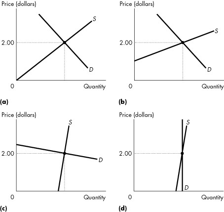

# **Chapter 6 Government Actions in Markets**

## 6.1 A Housing Market with a Rent Ceiling

##### 1\) The time spent looking for someone with whom to do business is called

A\) elasticity of time.

B\) market time.

C\) search activity.

D\) opportunity time.

E\) development time.

---
---
Answer: C

---

 Diff: 1 Type: MC
 Topic: A Housing Market with a Rent Ceiling

*Use the figure below to answer the following questions.*

**Figure 6.1.1**

##### 2\) Consider the market for rental housing illustrated in Figure 6.1.1 when the demand curve is *D0*. The equilibrium in an unregulated market is

A\) 1,500 rooms rented at \$150 a month.

B\) 1,500 rooms rented at \$200 a month.

C\) 1,750 rooms rented at \$175 a month.

D\) 1,750 rooms rented at \$200 a month.

E\) 2,000 rooms rented at \$150 a month.

---
---
Answer: A

---

 Diff: 1 Type: MC
 Topic: A Housing Market with a Rent Ceiling

##### 3\) Refer to Figure 6.1.1. If the demand for rental housing increases and the demand curve shifts rightward from *D0* to *D1*, and the market is unregulated, the number of rooms rented is

A\) 1,500, and the rent rises to \$200 a month.

B\) 2,000, and the rent is at its initial level.

C\) 1,750, and the rent rises to \$175 a month.

D\) 2,000, and the rent rises to \$200 a month.

E\) 1,750, and the rent rises to \$200 a month.

---
---
Answer: C

---

 Diff: 1 Type: MC
 Topic: A Housing Market with a Rent Ceiling

##### 4\) Refer to Figure 6.1.1. If the demand for rental housing increases and the demand curve shifts rightward from *D0* to *D1*, and there is a strictly enforced rent ceiling of \$150 per room,

A\) the number of rooms rented will increase to 2,000.

B\) the number of rooms rented is 1,500.

C\) there is a housing shortage of 500 rooms.

D\) both B and C.

E\) the number of rooms rented decreases to 1,000.

---
---
Answer: D

---

 Diff: 2 Type: MC
 Topic: A Housing Market with a Rent Ceiling

##### 5\) Refer to Figure 6.1.1. Suppose the demand for rental housing is shown by demand curve *D1*, and there is a rent ceiling of \$150 per room. What is the highest rent that would be charged in a black market?

A\) \$150 a month

B\) \$175 a month

C\) \$200 a month

D\) \$100 a month

E\) cannot be determined from the graph, but we know it is greater than
\$200

---
---
Answer: C

---

 Diff: 3 Type: MC
 Topic: A Housing Market with a Rent Ceiling

##### 6\) Refer to Figure 6.1.1. Suppose the demand for rental housing is shown by demand curve *D*1, and there is a rent ceiling of \$150 per room. What is the highest amount that would be expended on search activity?

A\) \$200.

B\) \$150.

C\) \$100.

D\) \$50.

E\) \$0.

---
---
Answer: D

---

 Diff: 3 Type: MC
 Topic: A Housing Market with a Rent Ceiling

##### 7\) An illegal market in which the equilibrium price exceeds the price ceiling is

A\) a rental market.

B\) a capital market.

C\) a black market.

D\) an efficient market.

E\) a housing market.

---
---
Answer: C

---

 Diff: 1 Type: MC
 Topic: A Housing Market with a Rent Ceiling

##### 8\) If the government imposes a maximum rent for housing that is above the equilibrium price, then you predict that

A\) the law will have no effect in the market for housing.

B\) the law will generate a shortage of housing.

C\) the law will create a surplus of housing.

D\) the demand curve for housing shifts rightward.

E\) the supply curve of housing shifts leftward.

---
---
Answer: A

---

 Diff: 2 Type: MC
 Topic: A Housing Market with a Rent Ceiling

##### 9\) When a price ceiling is set below the equilibrium price,

A\) the demand curve shifts leftward.

B\) the quantity supplied exceeds the quantity demanded.

C\) the quantity supplied equals the quantity demanded.

D\) the supply curve shifts rightward.

E\) the quantity demanded exceeds the quantity supplied.

---
---
Answer: E

---

 Diff: 2 Type: MC
 Topic: A Housing Market with a Rent Ceiling

*\ Use the figure below to answer the following questions.*

**Figure 6.1.2**

##### 10\) Refer to Figure 6.1.2. If a rigorously enforced price ceiling is set at \$10, then

A\) 100 units will be sold at a price of \$20 each.

B\) 100 units will be sold at a price of \$15 each.

C\) 150 units will be sold at a price of \$15 each.

D\) 200 units will be sold at a price of \$10 each.

E\) 100 units will be sold at a price of \$10 each.

---
---
Answer: E

---

 Diff: 2 Type: MC
 Topic: A Housing Market with a Rent Ceiling

##### 11\) Refer to Figure 6.1.2. What would be the maximum black market price of the good if a price ceiling is set at \$10 a unit?

A\) \$10

B\) \$15

C\) \$20

D\) 50 goods sold at \$10 and 50 goods sold at \$20

E\) 50 goods sold at \$10 and 50 goods sold at \$15

---
---
Answer: C

---

 Diff: 3 Type: MC
 Topic: A Housing Market with a Rent Ceiling

##### 12\) Which one of the following is *not* likely to be an outcome of a rent ceiling?

A\) a black market for rent-controlled housing

B\) long waiting lists of potential renters for rent-controlled housing

C\) a short-run shortage of housing

D\) a black market price below the rent ceiling

E\) increased search activity for rent-controlled housing

---
---
Answer: D

---

 Diff: 2 Type: MC
 Topic: A Housing Market with a Rent Ceiling
 Source: Study Guide

##### 13\) If a rent ceiling imposed by the government is greater than the equilibrium rent for housing, then

A\) the supply of rental housing will increase.

B\) a shortage of housing will occur.

C\) a surplus of housing will occur.

D\) the equilibrium rent will prevail as long as all else remains constant.

E\) the equilibrium rent will rise.

---
---
Answer: D

---

 Diff: 2 Type: MC
 Topic: A Housing Market with a Rent Ceiling

##### 14\) Which one of the following is likely to be the outcome of a rent ceiling imposed below the equilibrium rent?

A\) a black market for rent-controlled housing

B\) long waiting lists of potential suppliers for rent-controlled housing

C\) a surplus of housing

D\) no search activity

E\) Both A and B are correct.

---
---
Answer: E

---

 Diff: 2 Type: MC
 Topic: A Housing Market with a Rent Ceiling

##### 15\) A price ceiling set below the equilibrium price will result in

A\) excess supply.

B\) excess demand.

C\) the equilibrium price.

D\) an increase in supply.

E\) a decrease in demand.

---
---
Answer: B

---

 Diff: 1 Type: MC
 Topic: A Housing Market with a Rent Ceiling
 Source: Study Guide

##### 16\) Daisy and Donald live in a community with rent ceilings. Both are looking for an apartment to rent. Daisy has a job paying \$10 per hour and Donald has a job paying \$8 per hour. Both value an apartment equally. What is the most likely outcome?

A\) Daisy will spend more time than Donald searching for an apartment.

B\) Donald will spend more time than Daisy searching for an apartment.

C\) Both of them will spend the same amount of time searching for an apartment.

D\) Daisy will find the apartment.

E\) Donald will find the apartment.

---
---
Answer: B

---

 Diff: 2 Type: MC
 Topic: A Housing Market with a Rent Ceiling

##### 17\) In an unregulated housing market with no rent ceiling, the rent is determined by the

A\) landlords only.

B\) tenants only.

C\) government only.

D\) market.

E\) landlords, tenants, and the government.

---
---
Answer: D

---

 Diff: 2 Type: MC
 Topic: A Housing Market with a Rent Ceiling

##### 18\) An effective rent ceiling

A\) increases consumer surplus.

B\) increases producer surplus.

C\) creates a deadweight loss.

D\) decreases the supply of housing.

E\) increases the supply of housing.

---
---
Answer: C

---

 Diff: 3 Type: MC
 Topic: A Housing Market with a Rent Ceiling

##### 19\) In an unregulated housing market with no rent ceiling,

A\) scarce housing resources are allocated inefficiently.

B\) scarce housing resources are allocated efficiently.

C\) tenants pay a lower rent compared to what they pay in a market with an effective rent ceiling.

D\) landlords receive less compared to what they receive in a market with an effective rent ceiling.

E\) consumer surplus equals producer surplus.

---
---
Answer: B

---

 Diff: 2 Type: MC
 Topic: A Housing Market with a Rent Ceiling

##### 20\) In an unregulated housing market, with no rent ceiling,

A\) marginal social cost is greater than marginal social benefit.

B\) marginal social benefit is greater than marginal social cost.

C\) marginal social benefit equals marginal social cost.

D\) marginal social benefit is negative.

E\) marginal social cost is negative.

---
---
Answer: C

---

 Diff: 2 Type: MC
 Topic: A Housing Market with a Rent Ceiling

##### 21\) According to the *fair result* view of fairness, a fair outcome in the housing market

A\) is the one that blocks voluntary exchange of housing.

B\) cannot be created in the housing industry.

C\) is one that allocates scarce housing resources to those who are willing and able to pay.

D\) is one that allocates scarce housing resources by lottery.

E\) is one that allocates scarce housing resources to the poorest.

---
---
Answer: E

---

 Diff: 3 Type: MC
 Topic: A Housing Market with a Rent Ceiling

##### 22\) According to the *fair rules* view of fairness, a fair outcome in the housing market

A\) is one that does not block voluntary exchanges of housing.

B\) cannot be created in housing industry.

C\) is one that allocates scarce housing resources to those who are willing and able to pay.

D\) is one that allocates scarce housing resources by lottery.

E\) is one that allocates scarce housing resources to the poorest.

---
---
Answer: A

---

 Diff: 3 Type: MC
 Topic: A Housing Market with a Rent Ceiling

##### 23\) When rent is not permitted to allocate scarce housing, what other mechanisms are available?

A\) a lottery

B\) first-come, first-served

C\) discrimination

D\) both A and B are correct

E\) A, B and C are correct

---
---
Answer: E

---

 Diff: 1 Type: MC
 Topic: A Housing Market with a Rent Ceiling

##### 24\) A lottery allocates housing to those

A\) who are poor.

B\) who share similar views to the owner of the housing.

C\) who are rich.

D\) whose names are on waiting lists.

E\) who are lucky.

---
---
Answer: E

---

 Diff: 1 Type: MC
 Topic: A Housing Market with a Rent Ceiling

##### 25\) First-come, first-served allocates housing to those

A\) whose names are on waiting lists.

B\) who share similar views to the owner of the housing.

C\) who are rich.

D\) who are poor.

E\) who are lucky.

---
---
Answer: A

---

 Diff: 1 Type: MC
 Topic: A Housing Market with a Rent Ceiling

##### 26\) Discrimination allocates scarce housing

A\) to those who are poor.

B\) based on the self-interest of landlords.

C\) to those who are lucky.

D\) to those whose names are on waiting lists.

E\) to those who are willing and able to pay.

---
---
Answer: B

---

 Diff: 1 Type: MC
 Topic: A Housing Market with a Rent Ceiling

##### 27\) Suppose the government introduces a ceiling on the fees that lawyers are permitted to charge. If the fee ceiling is set \_\_\_\_\_\_\_\_ the equilibrium wage rate, the amount of work done by lawyers
\_\_\_\_\_\_\_\_, the consumer surplus of people who hire lawyers
\_\_\_\_\_\_\_\_, and the producer surplus of law firms
\_\_\_\_\_\_\_\_.

A\) below; increases; increases; increases

B\) above; decreases; decreases; decreases

C\) below; decreases; decreases; decreases

D\) above; increases; increases; increases

E\) below; decreases; increases; decreases

---
---
Answer: C

---

 Type: MC
 Topic: A Housing Market with a Rent Ceiling
 Source: MyEconLab

##### 28\) Suppose the government introduces a ceiling on the fees that lawyers are permitted to charge. This fee ceiling

A\) is always inefficient.

B\) results in an inefficient use of resources when the ceiling is above the equilibrium fee.

C\) results in an efficient use of resources when the ceiling is above the equilibrium fee.

D\) results in an efficient use of resources when the ceiling is below the equilibrium fee.

E\) is always efficient.

---
---
Answer: C

---

 Type: MC
 Topic: A Housing Market with a Rent Ceiling
 Source: MyEconLab

##### 29\) An effective rent ceiling

A\) increases producer surplus.

B\) results in a producer surplus of zero.

C\) sometimes increases producer surplus and sometimes decreases producer surplus.

D\) decreases producer surplus.

E\) decreases the supply of housing.

---
---
Answer: D

---

 Type: MC

##### 30\) A rent ceiling

A\) results in a shortage of housing if the rent ceiling is below the equilibrium rent.

B\) results in a surplus of housing if the rent ceiling is above the equilibrium rent.

C\) always results in a shortage of housing.

D\) always results in a surplus of housing.

E\) Both A and B are correct.

---
---
Answer: A

---

 Type: MC

## 6.2 A Labour Market with a Minimum Wage

*Use the figure below to answer the following questions.*

**Figure 6.2.1**

##### 1\) Refer to Figure 6.2.1. What is the equilibrium wage rate per hour in an unregulated market?

A\) \$2

B\) \$3

C\) \$4

D\) \$5

E\) \$30

---
---
Answer: C

---

 Diff: 1 Type: MC
 Topic: A Labour Market with a Minimum Wage

##### 2\) Refer to Figure 6.2.1. Suppose a \$5 per hour minimum wage is in force. What is the lowest wage per hour an unemployed person would be willing to accept?

A\) \$2

B\) \$3

C\) \$4

D\) \$5

E\) \$1

---
---
Answer: B

---

 Diff: 2 Type: MC
 Topic: A Labour Market with a Minimum Wage

##### 3\) Refer to Figure 6.2.1. If the minimum wage is set at \$2 per hour, what is the level of unemployment in millions of hours?

A\) 50

B\) 40

C\) 20

D\) 10

E\) 0

---
---
Answer: E

---

 Diff: 2 Type: MC
 Topic: A Labour Market with a Minimum Wage
 Source: Study Guide

##### 4\) Refer to Figure 6.2.1. If the minimum wage is set at \$6 per hour, what is the level of unemployment in millions of hours?

A\) 50

B\) 40

C\) 20

D\) 10

E\) 0

---
---
Answer: B

---

 Diff: 2 Type: MC
 Topic: A Labour Market with a Minimum Wage
 Source: Study Guide

##### 5\) Suppose a minimum wage of \$4 an hour is in force, resulting in unemployment of 10 million hours. Then the demand for labour increases such that supply and demand intersect at a wage rate of \$5 per hour. What will happen to the equilibrium wage rate and employment?

A\) The wage rate is \$5 an hour and there will be no unemployment.

B\) The wage rate is \$5 an hour and there will be a surplus of labour.

C\) The wage rate is \$4 an hour and there will be a surplus of labour.

D\) The wage rate is \$4 an hour and there will be no unemployment.

E\) The wage rate is \$4 an hour and there will be unemployment.

---
---
Answer: A

---

 Diff: 1 Type: MC
 Topic: A Labour Market with a Minimum Wage

*\ Use the table below to answer the following questions.*

**Table 6.2.1** [ ]{.underline}

##### 6\) Table 6.2.1 gives the supply and demand schedules for teenage labour in Genoa City. In an unregulated market,

A\) there is no teenage unemployment and the wage rate is \$6 per hour.

B\) there is no teenage unemployment and the wage rate is \$5 per hour.

C\) teenage unemployment is 400 hours and the wage rate is \$6 per hour.

D\) teenage unemployment is 400 hours and the wage rate is \$5 per hour.

E\) the minimum wage is \$7 per hour.

---
---
Answer: B

---

 Diff: 2 Type: MC
 Topic: A Labour Market with a Minimum Wage

##### 7\) Table 6.2.1 gives the supply and demand schedules for teenage labour in Genoa City. Suppose the Genoa City Council sets a minimum wage of \$6 per hour. Teenage unemployment is

A\) 800 hours.

B\) 600 hours.

C\) 400 hours.

D\) 200 hours.

E\) zero hours.

---
---
Answer: C

---

 Diff: 2 Type: MC
 Topic: A Labour Market with a Minimum Wage

##### 8\) Table 6.2.1 gives the supply and demand schedules for teenage labour in Genoa City. Suppose the Genoa City Council sets a minimum wage of \$4 per hour. Teenage unemployment is

A\) 800 hours.

B\) 600 hours.

C\) 400 hours.

D\) 200 hours.

E\) zero hours.

---
---
Answer: E

---

 Diff: 2 Type: MC
 Topic: A Labour Market with a Minimum Wage

##### 9\) Table 6.2.1 gives the supply and demand schedules for teenage labour in Genoa City. There is a minimum wage set at \$6 per hour. Suppose a new fast food restaurant opens and increases the quantity demanded of teenage labour by 400 hours per week at each wage rate. The result is

A\) elimination of teenage unemployment and a wage rate of \$7 per hour.

B\) elimination of teenage unemployment, but the wage rate remains at \$6 per hour.

C\) some teenage unemployment with the wage rate remaining at \$6 per hour.

D\) no change in teenage unemployment because the wage rate rises to \$7 per hour.

E\) none of the above.

---
---
Answer: B

---

 Diff: 2 Type: MC
 Topic: A Labour Market with a Minimum Wage

##### 10\) Table 6.2.1 gives the supply and demand schedules for teenage labour in Genoa City. Suppose a new fast food restaurant opens and increases the quantity demanded of teenage labour by 400 hours per week at each wage rate. If the teenage labour market is unregulated, there is an increase in teenage employment to

A\) 1,000 hours per week and a wage of \$5 per hour.

B\) 1,000 hours per week and a wage of \$7 per hour.

C\) 800 hours per week and a wage of \$6 per hour.

D\) 600 hours per week and a wage of \$7 per hour.

E\) 400 hours per week and a wage of \$7 per hour.

---
---
Answer: C

---

 Diff: 2 Type: MC
 Topic: A Labour Market with a Minimum Wage

##### 11\) Which one of the following statements is *false*?

A\) An effective minimum wage sets the wage rate above the equilibrium wage rate.

B\) An effective rent ceiling sets the rent below the equilibrium rent.

C\) An effective rent ceiling leads to a housing shortage.

D\) An effective minimum wage is inefficient.

E\) A minimum wage is a price ceiling in the labour market.

---
---
Answer: E

---

 Diff: 2 Type: MC
 Topic: A Labour Market with a Minimum Wage

*\ Use the table below to answer the following questions.*

**Table 6.2.2**

##### 12\) Refer to Table 6.2.2. What is the level of unemployment in millions of hours if the minimum wage is set at \$3 per hour?

A\) 70

B\) 40

C\) 30

D\) 20

E\) zero

---
---
Answer: E

---

 Diff: 2 Type: MC
 Topic: A Labour Market with a Minimum Wage

##### 13\) Refer to Table 6.2.2. What is the level of unemployment in millions of hours if the minimum wage is set at \$7 per hour?

A\) 40

B\) 30

C\) 20

D\) 10

E\) zero

---
---
Answer: B

---

 Diff: 2 Type: MC
 Topic: A Labour Market with a Minimum Wage

##### 14\) Refer to Table 6.2.2. What is the equilibrium wage rate in an unregulated market?

A\) \$5.00 per hour

B\) \$5.50 per hour

C\) \$6.00 per hour

D\) \$6.50 per hour

E\) \$7.50 per hour

---
---
Answer: B

---

 Diff: 2 Type: MC
 Topic: A Labour Market with a Minimum Wage

##### 15\) Suppose the minimum wage is \$4 per hour, and 1,100 units of labour are hired. Then the government raises the minimum wage to \$6 per hour, and 900 units are now hired. Choose the correct statement.

A\) Total wages paid to workers has fallen.

B\) The price elasticity of demand for labour is 0.5.

C\) There is unemployment in this labour market.

D\) The quantity of labour supplied is greater at the higher minimum wage.

E\) all of the above except A

---
---
Answer: E

---

 Diff: 3 Type: MC
 Topic: A Labour Market with a Minimum Wage

##### 16\) Complete the following sentence. A price floor set below the equilibrium price results in

A\) a surplus.

B\) a shortage.

C\) the equilibrium price.

D\) an increase in supply.

E\) a decrease in demand.

---
---
Answer: C

---

 Diff: 2 Type: MC
 Topic: A Labour Market with a Minimum Wage

##### 17\) When a minimum wage is set above the equilibrium wage rate,

A\) unemployment decreases.

B\) job search activity decreases.

C\) the supply of workers decreases.

D\) unemployment increases.

E\) the supply of workers increases.

---
---
Answer: D

---

 Type: MC
 Topic: A Labour Market with a Minimum Wage
 Source: MyEconLab

##### 18\) The government sets a price floor for corn, which is above the equilibrium price of corn. As a result

A\) the market for corn is efficient.

B\) a shortage of corn occurs.

C\) consumer surplus is maximized.

D\) a deadweight loss is created.

E\) B, C, and D are correct.

---
---
Answer: D

---

 Type: MC

##### 19\) Suppose the equilibrium wage is \$10 an hour. A minimum wage is a price \_\_\_\_\_\_\_\_ and that will change the quantity of employment if it is set at \_\_\_\_\_\_\_\_ an hour.

A\) floor; \$12

B\) ceiling; \$12

C\) floor; \$8

D\) ceiling; \$8

E\) floor; \$10

---
---
Answer: A

---

 Type: MC

## 6.3 Taxes

##### 1\) Suppose the demand for gasoline is inelastic, but not perfectly inelastic, and the supply is elastic, but not perfectly elastic. A tax on gasoline is paid

A\) mostly by buyers.

B\) mostly by sellers.

C\) equally by buyers and sellers.

D\) totally by buyers.

E\) totally by sellers.

---
---
Answer: A

---

 Diff: 3 Type: MC
 Topic: Taxes

##### 2\) Suppose the demand for CDs is elastic, but not perfectly elastic, and the supply is inelastic, but not perfectly inelastic. A tax on CDs is paid

A\) equally by buyers and sellers.

B\) mostly by sellers.

C\) mostly by buyers.

D\) by neither buyers nor sellers.

E\) totally by sellers.

---
---
Answer: B

---

 Diff: 3 Type: MC
 Topic: Taxes

*\ Use the figure below to answer the following questions.*

**Figure 6.3.1**

##### 3\) Refer to Figure 6.3.1 showing the market for frisbees before and after a tax is imposed. The tax on each frisbee is

A\) \$0.40.

B\) \$0.60.

C\) \$1.00.

D\) \$5.60.

E\) \$6.60.

---
---
Answer: C

---

 Diff: 2 Type: MC
 Topic: Taxes
 Source: Study Guide

##### 4\) Refer to Figure 6.3.1 showing the market for frisbees before and after a tax is imposed. On each frisbee, the sellers\' share of the tax is

A\) \$0.40.

B\) \$0.60.

C\) \$1.00.

D\) \$5.60.

E\) \$6.60.

---
---
Answer: A

---

 Diff: 3 Type: MC
 Topic: Taxes
 Source: Study Guide

##### 5\) Refer to Figure 6.3.1 showing the market for frisbees before and after a tax is imposed. On each frisbee, the buyers\' share of the tax is

A\) \$0.40.

B\) \$0.60.

C\) \$1.00.

D\) \$5.60.

E\) \$6.60.

---
---
Answer: B

---

 Diff: 3 Type: MC
 Topic: Taxes
 Source: Study Guide

##### 6\) Refer to Figure 6.3.1 showing the market for frisbees before and after a tax is imposed. Government revenue from the tax is

A\) \$4,000.

B\) \$5,000.

C\) \$22,400.

D\) \$26,400.

E\) \$30,000.

---
---
Answer: A

---

 Diff: 2 Type: MC
 Topic: Taxes
 Source: Study Guide

##### 7\) Refer to Figure 6.3.1 showing the market for frisbees before and after a tax is imposed. We can determine that between 4,000 and 5,000 frisbees, supply is

A\) inelastic.

B\) unit elastic.

C\) elastic.

D\) perfectly elastic.

E\) perfectly inelastic.

---
---
Answer: C

---

 Diff: 2 Type: MC
 Topic: Taxes

##### 8\) If the price of a good is not affected by a tax, then

A\) supply is perfectly elastic.

B\) demand is perfectly elastic.

C\) the elasticity of supply is greater than elasticity of demand.

D\) demand is unit elastic.

E\) supply is unit elastic.

---
---
Answer: B

---

 Diff: 3 Type: MC
 Topic: Taxes
 Source: Study Guide

##### 9\) The burden of the tax on buyers is greater the more

\(1) elastic is demand

\(2) inelastic is demand

\(3) elastic is supply

\(4) inelastic is supply

A\) (2) only

B\) (1) and (3)

C\) (1) and (4)

D\) (2) and (3)

E\) (2) and (4)

---
---
Answer: D

---

 Diff: 3 Type: MC
 Topic: Taxes

##### 10\) The burden of tax on sellers is greater the more

\(1) elastic is demand

\(2) inelastic is demand

\(3) elastic is supply

\(4) inelastic is supply

A\) (2) only

B\) (1) and (3)

C\) (1) and (4)

D\) (2) and (3)

E\) (2) and (4)

---
---
Answer: C

---

 Diff: 3 Type: MC
 Topic: Taxes

##### 11\) Suppose your province raises the provincial sales tax by 1 percent. You predict that the prices of taxed goods (including the tax) will

A\) rise by 1 percent.

B\) rise by more than 1 percent.

C\) rise by an amount between zero and 1 percent.

D\) not change at all.

E\) fall by an amount between zero and 1 percent.

---
---
Answer: C

---

 Diff: 2 Type: MC
 Topic: Taxes

*Use the figure below to answer the following questions.*

**Figure 6.3.2**

##### 12\) Refer to Figure 6.3.2. The amount of the tax per unit is

A\) zero.

B\) \$0.50.

C\) \$1.00.

D\) \$1.50.

E\) \$2.00.

---
---
Answer: E

---

 Diff: 2 Type: MC
 Topic: Taxes

##### 13\) Refer to Figure 6.3.2. The buyers\' share of the tax is

A\) zero.

B\) \$0.50.

C\) \$1.00.

D\) \$1.50.

E\) \$2.00.

---
---
Answer: B

---

 Diff: 3 Type: MC
 Topic: Taxes

##### 14\) Refer to Figure 6.3.2. The seller\'s share of the tax is

A\) zero.

B\) \$0.50.

C\) \$1.00.

D\) \$1.50.

E\) \$2.00.

---
---
Answer: D

---

 Diff: 3 Type: MC
 Topic: Taxes

##### 15\) Refer to Figure 6.3.2. Government revenue from the tax is

A\) zero.

B\) \$100.

C\) \$300.

D\) \$400.

E\) \$600.

---
---
Answer: D

---

 Diff: 2 Type: MC
 Topic: Taxes

##### 16\) Refer to Figure 6.3.2. The deadweight loss from the sales tax is

A\) \$50.

B\) \$100.

C\) \$200.

D\) \$1,000.

E\) \$150.

---
---
Answer: B

---

 Diff: 3 Type: MC
 Topic: Taxes

##### 17\) Refer to Figure 6.3.2. Between 200 and 300 units, demand is

A\) inelastic.

B\) unit elastic.

C\) elastic.

D\) perfectly inelastic.

E\) perfectly elastic.

---
---
Answer: C

---

 Diff: 2 Type: MC
 Topic: Taxes

##### 18\) The seller pays most of a tax if demand is relatively elastic because

A\) the buyer can easily substitute to other markets.

B\) the seller can easily substitute to other markets.

C\) the government forces the seller to bear the burden of the tax.

D\) there is a black market for this good.

E\) the seller cannot easily substitute to other goods.

---
---
Answer: A

---

 Diff: 2 Type: MC
 Topic: Taxes

##### 19\) The buyer pays most of a tax if demand is relatively inelastic because

A\) the buyer cannot easily substitute to other markets.

B\) the buyer can easily substitute to other markets.

C\) the government forces the seller to bear the burden of the tax.

D\) there is a black market for this good.

E\) the seller cannot easily substitute to other goods.

---
---
Answer: A

---

 Diff: 2 Type: MC
 Topic: Taxes

##### 20\) The buyer pays most of a tax if supply is relatively elastic because

A\) the buyer cannot easily substitute to other markets.

B\) the seller can easily substitute to other markets.

C\) the government forces the seller to bear the burden.

D\) there is a black market for this good.

E\) the seller cannot easily substitute to other goods.

---
---
Answer: B

---

 Diff: 2 Type: MC
 Topic: Taxes

##### 21\) If a sales tax is imposed on food, who is likely to pay most of the tax?

A\) mostly the buyer

B\) mostly the seller

C\) neither the seller nor the buyer

D\) the buyer and the seller equally

E\) the burden of the tax depends on the size of the tax

---
---
Answer: A

---

 Diff: 3 Type: MC
 Topic: Taxes

*\ Use the figure below to answer the following questions.*

**Figure 6.3.3**

##### 22\) Refer to Figure 6.3.3. Suppose a tax of \$1 is imposed. In which market would the seller pay the highest portion of the tax?

A\) (a)

B\) (b)

C\) (c)

D\) (d)

E\) all markets equally

---
---
Answer: C

---

 Diff: 3 Type: MC
 Topic: Taxes

##### 23\) Refer to Figure 6.3.3. Suppose a tax of \$1 is imposed. In which market would the buyer pay the highest portion of the tax?

A\) (a)

B\) (b)

C\) (c)

D\) (d)

E\) all markets equally

---
---
Answer: D

---

 Diff: 3 Type: MC
 Topic: Taxes

##### 24\) Refer to Figure 6.3.3. Suppose a tax of \$1 is imposed. In which market would tax revenue be the lowest?

A\) (a)

B\) (b)

C\) (c)

D\) (d)

E\) all markets equally

---
---
Answer: C

---

 Diff: 3 Type: MC
 Topic: Taxes

##### 25\) Refer to Figure 6.3.3. Suppose a tax of \$1 is imposed. In which market would tax revenue be the highest?

A\) (a)

B\) (b)

C\) (c)

D\) (d)

E\) all markets equally

---
---
Answer: D

---

 Diff: 3 Type: MC
 Topic: Taxes

##### 26\) Governments tend to tax items with inelastic demand because

A\) governments wish to avoid big rises in after-tax prices.

B\) sellers pay most of the tax in these cases.

C\) buyers pay most of the tax in these cases.

D\) these goods yield the most tax revenues.

E\) none of the above.

---
---
Answer: D

---

 Diff: 2 Type: MC
 Topic: Taxes

##### 27\) If the supply of a good is perfectly elastic, then a tax on the good will be paid

A\) completely by the buyers.

B\) completely by the sellers.

C\) equally by the buyers and sellers.

D\) mostly but not completely by the buyers.

E\) mostly but not completely by the sellers.

---
---
Answer: A

---

 Diff: 2 Type: MC
 Topic: Taxes

##### 28\) If the supply of a good is perfectly inelastic, then a tax on the good will be paid

A\) completely by the buyers.

B\) completely by the sellers.

C\) equally by the buyers and sellers.

D\) mostly but not completely by the buyers.

E\) mostly but not completely by the sellers.

---
---
Answer: B

---

 Diff: 2 Type: MC
 Topic: Taxes

##### 29\) If the demand for a good is perfectly elastic, then a tax on the good will be paid

A\) completely by the buyers.

B\) completely by the sellers.

C\) equally by the buyers and sellers.

D\) mostly but not completely by the buyers.

E\) mostly but not completely by the sellers.

---
---
Answer: B

---

 Diff: 2 Type: MC
 Topic: Taxes

##### 30\) If the demand for a good is perfectly inelastic, then a tax on the good will be paid

A\) completely by the buyers.

B\) completely by the sellers.

C\) equally by the buyers and sellers.

D\) mostly but not completely by the buyers.

E\) mostly but not completely by the sellers.

---
---
Answer: A

---

 Diff: 2 Type: MC
 Topic: Taxes

##### 31\) A \$10 per-unit tax on MP3 players raises the equilibrium price paid by consumers by \$5. The quantity sold before the tax was 5,000 per year. The revenue from the tax is

A\) zero.

B\) positive but less than \$50,000 per year.

C\) \$50,000 per year.

D\) more than \$50,000 per year.

E\) greater the more elastic is demand.

---
---
Answer: B

---

 Diff: 3 Type: MC
 Topic: Taxes

##### 32\) A 3 cents per-unit tax on bread leads to no change in the quantity bought and sold. The tax is paid

A\) completely by the sellers.

B\) completely by the buyers.

C\) equally by the buyers and sellers.

D\) mostly but not completely by the buyers.

E\) completely by either the sellers or the buyers; we cannot tell without more information.

---
---
Answer: E

---

 Diff: 3 Type: MC
 Topic: Taxes

*Use the table below to answer the following questions.*

**Table 6.3.1**

##### 33\) Refer to Table 6.3.1. Suppose a sales tax of \$2 a unit is imposed on the good described in the table. The new price paid by consumers is
\$ \_\_\_\_\_\_\_\_ and \_\_\_\_\_\_\_\_ units are sold.

A\) \$6; 400

B\) \$7; 700

C\) \$7; 500

D\) \$6.50; 500

E\) \$6.50; 700

---
---
Answer: C

---

 Diff: 3 Type: MC
 Topic: Taxes

##### 34\) Refer to Table 6.3.1. Suppose a sales tax of \$2 a unit is imposed on the good described in the table. The buyers\' share of the tax is

A\) \$2.00.

B\) \$1.50.

C\) \$1.00.

D\) zero.

E\) \$2.50.

---
---
Answer: C

---

 Diff: 3 Type: MC
 Topic: Taxes

##### 35\) Refer to Table 6.3.1. Suppose a sales tax of \$2 a unit is imposed on the good described in the table. The sellers\' share of the tax is

A\) \$2.00.

B\) \$1.50.

C\) \$1.00.

D\) \$0.

E\) \$2.50.

---
---
Answer: C

---

 Diff: 3 Type: MC
 Topic: Taxes

##### 36\) Refer to Table 6.3.1. Suppose a sales tax of \$2 a unit is imposed on the good described in the table. Government revenue from the tax is

A\) \$1,200.

B\) \$1,000.

C\) \$800.

D\) \$600.

E\) zero.

---
---
Answer: B

---

 Diff: 3 Type: MC
 Topic: Taxes

##### 37\) The \_\_\_\_\_\_\_\_ principle is the proposition that people should pay taxes equal to the benefits they receive from the services provided by government.
 The \_\_\_\_\_\_\_\_ principle is the proposition that people should pay taxes according to how easily they can bear the burden of the tax.

A\) benefits; ability-to-pay

B\) equality; fairness

C\) services; burden

D\) ability-to-pay; benefits

E\) efficient; inefficient

---
---
Answer: A

---

 Type: MC
 Topic: Taxes
 Source: MyEconLab

##### 38\) When a sales tax is imposed on sellers, the supply curve shifts so that the vertical distance between the original supply curve and supply plus tax curve equals the

A\) sales tax multiplied by the price elasticity of demand.

B\) sales tax multiplied by the price elasticity of supply.

C\) sales tax divided by the price elasticity of demand.

D\) amount of the sales tax per unit.

E\) sales tax divided by the price elasticity of supply.

---
---
Answer: D

---

 Type: MC

##### 39\) The demand for a good and the supply of a good are each neither perfectly elastic nor perfectly inelastic. If a sales tax on sellers of the good is imposed, the tax is paid by

A\) the buyers only.

B\) both the buyers and the sellers.

C\) the sellers only.

D\) the buyers only if demand for the good increases.

E\) the suppliers only if the supply of the good increases.

---
---
Answer: B

---

 Type: MC

## 6.4 Production Quotas and Subsidies

##### 1\) A subsidy is a

A\) tax imposed by the government on imported goods.

B\) payment made by the government to a producer.

C\) tax imposed by the government on a producer.

D\) payment made by a consumer to a producer.

E\) payment made by foreign governments to domestic farmers.

---
---
Answer: B

---

 Diff: 2 Type: MC
 Topic: Production Quotas and Subsidies

##### 2\) A subsidy

A\) lowers the price received by farmers.

B\) decreases the quantity supplied in the market.

C\) raises the price received by farmers.

D\) prevents the deadweight loss from underproduction.

E\) decreases total revenue received by farmers.

---
---
Answer: C

---

 Diff: 2 Type: MC
 Topic: Production Quotas and Subsidies

##### 3\) A subsidy

A\) raises marginal social benefit above marginal social cost.

B\) makes marginal social cost equal marginal social benefit.

C\) results in efficient production.

D\) raises marginal social cost above marginal social benefit.

E\) makes world prices higher than domestic prices.

---
---
Answer: D

---

 Diff: 2 Type: MC
 Topic: Production Quotas and Subsidies

##### 4\) A production quota

A\) is a lower limit to the quantity of a good that can be produced in a specified period.

B\) is an upper limit to the quantity of a good that can be produced in a specified period.

C\) is a payment made by a consumer to a producer.

D\) is a payment made by a producer to a consumer.

E\) is a payment made by the government to a producer.

---
---
Answer: B

---

 Diff: 2 Type: MC
 Topic: Production Quotas and Subsidies

##### 5\) Suppose the Canadian Dairy Commission sets a production quota for dairy production above the equilibrium quantity. Then,

A\) the policy will increase the quantity of milk produced in Canada.

B\) the policy will raise the price of milk in the international market.

C\) the policy will have no impact on the dairy industry.

D\) the policy will increase revenue received by dairy producers.

E\) the policy will decrease revenue received by dairy producers.

---
---
Answer: C

---

 Diff: 2 Type: MC
 Topic: Production Quotas and Subsidies

##### 6\) A production quota

A\) increases the marginal social cost of production.

B\) lowers the price and increases the marginal social cost of production.

C\) increases demand for the good.

D\) raises the price and decreases the marginal social cost of production.

E\) makes production more efficient.

---
---
Answer: D

---

 Diff: 2 Type: MC
 Topic: Production Quotas and Subsidies

##### 7\) An effective production quota

A\) is efficient because it results in overproduction.

B\) is efficient because it results in underproduction.

C\) is inefficient because it results in underproduction.

D\) is inefficient because it results in overproduction.

E\) is efficient for quantities below the equilibrium quantity and is inefficient for quantities above the equilibrium quantity.

---
---
Answer: C

---

 Diff: 2 Type: MC
 Topic: Production Quotas and Subsidies

##### 8\) In a market with an effective production quota

A\) marginal social benefit exceeds marginal social cost.

B\) marginal social benefit equals marginal social cost.

C\) marginal social cost exceeds marginal social benefit.

D\) marginal social cost is greater than the equilibrium price.

E\) marginal social benefit is less than the equilibrium price.

---
---
Answer: A

---

 Diff: 2 Type: MC
 Topic: Production Quotas and Subsidies

##### 9\) When an effective production quota is applied in the market for wheat, the quantity produced \_\_\_\_\_\_\_\_ and the price
\_\_\_\_\_\_\_\_. The marginal social benefit \_\_\_\_\_\_\_\_ marginal social cost.

A\) increases; rises; exceeds

B\) decreases; falls; is less than

C\) decreases; rises; exceeds

D\) increases; falls; is less than

E\) decreases; rises; is less than

---
---
Answer: C

---

 Type: MC
 Topic: Production Quotas and Subsidies
 Source: MyEconLab

*Use the figure below to answer the following question.*

**Figure 6.4.1**

##### 10\) Refer to Figure 6.4.1. The graph shows the market for tomatoes. When the government introduces a subsidy for tomatoes at \$4 a kilogram, the quantity produced is \_\_\_\_\_\_\_\_ because \_\_\_\_\_\_\_\_.

A\) efficient; marginal social cost is less than marginal social benefit

B\) efficient; marginal social benefit equals marginal social cost

C\) inefficient; marginal social cost is less than marginal social benefit

D\) inefficient; marginal social benefit is less than marginal social cost

E\) inefficient; marginal social cost is zero

---
---
Answer: D

---

 Type: MC
 Topic: Production Quotas and Subsidies
 Source: MyEconLab

*\ Use the table below to answer the following question.*

**Table 6.4.1**

##### 11\) Refer to Table 6.4.1. The table shows the demand and supply schedules for rice. The market for rice is in equilibrium. With a subsidy of \$0.30 a box, the price of a box of rice is \_\_\_\_\_\_\_\_, the marginal cost of producing rice is \_\_\_\_\_\_\_\_ a box, and the quantity of rice produced is \_\_\_\_\_\_\_\_ boxes.

A\) \$1.40; \$1.40; 2,500

B\) \$1.20; \$1.50; 2,500

C\) \$1.20; \$1.50; 3,000

D\) \$1.50; \$1.20; 3,000

E\) \$1.50; \$1.20; 2,500

---
---
Answer: C

---

 Type: MC
 Topic: Production Quotas and Subsidies
 Source: MyEconLab

##### 12\) Refer to Table 6.4.1. The table shows the demand and supply schedules for rice. With a production quota of 2,000 boxes a week, the price of a box of rice is \_\_\_\_\_\_\_\_, the marginal cost of producing rice is \_\_\_\_\_\_\_\_ a box, and the quantity of rice produced is \_\_\_\_\_\_\_\_ boxes a week.

A\) \$1.30; \$1.60; 2,000

B\) \$1.60; \$1.30; 2,000

C\) \$1.40; \$1.40; 2,500

D\) \$1.40; \$1.40; 2,000

E\) \$1.60; \$1.30; 2,500

---
---
Answer: B

---

 Type: MC
 Topic: Production Quotas and Subsidies
 Source: MyEconLab

##### 13\) A production quota is set below the equilibrium quantity. At the quota quantity, marginal social benefit is \_\_\_\_\_\_\_\_ marginal social cost and the level of production is \_\_\_\_\_\_\_\_.

A\) less than; efficient

B\) greater than; efficient

C\) less than; efficient

D\) more than; inefficient

E\) equal to; efficient

---
---
Answer: D

---

 Type: MC

##### 14\) A production quota is set equal to the equilibrium quantity. At the quota quantity, marginal social benefit is \_\_\_\_\_\_\_\_ marginal social cost and the level of production is \_\_\_\_\_\_\_\_.

A\) less than; efficient

B\) greater than; efficient

C\) less than; efficient

D\) less than; inefficient

E\) equal to; efficient

---
---
Answer: E

---

 Type: MC

## 6.5 Markets for Illegal Goods

##### 1\) If enforcement is aimed at sellers of an illegal good, the

A\) price and quantity bought decrease.

B\) price and quantity bought increase.

C\) price rises and quantity bought decreases.

D\) price falls and quantity bought increases.

E\) price change is uncertain and quantity bought decreases.

---
---
Answer: C

---

 Diff: 3 Type: MC
 Topic: Markets for Illegal Goods
 Source: Study Guide

##### 2\) If enforcement is aimed at buyers of an illegal good, the

A\) price and quantity bought decrease.

B\) price and quantity bought increase.

C\) price rises and quantity bought decreases.

D\) price falls and quantity bought increases.

E\) price change is uncertain and quantity bought decreases.

---
---
Answer: A

---

 Diff: 3 Type: MC
 Topic: Markets for Illegal Goods

##### 3\) Which one of the following statements about illegal goods is *true*?

A\) Taxes are more effective in changing preferences than prohibition.

B\) Prohibition is more effective in generating revenue than an equivalent tax.

C\) Taxes and penalties cannot be set to yield equivalent outcomes.

D\) Taxes generate revenues while prohibition sends a signal that might influence preferences.

E\) none of the above

---
---
Answer: D

---

 Diff: 2 Type: MC
 Topic: Markets for Illegal Goods
 Source: Study Guide

##### 4\) Consider a market for an illegal good. If the government imposes the cost of breaking the law on the buyer of the good, then price will be

A\) higher and quantity lower compared to imposing the same cost on the seller.

B\) higher and quantity higher compared to imposing the same cost on the seller.

C\) lower and quantity lower compared to imposing the same cost on the seller.

D\) lower and quantity the same compared to imposing the same cost on the seller.

E\) higher and quantity the same compared to imposing the same cost on the seller.

---
---
Answer: D

---

 Diff: 3 Type: MC
 Topic: Markets for Illegal Goods

##### 5\) Suppose the cost of breaking the law is imposed on the buyers of an illegal good. This action will have its biggest impact on quantity if the demand for the good is

A\) inelastic or the supply is inelastic.

B\) elastic or the supply is elastic.

C\) elastic or the supply is inelastic.

D\) inelastic or the supply is elastic.

E\) perfectly inelastic.

---
---
Answer: B

---

 Diff: 3 Type: MC
 Topic: Markets for Illegal Goods

##### 6\) Suppose the cost of breaking the law is imposed on the sellers of an illegal good. This action will have its biggest impact on quantity if the demand for the good is

A\) inelastic or the supply is inelastic.

B\) elastic or the supply is elastic.

C\) elastic or the supply is inelastic.

D\) inelastic or the supply is elastic.

E\) perfectly inelastic.

---
---
Answer: B

---

 Diff: 3 Type: MC
 Topic: Markets for Illegal Goods

*Use the table below to answer the following questions.*

**Table 6.5.1**
 The Market for a Prohibited Good.

##### 7\) Refer to Table 6.5.1. Which one of the following costs of breaking the law imposed on the buyers of the good would reduce the quantity to zero?

A\) \$1

B\) \$2

C\) \$4

D\) \$6

E\) \$8

---
---
Answer: E

---

 Diff: 3 Type: MC
 Topic: Markets for Illegal Goods

##### 8\) Refer to Table 6.5.1. If a \$2-per-unit cost of breaking the law is imposed on buyers, the new price is \_\_\_\_\_\_\_\_ and the new equilibrium quantity is \_\_\_\_\_\_\_\_ units.

A\) \$8; 400

B\) \$8; 300

C\) \$7; 300

D\) \$9; 300

E\) \$8; 200

---
---
Answer: C

---

 Diff: 3 Type: MC
 Topic: Markets for Illegal Goods

##### 9\) Refer to Table 6.5.1. If a \$2-per-unit cost of breaking the law is imposed on sellers, the new price is \_\_\_\_\_\_\_\_ and the new equilibrium quantity is \_\_\_\_\_\_\_\_ units.

A\) \$8; 400

B\) \$8; 300

C\) \$7; 300

D\) \$9; 300

E\) \$8; 200

---
---
Answer: D

---

 Diff: 3 Type: MC
 Topic: Markets for Illegal Goods

##### 10\) Refer to Table 6.5.1. If a \$2-per-unit cost of breaking the law is imposed on sellers, the price received by sellers (net of the cost of breaking the law) would be

A\) \$8.

B\) \$7.

C\) \$9.

D\) \$10.

E\) \$6.

---
---
Answer: B

---

 Diff: 3 Type: MC
 Topic: Markets for Illegal Goods

##### 11\) Refer to Table 6.5.1. If a \$2-per-unit cost of breaking the law is imposed on both the buyers and the sellers, the new price is
\_\_\_\_\_\_\_\_ and the new equilibrium quantity is \_\_\_\_\_\_\_\_ units.

A\) \$8; 400

B\) \$8; 300

C\) \$7; 300

D\) \$9; 300

E\) \$8; 200

---
---
Answer: E

---

 Diff: 3 Type: MC
 Topic: Markets for Illegal Goods

##### 12\) If enforcement of the law is aimed at buyers of an illegal good, the result will be

A\) an increase in the supply of the good.

B\) a decrease in the supply of the good.

C\) a decrease in the demand for the good.

D\) a rise in the price of the good.

E\) no change in the equilibrium quantity.

---
---
Answer: C

---

 Diff: 2 Type: MC
 Topic: Markets for Illegal Goods

##### 13\) Provincial governments across Canada recently started legalizing and then heavily taxing gambling at casinos. The new taxes are lower than the cost of breaking the law was to the sellers of the previously illegal casino services. The costs of breaking the law to the buyers of these services also fell to zero. This change will likely lead to

A\) a rise in the equilibrium price, and a decrease in the equilibrium quantity.

B\) a rise in the equilibrium price, and an increase in the equilibrium quantity.

C\) a fall in the equilibrium price, and an increase in the equilibrium quantity.

D\) a fall in the equilibrium price, and a decrease in the equilibrium quantity.

E\) an unknown change in equilibrium price and equilibrium quantity.

---
---
Answer: B

---

 Diff: 3 Type: MC
 Topic: Markets for Illegal Goods

##### 14\) All of the following statements about legalizing and taxing drugs are true *except*

A\) legalizing and taxing drugs would eliminate the black market in drugs.

B\) the quantity of a drug bought could be decreased if the drug was legalized and taxed.

C\) a sufficiently high tax could be imposed to decrease supply, raise the price, and achieve the same decrease in the quantity bought as with a prohibition of drugs.

D\) an extremely high tax rate would be needed to cut the quantity of drugs bought to the level prevailing with a prohibition.

E\) tax revenue can be used to make law enforcement more effective.

---
---
Answer: A

---

 Type: MC
 Topic: Markets for Illegal Goods
 Source: MyEconLab

##### 15\) A fact that argues in favour of prohibition and against taxes on illegal drugs is that

A\) prohibition sends a signal that might influence preferences.

B\) penalties for illegal activities with prohibition are less than the penalties for tax evasion.

C\) a black market is easier to maintain under prohibition than under the tax code.

D\) search activity decreases with prohibition.

E\) all of the above.

---
---
Answer: A

---

 Type: MC
 Topic: Markets for Illegal Goods
 Source: MyEconLab

##### 16\) Suppose that buying and selling a certain good is made illegal. In the market for this good, the demand curve shifts \_\_\_\_\_\_\_\_ and the supply curve shifts \_\_\_\_\_\_\_\_.

A\) rightward; rightward

B\) leftward; leftward

C\) rightward; leftward

D\) leftward; rightward

E\) None of the above. Neither the demand curve nor the supply curve shift.

---
---
Answer: B

---

 Type: MC

##### 17\) If the penalty on sellers of an illegal good is less than the penalty on buyers of an illegal good, then supply of the good will
\_\_\_\_\_\_\_\_ by \_\_\_\_\_\_\_\_ demand and the price of the good will \_\_\_\_\_\_\_\_.

A\) decrease; more than; rise

B\) decrease; less than; rise

C\) decrease; less than; fall

D\) decrease; more than; fall

E\) increase; less than; rise

---
---
Answer: C

---

 Type: MC
