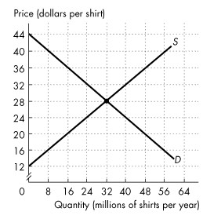
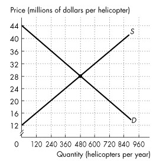
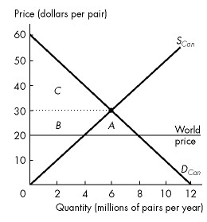
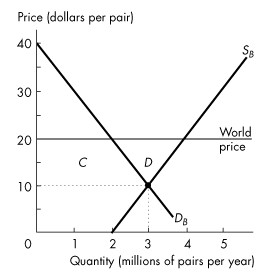
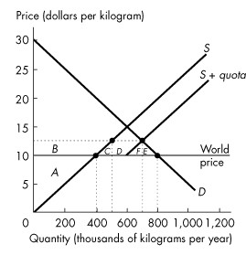

**Chapter 7 Global Markets in Action**

## 7.1 How Global Markets Work

1\) Goods and services that we buy from other countries are our

A\) balance of payments.

B\) exports.

C\) imports.

D\) terms of trade.

E\) comparative goods and services.

---
---
Answer: C

---

Type: MC

Topic: How Global Markets Work

Skill: Recognition

AACSB: Reflective Thinking

2\) The goods and services we sell to people in other countries are our

A\) tariffs.

B\) quotas.

C\) exports.

D\) imports.

E\) investment goods and services.

---
---
Answer: C

---

Type: MC

Topic: How Global Markets Work

Skill: Recognition

AACSB: Reflective Thinking

3\) The fundamental force that drives international trade is

A\) absolute advantage.

B\) importation duties.

C\) the advantage of execution.

D\) export advantage.

E\) comparative advantage.

---
---
Answer: E

---

Type: MC

Topic: How Global Markets Work

Skill: Recognition

AACSB: Reflective Thinking

4\) The fundamental force that drives international trade is

A\) comparative advantage.

B\) absolute advantage.

C\) a countries\' desire to increase their trade surplus.

D\) cheap labour in countries like China and India.

E\) unemployment of factors of production.

---
---
Answer: A

---

Diff: 2 Type: MC

Topic: How Global Markets Work

Skill: Recognition

AACSB: Reflective Thinking

5\) A country

A\) imports those goods in which it has a comparative advantage.

B\) exports those goods in which it has a comparative advantage.

C\) imports goods produced in countries with lower wage rates.

D\) exports goods produced by domestic industries with low wages relative
to its trading partners.

E\) B and D are correct.

---
---
Answer: B

---

Type: MC

Topic: How Global Markets Work

Skill: Conceptual

AACSB: Reflective Thinking

6\) Canada has a comparative advantage in producing airplanes if

A\) it can produce them at a lower dollar cost than another country.

B\) it can produce a larger quantity than another country.

C\) it has a larger quantity of skilled workers than another country.

D\) it can produce them at a higher opportunity cost than another
country.

E\) it can produce them at a lower opportunity cost than another country.

---
---
Answer: E

---

Type: MC

Topic: How Global Markets Work

Skill: Conceptual

AACSB: Reflective Thinking

7\) Prior to international trade, if the price of good *X* is lower in
country A than in country B,

A\) country B has an absolute advantage in the production of good *X*.

B\) country B has a comparative advantage in the production of good *X*.

C\) country A has an absolute advantage in the production of good *X*.

D\) country A has a comparative advantage in the production of good *X*.

E\) country B should stop producing good X.

---
---
Answer: D

---

Type: MC

Topic: How Global Markets Work

Skill: Conceptual

AACSB: Reflective Thinking

8\) Which of the following statements about Canada\'s international trade
in 2010 is correct?

A\) The value of Canada\'s imports exceeded the value of Canada\'s
exports.

B\) The value of Canada\'s exports was about 45 percent of the value of
total expenditure in Canada.

C\) Canada imported only goods.

D\) Canada was the world\'s second largest trader.

E\) Canada exported only goods.

---
---
Answer: A

---

Type: MC

Topic: How Global Markets Work

Skill: Recognition

AACSB: Reflective Thinking

9\) Canada has a comparative advantage in producing hardwood if the
Canadian price of hardwood before international trade is
\_\_\_\_\_\_\_\_ the world price.

A\) equal to

B\) greater than

C\) not comparable to

D\) at least double

E\) less than

---
---
Answer: E

---

Type: MC

Topic: How Global Markets Work

Skill: Conceptual

AACSB: Reflective Thinking

10\) Compared to the situation before international trade, after Canada
exports a good, production in Canada \_\_\_\_\_\_\_\_ and consumption in
Canada \_\_\_\_\_\_\_\_.

A\) increases; increases

B\) increases; decreases

C\) decreases; increases

D\) decreases; decreases

E\) increases; does not change

---
---
Answer: B

---

Type: MC

Topic: How Global Markets Work

Skill: Conceptual

AACSB: Analytical Skills

11\) Compared to the situation before international trade, after Canada
imports a good, production in Canada \_\_\_\_\_\_\_\_ and consumption in
Canada \_\_\_\_\_\_\_\_.

A\) increases; increases

B\) increases; decreases

C\) decreases; increases

D\) decreases; decreases

E\) does not change; increases

---
---
Answer: C

---

Type: MC

Topic: How Global Markets Work

Skill: Conceptual

AACSB: Analytical Skills

12\) Which of the following is a Canadian service export?

A\) a Canadian buys dinner while travelling in Switzerland

B\) a Swiss buys dinner while travelling in Canada

C\) a Canadian buys a clock made in Switzerland

D\) a Swiss buys a computer made in Canada

E\) a Canadian buys a Canadian computer in Switzerland

---
---
Answer: B

---

Type: MC

Topic: How Global Markets Work

Skill: Conceptual

Source: Study Guide

AACSB: Analytical Skills

*\
Refer to the table below to answer the following questions.*

**Table 7.1.1**

Glazeland\'s Doughnut Market

+------------------------+---------------------+---------------------+
| Price                  | Glazeland\'s Supply | Glazeland\'s Demand |
|                        |                     |                     |
| (dollars per doughnut) | (millions)          | (millions)          |
+------------------------+---------------------+---------------------+
| 0.20                   | 1                   | 10                  |
|                        |                     |                     |
| 0.30                   | 2                   | 8                   |
|                        |                     |                     |
| 0.40                   | 3                   | 6                   |
|                        |                     |                     |
| 0.50                   | 4                   | 4                   |
|                        |                     |                     |
| 0.60                   | 5                   | 2                   |
|                        |                     |                     |
| 0.70                   | 6                   | 0                   |
+------------------------+---------------------+---------------------+

13\) Table 7.1.1 shows Glazeland\'s doughnut market before international
trade. Glazeland opens up to international trade. If the world price is
\$0.60, then Glazeland will produce \_\_\_\_\_\_\_\_ doughnuts and will
\_\_\_\_\_\_\_\_ doughnuts.

A\) 2 million; import 3 million

B\) 4 million; import 1 million

C\) 4 million; export 1 million

D\) 5 million; import 3 million

E\) 5 million; export 3 million

---
---
Answer: E

---

Type: MC

Topic: How Global Markets Work

Skill: Conceptual

Source: Study Guide

AACSB: Analytical Skills

14\) Table 7.1.1 shows Glazeland\'s doughnut market before international
trade. Glazeland opens up to international trade. If the world price is
\$0.40, then Glazeland will produce \_\_\_\_\_\_\_\_ doughnuts and will
\_\_\_\_\_\_\_\_ doughnuts.

A\) 3 million; import 3 million

B\) 3 million; export 3 million

C\) 4 million; import 1 million

D\) 4 million; export 1 million

E\) 6 million; export 3 million

---
---
Answer: A

---

Type: MC

Topic: How Global Markets Work

Skill: Conceptual

Source: Study Guide

AACSB: Analytical Skills

15\) Canada produces both lumber and wine. Canada exports lumber and
imports wine. The rest of the world imports Canadian lumber and exports
wine to Canada. If Canada did *not* trade with the rest of the world,
then the equilibrium price of lumber would be \_\_\_\_\_\_\_\_ in Canada
than the rest of the world, and the equilibrium price of wine would be
\_\_\_\_\_\_\_\_ in Canada than the rest of the world.

A\) lower; higher

B\) higher; lower

C\) higher; higher

D\) lower; lower

E\) the same or lower; the same or higher

---
---
Answer: A

---

Type: MC

Topic: How Global Markets Work

Skill: Conceptual

Source: MyEconLab

AACSB: Analytical Skills

16\) Canada produces both lumber and wine. Canada exports lumber and
imports wine. The rest of the world imports Canadian lumber and exports
wine to Canada. Canada has a comparative advantage in producing
\_\_\_\_\_\_\_\_. The rest of the world has a comparative advantage in
producing \_\_\_\_\_\_\_\_.

A\) lumber; wine

B\) wine; lumber

C\) wine; wine

D\) lumber; lumber

E\) a good other than lumber or wine; wine

---
---
Answer: A

---

Type: MC

Topic: How Global Markets Work

Skill: Conceptual

Source: MyEconLab

AACSB: Analytical Skills

17\) In one year, Brazil exported more than 1.8 billion kilograms of
coffee to the rest of the world. We can conclude that

A\) Brazil has comparative advantage in coffee production.

B\) Brazil has an absolute advantage in coffee production.

C\) the rest of the world has a comparative advantage in coffee
production.

D\) the rest of the world has an absolute advantage in coffee production.

E\) Brazil\'s government has placed a tariff on coffee.

---
---
Answer: A

---

Type: MC

18\) Choose the correct statement.

A\) Exports include goods and services.

B\) Imports include goods but not services.

C\) Imports include services but not goods.

D\) Exports include goods but not services.

E\) Exports include services but not goods.

---
---
Answer: A

---

Type: MC

## 7.2 Winners, Losers, and the Net Gain from Trade

1\) Consider a country that sells some of its goods as exports. Who does
*NOT* benefit?

A\) domestic consumers

B\) domestic producers

C\) workers in the industry

D\) foreign consumers

E\) everyone benefits

---
---
Answer: A

---

Type: MC

Topic: Winners, Losers, and the Net Gain from Trade

Skill: Conceptual

AACSB: Analytical Skills

2\) Who benefits from imports?

A\) domestic consumers

B\) domestic producers

C\) foreign consumers

D\) domestic workers in the industry

E\) everyone benefits

---
---
Answer: A

---

Type: MC

Topic: Winners, Losers, and the Net Gain from Trade

Skill: Conceptual

AACSB: Analytical Skills

3\) A country opens up to trade and becomes an importer of some good.
Consumer surplus \_\_\_\_\_\_\_\_, producer surplus \_\_\_\_\_\_\_\_,
and total surplus \_\_\_\_\_\_\_\_.

A\) increases; decreases; decreases

B\) decreases; decreases; decreases

C\) decreases; increases; increases

D\) increases; increases; increases

E\) increases; decreases; increases

---
---
Answer: E

---

Type: MC

Topic: Winners, Losers, and the Net Gain from Trade

Skill: Conceptual

AACSB: Analytical Skills

4\) A country opens up to trade. In an import industry, surplus has been
redistributed from

A\) producers to consumers.

B\) consumers to producers.

C\) government to consumers.

D\) producers to government.

E\) none of the above.

---
---
Answer: A

---

Type: MC

Topic: Winners, Losers, and the Net Gain from Trade

Skill: Conceptual

AACSB: Analytical Skills

*Refer to the table below to answer the following questions.*

**Table 7.2.1**

+-----------+-------------------+-------------------+
| Price     | Quantity demanded | Quantity supplied |
|           |                   |                   |
| (dollars) | (units)           | (units)           |
+-----------+-------------------+-------------------+
| 2         | 100               | 70                |
|           |                   |                   |
| 4         | 95                | 75                |
|           |                   |                   |
| 6         | 90                | 80                |
|           |                   |                   |
| 8         | 85                | 85                |
|           |                   |                   |
| 10        | 80                | 90                |
|           |                   |                   |
| 12        | 75                | 95                |
+-----------+-------------------+-------------------+

5\) The table shows a country\'s demand and supply schedules. Based on
Table 7.2.1, at what world price would the country import?

A\) at exactly \$8 a unit

B\) any price above \$8 a unit

C\) a price of \$10 a unit

D\) a price of \$20 a unit

E\) a price below \$8 a unit

---
---
Answer: E

---

Type: MC

Topic: Winners, Losers, and the Net Gain from Trade

Skill: Analytical

AACSB: Analytical Skills

6\) The table shows a country\'s demand and supply schedules. Based on
Table 7.2.1, suppose the world price is \$4 a unit. The country

A\) imports 20 units.

B\) exports 20 units.

C\) imports 10 units.

D\) exports 10 units.

E\) imports 30 units.

---
---
Answer: A

---

Type: MC

Topic: Winners, Losers, and the Net Gain from Trade

Skill: Analytical

AACSB: Analytical Skills

7\) A market is open to international trade. At the world price, the
quantity demanded is 150 units and the quantity supplied is 200 units.
This country will

A\) import 50 units.

B\) export 200 units.

C\) import 150 units.

D\) import 200 units.

E\) export 50 units.

---
---
Answer: E

---

Type: MC

Topic: Winners, Losers, and the Net Gain from Trade

Skill: Conceptual

AACSB: Analytical Skills

8\) A country opens up to trade and becomes an exporter of a good.
Consumer surplus \_\_\_\_\_\_\_\_, producer surplus \_\_\_\_\_\_\_\_,
and total surplus \_\_\_\_\_\_\_\_.

A\) decreases; increases; increases

B\) increases; decreases; increases

C\) decreases; increases; decreases

D\) remains unchanged; increases; increases

E\) decreases; decreases; decreases

---
---
Answer: A

---

Type: MC

Topic: Winners, Losers, and the Net Gain from Trade

Skill: Conceptual

AACSB: Analytical Skills

9\) A country opens up to trade. In an export industry, surplus has been
redistributed from

A\) consumers to producers.

B\) producers to consumers.

C\) producers to government.

D\) government to consumers.

E\) none of the above.

---
---
Answer: A

---

Type: MC

Topic: Winners, Losers, and the Net Gain from Trade

Skill: Conceptual

AACSB: Communication

*Refer to the table below to answer the following question.*

**Table 7.2.2**

+-----------+-------------------+-------------------+
| Price     | Quantity demanded | Quantity supplied |
|           |                   |                   |
| (dollars) | (units)           | (units)           |
+-----------+-------------------+-------------------+
| 2         | 100               | 70                |
|           |                   |                   |
| 4         | 95                | 75                |
|           |                   |                   |
| 6         | 90                | 80                |
|           |                   |                   |
| 8         | 85                | 85                |
|           |                   |                   |
| 10        | 80                | 90                |
|           |                   |                   |
| 12        | 75                | 95                |
+-----------+-------------------+-------------------+

10\) The table shows a country\'s demand and supply schedules. Based on
Table 7.2.2, at what world price would the country export?

A\) at only \$8 a unit

B\) any price below \$8

C\) a price of \$6 a unit

D\) a price of \$4 a unit

E\) any price above \$8 a unit

---
---
Answer: E

---

Type: MC

Topic: Winners, Losers, and the Net Gain from Trade

Skill: Analytical

AACSB: Analytical Skills

*\
Refer to the figure below to answer the following questions.*

The figure shows the market for shirts in Canada, where *D* is the
domestic demand curve and *S* is the domestic supply curve. The world
price is \$20 per shirt.

**Figure 7.2.1**

11\) In Figure 7.2.1, with international trade Canadians buy
\_\_\_\_\_\_\_\_ million shirts per year.

A\) 48

B\) 32

C\) 16

D\) 24

E\) 56

---
---
Answer: A

---

Diff: 2 Type: MC

Topic: Winners, Losers, and the Net Gain from Trade

Skill: Analytical

AACSB: Analytical Skills

12\) In Figure 7.2.1, with international trade \_\_\_\_\_\_\_\_ million
shirts per year are produced in Canada.

A\) 48

B\) 32

C\) 20

D\) 56

E\) 16

---
---
Answer: E

---

Diff: 2 Type: MC

Topic: Winners, Losers, and the Net Gain from Trade

Skill: Analytical

AACSB: Analytical Skills

13\) In Figure 7.2.1, with international trade Canada \_\_\_\_\_\_\_\_
million shirts per year.

A\) imports 32

B\) imports 48

C\) exports 16

D\) exports 32

E\) imports 16

---
---
Answer: A

---

Diff: 2 Type: MC

Topic: Winners, Losers, and the Net Gain from Trade

Skill: Analytical

AACSB: Analytical Skills

14\) In Figure 7.2.1, international trade \_\_\_\_\_\_\_\_ consumer
surplus in Canada by \_\_\_\_\_\_\_\_.

A\) increases; \$320 million

B\) decreases; \$192 million

C\) increases; \$192 million

D\) decreases; \$320 million

E\) increases; \$576 million

---
---
Answer: A

---

Diff: 3 Type: MC

Topic: Winners, Losers, and the Net Gain from Trade

Skill: Analytical

AACSB: Analytical Skills

15\) In Figure 7.2.1, international trade \_\_\_\_\_\_\_\_ producer
surplus in Canada by \_\_\_\_\_\_\_\_.

A\) increases; \$320 million

B\) decreases; \$192 million

C\) increases; \$192 million

D\) decreases; \$320 million

E\) decreases; \$256 million

---
---
Answer: B

---

Diff: 3 Type: MC

Topic: Winners, Losers, and the Net Gain from Trade

Skill: Analytical

AACSB: Analytical Skills

16\) In Figure 7.2.1, international trade \_\_\_\_\_\_\_\_ total surplus
in Canada by \_\_\_\_\_\_\_\_.

A\) increases; \$128 million

B\) decreases; \$192 million

C\) increases; \$320 million

D\) decreases; \$256 million

E\) decreases; \$128 million

---
---
Answer: A

---

Diff: 3 Type: MC

Topic: Winners, Losers, and the Net Gain from Trade

Skill: Analytical

AACSB: Analytical Skills

*Refer to the figure below to answer the following questions.*

The figure shows the market for helicopters in Canada, where *D* is the
domestic demand curve and S is the domestic supply curve. Canada trades
helicopters with the rest of the world at a price of \$36 million per
helicopter.

**Figure 7.2.2**

17\) In Figure 7.2.2, with international trade Canadian firms buy
\_\_\_\_\_\_\_\_ helicopters per year.

A\) 240

B\) 480

C\) 720

D\) 360

E\) 600

---
---
Answer: A

---

Diff: 2 Type: MC

Topic: Winners, Losers, and the Net Gain from Trade

Skill: Analytical

AACSB: Analytical Skills

18\) In Figure 7.2.2, with international trade \_\_\_\_\_\_\_\_
helicopters per year are produced in Canada.

A\) 360

B\) 480

C\) 720

D\) 240

E\) 600

---
---
Answer: C

---

Diff: 2 Type: MC

Topic: Winners, Losers, and the Net Gain from Trade

Skill: Analytical

AACSB: Analytical Skills

19\) In Figure 7.2.2, Canada \_\_\_\_\_\_\_\_ helicopters per year.

A\) exports 480

B\) exports 720

C\) imports 480

D\) imports 240

E\) exports 240

---
---
Answer: A

---

Diff: 2 Type: MC

Topic: Winners, Losers, and the Net Gain from Trade

Skill: Analytical

AACSB: Analytical Skills

20\) In Figure 7.2.2, international trade \_\_\_\_\_\_\_\_ consumer
surplus in Canada by \_\_\_\_\_\_\_\_.

A\) decreases; \$2.88 billion

B\) decreases; \$1.92 billion

C\) increases; \$2.88 billion

D\) increases; \$4.8 billion

E\) increases; \$1.92 billion

---
---
Answer: A

---

Diff: 3 Type: MC

Topic: Winners, Losers, and the Net Gain from Trade

Skill: Analytical

AACSB: Analytical Skills

21\) In Figure 7.2.2, international trade \_\_\_\_\_\_\_\_ producer
surplus in Canada by \_\_\_\_\_\_\_\_.

A\) decreases; \$2.88 billion

B\) decreases; \$1.92 billion

C\) increases; \$4.8 billion

D\) increases; \$3.6 billion

E\) decreases; \$4.8 billion

---
---
Answer: C

---

Diff: 3 Type: MC

Topic: Winners, Losers, and the Net Gain from Trade

Skill: Analytical

AACSB: Analytical Skills

22\) In Figure 7.2.2, international trade \_\_\_\_\_\_\_\_ total surplus
in Canada by \_\_\_\_\_\_\_\_.

A\) decreases; \$2.56 billion

B\) increases; \$4.8 billion

C\) decreases; \$3.6 billion

D\) decreases; \$1.92 billion

E\) increases; \$1.92 billion

---
---
Answer: E

---

Diff: 3 Type: MC

Topic: Winners, Losers, and the Net Gain from Trade

Skill: Analytical

AACSB: Analytical Skills

23\) Canada\'s producer surplus \_\_\_\_\_\_\_\_ when Canada imports a
good and Canada\'s producer surplus \_\_\_\_\_\_\_\_ when Canada exports
a good.

A\) increases; increases

B\) increases; decreases

C\) decreases; increases

D\) decreases; decreases

E\) does not change; does not change

---
---
Answer: C

---

Type: MC

Topic: Winners, Losers, and the Net Gain from Trade

Skill: Conceptual

AACSB: Analytical Skills

24\) When Canada exports a good, Canada\'s consumer surplus
\_\_\_\_\_\_\_\_ and Canada\'s total surplus \_\_\_\_\_\_\_\_.

A\) increases; increases

B\) increases; decreases

C\) decreases; increases

D\) decreases; decreases

E\) decreases and Canada\'s producer surplus increases; does not change

---
---
Answer: C

---

Type: MC

Topic: Winners, Losers, and the Net Gain from Trade

Skill: Conceptual

AACSB: Analytical Skills

25\) When Canada exports a good, the amount of the \_\_\_\_\_\_\_\_ in
Canada\'s consumer surplus is \_\_\_\_\_\_\_\_ the amount of the
\_\_\_\_\_\_\_\_ in Canada\'s producer surplus.

A\) increase; smaller than; increase

B\) increase; larger than; decrease

C\) decrease; smaller than; increase

D\) decrease; equal to; decrease

E\) decrease; equal to; increase

---
---
Answer: C

---

Type: MC

Topic: Winners, Losers, and the Net Gain from Trade

Skill: Analytical

AACSB: Analytical Skills

26\) Canada exports athletic coaching services and imports computer tech
support. The price of athletic coaching services in Canada is
\_\_\_\_\_\_\_\_ with international trade than without international
trade. As a result of trade in athletic coaching services, the Canadian
producer surplus from athletic coaching services \_\_\_\_\_\_\_\_ and
the Canadian consumer surplus from athletic coaching services
\_\_\_\_\_\_\_\_.

A\) higher; increases; increases

B\) lower; decreases; decreases

C\) lower; decreases; increases

D\) higher; increases; decreases

E\) higher; decreases; increases

---
---
Answer: D

---

Type: MC

Topic: Winners, Losers, and the Net Gain from Trade

Skill: Analytical

Source: MyEconLab

AACSB: Analytical Skills

27\) Canada exports athletic coaching services and imports computer tech
support. The price of computer tech support in Canada is
\_\_\_\_\_\_\_\_ with international trade than without international
trade. As a result of trade in computer tech support, the Canadian
producer surplus from computer tech support \_\_\_\_\_\_\_\_ and the
Canadian consumer surplus from computer tech support \_\_\_\_\_\_\_\_.

A\) higher; increases; increases

B\) lower; decreases; increases

C\) lower; decreases; decreases

D\) higher; increases; decreases

E\) lower; increases; increases

---
---
Answer: B

---

Type: MC

Topic: Winners, Losers, and the Net Gain from Trade

Skill: Analytical

Source: MyEconLab

AACSB: Analytical Skills

*\
Refer to the figure below to answer the following question.*

**Figure 7.2.3**

28\) Refer to Figure 7.2.3. The graph shows the market for shoes in
Canada. The world price of a pair of shoes is \$20. With free
international trade, Canadian consumer surplus \_\_\_\_\_\_\_\_ and
Canadian producer surplus \_\_\_\_\_\_\_\_.

A\) increases by area *A* + *B*; decreases by area *B*

B\) increases by area *B*; decreases by area *B*

C\) increases by area *A*; decreases by area *B*

D\) decreases by area *A* + *B*; increases by area *B*

E\) decreases by area *B*; increases by area *A*

---
---
Answer: A

---

Type: MC

Topic: Winners, Losers, and the Net Gain from Trade

Skill: Analytical

Source: MyEconLab

AACSB: Analytical Skills

*\
Refer to the figure below to answer the following question.*

**Figure 7.2.4**

29\) Refer to Figure 7.2.4. The graph shows the demand for shoes in
Brazil, *DB*, the supply of shoes produced in Brazil, *SB*, and the
market equilibrium in Brazil when it does not trade internationally. If
the world price of a pair of shoes is \$20 and Brazil opens up and
trades internationally, producer surplus in Brazil \_\_\_\_\_\_\_\_ and
consumer surplus in Brazil \_\_\_\_\_\_\_\_.

A\) increases by area *C* + *D*; decreases by area *C*

B\) increases by area *C*; decreases by area *C* and a deadweight loss
equal to area *D* arises

C\) increases by area *D*; decreases by area *D*

D\) decreases by area *C*; increases by area *C* + *D*

E\) decreases by area *C* + *D*; increases by area *C*

---
---
Answer: A

---

Type: MC

Topic: Winners, Losers, and the Net Gain from Trade

Skill: Analytical

Source: MyEconLab

AACSB: Analytical Skills

30\) In one year, Brazil exported more than 1.8 billion kilograms of
coffee to the rest of the world. We can conclude that

A\) Brazil\'s coffee producers lose from this trade.

B\) coffee consumers in the rest of the world lose from this trade.

C\) Brazil\'s coffee consumers lose from this trade.

D\) coffee producers in the rest of the world gain from this trade.

E\) the deadweight loss in Brazil\'s coffee market is large and growing.

---
---
Answer: C

---

Type: MC

31\) In a market that moves from a situation of no trade to a situation
where a good is exported, the price of the good \_\_\_\_\_\_\_\_, the
quantity produced by the domestic industry \_\_\_\_\_\_\_\_, and
producer surplus \_\_\_\_\_\_\_\_.

A\) rises; increases; increases

B\) falls; decreases; decreases

C\) does not change; increases; increases

D\) does not change; decreases; decreases

E\) rises; increases; decreases

---
---
Answer: A

---

Type: MC

32\) In a market that moves from a situation of no trade to a situation
where a good is imported, the price of the good \_\_\_\_\_\_\_\_, the
quantity produced by the domestic industry \_\_\_\_\_\_\_\_, and
producer surplus \_\_\_\_\_\_\_\_.

A\) rises; increases; increases

B\) falls; decreases; decreases

C\) does not change; increases; increases

D\) does not change; decreases; decreases

E\) rises; increases; decreases

---
---
Answer: B

---

Type: MC

## 7.3 International Trade Restrictions

1\) A tariff is a tax that is imposed by the \_\_\_\_\_\_\_\_ country
when an \_\_\_\_\_\_\_\_ good crosses its international boundary.

A\) exporting; imported

B\) importing; exported

C\) exporting; exported

D\) importing; imported

E\) importing or exporting; imported or exported

---
---
Answer: D

---

Type: MC

Topic: International Trade Restrictions

Skill: Recognition

AACSB: Reflective Thinking

2\) A tax that is imposed by the importing country when an imported good
crosses its international boundary is called

A\) an import quota.

B\) dumping.

C\) a voluntary export restraint.

D\) a tariff.

E\) a sales tax.

---
---
Answer: D

---

Type: MC

Topic: International Trade Restrictions

Skill: Recognition

AACSB: Reflective Thinking

3\) Tariffs and import quotas differ in that

A\) one is a form of trade restriction, while the other is not.

B\) one is a tax, while the other is a limit.

C\) one is imposed by the government, while the other is imposed by the
private sector.

D\) one is legal, while the other is not.

E\) one increases imports, while the other decreases imports.

---
---
Answer: B

---

Type: MC

Topic: International Trade Restrictions

Skill: Conceptual

AACSB: Reflective Thinking

4\) Tariffs and import quotas both result in

A\) lower levels of domestic production.

B\) the domestic government gaining revenue.

C\) lower levels of imports.

D\) higher levels of domestic consumption.

E\) the elimination of deadweight loss.

---
---
Answer: C

---

Type: MC

Topic: International Trade Restrictions

Skill: Conceptual

AACSB: Analytical Skills

5\) If Canada imposes a tariff on imported cars,

A\) Canada\'s demand curve for cars shifts rightward.

B\) Canada\'s demand curve for cars shifts leftward.

C\) Canada\'s supply curve of cars shifts rightward.

D\) Canada\'s supply curve of cars shifts leftward.

E\) the price in Canada rises but neither Canada\'s demand curve nor
Canada\'s supply curve shifts.

---
---
Answer: E

---

Type: MC

Topic: International Trade Restrictions

Skill: Recognition

AACSB: Analytical Skills

6\) Which of the following statements concerning tariffs is *NOT* true?

A\) A tariff results in a deadweight loss.

B\) A tariff creates revenue for the government.

C\) A tariff decreases international trade.

D\) A tariff leaves the price of imports unchanged.

E\) A tariff decreases consumer surplus.

---
---
Answer: D

---

Type: MC

Topic: International Trade Restrictions

Skill: Recognition

AACSB: Communication

7\) If a country imposes a tariff on an imported good, the tariff
\_\_\_\_\_\_\_\_ the price in the importing country and \_\_\_\_\_\_\_\_
the quantity of imports.

A\) raises; increases

B\) raises; does not change

C\) lowers; does not change

D\) lowers; increases

E\) raises; decreases

---
---
Answer: E

---

Type: MC

Topic: International Trade Restrictions

Skill: Analytical

AACSB: Analytical Skills

8\) A tariff imposed by Canada on Japanese cars \_\_\_\_\_\_\_\_ the
price of cars in Canada and \_\_\_\_\_\_\_\_ the quantity of Japanese
cars imported into Canada.

A\) raises; increases

B\) raises; decreases

C\) lowers; increases

D\) lowers; decreases

E\) raises; does not change

---
---
Answer: B

---

Type: MC

Topic: International Trade Restrictions

Skill: Conceptual

AACSB: Analytical Skills

9\) If Canada imposes a tariff of \$1 per imported shirt, the tariff

A\) raises the price of a shirt paid by Canadian consumers.

B\) benefits Canadian shirt producers.

C\) decreases imports of shirts into Canada.

D\) creates a deadweight loss.

E\) all of the above.

---
---
Answer: E

---

Type: MC

Topic: International Trade Restrictions

Skill: Conceptual

AACSB: Communication

10\) If Canada imposes a tariff on imported steel, the tariff

A\) raises the Canadian price of imported steel.

B\) decreases the Canadian production of steel.

C\) increases the total Canadian consumption of steel.

D\) decreases employment in the Canadian steel industry.

E\) all of the above.

---
---
Answer: A

---

Type: MC

Topic: International Trade Restrictions

Skill: Conceptual

AACSB: Analytical Skills

11\) Suppose the country of Mooland imposes tariffs on imported beef from
the country of Aqualand. As a result of the tariffs, the

A\) price of beef in Mooland falls.

B\) quantity of beef exported by Mooland increases.

C\) quantity of beef imported by Mooland decreases.

D\) quantity of beef imported by Mooland increases.

E\) price of beef in Mooland does not change.

---
---
Answer: C

---

Type: MC

Topic: International Trade Restrictions

Skill: Conceptual

AACSB: Analytical Skills

12\) Reducing a tariff \_\_\_\_\_\_\_\_ the domestic production of the
good and \_\_\_\_\_\_\_\_ the total domestic consumption of the good.

A\) increases; increases

B\) increases; decreases

C\) decreases; increases

D\) decreases; decreases

E\) does not change; increases

---
---
Answer: C

---

Type: MC

Topic: International Trade Restrictions

Skill: Conceptual

AACSB: Analytical Skills

13\) Increasing a tariff \_\_\_\_\_\_\_\_ the domestic quantity consumed
of the good and \_\_\_\_\_\_\_\_ the domestic production of the good.

A\) increases; increases

B\) increases; decreases

C\) decreases; increases

D\) decreases; decreases

E\) decreases; does not change

---
---
Answer: C

---

Type: MC

Topic: International Trade Restrictions

Skill: Conceptual

AACSB: Analytical Skills

14\) Tariffs

A\) generate revenue for consumers.

B\) generate revenue for the government.

C\) encourage domestic consumers to buy more imports.

D\) encourage domestic producers to produce less.

E\) lower prices for consumers.

---
---
Answer: B

---

Type: MC

Topic: International Trade Restrictions

Skill: Conceptual

AACSB: Reflective Thinking

15\) Canada imports cars from Japan. If Canada imposes a tariff on cars
imported from Japan, Canadian

A\) consumers will lose and Japanese producers will gain.

B\) tariff revenue will equal the loss of Canadian consumer surplus.

C\) consumers will lose and Canadian producers will gain.

D\) car manufacturers will gain revenue equal to the revenue lost by
Japanese car manufacturers.

E\) producers will lose and Japanese consumers will gain.

---
---
Answer: C

---

Type: MC

Topic: International Trade Restrictions

Skill: Analytical

AACSB: Analytical Skills

16\) A Canadian tariff imposed on items that can be produced more cheaply
abroad

A\) benefits Canadians by making these goods cheaper.

B\) makes the goods more expensive in foreign markets.

C\) creates a deadweight loss.

D\) equalizes the cost of production between Canada and foreign
producers.

E\) All of the above.

---
---
Answer: C

---

Type: MC

Topic: International Trade Restrictions

Skill: Conceptual

AACSB: Reflective Thinking

17\) A tariff is imposed on imports. Surplus will be redistributed from

A\) consumers to producers only.

B\) consumers to government only.

C\) government to producers only.

D\) government to consumers only.

E\) consumers to producers and government.

---
---
Answer: E

---

Type: MC

Topic: International Trade Restrictions

Skill: Conceptual

AACSB: Reflective Thinking

18\) The winners from a tariff on imports are

A\) producers and government.

B\) producers only.

C\) consumers only.

D\) consumers, producers, and government.

E\) government only.

---
---
Answer: A

---

Type: MC

Topic: International Trade Restrictions

Skill: Conceptual

AACSB: Ethical Reasoning

19\) A tariff is imposed on a good. This \_\_\_\_\_\_\_\_ the quantity
supplied, \_\_\_\_\_\_\_\_ the quantity demanded, and \_\_\_\_\_\_\_\_
the price in the home country.

A\) increases; decreases; raises

B\) increases; does not change; does not change

C\) increases; increases; raises

D\) increases; decreases; lowers

E\) decreases; increases; lowers

---
---
Answer: A

---

Type: MC

Topic: International Trade Restrictions

Skill: Conceptual

AACSB: Reflective Thinking

20\) A tariff is imposed on a good. This \_\_\_\_\_\_\_\_ producer
surplus, \_\_\_\_\_\_\_\_ consumer surplus, and \_\_\_\_\_\_\_\_ total
surplus in the home country.

A\) increases; decreases; increases

B\) increases; does not change; increases

C\) increases; increases; increases

D\) decreases; decreases; decreases

E\) increases; decreases; decreases

---
---
Answer: E

---

Type: MC

Topic: International Trade Restrictions

Skill: Conceptual

AACSB: Reflective Thinking

*\
Refer to the figure below to answer the following questions.*

The figure shows the market for shirts in Canada, where D is the
domestic demand curve and S is the domestic supply curve. The world
price is \$20 per shirt. Canada imposes a tariff on imported shirts of
\$4 per shirt.

**Figure 7.3.1**

21\) Refer to Figure 7.3.1, with the tariff Canadians buy
\_\_\_\_\_\_\_\_ million shirts per year.

A\) 48

B\) 32

C\) 16

D\) 24

E\) 40

---
---
Answer: E

---

Diff: 2 Type: MC

Topic: International Trade Restrictions

Skill: Analytical

AACSB: Analytical Skills

22\) Refer to Figure 7.3.1, with the tariff Canada imports
\_\_\_\_\_\_\_\_ million shirts per year.

A\) 24

B\) 8

C\) 32

D\) 16

E\) 40

---
---
Answer: D

---

Diff: 2 Type: MC

Topic: International Trade Restrictions

Skill: Analytical

AACSB: Analytical Skills

23\) Refer to Figure 7.3.1, the tariff \_\_\_\_\_\_\_\_ Canada\'s imports
of shirts by \_\_\_\_\_\_\_\_ million shirts per year.

A\) decreases; 16

B\) decreases; 8

C\) increases; 8

D\) increases; 4

E\) increases; 16

---
---
Answer: A

---

Diff: 2 Type: MC

Topic: International Trade Restrictions

Skill: Analytical

AACSB: Analytical Skills

24\) Refer to Figure 7.3.1, the tariff \_\_\_\_\_\_\_\_ the domestic
production of shirts in Canada by \_\_\_\_\_\_\_\_ per year.

A\) increases; 8 million

B\) decreases; 16 million

C\) increases; 4 million

D\) decreases; 8 million

E\) increases; 24 million

---
---
Answer: A

---

Diff: 2 Type: MC

Topic: International Trade Restrictions

Skill: Analytical

AACSB: Analytical Skills

25\) Refer to Figure 7.3.1, the Canadian government\'s revenue from the
tariff is \_\_\_\_\_\_\_\_.

A\) \$64 million

B\) \$32 million

C\) \$128 million

D\) \$48 million

E\) \$480 million

---
---
Answer: A

---

Diff: 2 Type: MC

Topic: International Trade Restrictions

Skill: Analytical

AACSB: Analytical Skills

26\) Refer to Figure 7.3.1, Canadian consumers\' \_\_\_\_\_\_\_\_ from
the tariff is \_\_\_\_\_\_\_\_.

A\) loss; \$176 million

B\) gain; \$64 million

C\) loss; \$80 million

D\) gain; \$128 million

E\) gain; \$176 million

---
---
Answer: A

---

Diff: 3 Type: MC

Topic: International Trade Restrictions

Skill: Analytical

AACSB: Analytical Skills

27\) Refer to Figure 7.3.1, Canadian producers\' \_\_\_\_\_\_\_\_ from
the tariff is \_\_\_\_\_\_\_\_.

A\) loss; \$32 million

B\) loss; \$64 million

C\) gain; \$80 million

D\) gain; \$128 million

E\) gain; \$64 million

---
---
Answer: C

---

Diff: 3 Type: MC

Topic: International Trade Restrictions

Skill: Analytical

AACSB: Analytical Skills

28\) Refer to Figure 7.3.1, the deadweight loss from the tariff is
\_\_\_\_\_\_\_\_.

A\) \$80 million

B\) \$16 million

C\) zero

D\) \$64 million

E\) \$32 million

---
---
Answer: E

---

Diff: 3 Type: MC

Topic: International Trade Restrictions

Skill: Analytical

AACSB: Analytical Skills

29\) Of the following, in which decade were Canada\'s tariffs at their
lowest level?

A\) 2000s

B\) 1970s

C\) 1950s

D\) 1930s

E\) 1890s

---
---
Answer: A

---

Type: MC

Topic: International Trade Restrictions

Skill: Recognition

AACSB: Reflective Thinking

30\) An import quota is

A\) a tariff that is a fixed percentage of the price of a good.

B\) a tariff that is a fixed dollar amount per unit of a good.

C\) an agreed upon price for a good to be imported at a specified future
date.

D\) a restriction that specifies the maximum quantity of a good that may
be imported in a given time period.

E\) the same as an export subsidy.

---
---
Answer: D

---

Type: MC

Topic: International Trade Restrictions

Skill: Recognition

AACSB: Reflective Thinking

31\) \_\_\_\_\_\_\_\_ specifies the maximum quantity of a good that may
be imported in a given period of time.

A\) An import restriction

B\) A legislative restriction

C\) A trade restriction

D\) An import quota

E\) An import subsidy

---
---
Answer: D

---

Type: MC

Topic: International Trade Restrictions

Skill: Recognition

AACSB: Reflective Thinking

32\) Import quotas

A\) are the same as tariffs.

B\) are not used by Canada.

C\) set the minimum percentage of the value of a product that must
consist of imported components.

D\) benefit society.

E\) set the maximum number of units of a good that can be imported in a
given time period.

---
---
Answer: E

---

Type: MC

Topic: International Trade Restrictions

Skill: Recognition

AACSB: Reflective Thinking

33\) An import quota is a

A\) tariff imposed on goods that are dumped in the country.

B\) law that prevents ecologically damaging goods from being imported
into a country.

C\) market-imposed balancing factor that keeps prices of imports and
exports in equilibrium.

D\) government-imposed restriction on the quantity of a specific good
that can be imported.

E\) tax in an international market.

---
---
Answer: D

---

Type: MC

Topic: International Trade Restrictions

Skill: Recognition

AACSB: Reflective Thinking

34\) An import quota directly restricts \_\_\_\_\_\_\_\_ and are designed
to protect domestic \_\_\_\_\_\_\_\_.

A\) exports; consumers only

B\) exports; producers only

C\) imports; consumers only

D\) imports; producers only

E\) imports; producers and consumers

---
---
Answer: D

---

Type: MC

Topic: International Trade Restrictions

Skill: Conceptual

AACSB: Analytical Skills

35\) Import quotas \_\_\_\_\_\_\_\_ the price of imported goods and
\_\_\_\_\_\_\_\_ the quantity consumed in the country imposing the
quota.

A\) raise; increase

B\) raise; decrease

C\) lower; increase

D\) lower; decrease

E\) raise; do not change

---
---
Answer: B

---

Type: MC

Topic: International Trade Restrictions

Skill: Conceptual

AACSB: Analytical Skills

36\) If a government imposes a quota on imports of a popular doll, the
price of the doll in the importing country \_\_\_\_\_\_\_\_ and the
quantity purchased in the importing country \_\_\_\_\_\_\_\_.

A\) rises; increases

B\) rises; decreases

C\) falls; increases

D\) falls; decreases

E\) rises; does not change

---
---
Answer: B

---

Type: MC

Topic: International Trade Restrictions

Skill: Conceptual

AACSB: Analytical Skills

37\) A key difference between tariffs and import quotas is that

A\) consumers are hurt with import quotas but not with tariffs.

B\) consumers are hurt with tariffs but not with import quotas.

C\) the government receives revenue with a tariff, but the importer makes
a profit with an import quota.

D\) the government receives revenue with an import quota, but the
importer makes a profit with a tariff.

E\) producer surplus increases with a tariff and decreases with an import
quota.

---
---
Answer: C

---

Type: MC

Topic: International Trade Restrictions

Skill: Conceptual

AACSB: Reflective Thinking

38\) Import quotas and tariffs both

A\) decrease deadweight loss.

B\) cause a loss of revenue to domestic producers.

C\) lower prices on imported goods.

D\) decrease producer surplus.

E\) restrict foreign trade.

---
---
Answer: E

---

Type: MC

Topic: International Trade Restrictions

Skill: Conceptual

AACSB: Reflective Thinking

39\) A difference between a quota and a tariff is that

A\) a tariff generates a higher price than does an import quota.

B\) a tariff generates a greater reduction in exports than does an import
quota.

C\) an import quota increases profits of domestic producers more than a
tariff.

D\) the government collects revenue from a tariff but does not collect
revenue from an import quota.

E\) an import quota generates a deadweight loss and a tariff does not.

---
---
Answer: D

---

Type: MC

Topic: International Trade Restrictions

Skill: Conceptual

AACSB: Reflective Thinking

40\) A tariff \_\_\_\_\_\_\_\_ consumer surplus and an import quota
\_\_\_\_\_\_\_\_ consumer surplus.

A\) decreases; decreases

B\) increases; increases

C\) decreases; increases

D\) increases; decreases

E\) does not change; does not change

---
---
Answer: A

---

Type: MC

Topic: International Trade Restrictions

Skill: Conceptual

AACSB: Analytical Skills

41\) A tariff \_\_\_\_\_\_\_\_ the domestic price of the good and an
import quota \_\_\_\_\_\_\_\_ the domestic price of the good.

A\) lowers; lowers

B\) lowers; raises

C\) raises; lowers

D\) raises; raises

E\) does not change; does not change

---
---
Answer: D

---

Type: MC

Topic: International Trade Restrictions

Skill: Conceptual

AACSB: Analytical Skills

42\) A tariff \_\_\_\_\_\_\_\_ a deadweight loss and an import quota
\_\_\_\_\_\_\_\_ a deadweight loss.

A\) creates; creates

B\) does not create; creates

C\) creates; does not create

D\) does not create; does not create

E\) sometimes creates; always creates

---
---
Answer: A

---

Type: MC

Topic: International Trade Restrictions

Skill: Conceptual

AACSB: Analytical Skills

*Refer to the table below to answer the following questions.*

**Table 7.3.1**

Canada\'s Market for Widgets

+-----------------------+-----------------+-----------------+
| Price                 | Canadian Supply | Canadian Demand |
|                       |                 |                 |
| (dollars per widgets) | (millions)      | (millions)      |
+-----------------------+-----------------+-----------------+
| 5                     | 12              | 52              |
|                       |                 |                 |
| 6                     | 16              | 48              |
|                       |                 |                 |
| 7                     | 20              | 44              |
|                       |                 |                 |
| 8                     | 24              | 40              |
|                       |                 |                 |
| 9                     | 28              | 36              |
|                       |                 |                 |
| 10                    | 32              | 32              |
|                       |                 |                 |
| 12                    | 36              | 28              |
+-----------------------+-----------------+-----------------+

43\) Table 7.3.1 shows the Canadian supply of and demand for widgets.
Widgets are available on the world market for \$7. If the Canadian
government imposes a tariff of \$1, the domestic selling price will be
\_\_\_\_\_\_\_\_ and quantity bought will be \_\_\_\_\_\_\_\_.

A\) \$6; 48 million

B\) \$7; 44 million

C\) \$8; 16 million

D\) \$8; 24 million

E\) \$8; 40 million

---
---
Answer: E

---

Type: MC

Topic: International Trade Restrictions

Skill: Conceptual

Source: Study Guide

AACSB: Analytical Skills

44\) Table 7.3.1 shows the Canadian supply of and demand for widgets.
Widgets are available on the world market for \$7. If the Canadian
government imposes a tariff of \$1, how many widgets will Canada import?

A\) 32 million

B\) 24 million

C\) 16 million

D\) 28 million

E\) 40 million

---
---
Answer: C

---

Type: MC

Topic: International Trade Restrictions

Skill: Conceptual

Source: Study Guide

AACSB: Analytical Skills

45\) Table 7.3.1 shows the Canadian supply of and demand for widgets.
Widgets are available on the world market for \$7. Canadian widget
producers convince the government to protect the domestic industry from
cheap imports. If the Canadian government sets an import quota of 8
million widgets, the resulting price of a widget in Canada will be
\_\_\_\_\_\_\_\_, and domestic production will be \_\_\_\_\_\_\_\_.

A\) \$6; 40 million

B\) \$7; 36 million

C\) \$8; 32 million

D\) \$9; 28 million

E\) \$10; 32 million

---
---
Answer: D

---

Type: MC

Topic: International Trade Restrictions

Skill: Conceptual

Source: Study Guide

AACSB: Analytical Skills

46\) A tariff on watches which are imported by Atlantis \_\_\_\_\_\_\_\_
the price of watches in Atlantis and \_\_\_\_\_\_\_\_.

A\) lowers; imports of watches increase

B\) raises; watch production in Atlantis increases

C\) raises; watch production in Atlantis decreases

D\) lowers; watch production in Atlantis increases

E\) lowers; watch production in Atlantis decreases

---
---
Answer: B

---

Type: MC

Topic: International Trade Restrictions

Skill: Conceptual

Source: Study Guide

AACSB: Analytical Skills

47\) The introduction of a tariff \_\_\_\_\_\_\_\_ consumer surplus,
\_\_\_\_\_\_\_\_ producer surplus, and \_\_\_\_\_\_\_\_ total surplus.

A\) increases; decreases; decreases

B\) increases; increases; decreases

C\) decreases; decreases; decreases

D\) decreases; increases; decreases

E\) decreases; increases; increases

---
---
Answer: D

---

Type: MC

Topic: International Trade Restrictions

Skill: Conceptual

Source: Study Guide

AACSB: Analytical Skills

*\
Refer to the figure below to answer the following question.*

**Figure 7.3.2**

48\) Refer to Figure 7.3.2. The supply of peanuts in Canada is made up of
Canadian grown peanuts and imported peanuts. Initially, Canada engages
in free trade in the peanut market. Then Canada puts a quota on peanut
imports. The graph shows the Canadian market for peanuts when the
Canadian government puts a quota on peanut imports. The Canadian
consumer surplus that is redistributed to Canadian producers is
\_\_\_\_\_\_\_\_ and the quota creates a deadweight loss equal to
\_\_\_\_\_\_\_\_.

A\) area *B* + *C* + *D* + *E*; zero

B\) area *B* + *C* + *F*; area *D*

C\) area *B*; area *D* + *E*

D\) area *B*; area *C* + *E*

E\) area *B* + *C* + *D*; area *E* + *F*

---
---
Answer: D

---

Type: MC

Topic: International Trade Restrictions

Skill: Conceptual

Source: MyEconLab

AACSB: Analytical Skills

49\) Among the following, the domestic government gains the most revenue
when it

A\) imposes an import quota.

B\) eliminates an import quota.

C\) encourages freer trade.

D\) imposes a tariff.

E\) increases the demand for a domestically-produced good.

---
---
Answer: D

---

Type: MC

50\) If a quota is set at the same quantity of imports that results from
a tariff,

A\) the deadweight loss from the tariff is greater than the deadweight
loss from the import quota.

B\) the deadweight loss from the tariff equals the deadweight loss from
the import quota.

C\) the deadweight loss from the import quota is greater than the
deadweight loss from the tariff.

D\) the government tariff revenue is greater than the importers\' profit
from the import quota.

E\) the government tariff revenue is less than the importers\' profit
from the import quota.

---
---
Answer: B

---

Type: MC

## 7.4 The Case Against Protection

1\) Economists usually agree with which of the following arguments that
favour protectionism?

A\) the competition with cheap foreign labour defence

B\) the job protection defence

C\) the dumping defence

D\) the infant-industry defence

E\) None of the above. Economists generally agree that arguments in favor
of protection are flawed.

---
---
Answer: E

---

Type: MC

Topic: The Case Against Protection

Skill: Recognition

AACSB: Ethical Reasoning

2\) Which of the following are valid reasons advanced by almost all
economists? Protection

A\) saves jobs.

B\) prevents rich countries from exploiting developing countries.

C\) is a good way for governments in developed nations to raise revenue.

D\) penalizes lax environmental standards.

E\) Economists would not support any of the above reasons.

---
---
Answer: E

---

Type: MC

Topic: The Case Against Protection

Skill: Recognition

AACSB: Ethical Reasoning

3\) Which of the following are reasons economists consider valid for
trade protection?

I. Protection penalizes countries that have weak environmental
standards.

II\. Protection limits dumping of low-wage jobs into the domestic
economy.

III\. Protection prevents low-wage jobs in foreign countries from
lowering wages in Canada.

A\) I and II

B\) II and III

C\) I, II, and III

D\) I and III

E\) None of the above

---
---
Answer: E

---

Type: MC

Topic: The Case Against Protection

Skill: Recognition

AACSB: Ethical Reasoning

4\) The idea of comparative advantage changes is the basis for which of
the following arguments for protection from foreign competition?

A\) the cheap foreign labour argument

B\) the infant-industry argument

C\) the dumping argument

D\) the saves jobs argument

E\) the prevents rich countries from exploiting developing countries
argument

---
---
Answer: B

---

Type: MC

Topic: The Case Against Protection

Skill: Recognition

AACSB: Reflective Thinking

5\) The most efficient way to encourage the growth of an infant-industry
is through

A\) a voluntary export restraint.

B\) a tariff.

C\) a subsidy.

D\) an import quota.

E\) none of the above.

---
---
Answer: C

---

Type: MC

Topic: The Case Against Protection

Skill: Recognition

AACSB: Reflective Thinking

6\) The proposition that protection is necessary to allow an infant
industry to grow into a mature industry so that it can compete in world
markets is the \_\_\_\_\_\_\_\_.

A\) infant-maturity argument

B\) infant-industry argument

C\) new industry proposition

D\) growth proposition

E\) dynamic comparative advantage argument

---
---
Answer: B

---

Type: MC

Topic: The Case Against Protection

Skill: Recognition

AACSB: Reflective Thinking

7\) Dumping occurs when a foreign firm \_\_\_\_\_\_\_\_.

A\) pollutes international waters

B\) disposes of waste material internationally

C\) sells inferior output to foreigners

D\) sells its exports at a lower price than its cost of production

E\) sells its output at a lower price in a foreign country than in the
country where it produces the good

---
---
Answer: D

---

Type: MC

Topic: The Case Against Protection

Skill: Recognition

AACSB: Reflective Thinking

8\) \_\_\_\_\_\_\_\_ occurs when a foreign firm sells its exports at a
lower price than its cost of production.

A\) Comparative advantage

B\) Learning-by-doing

C\) A tariff

D\) An infant industry

E\) Dumping

---
---
Answer: E

---

Type: MC

Topic: The Case Against Protection

Skill: Recognition

AACSB: Reflective Thinking

9\) Suppose that the country of Pacifica sold its cars in Atlantica for
less than it costs to produce the cars. Pacifica could be accused of

A\) avoiding import quotas.

B\) increasing its gains from trade.

C\) dumping.

D\) engaging in learning-by-doing.

E\) exploiting a comparative advantage.

---
---
Answer: C

---

Type: MC

Topic: The Case Against Protection

Skill: Conceptual

AACSB: Reflective Thinking

10\) When a firms \"dumps\" some of its output in another country, it

A\) creates an environmental hazard in the receiving country.

B\) sells its output abroad at a price lower than it costs to produce the
output.

C\) increases the total level of employment in the importing country.

D\) is specializing according to comparative advantage.

E\) creates for itself an absolute advantage.

---
---
Answer: B

---

Type: MC

Topic: The Case Against Protection

Skill: Conceptual

AACSB: Reflective Thinking

11\) In poorer countries, free trade \_\_\_\_\_\_\_\_ the demand for
labour in these countries and \_\_\_\_\_\_\_\_ the wages paid in these
countries.

A\) decreases; lowers

B\) decreases; raises

C\) increases; lowers

D\) increases; raises

E\) increases the supply and decreases; lowers

---
---
Answer: D

---

Type: MC

Topic: The Case Against Protection

Skill: Conceptual

AACSB: Reflective Thinking

12\) Which of the following statements is true?

A\) International trade raises wages in developing countries.

B\) International trade with rich industrial countries forces people in
the developing countries to work for lower wages.

C\) International trade leads to job losses in both import competing
industries and exporting industries.

D\) Unlike other types of international trade, offshoring does not bring
any gains from trade.

E\) All of the above.

---
---
Answer: A

---

Diff: 2 Type: MC

Topic: The Case Against Protection

Skill: Conceptual

AACSB: Reflective Thinking

13\) The argument that protection \_\_\_\_\_\_\_\_.

A\) penalizes poor environmental standards is true

B\) allows us to compete with cheap foreign wages is true

C\) is necessary for infant industries is true

D\) saves jobs is flawed

E\) prevents rich countries from exploiting poor countries is true.

---
---
Answer: D

---

Type: MC

Topic: The Case Against Protection

Skill: Recognition

AACSB: Reflective Thinking

14\) Which of the following is an explanation for the existence of trade
restrictions?

A\) tariffs generate revenue for the government

B\) rent seeking

C\) inefficient quotas

D\) both A and B

E\) both A and C

---
---
Answer: D

---

Type: MC

Topic: The Case Against Protection

Skill: Recognition

AACSB: Reflective Thinking

15\) In industrial countries, there is more reliance on \_\_\_\_\_\_\_\_,
as opposed to \_\_\_\_\_\_\_\_ for government revenue.

A\) tariffs; tax collection

B\) import quotas; tariffs

C\) tariffs; import quotas

D\) import quotas; tax collection

E\) tax collection; tariffs

---
---
Answer: E

---

Type: MC

Topic: The Case Against Protection

Skill: Conceptual

AACSB: Reflective Thinking

16\) In developing countries, there is more reliance on \_\_\_\_\_\_\_\_
as opposed to \_\_\_\_\_\_\_\_ for government revenue.

A\) tariffs; tax collection

B\) import quotas; tariffs

C\) tax collection; tariffs

D\) tariffs; import quotas

E\) import quotas; tax collection

---
---
Answer: A

---

Type: MC

Topic: The Case Against Protection

Skill: Conceptual

AACSB: Reflective Thinking

17\) Of the groups listed below, which is most likely to lobby for
protection?

A\) workers in the import industry

B\) workers in the export industry

C\) consumers in the import industry

D\) producers in the export industry

E\) All of the above.

---
---
Answer: A

---

Type: MC

Topic: The Case Against Protection

Skill: Recognition

AACSB: Ethical Reasoning

18\) Rent seeking is one reason why countries choose to

A\) export and import the same goods.

B\) work for freer trade.

C\) follow the theory of comparative advantage.

D\) hire foreign labour.

E\) restrict trade.

---
---
Answer: E

---

Type: MC

Topic: The Case Against Protection

Skill: Conceptual

AACSB: Reflective Thinking

19\) When considering rent seeking, which of the following is *TRUE*?

A\) The anti-free trade group generally will lobby more than the pro-free
trade group.

B\) The pro-free trade group generally will lobby more than the anti-free
trade group.

C\) Usually only the anti-free trade group is concerned about what is
best for society at large.

D\) Only the pro-free trade group is concerned about the government\'s
revenue from tariffs.

E\) None of the above.

---
---
Answer: A

---

Type: MC

Topic: The Case Against Protection

Skill: Recognition

AACSB: Reflective Thinking

20\) One reason that international trade is restricted is that

A\) the individual gain to parties who benefit from the protection will
be much larger than the individual loss to parties who lose.

B\) the government completely pays the losers from international trade
for their losses.

C\) protectionism benefits consumers.

D\) the government cannot measure the cost of protectionism.

E\) tariff revenue raises more income than income taxes in industrial
countries.

---
---
Answer: A

---

Type: MC

Topic: The Case Against Protection

Skill: Conceptual

AACSB: Ethical Reasoning

21\) Usually the *removal* of trade barriers affecting a particular good
benefits \_\_\_\_\_\_\_\_ people domestically, each of whom gains a
\_\_\_\_\_\_\_\_.

A\) a few; little

B\) a few; lot

C\) many; little

D\) many; lot

E\) We can\'t determine the relative benefits from the removal of trade
barriers.

---
---
Answer: C

---

Type: MC

Topic: The Case Against Protection

Skill: Conceptual

AACSB: Ethical Reasoning

22\) Usually the *imposition* of trade barriers affecting a particular
good benefits \_\_\_\_\_\_\_\_ people domestically, each of whom gains a
\_\_\_\_\_\_\_\_.

A\) a few; little

B\) a few; lot

C\) many; little

D\) many; lot

E\) We can\'t determine the relative benefits from the imposition of
trade barriers.

---
---
Answer: B

---

Type: MC

Topic: The Case Against Protection

Skill: Conceptual

AACSB: Ethical Reasoning

23\) The gains from free trade are enjoyed by a \_\_\_\_\_\_\_\_ number
of people and the costs of free trade are imposed on a \_\_\_\_\_\_\_\_
number of people.

A\) small; large

B\) large; small

C\) small; small

D\) large; large

E\) We can\'t determine the relative number of people who benefit and
lose from free trade.

---
---
Answer: B

---

Type: MC

Topic: The Case Against Protection

Skill: Conceptual

AACSB: Reflective Thinking

24\) The effects of offshoring from opening up call centres in India are
similar to the effects from

A\) free trade.

B\) tariffs.

C\) import quota.

D\) voluntary export restraints.

E\) export subsidies.

---
---
Answer: A

---

Type: MC

Topic: The Case Against Protection

Skill: Conceptual

Source: Study Guide

AACSB: Reflective Thinking

25\) Offshore outsourcing occurs when a firm in Canada \_\_\_\_\_\_\_\_.

A\) hires foreign labour and produces in other countries

B\) buys finished goods, components, or services from other firms in
other countries

C\) buys finished goods, components, or services from other firms in
Canada

D\) hires Canadian labour and produces in Canada

E\) hires foreign workers who work in Canada

---
---
Answer: B

---

Type: MC

Topic: The Case Against Protection

Skill: Conceptual

Source: MyEconLab

AACSB: Reflective Thinking

26\) When a firm implements offshore outsourcing, consumers in Canada
\_\_\_\_\_\_\_\_, workers in Canada in the industry that is being
outsourced \_\_\_\_\_\_\_\_ and workers in the foreign country in the
industry that is being outsourced \_\_\_\_\_\_\_\_.

A\) gain; lose; lose

B\) lose; lose; gain

C\) lose; gain; lose

D\) gain; lose; gain

E\) gain; gain; gain

---
---
Answer: D

---

Type: MC

Topic: The Case Against Protection

Skill: Conceptual

Source: MyEconLab

AACSB: Reflective Thinking

27\) The infant industry argument is based on the idea of

A\) global comparative advantage.

B\) global absolute advantage.

C\) tariff maximization.

D\) learning-by-doing.

E\) tariff minimization.

---
---
Answer: D

---

Type: MC

28\) Offshoring occurs when a firm in Canada

A\) hires foreign labour and produces in other countries.

B\) buys finished goods, components, or services from other firms in
other countries.

C\) hires Canadian labour and produces in Canada.

D\) buys finished goods, components, or services from other firms in
Canada.

E\) both A and B are correct

---
---
Answer: E

---

Type: MC

29\) Outsourcing occurs when a firm in Canada

A\) hires foreign labour and produces in other countries.

B\) buys finished goods, components, or services from other firms in
other countries.

C\) hires Canadian labour and produces in Canada.

D\) buys finished goods, components, or services from other firms in
Canada.

E\) Both B and D are correct.

---
---
Answer: E

---

Type: MC
