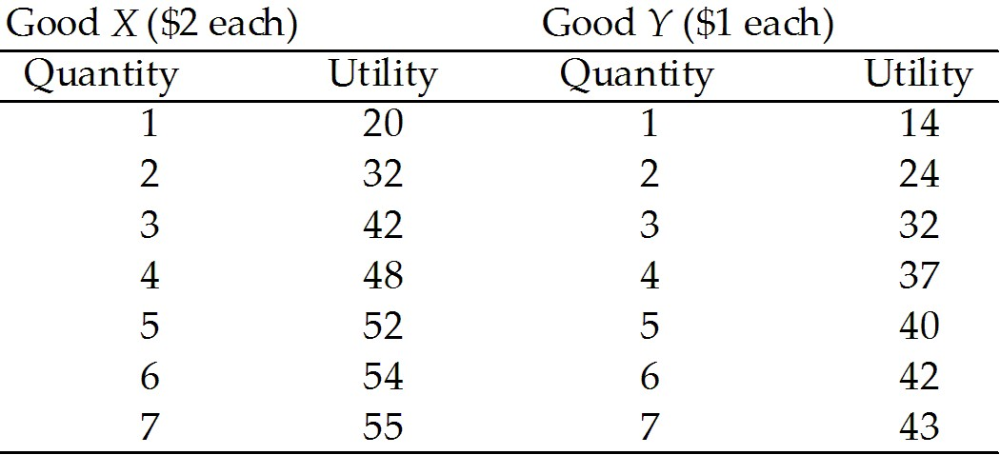

**Chapter 8 Utility and Demand**

## 8.1 Consumption Choices

1\) The change in total utility that results from a one-unit increase in
the quantity of a good consumed is

A\) additional utility.

B\) marginal utility.

C\) average utility.

D\) marginal utility per dollar.

E\) fractional utility.

---
---
Answer: B

---

Type: MC

Topic: Consumption Choices

2\) Utility is

A\) the value of a good.

B\) the additional satisfaction received from consuming another unit of a
good.

C\) the benefit or satisfaction from consuming goods and services.

D\) the practical usefulness of a good.

E\) equal to the price of a good.

---
---
Answer: C

---

Diff: 1 Type: MC

Topic: Consumption Choices

3\) Diminishing marginal utility means that

A\) Ralph will enjoy his second hamburger less than the first one.

B\) the utility from one hamburger is greater than the utility from two
hamburgers.

C\) the price of two hamburgers is less than twice the price of one.

D\) the utility from eating two hamburgers will be more than twice the
utility from eating the first one.

E\) hamburgers seem smaller as you eat more of them.

---
---
Answer: A

---

Diff: 1 Type: MC

Topic: Consumption Choices

4\) As more of a good is consumed its

A\) marginal utility increases.

B\) marginal utility decreases.

C\) marginal utility remains unchanged.

D\) total utility decreases.

E\) total utility increases at an increasing rate.

---
---
Answer: B

---

Diff: 1 Type: MC

Topic: Consumption Choices

5\) What is marginal utility?

A\) The change in total utility divided by the price of a good.

B\) The maximum amount of satisfaction from consuming a good.

C\) The total satisfaction received from consuming as much of the good
that is available for consumption.

D\) The additional satisfaction received from consuming one more unit of
a good.

E\) The change in the price of a good divided by the change in total
utility.

---
---
Answer: D

---

Diff: 1 Type: MC

Topic: Consumption Choices

6\) John likes to eat apples, oranges, and pears. If John increases his
consumption of oranges, *ceteris paribus*, marginal utility theory tell
us that John\'s marginal utility of

A\) oranges decreases.

B\) apples decreases.

C\) pears decreases.

D\) oranges remains constant.

E\) oranges, apples, and pears all decrease.

---
---
Answer: A

---

Diff: 2 Type: MC

Topic: Consumption Choices

7\) The fact that your fourth slice of pizza does not generate as much
satisfaction as your third slice is an example of

A\) consumer surplus.

B\) diminishing total utility.

C\) diminishing marginal utility.

D\) the paradox of value.

E\) the law of demand.

---
---
Answer: C

---

Diff: 2 Type: MC

Topic: Consumption Choices

*\
Use the table below to answer the following questions.*

**Table 8.1.1**

8\) Refer to Table 8.1.1. The value of *B* is

A\) 30.

B\) 47.

C\) 42.

D\) 18.

E\) 0.

---
---
Answer: B

---

Diff: 2 Type: MC

Topic: Consumption Choices

9\) Refer to Table 8.1.1. The value of *C* is

A\) 0.

B\) 13.

C\) 17.

D\) 50.

E\) 3.

---
---
Answer: E

---

Diff: 3 Type: MC

Topic: Consumption Choices

10\) Total utility is always

A\) greater than marginal utility.

B\) less than marginal utility.

C\) decreasing when marginal utility is decreasing.

D\) decreasing when marginal utility is increasing.

E\) increasing when marginal utility is positive.

---
---
Answer: E

---

Diff: 2 Type: MC

Topic: Consumption Choices

Source: Study Guide

11\) Marginal utility equals

A\) total utility divided by price.

B\) total utility divided by the total number of units consumed.

C\) the slope of the total utility curve.

D\) the inverse of total utility.

E\) the area below the demand curve but above market price.

---
---
Answer: C

---

Diff: 2 Type: MC

Topic: Consumption Choices

12\) Total utility equals

A\) the sum of the marginal utilities of each unit consumed.

B\) the area below the demand curve but above the market price.

C\) the slope of the marginal utility curve.

D\) the marginal utility of the last unit divided by price.

E\) the marginal utility of the last unit consumed multiplied by the
total number of units consumed.

---
---
Answer: A

---

Diff: 2 Type: MC

Topic: Consumption Choices

Source: Study Guide

13\) According to the principle of diminishing marginal utility, as
consumption of a good increases, total utility

A\) decreases and then eventually increases.

B\) decreases at an increasing rate.

C\) decreases at a decreasing rate.

D\) increases at an increasing rate.

E\) increases at a decreasing rate.

---
---
Answer: E

---

Diff: 1 Type: MC

Topic: Consumption Choices

14\) When total utility is increasing, marginal utility

A\) is negative.

B\) must be between zero and one.

C\) is either increasing or decreasing.

D\) is either positive or negative.

E\) is also increasing.

---
---
Answer: C

---

Diff: 2 Type: MC

Topic: Consumption Choices

15\) The first can of Sprite Jack drinks give him 22 units of utility and
the second can gives him an additional 12 units of utility. How much
units of utility do the two cans of Sprite give Jack?

A\) 17

B\) 46

C\) 34

D\) 2

E\) 36

---
---
Answer: C

---

Diff: 2 Type: MC

Topic: Consumption Choices

16\) The first can of Coke gives 15 units of utility to Witney, while the
second can of Coke increases her total utility to 23. What is the
marginal utility of the second can of Coke?

A\) 24 units

B\) 8 units

C\) 38 units

D\) 11.5 units

E\) 7.5 units

---
---
Answer: B

---

Diff: 2 Type: MC

Topic: Consumption Choices

*Use the table below to answer the following question.*

**Table 8.1.2**

17\) Table 8.1.2 gives total utilities for Jim and Sally. Which one of
the following statements is true?

A\) Jim has increasing marginal utility.

B\) For Sally, the marginal utility of the third unit consumed is 6.

C\) If Jim consumes 2 units, his total utility is 34 units.

D\) Jim and Sally receive the same marginal utility from the third unit
consumed.

E\) If Sally consumes 2 units, her total utility is 10 units.

---
---
Answer: D

---

Diff: 2 Type: MC

Topic: Consumption Choices

18\) A budget line is drawn with

A\) quantity of one good on the vertical axis and the quantity of the
second good on the horizontal axis.

B\) price of one good on the vertical axis and the price of the second
good on the horizontal axis.

C\) quantity of one good on the vertical axis and its price on the
horizontal axis.

D\) quantity of one good on the horizontal axis and its price on the
vertical axis.

E\) quantity of one good on the horizontal axis and its total utility on
the vertical axis.

---
---
Answer: A

---

Type: MC

19\) The budget line

A\) shows the limits to a household\'s consumption choices.

B\) shows the households total utility.

C\) is downward sloping because it illustrates decreasing marginal
utility.

D\) shows how a household's consumption choices change as income changes.

E\) Both A and D are correct.

---
---
Answer: A

---

Type: MC

20\) The budget line shows the boundary between those combinations of
goods and services that

A\) have positive marginal utility and those that have negative marginal
utility.

B\) are available and those that are unavailable.

C\) are desirable and those that are undesirable.

D\) are affordable and those that are unaffordable.

E\) are normal goods and those that are inferior goods.

---
---
Answer: D

---

Type: MC

21\) Sam buys gasoline and coffee each week. To draw his budget line for
gasoline and coffee, Sam needs to know

A\) if his income is expected to rise in the future.

B\) if the price of gasoline is expected to rise in the future.

C\) if the price of coffee is expected to fall in the future.

D\) the goods that he considers to be substitutes for gasoline and for
coffee.

E\) how much income he has to spend and the prices of one litre of
gasoline and one cup of coffee.

---
---
Answer: E

---

Type: MC

## 8.2 Utility-Maximizing Choice

1\) Sarah can consume either pizzas or hamburgers. The price of a
hamburger is \$1 and the price of a pizza is \$5. Let *MUh* be the
marginal utility of hamburgers and *MUp* be the marginal utility of
pizzas. In consumer equilibrium, what must the ratio *MUh*/*MUp* equal?

A\) 1/5

B\) 5/1

C\) 1/1

D\) 1/6

E\) 4

---
---
Answer: A

---

Diff: 1 Type: MC

Topic: Utility-Maximizing Choices

*Use the table below to answer the following questions.*

**Table 8.2.1**

2\) Refer to Table 8.2.1. Consider Sam\'s utility from sailing and
skiing. If the price of sailing is \$10 per hour and the price of skiing
is \$20 per hour, Sam will choose to spend

A\) all his time sailing.

B\) all his time skiing.

C\) more time sailing than skiing.

D\) more time skiing than sailing.

E\) the same amount of time sailing and skiing, since they give the same
amount of utility.

---
---
Answer: C

---

Diff: 3 Type: MC

Topic: Utility-Maximizing Choices

3\) Refer to Table 8.2.1. Consider Sam\'s utility from sailing and
skiing. The price of sailing is \$10 per hour and the price of skiing is
\$20 per hour; Sam\'s income to spend on these activities is \$80. In
consumer equilibrium, Sam will sail for

A\) 3 hours and ski for 2 hours.

B\) 2 hours and ski for 4 hours.

C\) 4 hours.

D\) 4 hours and ski for 2 hours.

E\) 8 hours.

---
---
Answer: D

---

Diff: 3 Type: MC

Topic: Utility-Maximizing Choices

4\) If a consumer spends all his income and his marginal utility per
dollar is equal for all goods, then

A\) marginal utility is maximized.

B\) total utility is maximized.

C\) he cannot be better off even with more income.

D\) the proportion of income spent on each good must be equal.

E\) the number of units bought of each good must be equal.

---
---
Answer: B

---

Diff: 2 Type: MC

Topic: Utility-Maximizing Choices

5\) Which one of the following is *not* true in consumer equilibrium?

A\) The total utilities of all goods are equal.

B\) The consumer is maximizing utility, given her income and the prices
of goods and services.

C\) The marginal utility per dollar is equal for all goods.

D\) Given prices and her income, the consumer finds that any other choice
of goods to consume would lower her utility.

E\) The consumer will not change her choices unless prices or income
change.

---
---
Answer: A

---

Diff: 2 Type: MC

Topic: Utility-Maximizing Choices

*Use the table below to answer the following questions.*

**Table 8.2.2**

6\) Refer to Table 8.2.2. Henry is maximizing his utility by consuming 3
bags of popcorn and 3 bottles of pop. What is the ratio of the price of
popcorn to the price of pop?

A\) 1/2

B\) 1

C\) 3/4

D\) 4/3

E\) 6/5

---
---
Answer: D

---

Diff: 1 Type: MC

Topic: Utility-Maximizing Choices

7\) Refer to Table 8.2.2. What is the total utility if 3 bags of popcorn
and 2 bottles of pop are consumed?

A\) 150

B\) 310

C\) 490

D\) 660

E\) 100.

---
---
Answer: C

---

Diff: 2 Type: MC

Topic: Utility-Maximizing Choices

8\) Let *MUA* and *MUB* stand for the marginal utility of goods *A* and
*B*, respectively. Let *PA* and *PB* stand for the price of goods *A*
and *B*, respectively. Which statement must hold for consumer
equilibrium?

A\) *MUA* = *MUB*

B\) *MUA* = *MUB* and *PA* = *PB*

C\) *MUA*/*MUB* = *PB*/*PA*

D\) *MUA*/*MUB* = *PA*/*PB*

E\) *MUAPA* = *MUBPB*

---
---
Answer: D

---

Diff: 1 Type: MC

Topic: Utility-Maximizing Choices

9\) Let *MUA* and *MUB* stand for the marginal utility of goods *A* and
*B*, respectively. Let *PA* and *PB* stand for the price of goods *A*
and *B*, respectively. Assume that for a given consumer *MUA* and *MUB*
are equal to each other, and *PA* is greater than *PB*. In this case,
the consumer is better off if he consumes

A\) more of good *A* and less of good *B.*

B\) less of good *A* and more of good *B.*

C\) equal amount of goods *A* and *B.*

D\) good *B* only.

E\) neither good *A* nor good *B*.

---
---
Answer: B

---

Diff: 3 Type: MC

Topic: Utility-Maximizing Choices

10\) Advise Sarah how to maximize her utility if *MUA*=8, *MUB*=20,
*PA*=4 and *PB*=5.

A\) Consume equal amounts of both goods.

B\) Consume more of good *A* and less of good *B*.

C\) Consume more of good *B* and less of good *A.*

D\) Lower the price of good *B.*

E\) Raise the price of good *A.*

---
---
Answer: C

---

Diff: 3 Type: MC

Topic: Utility-Maximizing Choices

11\) To determine consumer equilibrium we need to know only

A\) prices and income.

B\) total utility and income.

C\) marginal utility and income.

D\) prices, income, and marginal utility.

E\) prices and marginal utility.

---
---
Answer: D

---

Diff: 2 Type: MC

Topic: Utility-Maximizing Choices

12\) Harold can consume either pens or milkshakes. The price of a pen is
\$1, and the price of a milkshake is \$1. Harold figures that when his
income is spent, his marginal utility from pens will be 10 and his
marginal utility from milkshakes will be 8. Harold is better off

A\) by consuming more pens and fewer milkshakes.

B\) by consuming more pens and more milkshakes.

C\) by consuming fewer pens and fewer milkshakes.

D\) by consuming fewer pens and more milkshakes.

E\) only if he makes more income.

---
---
Answer: A

---

Diff: 2 Type: MC

Topic: Utility-Maximizing Choices

13\) According to the marginal utility theory, consumers

A\) maximize utility and minimize marginal utility.

B\) maximize utility and equalize marginal utility per dollar across all
goods.

C\) save part of their income for future consumption.

D\) maximize utility by spending the most on the least expensive good.

E\) maximize utility by spending the least on the least expensive good.

---
---
Answer: B

---

Diff: 2 Type: MC

Topic: Utility-Maximizing Choices

14\) In consumer equilibrium

A\) total utility is maximized given the consumer\'s income and the
prices of goods.

B\) marginal utility is maximized given the consumer\'s income and the
prices of goods.

C\) marginal utility per dollar is maximized given the consumer\'s income
and the prices of goods.

D\) the marginal utility from each good is equal.

E\) marginal utility per dollar is zero.

---
---
Answer: A

---

Diff: 2 Type: MC

Topic: Utility-Maximizing Choices

Source: Study Guide

15\) Samir consumes apples and bananas and is in consumer equilibrium.
The marginal utility from his last apple is 10 and the marginal utility
from his last banana is 5. If the price of an apple is \$0.50, then what
is the price of a banana?

A\) \$0.05

B\) \$0.10

C\) \$0.25

D\) \$0.50

E\) \$1.00

---
---
Answer: C

---

Diff: 2 Type: MC

Topic: Utility-Maximizing Choices

Source: Study Guide

16\) Suppose a consumer spends all his income. His marginal utility per
dollar on *X* is 4 and marginal utility per dollar on *Y* is 2. We know
that

A\) utility can be increased by increasing the consumption of *X* and
decreasing the consumption of *Y*.

B\) utility can be increased by decreasing the consumption of *X* and
increasing the consumption of *Y*.

C\) the price of *Y* must be eight times the price of *X*.

D\) utility is maximized.

E\) the price of *Y* must be one-third the price of *X*.

---
---
Answer: A

---

Diff: 2 Type: MC

Topic: Utility-Maximizing Choices

*\
Use the table below to answer the following questions.*

**Table 8.2.3**

17\) Refer to Table 8.2.3. To attain consumer equilibrium, the first \$4
of income is used to purchase

A\) 2 units of good X.

B\) 3 units of good X.

C\) 4 units of good Y.

D\) an amount of X and Y that cannot be determined from the table.

E\) 2 units of good Y and 1 unit of X.

---
---
Answer: E

---

Diff: 3 Type: MC

Topic: Utility-Maximizing Choices

18\) Refer to Table 8.2.3. If income is \$13, then utility is maximized
when consumption is

A\) 6 units of *X* and 1 unit of *Y*.

B\) 5 units of *X* and 3 units of *Y*.

C\) 4 units of *X* and 5 units of *Y*.

D\) 3 units of *X* and 7 units of *Y*.

E\) 2 units of *X* and 9 units of *Y*.

---
---
Answer: C

---

Diff: 3 Type: MC

Topic: Utility-Maximizing Choices

19\) For a consumer to maximize utility from a given income,

A\) the marginal utility from each good must be maximized.

B\) the total utility from each good must be maximized.

C\) the marginal utilities of all goods and services consumed must be
equal.

D\) the marginal utility per dollar from all goods and services consumed
must be equal.

E\) the amount of each good consumed per dollar must be equal.

---
---
Answer: D

---

Diff: 2 Type: MC

Topic: Utility-Maximizing Choices

20\) Suppose you are consuming hot dogs and Cokes and believe you are
receiving maximum total utility from the meal for your entire budget of
\$12. The price of a hot dog is \$2 and the price of a Coke is \$2.
Which one of the following can you conclude?

A\) The total utility from hot dogs is maximized.

B\) The marginal utilities from hot dogs and Cokes divided by the
quantity of each good must be equal.

C\) The total utilities from hot dogs and Cokes must be equal.

D\) You are purchasing three hot dogs and three Cokes.

E\) The marginal utilities from hot dogs and Cokes must be equal.

---
---
Answer: E

---

Diff: 2 Type: MC

Topic: Utility-Maximizing Choices

*Use the table below to answer the following question.*

**Table 8.2.4**

  Units of *X* |  Total Utility (*X*)  | Units of *Y*  | Total Utility (*Y*)|
  ------|------|------|-----|
  0            |  0                    | 0             | 0|
  1            |  9                    | 1             | 49|
  2            |  17                   | 2             | 90|
  3            |  24                   | 3             | 110|
  4            |  30                   | 4             | 118|
  5            |  35                   | 5             | 124|
  6            |  39                   | 6             | 129|
  7            |  42                   | 7             | 132|
  8            |  44                   | 8             | 133|

21\) Refer to Table 8.2.4. Suppose the price of *X* is \$1 and the price
of *Y* is \$1. How much of each should you purchase to maximize utility
from a total expenditure of \$11?

A\) 3 units of *X* and 8 units of *Y*

B\) 4 units of *X* and 7 units of *Y*

C\) 5 units of *X* and 6 units of *Y*

D\) 6 units of *X* and 5 units of *Y*

E\) 7 units of *X* and 4 units of *Y*

---
---
Answer: C

---

Diff: 2 Type: MC

Topic: Utility-Maximizing Choices

22\) If Ms. Petersen is maximizing her utility in the consumption of
goods A and B, which one of the following statements must be true?

A\) MUA = MUB

B\) MUA/PA = MUB/PB

C\) MUA/PB = MUB/PA

D\) TUA = TUB

E\) TUA/PA = TUB/PB

---
---
Answer: B

---

Diff: 1 Type: MC

Topic: Utility-Maximizing Choices

Source: Study Guide

23\) Which one of the following is *not* an assumption of marginal
utility theory?

A\) People derive utility from their consumption.

B\) More consumption yields more total utility.

C\) Utility can be measured.

D\) Marginal utility diminishes with more consumption.

E\) Consumers maximize total utility.

---
---
Answer: C

---

Diff: 2 Type: MC

Topic: Utility-Maximizing Choices

24\) If Soula is maximizing her utility, and two goods have the same
marginal utility, she

A\) buys only one.

B\) buys equal quantities of both.

C\) is paying the same price for each good.

D\) receives the same total utility from each good.

E\) none of the above.

---
---
Answer: C

---

Diff: 2 Type: MC

Topic: Utility-Maximizing Choices

Source: Study Guide

25\) A consumer maximizes his utility by purchasing 2 units of good *X*
at \$5 per unit and 3 units of good *Y* at \$7 per unit. What is the
ratio of the marginal utility from *X* to the marginal utility from *Y*?

A\) 5/7

B\) 7/5

C\) 2/3

D\) 3/2

E\) 10/21

---
---
Answer: A

---

Diff: 2 Type: MC

Topic: Utility-Maximizing Choices

26\) Shelley is maximizing utility in her consumption of mansions and
Porsches. If the marginal utility of her last purchased mansion is twice
the marginal utility of her last purchased Porsche, then we know

A\) Shelley buys twice as many mansions as Porsches.

B\) Shelley buys twice as many Porsches as mansions.

C\) Shelley buys more Porsches than mansions, but we do not know how many
more.

D\) the price of a mansion is twice the price of a Porsche.

E\) the price of a Porsche is twice the price of a mansion.

---
---
Answer: D

---

Diff: 2 Type: MC

Topic: Utility-Maximizing Choices

27\) Sergio is maximizing utility in his consumption of beer and
bubblegum. If the price of beer is greater than the price of bubblegum,
then we know

A\) Sergio buys more beer than bubblegum.

B\) Sergio buys more bubblegum than beer.

C\) the marginal utility from the last purchased beer is greater than the
marginal utility from the last purchased bubblegum.

D\) the marginal utility from the last purchased bubblegum is greater
than the marginal utility from the last purchased beer.

E\) the marginal utilities from the last purchased beer and bubblegum are
equal.

---
---
Answer: C

---

Diff: 2 Type: MC

Topic: Utility-Maximizing Choices

Source: Study Guide

28\) In consumer equilibrium, a consumer equates the

A\) total utility from each good.

B\) marginal utility from each good.

C\) total utility per dollar on each good.

D\) marginal utility per dollar on each good.

E\) total income spent on each good with total utility from each good.

---
---
Answer: D

---

Diff: 1 Type: MC

Topic: Utility-Maximizing Choices

Source: Study Guide

29\) If the marginal utilities from two goods are not equal, then the
consumer

A\) cannot be in equilibrium.

B\) should increase consumption of the good with the lower marginal
utility.

C\) should decrease consumption of the good with the lower marginal
utility.

D\) may possibly be in equilibrium.

E\) will definitely be in equilibrium.

---
---
Answer: D

---

Diff: 3 Type: MC

Topic: Utility-Maximizing Choices

30\) Geneva is not at her consumer equilibrium for movies and music
downloads. Why?

A\) Her average utility from movies does not equal her average utility
from music downloads.

B\) Her total utility from movies does not equal her total utility from
music downloads.

C\) Her marginal utility from the last movie she attended does not equal
her marginal utility from the last music download she downloaded.

D\) Her average utility from movies does not equal her total utility from
music downloads.

E\) Her marginal utility per dollar from the last movie she attended does
not equal her marginal utility per dollar from the last music download
she downloaded.

---
---
Answer: E

---

Diff: 2 Type: MC

Topic: Utility-Maximizing Choices

31\) Martha and Sarah have the same preferences, face the same prices,
and have the same income. Sarah\'s utility is measured in units while
Martha\'s is measured in units squared. Select the best response.

A\) Martha and Sarah will choose to consume the same set of goods.

B\) Martha\'s and Sarah\'s marginal utility per dollar will be equal.

C\) Martha\'s and Sarah\'s marginal utilities will be equal.

D\) Martha and Sarah will have equal total utility.

E\) Martha and Sarah will not choose to consume the same set of goods.

---
---
Answer: A

---

Diff: 2 Type: MC

Topic: Utility-Maximizing Choices

32\) John and Sally have identical preferences except Sally\'s utility
units are exactly 10 times that of John\'s. Both have the same income
and face the same prices. Choose the best response.

A\) John consumes 10 times the amount that Sally consumes.

B\) John receives 1/10 the satisfaction that Sally receives.

C\) Both will consume the same amount of all goods.

D\) John and Sally will have equal total utility.

E\) John and Sally will have equal marginal utility.

---
---
Answer: C

---

Diff: 2 Type: MC

Topic: Utility-Maximizing Choices

33\) Billy likes candy bars and popcorn. Candy bars sell for \$0.50 each
and popcorn sells for \$1 a bag. Currently he is in consumer equilibrium
with marginal utility per dollar on popcorn equal to 100. What is the
marginal utility per dollar on candy bars?

A\) 50

B\) 100

C\) 200

D\) 25

E\) 0.5

---
---
Answer: B

---

Diff: 1 Type: MC

Topic: Utility-Maximizing Choices

34\) The relative price of beer to back bacon is 2:1. If Bob\'s current
consumption is at a level where

*MUbeer*/*MUback bacon* is 1:2, then to maximize total utility Bob must

A\) consume more beer and less back bacon.

B\) not change his current consumption of beer and back bacon.

C\) consume less beer and more back bacon.

D\) raise the price of beer.

E\) consume twice as much beer and half as much back bacon.

---
---
Answer: C

---

Diff: 2 Type: MC

Topic: Utility-Maximizing Choices

Source: Study Guide

35\) Max has \$35 a day to spend, and he can spend as much time as he
likes on his leisure pursuits. Windsurfing equipment rents for \$10 an
hour, and snorkeling equipment rents for \$5 an hour. If Max equalizes
the marginal utility *per hour* from windsurfing and from snorkeling, he

A\) maximizes his total utility.

B\) can increase his total utility by spending less time windsurfing and
more time snorkeling.

C\) can increase his total utility only if the price of windsurfing
equipment rentals decreases.

D\) can increase his total utility by spending more time windsurfing and
less time snorkeling.

E\) maximizes his marginal utility per dollar.

---
---
Answer: B

---

Type: MC

Topic: Utility-Maximizing Choices

Source: MyEconLab

*\
Use the table below to answer the following question.*

**Table 8.2.5**

  **Hours per month**  |  **Marginal utility from golf**  |  **Marginal utility from tennis** |
  ------|-----|------|
  1      |                80         |                       40 |
  2      |                60         |                       36 |
  3      |                40         |                       30 |
  4      |                30         |                       10 |
  5      |                20         |                       5 |
  6      |                10         |                       2 |
  7      |                6         |                        1 |

36\) Refer to Table 8.2.5. Cindy enjoys golf and tennis. The table shows
the marginal utility she gets from each activity.

Cindy has \$70 a month to spend, and she can spend as much time as she
likes on her leisure pursuits. The price of an hour of golf is \$10, and
the price of an hour of tennis is \$5.

Cindy decides to golf for 5 hours a month and play tennis for 4 hours a
month.

If Cindy spends a dollar more on golf and a dollar less on tennis, her
total utility \_\_\_\_\_\_\_\_.

If Cindy spends a dollar less on golf and a dollar more on tennis, her
total utility \_\_\_\_\_\_\_\_.

A\) decreases; decreases

B\) increases; decreases

C\) decreases; increases

D\) increases; increases

E\) does not change; does not change

---
---
Answer: A

---

Type: MC

Topic: Utility-Maximizing Choices

Source: MyEconLab

37\) Danny has \$12 to spend on two goods: pies and pop. The price of a
pie is \$4, and the price of a can of pop is \$2. To maximize his
utility, Danny buys

A\) 2 pies and 2 cans of pop.

B\) 3 pies and no pop.

C\) the combination that gives him the same marginal utility per dollar
on pies as on pop.

D\) 6 cans of pop and no pie.

E\) the combination that gives him the same total utility from pies as
from pop.

---
---
Answer: C

---

Type: MC

38\) When Kathryn is at her consumer equilibrium, she is

A\) consuming the combination of goods that is at the midpoint of her
budget line.

B\) consuming a combination of goods that is located inside her budget
line.

C\) consuming a combination of goods that is located outside her budget
line.

D\) consuming a combination such that the marginal utility from good *X*
divided by the marginal utility from good *Y* equals the price of good
*X* divided by the price of good *Y*.

E\) on the midpoint of her demand curve.

---
---
Answer: D

---

Type: MC

39\) If Katie purchases two slices of pizza and six breadsticks to
maximize her total utility, then

A\) a slice of pizza costs three times as much as a breadstick.

B\) her marginal utility from the second slice of pizza divided by the
price of a slice of pizza is equal to her marginal utility from the
sixth breadstick divided by the price of a breadstick.

C\) a breadstick costs three times as much as a slice of pizza.

D\) she spends more on pizza than she spends on breadsticks.

E\) B and D are both correct.

---
---
Answer: B

---

Type: MC

## 8.3 Predictions of Marginal Utility Theory

1\) Chuck and Barry have identical total utility schedules but Chuck has
a much higher income. If each is maximizing his total utility, then

A\) they will have equal total utilities.

B\) Chuck will have lower total utility than Barry.

C\) Chuck will have lower marginal utility than Barry for each normal
good consumed.

D\) Chuck will have higher marginal utility than Barry for each normal
good consumed.

E\) they will have equal marginal utilities for each normal good
consumed.

---
---
Answer: C

---

Diff: 3 Type: MC

Topic: Predictions of Marginal Utility Theory

Source: Study Guide

2\) Harold can consume apples and oranges. He likes them equally well and
currently is in consumer equilibrium. Then the price of oranges rises,
while his income remains the same. What will happen to his consumption?

A\) consumption of oranges increases; consumption of apples decreases

B\) consumption of oranges increases; consumption of apples increases

C\) consumption of oranges decreases; consumption of apples decreases

D\) consumption of oranges decreases; consumption of apples increases

E\) consumption of oranges decreases; consumption of apples could either
increase or decrease

---
---
Answer: E

---

Diff: 3 Type: MC

Topic: Predictions of Marginal Utility Theory

3\) As a consumer\'s income decreases, marginal utility theory predicts
that

A\) the price of normal goods falls.

B\) the demand for normal goods decreases.

C\) the demand for all goods decreases.

D\) the demand for normal goods increases.

E\) total utility increases.

---
---
Answer: B

---

Diff: 2 Type: MC

Topic: Predictions of Marginal Utility Theory

4\) Billy likes candy bars and popcorn. Candy bars sell for \$0.50 each
and popcorn sells for \$1 per bag. Currently he is in consumer
equilibrium. Then the price of a candy bar rises to \$1. Which statement
is true in the new consumer equilibrium?

A\) The marginal utility from popcorn will increase.

B\) Marginal utility per dollar on candy bars will be equal to 2.

C\) Total utility will increase.

D\) The marginal utility from candy will decrease.

E\) The marginal utility from candy will be equal to the marginal utility
from popcorn.

---
---
Answer: E

---

Diff: 2 Type: MC

Topic: Predictions of Marginal Utility Theory

*Use the table below to answer the following questions.*

**Table 8.2.1**

Windsurfing equipment rents for \$10 per hour, snorkeling equipment for
\$5 per hour.

5\) Devon enjoys windsurfing and snorkeling. His total utility from each
activity is summarized in Table 8.2.1. Devon has \$35 to spend. How long
will Devon choose to windsurf and to snorkel?

A\) 1 hour windsurfing and 5 hours snorkeling

B\) 2 hours windsurfing and 3 hours snorkeling

C\) 3 hours windsurfing and 1 hour snorkeling

D\) 4 hours windsurfing and no hours snorkeling

E\) 2 hour windsurfing and 4 hours snorkeling

---
---
Answer: C

---

Diff: 2 Type: MC

Topic: Predictions of Marginal Utility Theory

6\) Consider Devon\'s utility from snorkeling and windsurfing in Table
## 8.2.1. Devon has \$55 to spend. What are Devon\'s choices for time spent
on the two activities?

A\) 1 hour of windsurfing and 9 hours of snorkeling

B\) 2 hours of windsurfing and 7 hours of snorkeling

C\) 3 hours of windsurfing and 5 hours of snorkeling

D\) 4 hours of windsurfing and 3 hours of snorkeling

E\) 5 hours of windsurfing and 1 hour of snorkeling

---
---
Answer: D

---

Diff: 2 Type: MC

Topic: Predictions of Marginal Utility Theory

7\) Consider Devon\'s total utility from snorkeling and windsurfing in
Table 8.2.1. Suppose that Devon\'s total income rises from \$35 to \$55,
*ceteris paribus*. Given that Devon changes his choice of windsurfing
and snorkeling, what is his income elasticity for windsurfing?

A\) zero

B\) 28.6

C\) 44.4

D\) 0.64

E\) 1.55

---
---
Answer: D

---

Diff: 3 Type: MC

Topic: Predictions of Marginal Utility Theory

8\) Consider Devon\'s total utility from snorkeling and windsurfing in
Table 8.2.1. Suppose Devon\'s total income is \$35. If the price of
windsurfing rises to \$20 per hour, how long does Devon choose to
windsurf and to snorkel?

A\) 1 hour of windsurfing and 3 hours of snorkeling

B\) 2 hour of windsurfing and 7 hours of snorkeling

C\) 3 hours of windsurfing and 5 hours of snorkeling

D\) 4 hours of windsurfing and 3 hours of snorkeling

E\) 5 hours of windsurfing and 1 hour of snorkeling

---
---
Answer: A

---

Diff: 3 Type: MC

Topic: Predictions of Marginal Utility Theory

9\) Consider Devon\'s total utility from snorkeling and windsurfing in
Table 8.2.1. Suppose Devon\'s total income is \$35. If the price of
windsurfing rises to \$20 per hour, what is Devon\'s elasticity of
demand for windsurfing?

A\) 1.0

B\) 0.67

C\) 1.5

D\) 10

E\) 1.33

---
---
Answer: C

---

Diff: 3 Type: MC

Topic: Predictions of Marginal Utility Theory

10\) Consider Devon\'s total utility from snorkeling and windsurfing in
Table 8.2.1. Suppose Devon\'s total income is \$35. If the price of
windsurfing rises to \$20 per hour, what is Devon\'s cross elasticity of
demand of snorkeling with respect to the price of windsurfing?

A\) 1.0

B\) 0.67

C\) 1.5

D\) 10

E\) 1.33

---
---
Answer: C

---

Diff: 3 Type: MC

Topic: Predictions of Marginal Utility Theory

11\) Bikes and roller blades are substitutes. Marginal utility theory
predicts that when the price of a bike rises, the quantity of bikes
demanded

A\) decreases and the demand curve for roller blades shifts rightward.

B\) decreases and the demand curve for roller blades shifts leftward.

C\) decreases and a movement occurs down along the demand curve for
roller blades.

D\) increases and the demand curve for roller blades shifts rightward.

E\) increases and the demand curve for roller blades shifts leftward.

---
---
Answer: A

---

Diff: 2 Type: MC

Topic: Predictions of Marginal Utility Theory

Source: Study Guide

12\) Beverly is currently in consumer equilibrium. An increase in her
income

A\) increases her total utility.

B\) decreases her total utility.

C\) increases her marginal utility from all goods.

D\) decreases her marginal utility from all goods.

E\) increases her consumption of all goods.

---
---
Answer: A

---

Diff: 2 Type: MC

Topic: Predictions of Marginal Utility Theory

Source: Study Guide

13\) Ron starts out in consumer equilibrium, consuming two goods, *X* and
*Y*. The price of *Y* rises. Immediately after the rise in price

A\) *MUX/PX \> MUY/PY*, and then Ron increases his consumption of *Y*.

B\) *MUX/PX \> MUY/PY*, and then Ron decreases his consumption of *Y*.

C\) *MUX/PX \< MUY/PY*, and then Ron increases his consumption of *Y*.

D\) *MUX/PX \< MUY/PY*, and then Ron decreases his consumption of *Y*.

E\) none of the above.

---
---
Answer: B

---

Diff: 2 Type: MC

Topic: Predictions of Marginal Utility Theory

14\) Ron starts out in consumer equilibrium, consuming two goods, *X* and
*Y*. The price of *X* rises. Immediately after the rise in price

A\) *MUX/PX \> MUY/PY*, and then Ron increases his consumption of *X*.

B\) *MUX/PX \> MUY/PY*, and then Ron decreases his consumption of *X*.

C\) *MUX/PX \< MUY/PY*, and then Ron increases his consumption of *X*.

D\) *MUX/PX \< MUY/PY*, and then Ron decreases his consumption of *X*.

E\) none of the above.

---
---
Answer: D

---

Diff: 2 Type: MC

Topic: Predictions of Marginal Utility Theory

15\) Ron starts out in consumer equilibrium, consuming two goods, *X* and
*Y*. Ron\'s income rises. At this point, we can definitely conclude that

A\) *MUX/PX \> MUY/PY*, and then Ron increases his consumption of *X*.

B\) *MUX/PX \> MUY/PY*, and then Ron decreases his consumption of *X*.

C\) *MUX/PX \< MUY/PY*, and then Ron increases his consumption of *X*.

D\) *MUX/PX \< MUY/PY*, and then Ron decreases his consumption of *X*.

E\) none of the above.

---
---
Answer: E

---

Diff: 3 Type: MC

Topic: Predictions of Marginal Utility Theory

16\) If the price of a good rises, then in the new consumer equilibrium
all of the following are true *except*

A\) the marginal utility from consuming the good will be higher than
before the price rise.

B\) the quantity of the good consumed decreases.

C\) the quantity of substitutes consumed increases.

D\) the marginal utility from substitutes will be lower than before the
price rise.

E\) the marginal utility from the good equals its new higher price.

---
---
Answer: E

---

Diff: 2 Type: MC

Topic: Predictions of Marginal Utility Theory

17\) If the price of a good falls, then in the new consumer equilibrium

A\) the marginal utility from consuming the good will be higher than
before.

B\) the quantity of the good consumed decreases.

C\) the quantity of substitutes consumed increases.

D\) the marginal utility from substitutes will be lower than before the
fall in price.

E\) none of the above.

---
---
Answer: E

---

Diff: 2 Type: MC

Topic: Predictions of Marginal Utility Theory

18\) If income rises, then in the new consumer equilibrium

A\) the marginal utility from normal goods increases.

B\) the marginal utility from normal goods decreases.

C\) the marginal utility from inferior goods increases.

D\) total utility from inferior goods increases.

E\) both B and C.

---
---
Answer: E

---

Diff: 3 Type: MC

Topic: Predictions of Marginal Utility Theory

19\) If income falls, then in the new consumer equilibrium

A\) the marginal utility from normal goods increases.

B\) the marginal utility from normal goods decreases.

C\) the marginal utility from inferior goods increases.

D\) total utility from normal goods increases.

E\) both B and C.

---
---
Answer: A

---

Diff: 3 Type: MC

Topic: Predictions of Marginal Utility Theory

20\) Utility is similar to temperature because

A\) both are positive.

B\) both are negative.

C\) both have units of measurement that are arbitrary.

D\) both are observable.

E\) both are measured in the same scale.

---
---
Answer: C

---

Diff: 3 Type: MC

Topic: Predictions of Marginal Utility Theory

21\) Other things remaining the same, marginal utility theory implies
that a rise in the price of a good

A\) increases the consumer surplus.

B\) decreases the consumer surplus.

C\) leaves consumer surplus unchanged.

D\) has an effect on consumer surplus that cannot be determined.

E\) decreases consumer surplus by the amount equal to the total utility
of all goods consumed before the price rise but not after the price
rise.

---
---
Answer: B

---

Diff: 2 Type: MC

Topic: Predictions of Marginal Utility Theory

22\) The paradox of value as it applies to diamonds and water can be
explained by

A\) distinguishing between utility and price.

B\) water having a high level of marginal utility relative to diamonds.

C\) water having a low price relative to diamonds.

D\) the fact that utility can\'t be measured.

E\) distinguishing between total utility and marginal utility.

---
---
Answer: E

---

Diff: 2 Type: MC

Topic: Predictions of Marginal Utility Theory

23\) The high price of diamonds relative to the price of water reflects
the fact that, at typical levels of consumption,

A\) the total utility of water is relatively low.

B\) the total utility of diamonds is relatively high.

C\) the marginal utility of water is high.

D\) the marginal utility of diamonds is relatively low.

E\) None of the above is true.

---
---
Answer: E

---

Diff: 2 Type: MC

Topic: Predictions of Marginal Utility Theory

Source: Study Guide

24\) Which one of the following statements is true?

A\) Since consumers of a good consume this good until the price equals
the value of the last unit, they clearly get no benefit from consuming
this good.

B\) Consumers choosing between goods *X* and *Y* will set *MUX* = *MUY*.

C\) The value of a good to a consumer is measured by the price.

D\) Consumer surplus on a unit of a good will never be zero.

E\) If the marginal utility per dollar of good *X* is less than the
marginal utility per dollar of good *Y*, then the consumer should shift
some spending from *X* to *Y*.

---
---
Answer: E

---

Diff: 2 Type: MC

Topic: Predictions of Marginal Utility Theory

25\) The paradox of value

A\) is that values are the same for different people.

B\) is that economists can calculate marginal utility, even though
utility is unmeasurable.

C\) is resolved by an appeal to the law of diminishing total utility.

D\) remains unresolved by economists.

E\) is resolved by an appeal to the difference between marginal utility
and total utility.

---
---
Answer: E

---

Diff: 2 Type: MC

Topic: Predictions of Marginal Utility Theory

26\) Childcare workers often get paid fairly low wages, yet it is said
that they have \"the most important job in the world.\" This paradox can
be resolved by

A\) distinguishing between price and value.

B\) distinguishing between marginal utility and total utility.

C\) noting that childcare yields no utility since it is a service.

D\) noting that marginal utility does not diminish for childcare.

E\) none of the above.

---
---
Answer: B

---

Diff: 2 Type: MC

Topic: Predictions of Marginal Utility Theory

27\) With respect to water and diamonds, water

A\) has a higher marginal utility.

B\) has a lower marginal utility.

C\) has a lower total utility.

D\) is cheaper than diamonds because it has a lower total utility.

E\) none of the above.

---
---
Answer: B

---

Diff: 2 Type: MC

Topic: Predictions of Marginal Utility Theory

28\) The value of a good relates to

A\) total utility, while price relates to consumer surplus.

B\) consumer surplus, while price relates to total utility.

C\) marginal utility, while price relates to consumer surplus.

D\) marginal utility, while price relates to total utility.

E\) total utility, while price relates to marginal utility.

---
---
Answer: E

---

Diff: 2 Type: MC

Topic: Predictions of Marginal Utility Theory

Source: Study Guide

29\) Which of the following is *not* a prediction of marginal utility
theory?

A\) Other things remaining the same, the higher the price of a good, the
smaller the quantity demanded.

B\) Other things remaining the same, the lower the price of a good, the
greater the quantity demanded.

C\) Other things remaining the same, the lower the price of a good, the
smaller is the consumption of substitutes for that good.

D\) The law of demand.

E\) Diminishing marginal utility.

---
---
Answer: E

---

Type: MC

Topic: Predictions of Marginal Utility Theory

30\) You are consuming hot dogs and Cokes and believe you are maximizing
utility for your entire budget of \$12. The price of a hot dog is \$2
and the price of a Coke is \$2. Suppose the price of hot dogs rises to
\$4 and the price of a Coke remains at \$2. You adjust your consumption
of hot dogs and Cokes and believe you are once again receiving maximum
total utility from the meal. Which one of the following can you
conclude?

A\) The total utility from hot dogs is maximized.

B\) The marginal utilities from hot dogs and Cokes must be equal.

C\) The marginal utility from hot dogs must rise compared to the marginal
utility from Cokes.

D\) You are purchasing 2 hot dogs and 2 Cokes.

E\) You are purchasing 1 hot dog and 4 Cokes.

---
---
Answer: C

---

Type: MC

Topic: Predictions of Marginal Utility Theory

31\) If a consumer\'s income increases and if all goods are normal goods,

A\) the quantity bought of each good decreases.

B\) the quantity bought of some normal goods increases and of other
normal goods decreases, but we can\'t make an accurate prediction.

C\) some goods become inferior because it isn\'t possible to buy all
goods.

D\) the quantity bought of each good increases.

E\) the supply of all goods increases and the marginal utility from all
goods decreases.

---
---
Answer: D

---

Type: MC

Topic: Predictions of Marginal Utility Theory

Source: MyEconLab

32\) Ben consumes only movies and video games and he is in consumer
equilibrium. For Ben, movies and video games are substitutes.

The price of a movie falls which \_\_\_\_\_\_\_\_ the marginal utility
per dollar from movies.

To return to consumer equilibrium, Ben \_\_\_\_\_\_\_\_ the number of
movies he sees and \_\_\_\_\_\_\_\_ the number of video games he plays.

His marginal utility per dollar for movies \_\_\_\_\_\_\_\_ and his
marginal utility per dollar for video games \_\_\_\_\_\_\_\_ as he
returns to consumer equilibrium.

A\) increases; decreases; increases; decreases; increases

B\) decreases; increases; decreases; decreases; increases

C\) increases; increases; decreases; decreases; increases

D\) decreases; decreases; increases; increases; decreases

E\) increases; increases; decreases; increases; increases

---
---
Answer: C

---

Type: MC

Topic: Predictions of Marginal Utility Theory

Source: MyEconLab

33\) The paradox of value asks why

A\) bad things happen to good people.

B\) the price of water is low and the price of a diamond is high, but
water is essential to life while diamonds are not.

C\) the good die young.

D\) total utility is greater than marginal utility.

E\) the standard of living is higher in North America than in South
America.

---
---
Answer: B

---

Type: MC

Topic: Predictions of Marginal Utility Theory

Source: MyEconLab

34\) Ben spends \$50 a year on 2 bunches of flowers and \$50 a year on
10,000 litres of tap water. Ben is maximizing utility. His marginal
utility from water is 0.5 units per litre.

\_\_\_\_\_\_\_\_ more valuable to Ben than \_\_\_\_\_\_\_\_.

Ben\'s expenditure on flowers and water illustrates the paradox of value
because Ben\'s marginal utility from flowers is \_\_\_\_\_\_\_\_ than
his marginal utility from water and his total utility from flowers is
\_\_\_\_\_\_\_\_ than his total utility from water.

A\) Water is; flowers; greater; less

B\) Water is; flowers; less; greater

C\) Flowers are; water; greater; less

D\) Flowers are; water; less; greater

E\) None of the above because Ben values flowers and water equally

---
---
Answer: A

---

Type: MC

Topic: Predictions of Marginal Utility Theory

Source: MyEconLab

35\) Marginal utility theory predicts that a rise in the price of a
banana results in

A\) the demand curve for bananas shifting rightward.

B\) the demand curve for bananas shifting leftward.

C\) a movement upward along the demand curve for bananas.

D\) a movement downward along the demand curve for bananas.

E\) the demand curve for bananas shifting rightward and the supply curve
for bananas shifting rightward.

---
---
Answer: C

---

Type: MC

Topic: Predictions of Marginal Utility Theory

Skill: Conceptual

AACSB: Reflective Thinking

36\) Which of the following statements is true?

A\) Marginal utility theory predicts that an increase in a consumer\'s
income increases consumption of *all* goods.

B\) It is possible to derive the law of demand --- that a higher price
decreases the quantity demanded --- using marginal utility theory.

C\) Marginal utility theory makes no prediction about a consumer\'s
responses to hikes in the prices of the goods and services he or she
consumes.

D\) Marginal utility theory predicts that all goods are normal goods and
that all goods are substitutes for each other.

E\) None of the above.

---
---
Answer: B

---

Type: MC

Topic: Predictions of Marginal Utility Theory

Skill: Conceptual

AACSB: Reflective Thinking

37\) Bianca consumes pizza. Marginal utility theory predicts that when
the price of pizza increases,

A\) Bianca\'s total utility from pizza will increase.

B\) Bianca\'s marginal utility from pizza will not change.

C\) Bianca\'s demand curve for pizza will shift leftward.

D\) Bianca will buy less pizza.

E\) C and D are correct.

---
---
Answer: D

---

Type: MC

38\) Lucy buys only magazines and CDs. Both are normal goods. Lucy\'s
income decreases, but the prices of magazines and CDs do not change.
Marginal utility theory predicts that

A\) Lucy buys more magazines and more CDs.

B\) Lucy buys fewer magazines and fewer CDs.

C\) Lucy\'s demand curve for magazines shifts leftward.

D\) Lucy\'s demand curve for CDs shifts leftward.

E\) B, C, and D are correct.

---
---
Answer: E

---

Type: MC

## 8.4 New Ways of Explaining Consumer Choices

1\) Which of the following barriers to rational choices are studied by
behavioural economics?

A\) bounded rationality

B\) bounded will-power

C\) bounded self-interest

D\) the endowment effect

E\) all of the above.

---
---
Answer: E

---

Diff: 1 Type: MC

Topic: New Ways of Explaining Consumer Choices

Source: Study Guide

2\) Neuroeconomics studies all of the following concepts *except*

A\) the prefrontal cortex.

B\) the hippocampus.

C\) the production possibilites frontier.

D\) dopamine.

E\) anxiety and fear.

---
---
Answer: C

---

Diff: 1 Type: MC

Topic: New Ways of Explaining Consumer Choices

Source: Study Guide

3\) The three limitations on human rationality that behavioural economics
emphasizes are

A\) bounded rationality, bounded utility, and bounded self-interest.

B\) bounded rationality, bounded will-power, and bounded self-interest.

C\) bounded utility, bounded will-power, and bounded self-interest.

D\) bounded rationality, bounded will-power, and bounded utility.

E\) bounded rationality, bounded surplus, and bounded utility.

---
---
Answer: B

---

Diff: 1 Type: MC

Topic: New Ways of Explaining Consumer Choices

Source: MyEconLab

4\) Behavioural economics and neuroeconomics seek to achieve

A\) the reason why we do not always make rational economic decisions.

B\) a method of using will-power and self-interest to gain utility
maximization.

C\) a theory in which consumers are always utility-maximizers.

D\) a new method for the human brain to work out rational choice.

E\) the rational concepts that support the law of demand and the law of
supply.

---
---
Answer: A

---

Diff: 1 Type: MC

Topic: New Ways of Explaining Consumer Choices

Source: MyEconLab

5\) Behavioural economics

A\) studies the activity of the human brain when a person makes an
economic decision.

B\) studies psychology by using the economist\'s toolbox.

C\) studies the ways in which limits on the human brain\'s ability to
compute and implement rational decisions influences economic behaviour.

D\) was used extensively in the development of marginal utility theory.

E\) all of the above.

---
---
Answer: C

---

Diff: 1 Type: MC

Topic: New Ways of Explaining Consumer Choices

Source: MyEconLab

6\) Billy Jean loves to read and she has decided that she will buy all of
her books at the bookstore at the outlet mall. One day she is in
Chapters and sees a book from the *Globe and Mail* Best Sellers list
that she wants to read and she decides to buy it.

Buying the book means that she will not be able to take her Mom out for
coffee this week.

Billy Jean\'s decision is an example of

A\) bounded economics.

B\) bounded self-interest.

C\) bounded will-power.

D\) bounded rationality.

E\) all of the above.

---
---
Answer: C

---

Diff: 2 Type: MC

Topic: New Ways of Explaining Consumer Choices

Source: MyEconLab

7\) A behavioural economist will explain Tom\'s donation to charity by
saying that Tom is displaying

A\) the endowment effect.

B\) bounded rationality.

C\) bounded self-interest.

D\) bounded will-power.

E\) the neuro effect.

---
---
Answer: C

---

Type: MC

Topic: New Ways of Explaining Consumer Choices

Skill: Conceptual

AACSB: Reflective Thinking

8\) If Sean thinks that the choice between going to Olive Garden or Red
Lobster is simply too confusing, a behavioural economist will explain
that Sean is showing

A\) the endowment effect.

B\) bounded rationality.

C\) bounded self-interest.

D\) bounded will-power.

E\) irrational behaviour.

---
---
Answer: B

---

Type: MC

Topic: New Ways of Explaining Consumer Choices

Skill: Conceptual

AACSB: Reflective Thinking

9\) According to a behavioural economist, a person who is unwilling to
sell the last kilogram of rice he purchased for the same price that he
paid for it is displaying

A\) the endowment effect.

B\) bounded rationality.

C\) bounded self-interest.

D\) bounded will-power.

E\) rational behaviour.

---
---
Answer: A

---

Type: MC

Topic: New Ways of Explaining Consumer Choices

Skill: Conceptual

AACSB: Reflective Thinking

10\) Gene plays another hour of computer games rather than study for the
hour even though he knows that the next day when he takes his test he
will regret his decision. Gene is showing

A\) the endowment effect.

B\) bounded rationality.

C\) bounded self-interest.

D\) bounded will-power.

E\) bad judgment.

---
---
Answer: D

---

Type: MC

Topic: New Ways of Explaining Consumer Choices

Skill: Conceptual

AACSB: Reflective Thinking

11\) Lucky buys hats for \$20 but Lucky will not sell one of her hats for
less than \$35. Lucky is

A\) displaying the endowment effect.

B\) making decisions using her prefrontal cortex.

C\) exhibiting bounded self-interest.

D\) showing unbounded will-power.

E\) a behavioural economist.

---
---
Answer: A

---

Type: MC

Topic: New Ways of Explaining Consumer Choices

Skill: Conceptual

AACSB: Reflective Thinking

12\) Bounded self-interest

A\) is limited by the computing power of the human brain.

B\) prevents us from making a decision that we know, at the time of
implementing the decision, we will later regret.

C\) is the tendency for people to value something more highly simply
because they own it.

D\) results in sometimes suppressing our own interests to help others.

E\) is the tendency for people to value something more highly simply
because a friend owns it.

---
---
Answer: D

---

Type: MC
