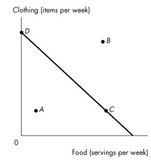
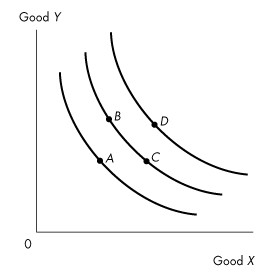
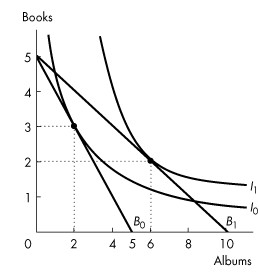
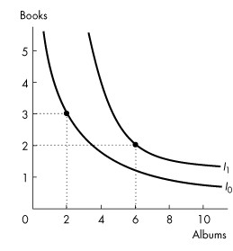
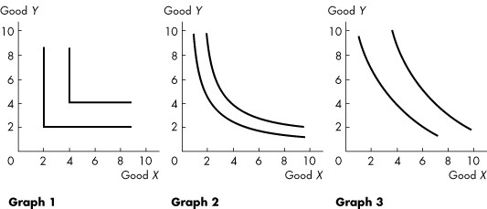
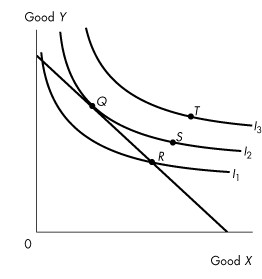
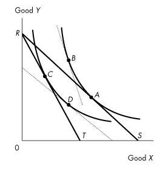

**Chapter 9 Possibilities, Preferences, and Choices**

## 9.1 Consumption Possibilities

1\) Guy has an income (*Y*) of \$50 with which he can purchase DVDs (*D*)
at \$10 each and haircuts (*H*) at \$20 each. Which one of the following
represents Guy\'s budget line?

A\) *Y* = 10Q*D* - 20Q*H*

B\) 50 = Q*D* + Q*H*

C\) *Y* = 50 + Q*D* + Q*H*

D\) 20*Y* = Q*D* + 10Q*H*

E\) 50 = 10Q*D* + 20Q*H*

---

*Use the figure below to answer the following questions.*

**Figure 9.1.1**

2\) Shelly\'s budget line is shown in Figure 9.1.1 Which point is
unaffordable given her income and current prices?

A\) *A* and *B*

B\) *B* only

C\) *C* only

D\) *C* and *D* only

E\) All points are unattainable.

---

3\) Shelly\'s budget line is shown in Figure 9.1.1. Which points are
affordable given her income and current prices?

A\) *A* only

B\) *B* only

C\) *C* only

D\) *D* only

E\) *A, C*, and *D*

---

4\) David has an income of \$30 to buy movie tickets and bus tickets. The
price of a movie ticket is \$6 and the price of a bus ticket is \$2.
What is David\'s real income?

A\) \$30

B\) 5 movie tickets or 15 bus tickets

C\) 15 movie tickets or 5 bus tickets

D\) \$38

E\) \$32

---

5\) David has an income of \$30 to buy movie tickets and bus tickets. The
price of a movie ticket is \$6 and the price of a bus ticket is \$2.
What is the relative price of a bus ticket in terms of movie tickets?

A\) 2 movie tickets

B\) 15 movie tickets

C\) \$3

D\) 1/3 movie tickets

E\) \$6

---

6\) Real income in terms of a good is defined as

A\) income divided by the quantity consumed of a good.

B\) the income of a producer of that good.

C\) the price of one good divided by the price of another good.

D\) dollar income.

E\) income divided by the price of a good.

---

7\) Marie-Louise has an income of \$10 to buy peanuts and popcorn. The
price of a bag of peanuts is \$1 and the price of a bag of popcorn is
\$2. What is Marie-Louise\'s real income in terms of popcorn?

A\) 1/2 bag of popcorn

B\) 1 bag of popcorn

C\) 2 bags of popcorn

D\) 5 bags of popcorn

E\) 10 bags of popcorn

---

8\) The price of one good divided by the price of another good is

A\) an absolute price.

B\) a relative price.

C\) a marginal price.

D\) a demand price.

E\) a money price.

---

9\) The price of a cup of coffee is \$2.00. The price of a cup of tea is
\$1.20. The relative price of a cup of tea with respect to a cup of
coffee is

A\) 0.6 cups of coffee.

B\) 1.67 cups of coffee.

C\) 1.0 cup of coffee.

D\) 1.25 cups of coffee.

E\) 0.75 cups of coffee.

---

10\) The magnitude of the slope of the budget line is the

A\) relative price of the good measured on the vertical axis.

B\) relative price of the good measured on the horizontal axis.

C\) absolute price of the good measured on the horizontal axis.

D\) real price of the good measured on the vertical axis.

E\) price of the good measured on the vertical axis.

---

11\) When speaking of the price of the good measured on the horizontal
axis relative to the price of the good measured on the vertical axis,
which statement is true?

A\) The steeper the slope of the budget line, the more expensive the good
measured on the horizontal axis.

B\) The steeper the slope of the budget line, the less expensive the good
measured on the horizontal axis.

C\) The steeper the slope of the budget line, the more expensive the good
measured on the vertical axis.

D\) The slope of the budget line is independent of relative prices.

E\) The flatter the slope of the budget line, the more expensive the good
measured on the horizontal axis.

---

12\) Suppose all prices double and income also doubles. Which statement
is true?

A\) The budget line does not change.

B\) The slope of the budget line increases.

C\) The slope of the budget line decreases.

D\) The budget line shifts rightward.

E\) The budget line shifts leftward.

---

13\) The budget line depends on

A\) income only.

B\) prices only.

C\) income and prices.

D\) preferences only.

E\) preferences and prices.

---

Source: Study Guide

14\) If the price of the good measured on the vertical axis increases,
the budget line

A\) becomes steeper.

B\) becomes flatter.

C\) shifts leftward and parallel to the original budget line.

D\) shifts rightward and parallel to the original budget line.

E\) shifts leftward and becomes steeper.

---

Source: Study Guide

15\) If the price of the good measured on the horizontal axis increases,
the budget line

A\) becomes steeper.

B\) shifts leftward and becomes steeper.

C\) shifts leftward and parallel to the original budget line.

D\) shifts rightward and parallel to the original budget line.

E\) becomes flatter.

---

16\) If income increases, the budget line

A\) becomes steeper.

B\) becomes flatter.

C\) shifts leftward and parallel to the original budget line.

D\) shifts rightward and parallel to the original budget line.

E\) shifts parallels either leftward or rightward depending on whether
the goods measured on the axes are normal or inferior.

---

Source: Study Guide

17\) If income decreases, the budget line

A\) becomes steeper.

B\) becomes flatter.

C\) shifts leftward and parallel to the original budget line.

D\) shifts rightward and parallel to the original budget line.

E\) shifts parallel either leftward or rightward depending on whether the
goods measured on the axes are normal or inferior.

---

18\) Martha consumes cake and muffins. Suppose Martha\'s income doubles
and the prices of cake and muffins also double. Martha\'s budget line

A\) shifts leftward but the slope does not change.

B\) remains unchanged.

C\) shifts rightward but the slope does not change.

D\) shifts rightward and becomes steeper.

E\) shifts rightward and becomes flatter.

---

19\) Let *Y* = \$100, *QX* = quantity of good *X*, and *QW* = quantity of
good *W*, *PX* = \$4 and *PW* = \$5. The budget equation is

A\) 100 = 4*QX* + 5*QW*.

B\) 100 = *QX* + (4/5)*QW*.

C\) *QX* = 100 + (4/5)*QW*.

D\) *QX* = *QW* + (4/5)*Y*.

E\) *QW* = *QX* + (4/5)*Y*.

---

20\) Sarah has an income of \$100. She purchases 5 pizzas at \$10 each
and 10 subs at \$5 each. Then the government taxes subs, and the price
rises to \$10 each. Simultaneously, the government gives Sarah a grant
of \$50 in income to make up for this change. As a result, Sarah\'s
budget line

A\) becomes steeper.

B\) becomes flatter.

C\) shifts leftward and parallel to the original budget line.

D\) shifts rightward and parallel to the original budget line.

E\) swivels around the original consumption choice.

---

21\) Bill consumes apples and bananas. Apples are measured on the
vertical axis and bananas are measured on the horizontal axis. Bill\'s
income doubles, the price of apples doubles, and the price of bananas
triples. Bill\'s budget line

A\) remains unchanged.

B\) shifts rightward and the slope does not change.

C\) shifts rightward and becomes steeper.

D\) shifts rightward and becomes flatter.

E\) becomes steeper.

---

22\) The initial budget equation for pop (*p*) and movies (*m*) is *Qp* =
20 - 4*Qm*, and the price of a pop is \$5. If the price of a pop falls
to \$4, what is the new budget equation?

A\) *Qp* = 25 - 2*Qm*

B\) *Qp* = 25 - 4*Qm*

C\) *Qp* = 25 - 5*Qm*

D\) *Qp* = 20 - 5*Qm*

E\) none of the above

---

Source: Study Guide

23\) Which one of the following statements about the budget line is
*false*? The budget line

A\) separates affordable consumption points from unaffordable consumption
points.

B\) is based on fixed prices.

C\) is based on fixed income.

D\) is based on fixed quantities.

E\) constrains consumer choices.

---

24\) Zarina can afford to buy 3 tomatoes and no toothbrushes, or 2
toothbrushes and no tomatoes. The relative price of a toothbrush is

A\) 2/3 of a tomato.

B\) 3/2 tomatoes.

C\) 6 tomatoes.

D\) 1/6 of a tomato.

E\) impossible to calculate without additional information.

---

Source: Study Guide

25\) A change in the price of the good measured on the horizontal axis
changes \_\_\_\_\_\_\_\_ of the budget line.

A\) the slope and *y*-intercept

B\) the slope and *x*-intercept

C\) the *x*- and *y*-intercepts but not the slope

D\) only the slope

E\) only the *y*-intercept

---

26\) A change in the price of the good measured on the vertical axis
changes \_\_\_\_\_\_\_\_ of the budget line.

A\) the slope and *y*-intercept

B\) the slope and *x*-intercept

C\) the *x*- and *y*-intercepts but not the slope

D\) only the slope

E\) only the *y*-intercept

---

27\) A change in income changes \_\_\_\_\_\_\_\_ of the budget line.

A\) the slope and *y*-intercept

B\) the slope and *x*-intercept

C\) the *x*- and *y*-intercepts but not the slope

D\) only the slope

E\) only the *y*-intercept

---

*Use the figure below to answer the following questions.*

**Figure 9.1.2**

28\) Refer to Figure 9.1.2. Which budget line shows the greatest real
income in terms of compact discs?

A\) *AD*

B\) *BD*

C\) *CD*

D\) Real income is equal for all three budget lines.

E\) Cannot be determined without studying the indifference curves.

---

29\) Refer to Figure 9.1.2. Which budget line shows the greatest real
income in terms of carrots?

A\) *AD*

B\) *BD*

C\) *CD*

D\) Real income is equal for all three budget lines.

E\) Cannot be determined without studying the indifference curves.

---

30\) Refer to Figure 9.1.2. Which budget line has the lowest relative
price for compact discs?

A\) *DA*

B\) *DB*

C\) *DC*

D\) The relative price is equal for all three budget lines.

E\) Cannot be determined without studying the indifference curves.

---

31\) Refer to Figure 9.1.2. Which budget line has the lowest relative
price for carrots?

A\) *AD*

B\) *BD*

C\) *CD*

D\) The relative price is equal for all three budget lines.

E\) Cannot be determined without studying the indifference curves.

---

32\) Larry consumes only beer (*B*) and chips (*C*). The equation of his
budget line (with beer measured on the vertical axis) is

A\) *QB = Y/PB - (PC/PB)QC.*

B\) *QB = Y - (PC/PB)QC.*

C\) *QB = Y/PC - (PB/PC)QC.*

D\) *QB = Y/PB - (PC/PB)QB.*

E\) *QC = Y/PC - (PB/PC)QB.*

---

33\) Larry consumes only beer (*B*) and chips (*C*). The magnitude of the
slope of his budget line (with beer measured on the vertical axis) is

A\) *PC/Y.*

B\) *PC* × *PB.*

C\) *Y/PC.*

D\) *Y/PB.*

E\) *PC/PB.*

---

34\) Larry consumes only beer (*B*) and chips (*C*). His real income in
terms of beer is

A\) *PC/Y.*

B\) *PC* × *PB.*

C\) *Y/PC.*

D\) *Y/PB.*

E\) *PC/PB.*

---

35\) Larry consumes only beer (*B*) and chips (*C*). His real income in
terms of chips is

A\) *PC/Y.*

B\) *PC* × *PB.*

C\) *Y/PC.*

D\) *Y/PB.*

E\) *PC/PB.*

---

36\) Larry consumes only beer (*B*) and chips (*C*). If beer is measured
on the vertical axis, the relative price of chips in terms of beer is
all of the following *except*

A\) *PC/PB*

B\) the magnitude of the slope of the budget line

C\) equal to the opportunity cost of 1 bag of chips

D\) the real income in terms of beer

E\) the inverse of the relative price of beer in terms of chips

---

37\) Sara\'s income is \$12 a week. The price of popcorn is \$3 a bag,
and the price of a smoothie is \$3. The opportunity cost of a smoothie
is \_\_\_\_\_\_\_\_.

A\) \$3

B\) 4 bags of popcorn

C\) 1.00 smoothie

D\) 1.0 bag of popcorn

E\) \$1

---

Source: MyEconLab

38\) Goods that can be bought in any quantity desired are called [
]{.underline}

A\) divisible goods.

B\) invisible goods.

C\) inferior goods.

D\) services.

E\) normal goods.

---

Type: MC

39\) Junkfood Jill spends all of her income on jellybeans and Jolt cola.
Suppose that Jill\'s income is \$30, the price of a bag of jellybeans is
\$6, and the price of a bottle of Jolt cola is \$2. Which of the
following combinations of jellybeans and Jolt cola lies inside Jill\'s
budget line?

A\) 2 bags of jellybeans and 8 bottles of Jolt

B\) 5 bags of jellybeans and 0 bottles of Jolt

C\) 4 bags of jellybeans and 4 bottles of Jolt

D\) 3 bags of jellybeans and 6 bottles of Jolt

E\) 5 bags of jellybeans and 15 bottles of Jolt

---

Type: MC

40\) Which of the following is *not* relevant when calculating the budget
line?

A\) the price of good *X*

B\) income

C\) the price of good *Y*

D\) preferences

E\) the relative price of good *X* in terms of good *Y*

---

Type: MC

41\) The number of pizza slices is plotted on the horizontal axis and
number of hot dogs is plotted on the vertical axis. If the price of a
hot dog rises the

A\) *x*-intercept and the slope of the budget line increase.

B\) *y*-intercept and the slope of the budget line increase.

C\) *x*-intercept and the slope of the budget line decrease.

D\) *y*-intercept decreases and the slope of the budget line does not
change.

E\) *y*-intercept and the slope of the budget line decrease.

---

Type: MC

## 9.2 Preferences and Indifference Curves

1\) An indifference curve is

A\) the boundary between what can be produced and what cannot be
produced.

B\) the boundary between what a consumer can afford and what he cannot
afford.

C\) a line that shows combinations of goods among which a consumer is
indifferent.

D\) the boundary between normal goods and inferior goods.

E\) a line with a positive slope.

---

2\) A preference map is

A\) a series of points that represent levels of equal satisfaction.

B\) a series of demand curves.

C\) a series of supply curves.

D\) a map that shows contour lines.

E\) a series of indifference curves.

---

3\) The marginal rate of substitution

A\) is the amount of good *Y* substituted for good *X* as a consumer
moves along his budget line.

B\) is the rate at which a person gives up the good measured on the
*y*-axis to get an additional unit of the good measured on the *x*-axis
while remaining on the same indifference curve.

C\) increases as a consumer consumes more of the good measured on the
*x*-axis.

D\) is greater than the magnitude of the slope of the budget line.

E\) is equal to the slope of the budget line.

---

4\) Which one of the following statements is *false*?

A\) If the indifference curve is steep, the marginal rate of substitution
is high.

B\) A low marginal rate of substitution implies a flat indifference
curve.

C\) A flat indifference curve implies a consumer must receive a large
amount of good *X* to compensate for a small decrease in good *Y*.

D\) A high marginal rate of substitution implies a consumer must receive
a large amount of good *X* to compensate for a small decrease in good
*Y*.

E\) A high marginal rate of substitution implies a consumer must receive
a small amount of good *X* to compensate for a large decrease in good
*Y*.

---

5\) The magnitude of the slope of an indifference curve is

A\) the marginal rate of substitution.

B\) the marginal rate of transformation.

C\) the marginal propensity to consume.

D\) the marginal propensity to substitute.

E\) the relative price of good *Y*.

---

*Use the figure below to answer the following questions.*

**Figure 9.2.1**

6\) Which one of the graphs in Figure 9.2.1 shows perfect substitutes?

A\) (a)

B\) (b)

C\) (c)

D\) (d)

E\) (c) and (d)

---

7\) Which of the graphs in Figure 9.2.1 shows perfect complements?

A\) (a)

B\) (b)

C\) (c)

D\) (d)

E\) (c) and (d)

---

8\) A constant marginal rate of substitution between two goods implies

A\) the goods are perfect complements.

B\) the goods are imperfect substitutes.

C\) the goods are both inferior.

D\) one good is normal and one good is inferior.

E\) the goods are perfect substitutes.

---

9\) What is a distinguishing characteristic of goods that are perfect
complements?

A\) straight-line indifference curves

B\) upward-sloping demand curves

C\) L-shaped indifference curves

D\) upward-sloping indifference curves

E\) curved indifference curves, bowed away from the origin

---

10\) A consumer always has a cup of coffee with a tablespoon of sugar.
What would the consumer\'s indifference curves for these two goods look
like?

A\) upward sloping

B\) horizontal along the entire length

C\) downward sloping with a constant slope

D\) vertical along the entire length

E\) L-shaped

---

11\) A consumer considers Coke and Pepsi to be perfect substitutes for
each other. What would the consumer\'s indifference curves for these two
goods look like?

A\) L-shaped

B\) horizontal along the entire length

C\) vertical along the entire length

D\) upward sloping

E\) downward sloping with a constant slope

---

12\) Which one of the following statements is *false*?

A\) Indifference curves are negatively sloped.

B\) A preference map consists of a series of indifference curves.

C\) Indifference curves are bowed out from the origin.

D\) The marginal rate of substitution is the magnitude of the slope of an
indifference curve.

E\) The marginal rate of substitution increases as a consumer moves up
along an indifference curve for ordinary goods.

---

Source: Study Guide

*\
Use the figure below to answer the following question.*

**Figure 9.2.2**

13\) Figure 9.2.2 shows three indifference curves for Brenda. Which one
of the following is *not* true?

A\) Brenda would be equally happy consuming at either point *B* or point
*C*.

B\) Brenda prefers consuming at point *B* to consuming at point *A*.

C\) Brenda prefers consuming at point *D* to consuming at either point
*B* or point *C*.

D\) The marginal rate of substitution is higher at point *C* than at
point *B*.

E\) Brenda prefers consuming at point *D* to consuming at point *A*.

---

14\) Good *X* is measured on the horizontal axis and good *Y* is measured
on the vertical axis. The marginal rate of substitution is

A\) the relative price of good *X* in terms of good *Y*.

B\) the relative price of good *Y* in terms of good *X*.

C\) the rate at which a consumer will give up good *Y* to obtain an
additional unit of good *X* while remaining indifferent.

D\) the rate at which a consumer will give up good *X* to obtain an
additional unit of good Y while remaining indifferent.

E\) equal to the magnitude of the slope of the budget line.

---

15\) Which one of the following statements is *true* about the
indifference curves for two goods that are perfect substitutes?

A\) The indifference curves are negatively-sloped straight lines.

B\) The indifference curves are L-shaped.

C\) The marginal rate of substitution is zero.

D\) The indifference curves are positively-sloped straight lines.

E\) The marginal rate of substitution is infinity.

---

16\) Which one of the following statements is *true* about the
indifference curves for two goods that are close but not perfect
substitutes?

A\) The indifference curves are negatively-sloped straight lines.

B\) The indifference curves are L-shaped.

C\) The marginal rate of substitution is constant.

D\) The marginal rate of substitution decreases as more of the good
measured on the *x*-axis and less of the good measured on the *y*-axis
are consumed.

E\) both A and C

---

17\) The shape of a person\'s indifference curves between two goods
depends on

A\) the prices of the two goods.

B\) the person\'s income.

C\) the degree of substitutability between the two goods.

D\) the level of satisfaction for the person.

E\) all of the above.

---

Source: Study Guide

18\) If two goods are perfect substitutes, then their

A\) indifference curves are positively-sloped straight lines.

B\) indifference curves are negatively-sloped straight lines.

C\) indifference curves are L-shaped.

D\) marginal rate of substitution is zero.

E\) marginal rate of substitution is infinity.

---

Source: Study Guide

*\
Use the figure below to answer the following questions.*

**Figure 9.2.3**

19\) Refer to Figure 9.2.3. Rashid buys only books and albums. The figure
shows his preferences. When Rashid chooses the consumption point of 3
books and 2 albums, his marginal rate of substitution is
\_\_\_\_\_\_\_\_.

A\) 1 book per album

B\) zero

C\) 3/2 books per album

D\) 2/3 books per album

E\) 0.5 books per album

---

Source: MyEconLab

20\) Refer to Figure 9.2.3. When Rashid chooses the consumption point of
2 books and 6 albums, his marginal rate of substitution is
\_\_\_\_\_\_\_\_.

A\) 1/3 books per album

B\) 0.5 books per album

C\) 3 books per album

D\) 1 book per album

E\) 2 books per album

---

Source: MyEconLab

*\
Use the figure below to answer the following question.*

**Figure 9.2.4**

21\) Refer to Figure 9.2.4. Rashid buys only books and albums. The figure
shows his preferences. Rashid\'s indifference curves \_\_\_\_\_\_\_\_
display diminishing marginal rate of substitution because
\_\_\_\_\_\_\_\_.

A\) do; Rashid is indifferent between consuming 6 albums and 2 books and
consuming 2 albums and 3 books

B\) do not; the magnitude of the slope of both indifference curves
decreases as Rashid consumes more albums and fewer books

C\) do not; Rashid is indifferent between consuming 6 albums and 2 books
and consuming 2 albums and 3 books

D\) do; the magnitude of the slope of both indifference curves decreases
as Rashid consumes more albums and fewer books

E\) do; the price of an album decreases as Rashid increases the quantity
he buys

---

Source: MyEconLab

*\
Use the figure below to answer the following question.*

**Figure 9.2.5**

22\) Refer to Figure 9.2.5. The graphs show indifference curves for
various goods. Graph \_\_\_\_\_\_\_\_ best describes the pair of goods
baseballs and baseball bats. Graph \_\_\_\_\_\_\_\_ best describes the
pair of goods desktop computers and laptop computers.

A\) 2; 3

B\) 2; 1

C\) 1; 1

D\) 1; 3

E\) 3; 2

---

Source: MyEconLab

23\) An indifference curve slopes downward because \_\_\_\_\_\_\_\_.

A\) it shows that people are only happy when they increase consumption of
all goods

B\) it shows that when a person gives up some of good *X* they must
increase their consumption of good *Y* to remain indifferent

C\) it shows that when a person gives up some of good *X* they can afford
to increase their consumption of good *Y*

D\) it is a demand curve without prices

E\) the quantity demanded increases as the price falls

---

Source: MyEconLab

24\) Which of the following statements is [FALSE]{.underline}?

A\) A consumer possesses a preference map.

B\) An indifference curve is a line that shows combinations of goods
among which a consumer is indifferent.

C\) A consumer has only one indifference curve.

D\) The marginal rate of substitution is the rate at which a consumer
will give up good *y* to get an additional unit of good *x* and remain
on the same indifference curve.

E\) If the indifference curve is steep, the marginal rate of substitution
is high.

---

Type: MC

25\) Which of the following results in a rightward shift of your
indifference curves for gasoline and movie rentals?

A\) an increase in the price of a litre of gasoline with no change in the
price of a movie rental

B\) an increase in the price of a movie rental with no change in the
price of a litre of gasoline

C\) an increase in income if gasoline and movie rentals are normal goods

D\) a decrease in the price of a litre of gasoline or a decrease in the
price of a movie rental

E\) none of the above

---

Type: MC

26\) If two consumption points are on different indifference curves, then
one point is

A\) a substitute for the other.

B\) preferred to the other.

C\) a complement of the other.

D\) a normal good and the other point is an inferior good.

E\) more expensive than the other.

---

Type: MC

## 9.3 Predicting Consumer Choices

1\) Leah consumes at a point on her budget line where her marginal rate
of substitution is less than the magnitude of the slope of her budget
line. As Leah moves towards her best affordable point, she will move to

A\) a lower budget line.

B\) a higher budget line.

C\) a lower indifference curve.

D\) a higher indifference curve.

E\) a tangent point on the same indifference curve.

---

2\) Leah consumes at a point on her budget line where her marginal rate
of substitution is less than the magnitude of the slope of her budget
line. As Leah moves along her budget line toward her best affordable
point, she will move

A\) down and left.

B\) down and right.

C\) up and left.

D\) up and right.

E\) straight up.

---

3\) A consumer\'s best affordable point occurs

A\) inside the budget line.

B\) outside the budget line.

C\) on the budget line.

D\) at a point that cannot be determined.

E\) at a corner on the budget line, with only one good consumed.

---

4\) At the best affordable point, what is the relationship between the
indifference curve and the budget line?

A\) The budget line and the indifference curve are identical.

B\) The slope of the indifference curve exceeds the slope of the budget
line.

C\) The slope of the budget line exceeds the slope of the indifference
curve.

D\) The slope of the indifference curve equals the slope of the budget
line.

E\) None of the above.

---

5\) Jay has an income of \$10 to buy peanuts and popcorn. The price of
peanuts is \$1 a bag and the price of popcorn is \$2 a bag. He chooses
to consume 5 bags of peanuts and 2 bags of popcorn. What can we say
about this consumption choice?

A\) It is not the best affordable choice. He should consume more peanuts,
more popcorn, or more of both.

B\) It is the best affordable choice, and his marginal rate of
substitution equals the slope of the budget line.

C\) The consumption choice is on the budget line.

D\) The consumption choice is outside the budget line.

E\) both B and C

---

6\) Which one of the following is true at the best affordable choice of a
consumer?

A\) Marginal rate of substitution exceeds the slope of the budget line.

B\) Marginal rate of substitution is less than the relative price of the
good measured on the *x*-axis.

C\) All income is spent.

D\) The consumption choice is outside the budget line.

E\) Other consumption points along the consumer\'s budget line lie on
higher indifference curves.

---

7\) At the best affordable point, which statement is true?

A\) The slope of the indifference curve equals the slope of the budget
line.

B\) The marginal rate of substitution between two goods equals their
absolute price.

C\) The highest affordable indifference curve has the same intercept as
the budget line.

D\) Other points on the same indifference curve are affordable but not
preferred.

E\) Some income is not spent.

---

*\
Use the figure below to answer the following questions.*

**Figure 9.3.1**

8\) Consider the budget line and indifference curve in Figure 9.3.1. If
the price of good *X* is \$1 a unit, then the price of good *Y* is

A\) \$0.75 a unit.

B\) \$1 a unit.

C\) \$1.25 a unit.

D\) \$2 a unit.

E\) \$1.33 a unit.

---

9\) Consider the budget line and indifference curve in Figure 9.3.1. At
the best affordable point, the marginal rate of substitution is

A\) 1/2.

B\) 2.

C\) 4/3.

D\) 3/4.

E\) 4.

---

10\) Consider the budget line and indifference curve in Figure 9.3.1. If
the price of good *X* is \$2 a unit, what is the price of good *Y*?

A\) \$0.37 a unit

B\) \$0.67 a unit

C\) \$1.50 a unit

D\) \$2.67 a unit

E\) impossible to calculate without additional information

---

*Use the figure below to answer the following question.*

**Figure 9.3.2**

11\) Which one of the following statements about Figure 9.3.2 is *true*?

A\) Point *S* is preferred to point *Q*, but *S* is not affordable.

B\) Point *R* is not affordable.

C\) Point *T* is preferred to point *Q*, but *T* is not affordable.

D\) Points *Q* and *S* cost the same, but *Q* is preferred to *S*.

E\) Point *R* is the best affordable point.

---

Source: Study Guide

12\) Peter\'s income increases and so does his consumption of both movies
and pop, but his consumption of pop increases by less than his
consumption of movies increases. Which one of the following statements
is true for Peter?

A\) A movie is an inferior good; pop is a normal good.

B\) A movie is a normal good; pop is an inferior good.

C\) A movie is an inferior good; pop is an inferior good.

D\) Movies and pop are both normal goods.

E\) A movie is a normal good; we cannot tell whether pop is a normal good
or an inferior good.

---

13\) A consumer choosing between apples and oranges is at her best
affordable point. Then the price of apples decreases. If both apples and
oranges are normal goods, which one of the following statements is true
about her new best affordable point?

A\) She will consume more apples and more oranges.

B\) She will consume more apples and fewer oranges.

C\) She will consume fewer apples and more oranges.

D\) She will consume fewer apples and fewer oranges.

E\) She will consume more apples, and we cannot tell whether she will
consume more or less oranges.

---

14\) Which statement is true for a normal good?

A\) The income effect dominates the substitution effect.

B\) The income effect reinforces the substitution effect.

C\) As income increases, consumption decreases.

D\) As income increases, consumption remains constant.

E\) As price falls, we cannot tell whether consumption increases or
decreases.

---

15\) Which statement is true for an inferior good?

A\) The substitution effect is positive; as price rises, consumption
increases.

B\) The income effect is absent; as income increases, consumption remains
constant.

C\) The income effect works in the opposite direction to the substitution
effect.

D\) The good is of poor workmanship.

E\) The income effect works in the same direction as the substitution
effect.

---

16\) The effect of a change in income on buying plans is called the

A\) income effect.

B\) substitution effect.

C\) normal effect.

D\) inferior effect.

E\) price effect.

---

17\) What is the relationship between goods and the income effect?

A\) An inferior good has a positive income effect.

B\) A normal good has a positive income effect.

C\) An inferior good has no income effect.

D\) A normal good has no income effect.

E\) A normal good has a negative income effect.

---

18\) What is a distinguishing characteristic of an inferior good?

A\) a negative price effect

B\) a positive income effect

C\) a positive substitution effect

D\) a negative income effect

E\) an upward-sloping demand curve

---

19\) The substitution effect is the effect of

A\) a change in income on the quantity bought.

B\) a change in price on the quantity bought when the consumer moves to a
higher indifference curve.

C\) a change in income on the quantity bought when the consumer moves to
a higher indifference curve.

D\) a change in the best affordable point.

E\) a change in price on the quantity bought when the consumer
hypothetically remains on the same indifference curve.

---

20\) A change in the price of a good has

A\) an income effect only.

B\) a substitution effect only.

C\) a substitution effect and an income effect.

D\) an income effect that exceeds the substitution effect.

E\) a substitution effect that exceeds the income effect.

---

21\) Suppose the price of potatoes falls and there is a decrease in the
purchases of potatoes, what can we infer?

A\) The income effect is negative and exceeds the substitution effect.

B\) The income effect is negative and reinforces the substitution effect.

C\) The income effect is positive and exceeds the substitution effect.

D\) The income effect is positive and reinforces the substitution effect.

E\) The income effect is negative and just about offsets the substitution
effect.

---

22\) Which one of the following statements is always true of the
substitution effect?

A\) It leads to a positive income effect.

B\) It is positive.

C\) It decreases consumption.

D\) It leads to a negative income effect.

E\) It is negative.

---

23\) Which one of the following is always true of the price effect?

A\) It leads to a positive income effect.

B\) It is positive.

C\) It decreases consumption.

D\) It leads to a negative income effect.

E\) None of the above.

---

24\) Which one of the following is always true of the income effect?

A\) It leads to a positive income effect.

B\) It is positive.

C\) It decreases consumption.

D\) It leads to a negative income effect.

E\) None of the above.

---

25\) The price of a good increases relative to other goods. Which one of
the following statements must be true? The resulting

A\) income effect is negative.

B\) income effect is positive.

C\) substitution effect is negative.

D\) substitution effect is positive.

E\) income effect is zero.

---

26\) When the price of a good changes, the change in consumption that
leaves the consumer indifferent between the two choices is called the

A\) normal effect.

B\) substitution effect.

C\) income effect.

D\) price effect.

E\) inferior effect.

---

27\) If the price of a normal good rises, the income effect

A\) will increase consumption of the good and the substitution effect
will decrease consumption.

B\) will decrease consumption of the good and the substitution effect
will increase consumption.

C\) and the substitution effect will both increase consumption of the
good.

D\) and the substitution effect will both decrease consumption of the
good.

E\) is always larger than the substitution effect.

---

28\) If the price of the good measured on the horizontal axis falls, the
substitution effect is indicated by movement to a

A\) higher indifference curve.

B\) lower indifference curve.

C\) steeper part of the same indifference curve.

D\) flatter part of the same indifference curve.

E\) flatter part of a higher indifference curve.

---

Source: Study Guide

*Use the figure below to answer the following questions.*

**Figure 9.3.3**

29\) Consider an initial budget line labelled *RS* in Figure 9.3.3. The
budget line becomes *RT* with

A\) a rise in the price of good *X*.

B\) a fall in the price of good *X*.

C\) a rise in the price of good *Y*.

D\) a decrease in the preference for good *X*.

E\) an increase in real income.

---

Source: Study Guide

30\) Consider an initial budget line labelled *RS* in Figure 9.3.3. If
the budget line becomes *RT*, the substitution effect is illustrated by
the move from point

A\) *A* to *B*.

B\) *A* to *C*.

C\) *A* to *D*.

D\) *B* to *D*.

E\) *D to C.*

---

Source: Study Guide

31\) Consider an initial budget line labelled *RS* in Figure 9.3.3. If
the budget line becomes *RT*, the income effect is illustrated by the
move from point

A\) *A* to *B*.

B\) *A* to *C*.

C\) *A* to *D.*

D\) *B* to *C*.

E\) *B* to *D*.

---

Source: Study Guide

32\) Consider an initial budget line labelled *RT* in Figure 9.3.3. What
would rotate the budget line to *RS*?

A\) a rise in the price of good *X*

B\) a fall in the price of good *X*

C\) a rise in the price of good *Y*

D\) a decrease in the preference for good *X*

E\) an increase in real income

---

33\) Consider an initial budget line labelled *RT* in Figure 9.3.3. If
the budget line becomes *RS*, the substitution effect is illustrated by
the move from point

A\) *A* to *C*.

B\) *A* to *D*.

C\) *B* to *D*.

D\) *B* to *A*.

E\) *C* to *D*.

---

34\) Consider an initial budget line labelled *RT* in Figure 9.3.3. If
the budget line becomes *RS*, the income effect is illustrated by the
move from point

A\) *A* to *B*.

B\) *A* to *C*.

C\) *B* to *D*.

D\) *C* to *B*.

E\) *D* to *A*.

---

35\) If the price of an inferior good rises, the income effect

A\) will have an uncertain effect on consumption of the good, and the
substitution effect will decrease consumption.

B\) will decrease consumption of the good, and the substitution effect
will decrease consumption.

C\) and the substitution effect will both increase consumption of the
good.

D\) and the substitution effect will both decrease consumption of the
good.

E\) will increase consumption of the good and the substitution effect
will decrease consumption.

---

*Use the information below to answer the following questions.*

**Fact 9.3.1**

Marc has an income of \$20 and spends it on two goods, root beer
(measured on the vertical axis) and chips (measured on the horizontal
axis). The price of root beer is \$1 a can. The price of chips is \$0.50
a bag. Initially, Marc chooses to consume 10 cans of root beer and 20
bags of chips. Then the price of root beer rises to \$1.50 per can and
the price of chips falls to \$0.25 a bag.

36\) Refer to Fact 9.3.1. Marc\'s initial marginal rate of substitution
was

A\) not calculable with the information given.

B\) equal to 2 cans of root beer given up for each bag of chips gained.

C\) equal to 1 can of root beer given up for each bag of chips gained.

D\) equal to 10 cans of root beer given up for each bag of chips gained.

E\) equal to 1/2 can of root beer given up for each bag of chips gained.

---

37\) Refer to Fact 9.3.1. When the price of a bag of chips falls, Marc

A\) will consume more beer, more chips, and be better off.

B\) will consume less beer, more chips, and be better off.

C\) will consume less beer, more chips, and be worse off.

D\) will consume less beer, less chips, and be worse off.

E\) consume more beer, less chips, and be better off.

---

38\) When price rises, the substitution effect

A\) always increases consumption.

B\) increases consumption for normal goods only.

C\) decreases consumption for normal goods only.

D\) decreases consumption for inferior goods only.

E\) does none of the above.

---

Source: Study Guide

*\
Use the figure below to answer the following questions.*

**Figure 9.3.4**

Original equilibrium at *A*, new equilibrium at *B*

39\) Refer to Figure 9.3.4. Which graphs show the case where good *Y* is
an inferior good?

A\) (a) and (b)

B\) (c) and (d)

C\) (a) and (c)

D\) (b) and (d)

E\) none of the graphs

---

40\) Refer to Figure 9.3.4. Which graphs show the case where good *Y* is
a normal good?

A\) (a) and (b)

B\) (c) and (d)

C\) (a) and (c)

D\) (b) and (d)

E\) none of the graphs

---

41\) Karen consumes chocolate and candles. When Karen is at her best
affordable point, she is \_\_\_\_\_\_\_\_.

A\) on or inside her budget line, on her highest attainable indifference
curve, and has a marginal rate of substitution between chocolate and
candles that is equal to the relative price of chocolate and candles

B\) on the indifference curve that is closest to the origin and
minimizing the marginal rate of substitution

C\) on the indifference curve that is farthest from the origin and
maximizing the marginal rate of substitution

D\) on her budget line, on her highest attainable indifference curve, and
has a marginal rate of substitution between chocolate and candles that
is equal to the relative price of chocolate and candles

E\) on her budget line, on her highest attainable indifference curve, and
maximizing the marginal rate of substitution

---

Source: MyEconLab

42\) The substitution effect is the effect of a change in
\_\_\_\_\_\_\_\_ on \_\_\_\_\_\_\_\_. The income effect is the effect of
a change in \_\_\_\_\_\_\_\_ on \_\_\_\_\_\_\_\_.

A\) income; quantity bought of a substitute; income; quantity bought

B\) income; consumption; price; quantity bought

C\) price; quantity bought; income; quantity bought

D\) the price of a substitute; quantity bought; income; the number of
labour hours

E\) none of the above

---

Source: MyEconLab

43\) For a normal good, the income effect \_\_\_\_\_\_\_\_.

A\) is negative and the substitution effect is positive

B\) reinforces the substitution effect

C\) is positive and the substitution effect is negative

D\) is equal and opposite to the substitution effect

E\) is zero

---

Source: MyEconLab

44\) When Jim is at his best affordable point, the budget line

A\) is steeper than the highest attainable indifference curve.

B\) is flatter than the highest attainable indifference curve.

C\) does not touch the highest attainable indifference curve.

D\) is tangent to the highest attainable indifference curve.

E\) intersects the highest attainable indifference curve.

---

Type: MC

45\) Albert is consuming at a point where his budget line is not as steep
as indifference curve. To reach consumer equilibrium, Albert

A\) consumes less of the good that is measured on the horizontal axis.

B\) consumes none of the good that is measured on the horizontal axis.

C\) must increase his income.

D\) must shop at stores that have lower prices.

E\) consumes more of the good that is measured on the horizontal axis.

---

Type: MC

46\) The substitution effect

A\) always dominates the income effect.

B\) is always dominated by the income effect.

C\) results in an increase in the quantity of the good consumed when the
price rises.

D\) results in a decrease in the quantity of the good consumed when the
price falls.

E\) is greater than the price effect.

---

Type: MC
