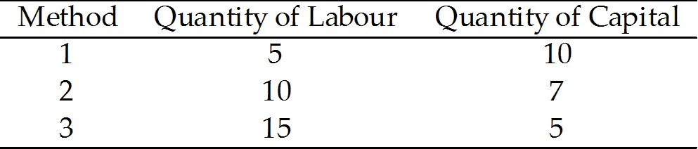
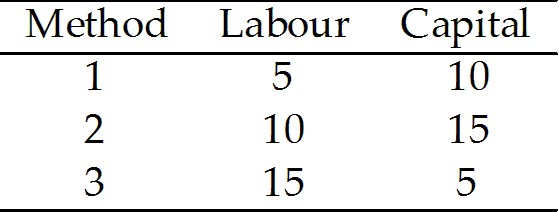
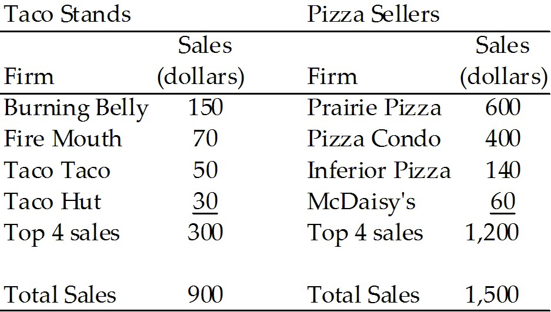

**Chapter 10 Organizing Production**

## 10.1 The Firm and Its Economic Problem

1\) A firm\'s goal is to

A\) maximize revenue.

B\) maximize cost while minimizing revenue.

C\) maximize profit.

D\) minimize costs.

E\) minimize risk.

---
---
Answer: C

---

Diff: 1 Type: MC

Topic: The Firm and Its Economic Problem

2\) A firm\'s total opportunity cost of production is the sum of the cost
of using resources

A\) bought in the market.

B\) owned by the firm.

C\) supplied by the firm\'s owner.

D\) bought in the market and supplied by the firm\'s owner.

E\) bought in the market, owned by the firm, and supplied by the firm\'s
owner.

---
---
Answer: E

---

Diff: 1 Type: MC

Topic: The Firm and Its Economic Problem

3\) The implicit rental rate

A\) is the firm\'s opportunity cost of using the capital it owns.

B\) is paid with cash.

C\) has two components: economic depreciation and foregone interest.

D\) both A and C are correct.

E\) both B and C are correct.

---
---
Answer: D

---

Diff: 1 Type: MC

Topic: The Firm and Its Economic Problem

4\) Which one of the following is included in the implicit rental rate of
capital?

A\) economic depreciation

B\) the cost of electricity

C\) the cost of raw materials

D\) the cost of low-skilled labour

E\) the cost of heating

---
---
Answer: A

---

Diff: 2 Type: MC

Topic: The Firm and Its Economic Problem

5\) Which one of the following statements about the implicit rental rate
of capital is true?

A\) It is the market value of capital.

B\) It is the opportunity cost to a firm of using its own capital.

C\) It includes normal profit.

D\) It is the amount paid for the use of land or buildings.

E\) It is the depreciated value of capital.

---
---
Answer: B

---

Diff: 1 Type: MC

Topic: The Firm and Its Economic Problem

6\) The difference in the market value of a new car and the market value
of the same car one year later is

A\) economic depreciation.

B\) physical depreciation.

C\) economic deterioration.

D\) physical deterioration.

E\) conventional depreciation.

---
---
Answer: A

---

Diff: 1 Type: MC

Topic: The Firm and Its Economic Problem

7\) Economic depreciation is

A\) the same as depreciation calculated by an accountant.

B\) equal to economic profit minus normal profit.

C\) the change in the market value of capital over a given period.

D\) the deterioration of the physical appearance of a capital.

E\) paid in cash.

---
---
Answer: C

---

Diff: 1 Type: MC

Topic: The Firm and Its Economic Problem

8\) Marc bought a new car last year for \$10,000. He can now sell the car
for \$8,500. To buy this year\'s model of the same car he would have to
pay \$11,000. What is the one-year amount of economic depreciation?

A\) \$2,500

B\) \$1,500

C\) \$1,000

D\) \$10,000

E\) \$3,500

---
---
Answer: B

---

Diff: 2 Type: MC

Topic: The Firm and Its Economic Problem

9\) Marc bought a new car last year for \$10,000. He can now sell the car
for \$8,500. To buy this year\'s model of the same car he would have to
pay \$11,000. What is the implicit rental rate using the car for one
year at a zero percent interest rate?

A\) \$2,500

B\) \$3,500

C\) \$1,000

D\) \$10,000

E\) \$1,500

---
---
Answer: E

---

Diff: 2 Type: MC

Topic: The Firm and Its Economic Problem

10\) Marc bought a new car last year for \$10,000. He can now sell the
car for \$8,500. To buy this year\'s model he would have to pay
\$11,000. Marc also had to take out a \$9,000 loan to buy the car, which
had to be paid back in yearly installments of \$3,300 per year over
three years. What is the implicit rental rate of the first year\'s use
of the car?

A\) \$2,800

B\) \$1,300

C\) \$1,800

D\) \$13,300

E\) \$4,800

---
---
Answer: C

---

Diff: 3 Type: MC

Topic: The Firm and Its Economic Problem

11\) The implicit rental rate to a firm of owning a building is

A\) the sum of economic depreciation and foregone interest.

B\) economic depreciation only.

C\) foregone interest only.

D\) the cost of using an alternative building.

E\) the rent paid on the building.

---
---
Answer: A

---

Diff: 2 Type: MC

Topic: The Firm and Its Economic Problem

12\) Gerald is a freelance writer who could work for a newspaper at
\$25,000 a year but instead runs his own business making revenue of
\$40,000 a year. His only business expenses are \$1,000 for writing
materials and \$12,000 for rent. What is Gerald\'s economic profit from
working as a freelance writer?

A\) \$2,000

B\) \$28,000

C\) \$15,000

D\) \$25,000

E\) \$27,000

---
---
Answer: A

---

Diff: 2 Type: MC

Topic: The Firm and Its Economic Problem

13\) Economic profit equals total revenue minus

A\) the cost of resources bought in the market.

B\) the implicit rental rate.

C\) the opportunity cost of production.

D\) the cost of resources supplied by the owner.

E\) the cost of resources owned by the firm.

---
---
Answer: C

---

Diff: 2 Type: MC

Topic: The Firm and Its Economic Problem

14\) In general,

\(1) opportunity cost is greater than accounting cost.

\(2) opportunity cost is less than accounting cost.

\(3) economic profit is greater than accounting profit.

\(4) economic profit is less than accounting profit.

A\) 1 only

B\) 1 and 3

C\) 1 and 4

D\) 2 and 3

E\) 2 and 4

---
---
Answer: C

---

Diff: 2 Type: MC

Topic: The Firm and Its Economic Problem

Source: Study Guide

15\) A profit-maximizing firm is constrained by

A\) demand for its product.

B\) limited resources.

C\) available technology.

D\) limited information.

E\) all of the above.

---
---
Answer: E

---

Diff: 2 Type: MC

Topic: The Firm and Its Economic Problem

Source: Study Guide

16\) Normal profit is the \_\_\_\_\_\_\_\_. Normal profit
\_\_\_\_\_\_\_\_ part of a firm\'s opportunity cost because
\_\_\_\_\_\_\_\_.

A\) return that an entrepreneur can expect to receive on the average; is;
it is the cost of a foregone alternative, which is running another firm

B\) profit used by the Canada Revenue Agency to calculate tax owing; is;
part of it must be paid to the government and is no longer available to
the entrepreneur

C\) profit used by the Canada Revenue Agency to calculate tax owing; is;
it is paid in cash

D\) return that an entrepreneur can expect to receive on the average; is
not; it is not paid in cash

E\) profit used by the Canada Revenue Agency to calculate tax owing; is;
it includes depreciation

---
---
Answer: A

---

Type: MC

Topic: The Firm and Its Economic Problem

Source: MyEconLab

17\) A firm\'s opportunity cost includes

A\) the cost of using resources bought in the market and owned by the
firm only.

B\) the cost of using resources bought in the market, owned by the firm,
and supplied by the firm\'s owner.

C\) only costs that are paid in cash or by cheque.

D\) the cost of using resources supplied by the firm\'s owner only.

E\) economic profit.

---
---
Answer: B

---

Type: MC

Topic: The Firm and Its Economic Problem

Source: MyEconLab

18\) Which of the following is part of a firm\'s opportunity cost of
production?

I. wages

II\. utility costs

III\. interest on a bank loan

IV\. interest forgone on funds used to buy capital equipment

A\) I only

B\) II only

C\) III only

D\) IV only

E\) I, II, III, and IV

---
---
Answer: E

---

Type: MC

19\) If economic profit is equal to zero then the firm is making

A\) a normal profit.

B\) zero profit as recorded by accountants.

C\) negative profit as recorded by accountants.

D\) zero taxable income.

E\) an amount equal to the implicit rental rate.

---
---
Answer: A

---

Type: MC

## 10.2 Technological and Economic Efficiency

1\) Firm *A* can produce a unit of output with 10 hours of labour and 5
units of capital. Firm *B* can produce a unit of output with 5 hours of
labour and 10 units of capital. Firm *C* can produce a unit of output
with 10 hours of labour and 10 units of capital. If the prices of labour
and material are \$10 and \$5, respectively which firm is
*technologically* efficient?

A\) *A* only

B\) *B* only

C\) *C* only

D\) *A* and *B*

E\) *A* and *C*

---
---
Answer: D

---

Diff: 3 Type: MC

Topic: Technological and Economic Efficiency

2\) To produce a unit of output, Alphaworks uses 10 hours of labour and 5
kilograms of material. Betaworks uses 5 hours of labour and 10 kilograms
of material, and Gammaworks uses 10 hours of labour and 10 kilograms of
material. If labour costs \$10 per hour and material costs \$5 per
kilogram, which firm is *economically* efficient?

A\) Alphaworks only

B\) Betaworks only

C\) Gammaworks only

D\) Alphaworks and Betaworks

E\) Alphaworks and Gammaworks

---
---
Answer: B

---

Diff: 2 Type: MC

Topic: Technological and Economic Efficiency

Source: Study Guide

3\) Which one of the following statements is *not* true?

A\) A production process is technologically efficient only if it is
producing a given output at the lowest possible cost.

B\) If a process is economically efficient, it must be technologically
efficient as well.

C\) Economic efficiency depends on the relative price of inputs, while
technological efficiency does not.

D\) Economically efficient firms will be more likely to survive than
economically inefficient firms.

E\) Technologically efficient firms are more likely to survive than
technologically inefficient firms.

---
---
Answer: A

---

Diff: 2 Type: MC

Topic: Technological and Economic Efficiency

*\
Use the information below to answer the following questions.*

**Fact 10.2.1**

Consider the following three methods of preparing your tax return.
Method *A* uses a personal computer (cost equal to \$1,000) and 1 hour
of your time. Method *B* uses a calculator (cost equal to \$30) and 12
hours of your time. Method *C* uses pen and paper (cost equal to \$1)
and 2 days (16 hours) of your time.

4\) Consider Fact 10.2.1. Which production method is *technologically*
inefficient?

A\) *A*

B\) *B*

C\) *C*

D\) all of the above

E\) none of the above

---
---
Answer: E

---

Diff: 3 Type: MC

Topic: Technological and Economic Efficiency

5\) Consider Fact 10.2.1. Choose the best statement.

A\) When your wage rate is \$5 per hour, the economically efficient
method is method *C*.

B\) When your wage rate is \$50 per hour, the economically efficient
method is method *B*.

C\) When your wage rate is \$500 per hour, the economically efficient
method is method *A*.

D\) all of the above

E\) B and C only

---
---
Answer: D

---

Diff: 2 Type: MC

Topic: Technological and Economic Efficiency

*\
Use the table below to answer the following questions.*

**Table 10.2.1**

6\) Refer to Table 10.2.1, which shows three methods for making photon
torpedoes. Which method is *technologically* efficient?

A\) 1 only

B\) 2 only

C\) 3 only

D\) all of the methods

E\) 1 and 3 only

---
---
Answer: D

---

Diff: 2 Type: MC

Topic: Technological and Economic Efficiency

Source: Study Guide

7\) Refer to Table 10.2.1. If the price of labour is \$10 per unit and
the price of capital is \$20 per unit, which method is *economically*
efficient?

A\) 1 only

B\) 2 only

C\) 3 only

D\) all of the above

E\) 1 and 3 only

---
---
Answer: B

---

Diff: 2 Type: MC

Topic: Technological and Economic Efficiency

Source: Study Guide

8\) Which one of the following statements is *true*?

A\) All technologically efficient methods are also economically
efficient.

B\) All economically efficient methods are also technologically
efficient.

C\) Technological efficiency changes with changes in relative input
prices.

D\) Technologically efficient firms will be more likely to survive than
economically efficient firms.

E\) none of the above

---
---
Answer: B

---

Diff: 2 Type: MC

Topic: Technological and Economic Efficiency

Source: Study Guide

*\
Use the table below to answer the following questions.*

**Table 10.2.2**

Three methods of making one medical hologram

9\) In Table 10.2.2, which method of making a medical hologram is
*technologically* efficient?

A\) 1 only

B\) 2 only

C\) 3 only

D\) all of the above

E\) 1 and 3 only

---
---
Answer: E

---

Diff: 2 Type: MC

Topic: Technological and Economic Efficiency

10\) Refer to Table 10.2.2. If the price of labour is \$20 per unit and
the price of capital is \$10 per unit, which method is *economically*
efficient?

A\) 1 only

B\) 2 only

C\) 3 only

D\) 2 and 3 only

E\) 1 and 3 only

---
---
Answer: A

---

Diff: 2 Type: MC

Topic: Technological and Economic Efficiency

11\) A firm that uses the latest technology \_\_\_\_\_\_\_\_
technologically efficient because \_\_\_\_\_\_\_\_.

A\) is not necessarily; the firm might not use the least amount of inputs
to produce a given output

B\) is not necessarily; new technology is more expensive than old
technology

C\) is; efficiency is about costs rather than when the technology was
developed

D\) is; new technology isn\'t developed unless it is efficient

E\) is; most consumers want access to the latest technology

---
---
Answer: A

---

Type: MC

Topic: Technological and Economic Efficiency

Source: MyEconLab

12\) Some firms use large amounts of capital and small amounts of labour,
while others use small amounts of capital and large amounts of labour to

A\) use surpluses of labour and capital and eliminate unemployment of
these resources.

B\) use the best available technology.

C\) use the resources that are most readily available.

D\) maximize profit.

E\) maximize production.

---
---
Answer: D

---

Type: MC

Topic: Technological and Economic Efficiency

Source: MyEconLab

13\) Emma owns a firm that produces umbrellas. Currently, Emma produces
2,500 umbrellas a day. Emma cannot produce more umbrellas in a day
unless she purchases another machine or else hires more workers. Emma is
\_\_\_\_\_\_\_\_ efficient.

A\) economically

B\) economically and technologically

C\) technologically

D\) not

E\) capital and labour

---
---
Answer: C

---

Type: MC

14\) A firm that is technologically efficient

A\) always makes an economic profit.

B\) *must* be economically efficient, but a firm that is economically
efficient is not always technologically efficient.

C\) *must* be economically efficient, and a firm that is economically
efficient *must* always be technologically efficient.

D\) is not always economically efficient, and a firm that is economically
efficient is not always technologically efficient.

E\) is not always economically efficient, but a firm that is economically
efficient *must* always be technologically efficient.

---
---
Answer: E

---

Type: MC

## 10.3 Information and Organization

1\) In the relationship between the owner of a bakery and the baker, the
owner is

A\) an agent, as is the baker.

B\) an agent and the baker is a principal.

C\) a principal and the baker is an agent.

D\) a principal, as is the baker.

E\) neither a principal nor an agent, but the baker is an agent.

---
---
Answer: C

---

Diff: 1 Type: MC

Topic: Information and Organization

2\) A firm with a single owner who has unlimited liability is

A\) a corporation.

B\) a sole proprietorship.

C\) a limited partnership.

D\) an unlimited partnership.

E\) a cooperative.

---
---
Answer: B

---

Diff: 1 Type: MC

Topic: Information and Organization

3\) The legal responsibility for debts incurred by a sole proprietorship
falls upon

A\) the shareholders.

B\) the partners of the sole proprietorship.

C\) the owner.

D\) the creditors.

E\) the managers.

---
---
Answer: C

---

Diff: 1 Type: MC

Topic: Information and Organization

4\) The profits of a sole proprietorship are

A\) taxed twice.

B\) subject to a corporate tax.

C\) not taxed.

D\) exempt from taxation.

E\) treated as the owner\'s income.

---
---
Answer: E

---

Diff: 1 Type: MC

Topic: Information and Organization

5\) Typical examples of a partnership would include which one of the
following?

A\) a law firm

B\) a corner drugstore

C\) an automobile manufacturer

D\) a bank

E\) a freelance writer

---
---
Answer: A

---

Diff: 1 Type: MC

Topic: Information and Organization

6\) In a partnership, each partner is legally liable for

A\) all the debts of the partnership.

B\) the fraction of the debts corresponding to the fraction of ownership.

C\) 50 percent of the debt.

D\) all debts of the partnership limited by the personal wealth of the
partner.

E\) an amount of debt limited to the amount of the partner\'s investment
in the partnership.

---
---
Answer: D

---

Diff: 1 Type: MC

Topic: Information and Organization

7\) Most establishments in Canada

A\) employ between 5 and 99 people.

B\) employ more than 100 people.

C\) employ fewer than 5 people.

D\) employ more than 500 people.

E\) are partnerships.

---
---
Answer: C

---

Diff: 1 Type: MC

Topic: Information and Organization

8\) Susan invests \$1,000 to buy shares of TooNew stock. The company
declares bankruptcy, leaving many debts unpaid, including Susan\'s
\$1,000 investment. Susan has a personal net worth of \$50,000. What
will be Susan\'s final net worth if TooNew has total unpaid debts of
\$30,000?

A\) \$19,000

B\) \$21,000

C\) \$49,000

D\) \$51,000

E\) \$20,000

---
---
Answer: C

---

Diff: 2 Type: MC

Topic: Information and Organization

9\) Mr. Brown opens his restaurant as a sole proprietorship. After a year
of disastrous reviews, he has gone deeply into debt. His liability is

A\) zero; he has already lost all his money.

B\) the amount of his original investment.

C\) limited only by his entire wealth.

D\) limited to assets owned by the restaurant.

E\) depends upon how much money he has in his savings account.

---
---
Answer: C

---

Diff: 2 Type: MC

Topic: Information and Organization

10\) A firm with two or more owners who have unlimited liability is

A\) a sole proprietorship.

B\) a partnership.

C\) a conglomerate.

D\) a corporation.

E\) a public company.

---
---
Answer: B

---

Diff: 1 Type: MC

Topic: Information and Organization

Source: Study Guide

11\) A firm with one or more owners of limited liability is

A\) a sole proprietorship.

B\) a partnership.

C\) a conglomerate.

D\) a corporation.

E\) a public company.

---
---
Answer: D

---

Diff: 1 Type: MC

Topic: Information and Organization

12\) What is a *disadvantage* of a corporation relative to a sole
proprietorship or partnership?

A\) Owners have unlimited liability.

B\) Profits are taxed twice; as corporate profits and as dividend income
and capital gains to stockholders.

C\) high cost of capital

D\) perpetual life

E\) None of the above.

---
---
Answer: B

---

Diff: 2 Type: MC

Topic: Information and Organization

Source: Study Guide

13\) Which one of the following is an *advantage* of a corporation
relative to a proprietorship or partnership?

A\) Owners have limited liability.

B\) Profits are taxed once.

C\) difficult to raise money

D\) no principal-agent problems

E\) None of the above.

---
---
Answer: A

---

Diff: 2 Type: MC

Topic: Information and Organization

14\) A sole proprietorship

A\) dies with the owner.

B\) is the same as a partnership.

C\) always bring a higher return to its owner than a corporation brings
to its owners.

D\) is a not-for-profit firm.

E\) has a complex management structure.

---
---
Answer: A

---

Diff: 1 Type: MC

Topic: Information and Organization

15\) Firms organize production by using

A\) command systems only.

B\) incentive systems only.

C\) command and incentive systems.

D\) market systems only.

E\) principal-agent systems only.

---
---
Answer: C

---

Diff: 2 Type: MC

Topic: Information and Organization

Source: Study Guide

16\) Firm strategies for coping with the principal-agent problem are

A\) ownership, incentive pay, and long-term contracts.

B\) sole proprietorship, partnership, and the corporation.

C\) economies of scale, scope, and team production.

D\) technology, information, and the market.

E\) ownership, scope, and the market.

---
---
Answer: A

---

Diff: 2 Type: MC

Topic: Information and Organization

Source: Study Guide

17\) Firms cope with uncertainty and incomplete information by using

A\) sole proprietorship, limited liability, and market coordination.

B\) ownership, incentive pay, and long-term contracts.

C\) team production, economies of scale, and transactions costs.

D\) the market, the firm, and internal organization.

E\) team production, economies of scale, and transaction costs.

---
---
Answer: B

---

Diff: 2 Type: MC

Topic: Information and Organization

18\) The possibility that an employee may not work hard is an example of
the

A\) limited liability problem.

B\) principal-agent problem.

C\) transactions cost problem.

D\) technological efficiency problem.

E\) partnership problem.

---
---
Answer: B

---

Diff: 2 Type: MC

Topic: Information and Organization

Source: Study Guide

19\) The principal-agent problem exists when

A\) there is no command system in place.

B\) firms operate as sole proprietorships.

C\) agents do not act in the best interest of principals.

D\) principals do not act in the best interest of agents.

E\) the future value of money is more than its current value.

---
---
Answer: C

---

Diff: 1 Type: MC

Topic: Information and Organization

20\) Federal Express enters into contracts with independent truck
operators who offer FedEx service and who are rewarded by the volume
(cubic feet) of packages they carry.

FedEx does not hire more independent drivers because

A\) it is concerned about a possible downturn in the economy and the
effects of overexpansion.

B\) it cannot afford more trucks and more drivers.

C\) of the principal-agent problem.

D\) it is a corporation, so it wants to have a limited number of
independent truck owners operating as proprietorships.

E\) trucks are not a technologically efficient method of transporting
parcels.

---
---
Answer: C

---

Type: MC

Topic: Information and Organization

Source: MyEconLab

21\) It is a disadvantage of \_\_\_\_\_\_\_\_ that retained profits are
taxed twice.

It is a disadvantage of \_\_\_\_\_\_\_\_ that bad decisions are not
checked by the need for consensus.

A\) a sole proprietorship; both a partnership and a sole proprietorship

B\) a corporation; a sole proprietorship

C\) both a partnership and a sole proprietorship; a partnership

D\) a corporation; both a partnership and a sole proprietorship

E\) both a corporation and a partnership; a sole proprietorship

---
---
Answer: B

---

Type: MC

Topic: Information and Organization

Source: MyEconLab

22\) A golf club manufacturer pays its workers based on the number of
sets of clubs they produce. This firm

A\) organizes production based on a command system.

B\) does not have a principal-agent problem.

C\) is a sole proprietorship.

D\) organizes production based on an incentive system.

E\) is a corporation.

---
---
Answer: D

---

Type: MC

23\) An example of the principal-agent problem occurs when

A\) an agent is more motivated than the principle to provide a
high-quality good or service.

B\) managers try to cope with employees that are inefficient.

C\) sole proprietors don\'t receive any money payment for their
entrepreneurial skills.

D\) managers devise penalties that eliminate employee waste.

E\) managers devise incentives that encourage employees to act in the
owner\'s behalf.

---
---
Answer: E

---

Type: MC

## 10.4 Markets and the Competitive Environment

*Use the table below to answer the following questions.*

**Table 10.4.1**

1\) Refer to Table 10.4.1. The four-firm concentration ratio for taco
stands is

A\) 15 percent.

B\) 100 percent.

C\) 80 percent.

D\) 33 percent.

E\) 30 percent.

---
---
Answer: D

---

Diff: 2 Type: MC

Topic: Markets and the Competitive Environment

2\) Refer to Table 10.4.1. The four-firm concentration ratio for the
pizza sellers is

A\) 40 percent.

B\) 100 percent.

C\) 80 percent.

D\) 33 percent.

E\) 12.5 percent.

---
---
Answer: C

---

Diff: 2 Type: MC

Topic: Markets and the Competitive Environment

3\) Which one of the following statements describes a market that is
monopolistically competitive?

A\) The presence of significant barriers to entry.

B\) The products produced by the firms are identical.

C\) Many firms compete by making similar but slightly different products.

D\) There is a small number of large firms.

E\) The product produced by one firm has no close substitutes.

---
---
Answer: C

---

Diff: 2 Type: MC

Topic: Markets and the Competitive Environment

4\) One difference between perfect competition and monopolistic
competition is

A\) firms in a perfectly competitive market produce similar but slightly
different products.

B\) in perfect competition, the product produced has no close
substitutes.

C\) monopolistic competition has barriers to entry, whereas perfect
competition has none.

D\) firms in monopolistic competition have some degree of market power.

E\) a small number of firms compete in a monopolistically competitive
market and a large number of firms compete in a perfectly competitive
market.

---
---
Answer: D

---

Diff: 2 Type: MC

Topic: Markets and the Competitive Environment

5\) One difference between oligopoly and monopolistic competition is

A\) there is a smaller number of firms in a monopolistically competitive
market than in an oligopoly.

B\) in oligopolies firms make slightly different products whereas in
monopolistic competition the products are identical.

C\) monopolistic competition has barriers to entry, whereas oligopoly has
none.

D\) fewer firms compete in an oligopoly than in a monopolistically
competitive market.

E\) in oligopolies, firms are typically smaller in size.

---
---
Answer: D

---

Diff: 2 Type: MC

Topic: Markets and the Competitive Environment

6\) The four-firm concentration ratio measures the share of the largest
four firms in total industry

A\) profit.

B\) sales.

C\) cost.

D\) capital.

E\) loss.

---
---
Answer: B

---

Diff: 2 Type: MC

Topic: Markets and the Competitive Environment

Source: Study Guide

7\) The purpose of calculating the concentration ratio is

A\) to obtain the firm\'s total profit.

B\) to obtain the firm\'s production cost.

C\) to measure the losses the firm incurred.

D\) to measure the extent to which the market is dominated by a small
number of firms.

E\) to distinguish between the firm\'s total profit and production cost.

---
---
Answer: D

---

Diff: 2 Type: MC

Topic: Markets and the Competitive Environment

8\) In a perfectly competitive market, the four-firm concentration ratio
is

A\) almost zero.

B\) 50 percent.

C\) 100 percent.

D\) 75 percent.

E\) 25 percent.

---
---
Answer: A

---

Diff: 2 Type: MC

Topic: Markets and the Competitive Environment

9\) In a monopoly, the four-firm concentration ratio is

A\) 75 percent.

B\) 100 percent.

C\) almost zero.

D\) 25 percent.

E\) 50 percent.

---
---
Answer: B

---

Diff: 2 Type: MC

Topic: Markets and the Competitive Environment

10\) A four-firm concentration ratio of less than 60 percent indicates

A\) a monopoly.

B\) a market that is dominated by a few firms.

C\) a competitive market.

D\) an oligopoly.

E\) an absence of competition.

---
---
Answer: C

---

Diff: 2 Type: MC

Topic: Markets and the Competitive Environment

11\) A four-firm concentration ratio that exceeds 60 percent indicates

A\) a perfectly competitive market.

B\) a monopolistically competitive market.

C\) a monopoly.

D\) an oligopoly.

E\) a competitive market.

---
---
Answer: D

---

Diff: 2 Type: MC

Topic: Markets and the Competitive Environment

12\) The Herfindahl-Hirschman Index (HHI) is the square of the percentage
market share of each firm summed over the \_\_\_\_\_\_\_\_ firms in a
market.

A\) largest 60

B\) largest 50

C\) smallest 50

D\) largest 75

E\) smallest 60

---
---
Answer: B

---

Diff: 2 Type: MC

Topic: Markets and the Competitive Environment

13\) In a perfectly competitive market, the Herfindahl-Hirschman Index
(HHI)

A\) is small.

B\) is usually greater than 5,000.

C\) is greater than 1,000 but less than 2,000.

D\) lies between 1,200 and 1,500.

E\) is greater than 10,000.

---
---
Answer: A

---

Diff: 2 Type: MC

Topic: Markets and the Competitive Environment

14\) A market in which the Herfindahl-Hirschman Index (HHI) lies between
1,000 and 1,800 is regarded as being

A\) a monopoly.

B\) an oligopoly.

C\) a perfectly competitive market.

D\) a moderately competitive market.

E\) a potential matter of concern for regulators.

---
---
Answer: D

---

Diff: 2 Type: MC

Topic: Markets and the Competitive Environment

15\) When the Herfindahl-Hirschman Index (HHI) is greater than 1,800,

A\) the market is very competitive.

B\) a monopoly exists.

C\) there are many producers in the market.

D\) the market is moderately competitive.

E\) the market is uncompetitive.

---
---
Answer: E

---

Diff: 2 Type: MC

Topic: Markets and the Competitive Environment

16\) An industry with a high four-firm concentration ratio may have
little monopoly power if

A\) its production is geographically concentrated.

B\) its barriers to entry are low.

C\) its barriers to entry are high.

D\) there are no international producers of the product.

E\) there are no close substitutes for its product.

---
---
Answer: B

---

Diff: 2 Type: MC

Topic: Markets and the Competitive Environment

17\) The four-firm concentration ratio tells us the percentage of
\_\_\_\_\_\_\_\_ for the four largest firms in an industry.

A\) employment

B\) accounting profit

C\) economic profit

D\) the value of sales

E\) physical output

---
---
Answer: D

---

Diff: 2 Type: MC

Topic: Markets and the Competitive Environment

18\) A provincial phone company like SaskTel likely has

A\) a high four-firm concentration ratio in the province, but a low one
nationally.

B\) a low four-firm concentration ratio in the province, but a high one
nationally.

C\) a low four-firm concentration ratio in the province and nationally.

D\) a high four-firm concentration ratio in the province and nationally.

E\) a four-firm concentration ratio of zero.

---
---
Answer: A

---

Diff: 2 Type: MC

Topic: Markets and the Competitive Environment

19\) What is the maximum value of the Herfindahl-Hirschman Index?

A\) 1

B\) 1,000,000

C\) 100,000

D\) 10,000

E\) 1,000

---
---
Answer: D

---

Diff: 3 Type: MC

Topic: Markets and the Competitive Environment

20\) The Herfindahl-Hirschman Index is calculated as

A\) the cube of the percentage market share of each firm summed over the
largest 100 firms.

B\) the square of the percentage market share of each firm summed over
the largest 50 firms or summed over all the firms if there are fewer
than 50.

C\) the square of the percentage market share of each firm summed over
the largest 20 firms.

D\) double the market share of the five largest firms.

E\) none of the above.

---
---
Answer: B

---

Diff: 2 Type: MC

Topic: Markets and the Competitive Environment

21\) If a market is shared equally by four firms, the
Herfindahl-Hirschman Index is

A\) 1/4.

B\) 4.

C\) 25.

D\) 100.

E\) 2,500.

---
---
Answer: E

---

Diff: 3 Type: MC

Topic: Markets and the Competitive Environment

22\) Where the Herfindahl-Hirschman Index is less than 1,000, the market
is regarded as

A\) a monopoly.

B\) an oligopoly.

C\) competitive.

D\) regulated.

E\) none of the above.

---
---
Answer: C

---

Diff: 2 Type: MC

Topic: Markets and the Competitive Environment

23\) A market structure where a small number of firms compete occurs in

A\) perfect competition.

B\) monopolistic competition.

C\) the worldwide market for wheat, corn, and rice.

D\) oligopoly.

E\) monopoly.

---
---
Answer: D

---

Diff: 2 Type: MC

Topic: Markets and the Competitive Environment

Source: Study Guide

24\) Which of the following industries in Canada has the highest
four-firm concentration ratio?

A\) audio and video equipment

B\) clothing

C\) bakery items

D\) fabrics

E\) tobacco products

---
---
Answer: E

---

Diff: 2 Type: MC

Topic: Markets and the Competitive Environment

25\) Which of the following industries in Canada has the lowest four-firm
concentration ratio?

A\) tires

B\) soft drinks and ice

C\) textiles

D\) sugar

E\) wooden windows and doors

---
---
Answer: C

---

Diff: 2 Type: MC

Topic: Markets and the Competitive Environment

26\) The Herfindahl-Hirschman Index (HHI) for a local water supplier is

A\) less than 100.

B\) between 101 and 999.

C\) more than 1,000 but less than 2,000.

D\) 10,000.

E\) between 2,000 and 5,000.

---
---
Answer: D

---

Diff: 2 Type: MC

Topic: Markets and the Competitive Environment

27\) If a market is shared equally by 100 firms, the Herfindahl-Hirschman
Index is

A\) 1/100.

B\) 1/50.

C\) 1.

D\) 50.

E\) 100.

---
---
Answer: D

---

Diff: 3 Type: MC

Topic: Markets and the Competitive Environment

28\) Product differentiation is always a feature in

A\) perfect competition.

B\) monopolistic competition.

C\) oligopoly.

D\) monopoly.

E\) all of the above.

---
---
Answer: B

---

Diff: 2 Type: MC

Topic: Markets and the Competitive Environment

Source: Study Guide

29\) The North American economy is \_\_\_\_\_\_\_\_ and is becoming
\_\_\_\_\_\_\_\_ competitive.

A\) uncompetitive; less

B\) competitive; more

C\) competitive; less

D\) uncompetitive; more

E\) currently an oligopolistic market; more

---
---
Answer: B

---

Type: MC

Topic: Markets and the Competitive Environment

Source: MyEconLab

30\) The four-firm concentration ratio in an industry is 75 percent.

Total sales in the industry are \$800 million and total economic profit
in the industry is \$500 million. Normal profit for each firm is zero.

From this information we know that

A\) economic profit of any four firms is at least \$667 million.

B\) total sales from the four largest firms is \$600 million.

C\) economic profit of the four largest firms is \$375 million.

D\) total sales from any four firms is at least \$1,067 million.

E\) economic profit of the four largest firms is \$500 million.

---
---
Answer: B

---

Type: MC

Topic: Markets and the Competitive Environment

Source: MyEconLab

31\) Which of the following pairs of market types are both characterized
by having a large number of firms?

A\) oligopoly and monopolistic competition

B\) monopoly and oligopoly

C\) perfect competition and monopolistic competition

D\) monopoly and monopolistic competition

E\) perfect competition and oligopoly

---
---
Answer: C

---

Type: MC

32\) The correct ranking of the four basic market structures from low HHI
(Herfindahl-Hirschaman Index) to high HHI is

A\) monopolistic competition, perfect competition, oligopoly, monopoly.

B\) perfect competition, oligopoly, monopolistic competition, monopoly.

C\) monopoly, oligopoly, monopolistic competition, perfect competition.

D\) perfect competition, monopolistic competition, oligopoly, monopoly.

E\) monopoly, monopolistic competition, oligopoly, perfect competition. [
]{.underline}

---
---
Answer: D

---

Type: MC

## 10.5 Produce or Outsource? Firms and Markets

1\) Which one of the following is not generally a transactions cost?

A\) the fee to a broker for buying stocks

B\) the cost of a lawyer who drafts a contract

C\) the cost of hiring someone to find you a supplier of raw materials

D\) the cost of the owner\'s time in a sole proprietorship

E\) the cost of phone calls made to find a buyer

---
---
Answer: D

---

Diff: 2 Type: MC

Topic: Produce or Outsource? Firms and Markets

2\) When the cost of producing a unit of a good falls as its output rate
increases,

A\) economies of scale exist.

B\) economies of scope exist.

C\) transactions costs are zero.

D\) market coordination is unnecessary.

E\) the firm is a partnership.

---
---
Answer: A

---

Diff: 1 Type: MC

Topic: Produce or Outsource? Firms and Markets

3\) Which one of the following would *not* likely be a firm with
economies of scale?

A\) an electrical production plant

B\) a steel mill

C\) a telephone company

D\) a firm that produces handmade cabinetry

E\) a multi-store dry-cleaning firm

---
---
Answer: D

---

Diff: 2 Type: MC

Topic: Produce or Outsource? Firms and Markets

4\) A firm with a sales department, a production department, and a
marketing department is an example of

A\) team production.

B\) joint production.

C\) economies of scale.

D\) economies of scope.

E\) transactions costs.

---
---
Answer: A

---

Diff: 1 Type: MC

Topic: Produce or Outsource? Firms and Markets

5\) Team production is

A\) a production process with decreasing costs per unit as production
increases.

B\) a production process with individuals specializing in mutually
supportive tasks.

C\) the production that results from market activity.

D\) the cost of organizing an assembly line.

E\) the lower costs resulting from organizing a firm versus using the
market to coordinate production.

---
---
Answer: B

---

Diff: 1 Type: MC

Topic: Produce or Outsource? Firms and Markets

6\) Firms coordinate economic activity more efficiently than markets when
firms have

A\) lower transactions costs.

B\) economies of scale.

C\) economies of scope.

D\) economies of team production.

E\) all of the above.

---
---
Answer: E

---

Diff: 2 Type: MC

Topic: Produce or Outsource? Firms and Markets

Source: Study Guide

7\) Which one of the following statements is *true*?

A\) Firms are markets in and of themselves.

B\) Firms do not organize factors of production to produce goods and
services.

C\) Firms are buyers of consumer goods and services.

D\) Efficient firms can eliminate scarcity.

E\) Firms are often more efficient than markets as coordinators of
economic activity.

---
---
Answer: E

---

Diff: 1 Type: MC

Topic: Produce or Outsource? Firms and Markets

8\) A group of business people are having coffee. Which of the following
quotations describes economies of scale?

A\) \"The new production process we\'ve installed uses less capital and
labour than the old one.\"

B\) \"The new assembly line has higher capital costs, but the fall in
workers\' hours has lowered overall costs.\"

C\) \"The costs of per-unit production have fallen dramatically as we
have increased the length of the production runs.\"

D\) \"Despite the higher costs of negotiating the contracts, hiring the
cleaning firm is much cheaper than using our own staff.\"

E\) \"The computer servicing people we have hired work very well as an
integrated problem-solving group.\"

---
---
Answer: C

---

Diff: 2 Type: MC

Topic: Produce or Outsource? Firms and Markets

9\) A group of business people are having coffee. Which of the following
quotations describes transactions costs?

A\) \"The new production process we\'ve installed uses less capital and
labour than the old one.\"

B\) \"The new assembly line has higher capital costs, but the fall in
workers\' hours has lowered overall costs.\"

C\) \"The costs of per-unit production have fallen dramatically as we
have increased the length of the production runs.\"

D\) \"Despite the higher costs of negotiating the contracts, hiring the
cleaning firm is much cheaper than using our own staff.\"

E\) \"The computer servicing people we have hired work very well as an
integrated problem-solving group.\"

---
---
Answer: D

---

Diff: 2 Type: MC

Topic: Produce or Outsource? Firms and Markets

10\) The major factor determining whether a firm or a market coordinates
a particular set of activities is

A\) cost.

B\) a sale.

C\) depreciation.

D\) the size of the market.

E\) the number of workers.

---
---
Answer: A

---

Diff: 2 Type: MC

Topic: Produce or Outsource? Firms and Markets

11\) Which of the following activities is most likely to be coordinated
by a firm, instead of a market?

A\) a large rock concert in Vancouver

B\) producing paperclips

C\) running a golf course

D\) selling groceries

E\) all of the above except A

---
---
Answer: E

---

Diff: 3 Type: MC

Topic: Produce or Outsource? Firms and Markets

12\) A firm with a lower unit cost from producing a wider range of goods
and services has economies of

A\) transactions costs.

B\) scale.

C\) scope.

D\) team production.

E\) market coordination.

---
---
Answer: C

---

Diff: 2 Type: MC

Topic: Produce or Outsource? Firms and Markets

Source: Study Guide

*Use the information below to answer the following question.*

**Fact 10.5.1**

Two leading design firms, Astro Studios of San Francisco and Hers
Experimental Design Labouratory, Inc. of Osaka, Japan, worked with
Microsoft to design the Xbox 360 video game console. IBM, ATI, and SiS
designed the Xbox 360\'s hardware. Three firms, Flextronics, Wistron,
and Celestica, manufacture the Xbox 360 at their plants in China and
Taiwan.

13\) Refer to Fact 10.5.1. Microsoft works with a large number of other
firms to bring the Xbox to market, rather than performing all the
required tasks at its headquarters in Seattle because

A\) Microsoft wants to control as many firms as possible and by sending
Xbox design and production to other firms, Microsoft gains control in a
new market.

B\) this is the method of production with the lowest cost.

C\) Microsoft employees do not have the expertise to perform the
necessary tasks.

D\) Microsoft already dominates too many markets and the government
requires that other firms coordinate Xbox design and production.

E\) All of the above.

---
---
Answer: B

---

Type: MC

Topic: Produce or Outsource? Firms and Markets

Source: MyEconLab

14\) All of the following statements are correct *except*

A\) firms coordinate economic activity when they can perform a task more
efficiently than markets can.

B\) Nobel Laureate Ronald Coase stated that firms cannot be more
efficient than markets.

C\) markets can coordinate production.

D\) firms are often more efficient than markets as coordinators of
economic activity because they can achieve lower transactions costs,
economies of scale, economies of scope, and economies of team
production.

E\) outsourcing is an example of market coordination.

---
---
Answer: A

---

Type: MC

Topic: Produce or Outsource? Firms and Markets

Source: MyEconLab

15\) When Jitters Coffee Company, Inc., can lower the cost of packaging a
kilogram of coffee by doubling the quantity packaged each day, it is
achieving

A\) economies of scope.

B\) lower transactions costs

C\) economies of scale.

D\) efficient team production.

E\) all of the above

---
---
Answer: C

---

Type: MC

16\) Team production is a production process in which

A\) an assembly line is used.

B\) individuals rotate from one task to another.

C\) competing groups perform identical tasks.

D\) individuals specialize in mutually supportive tasks.

E\) pay is based on group output.

---
---
Answer: D

---

Type: MC
