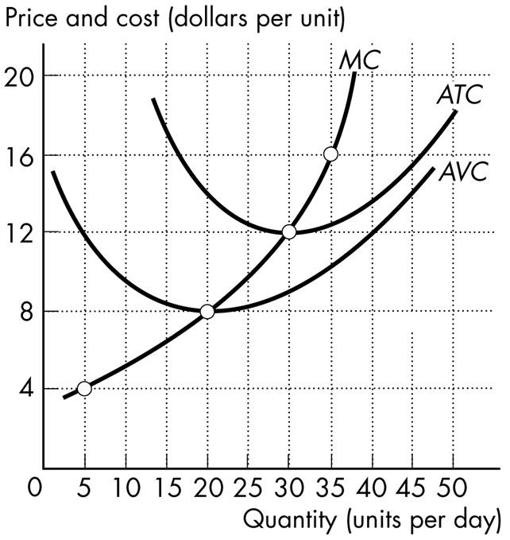

\pagenumbering{gobble}

**Chapter 12 Perfect Competition**

## 12.1 What Is Perfect Competition?

**1\) Perfect competition occurs in a market where there are many firms,**
each selling

A\) an identical product.

B\) a similar product.

C\) a unique product.

D\) a capital-intensive product.

E\) a competitive product.

---
---
Answer: A

---

**2\) Which one of the following does *not* occur in perfect competition?**

A\) No single firm can exert a significant influence on the market price
of the good.

B\) There are many buyers.

C\) There are significant restrictions on entry into the market.

D\) Sellers and buyers are well informed about prices.

E\) Established firms have no advantage over new ones.

---
---
Answer: C

---

**3\) A price-taking firm faces a**

A\) perfectly inelastic demand.

B\) downward-sloping marginal revenue curve.

C\) downward-sloping supply curve.

D\) perfectly elastic demand.

E\) downward-sloping demand curve.

---
---
Answer: D

---

**4\) In a perfectly competitive market, the market demand curve is**
illustrated by

A\) a downward-sloping curve.

B\) a line that is vertical at the market output.

C\) an upward-sloping curve.

D\) a line that is horizontal at the market price.

E\) a curve that is bowed towards the origin.

---
---
Answer: A

---

**5\) The slope of a perfectly competitive firm\'s demand curve is**

A\) infinity.

B\) zero.

C\) 1.

D\) greater than 1.

E\) negative.

---
---
Answer: B

---

**6\) A price taker is a firm that**

A\) must lower its price if it wants to sell more output.

B\) sets the market price.

C\) cannot influence the market price.

D\) is incurring an economic loss.

E\) can raise its price if it lowers output.

---
---
Answer: C

---

**7\) If a firm faces a perfectly elastic demand for its product, then**

A\) it is not a price taker.

B\) it will want to lower its price to increase sales.

C\) it will want to raise its price to increase total revenue.

D\) its marginal revenue curve is horizontal at the market price.

E\) it will always make zero economic profit.

---
---
Answer: D

---

**8\) Marginal revenue is**

A\) the change in total quantity that results from a one-unit increase in
the price of the good.

B\) the change in total revenue that results from a one-unit increase in
the quantity sold.

C\) economic profit divided by the quantity sold.

D\) the change in economic profit that results from a one-unit increase
in the quantity sold.

E\) total revenue minus total cost.

---
---
Answer: B

---

*\
Use the figure below to answer the following questions.*

**Figure 12.1.1**

**9\) Refer to Figure 12.1.1. The firm competes in a perfectly competitive**
market. Curve *A* represents the firm\'s

A\) total fixed cost curve.

B\) average fixed cost curve.

C\) average variable cost curve.

D\) total revenue curve.

E\) marginal revenue curve.

---
---
Answer: D

---

**10\) Refer to Figure 12.1.1. The firm competes in a perfectly competitive**
market. Curve *A* is a straight line because the firm

A\) is a price taker.

B\) faces constant returns to scale.

C\) wants to maximize profits.

D\) has perfect information.

E\) has constant marginal cost.

---
---
Answer: A

---

*\
Use the table below to answer the following questions.*

**Table 12.1.1**

**11\) Refer to Table 12.1.1 which gives the demand schedule for a**
perfectly competitive firm. If the firm sells 5 units of output, total
revenue is

A\) \$15.

B\) \$30.

C\) \$75.

D\) \$90.

E\) \$105.

---
---
Answer: C

---

**12\) Refer to Table 12.1.1 which gives the demand schedule for a**
perfectly competitive firm. If the firm sells 6 units of output,
marginal revenue is

A\) \$15.

B\) \$30.

C\) \$75.

D\) \$90.

E\) \$105.

---
---
Answer: A

---

**13\) Refer to Table 12.1.1 which gives the demand schedule for a**
perfectly competitive firm. If the quantity sold by the firm rises from
5 to 6, marginal revenue is

A\) \$15.

B\) \$30.

C\) \$75.

D\) \$90.

E\) \$105.

---
---
Answer: A

---

**14\) For perfect competition to arise, it is necessary that market demand**
be

A\) inelastic.

B\) elastic.

C\) perfectly elastic.

D\) large relative to the minimum efficient scale of a single firm.

E\) small relative to the minimum efficient scale of a single firm.

---
---
Answer: D

---

**15\) Assume that the leather market is a perfectly competitive market.**
The market demand curve for leather is \_\_\_\_\_\_\_\_ and each
individual leather producer\'s demand curve is \_\_\_\_\_\_\_\_.

A\) vertical; downward sloping

B\) downward sloping; horizontal

C\) downward sloping; vertical

D\) horizontal; horizontal

E\) horizontal; downward sloping

---
---
Answer: B

---

**16\) An example of a perfectly competitive industry is the**

A\) airline industry.

B\) beer industry.

C\) running shoe industry.

D\) fast food industry.

E\) wheat industry.

---
---
Answer: E

---

**17\) Economic profit equals**

A\) total fixed cost plus total variable cost.

B\) total revenue minus marginal cost.

C\) marginal revenue minus marginal cost.

D\) total revenue minus total cost.

E\) total revenue minus total variable cost.

---
---
Answer: D

---

**18\) Lin\'s fortune cookies are identical to the fortune cookies made by**
dozens of other firms, and there is free entry in the fortune cookie
market. Buyers and sellers are well informed about prices. Lin\'s
fortune cookies operates in a \_\_\_\_\_\_\_\_ market.

A\) challenging

B\) monopolistic

C\) perfectly competitive

D\) noncompetitive

E\) perfectly competent

---
---
Answer: C

---

**19\) Lin\'s fortune cookies are identical to the fortune cookies made by**
dozens of other firms, and there is free entry in the fortune cookie
market. Buyers and sellers are well informed about prices. The price of
a fortune cookie is determined by \_\_\_\_\_\_\_\_. The marginal revenue
of a fortune cookie equals \_\_\_\_\_\_\_\_.

A\) market demand and market supply; price

B\) the ingredients that Lin\'s uses to produce his fortune cookies;
average total cost

C\) the number of cookies that Lin\'s produces; average variable cost

D\) the freshness of the fortune cookies; average fixed cost

E\) market demand and market supply; the price elasticity of demand

---
---
Answer: A

---

**20\) A perfectly competitive market is characterized by**

A\) firms that are price setters.

B\) firms that each face a downward-sloping demand curve.

C\) firms that each sell a unique good or service.

D\) buyers who are unaware of the price charged by each firm.

E\) no restrictions on entry into the market.

---
---
Answer: E

---

**21\) When a firm is a \"price taker,\" the firm**

A\) can charge any price that it wants to charge, that is, \"take\" any
price it chooses.

B\) pays a fixed price for all of its fixed inputs.

C\) will accept (\"take\") the lowest price that its customers offer.

D\) pays a fixed price for all of its variable inputs.

E\) cannot influence the market price of the good that it sells.

---
---
Answer: E

---

## 12.2 The Firm\'s Output Decision

*Use the table below to answer the following questions.*

**Table 12.2.1**

**1\) Refer to Table 12.2.1, which gives the total revenue schedule and**
total cost schedule of a perfectly competitive firm. The short-run
equilibrium price of one unit of the good is

A\) \$3.

B\) \$10.

C\) \$15.

D\) \$25.

E\) \$30.

---
---
Answer: E

---

**2\) Refer to Table 12.2.1, which gives the total revenue schedule and**
total cost schedule of a perfectly competitive firm. The marginal
revenue received from the sale of the 4th unit of output is

A\) \$3.

B\) \$15.

C\) \$10.

D\) \$120.

E\) \$30.

---
---
Answer: E

---

**3\) Refer to Table 12.2.1, which gives the total revenue schedule and**
total cost schedule of a perfectly competitive firm. The marginal cost
of increasing production from 4 units to 5 units is

A\) \$14.

B\) \$128.

C\) \$100.

D\) \$25.

E\) \$30.

---
---
Answer: A

---

**4\) Refer to Table 12.2.1, which gives the total revenue schedule and**
total cost schedule of a perfectly competitive firm. If the firm
produces 2 units of output, it

A\) makes an economic profit of \$9.

B\) makes an economic profit of \$60.

C\) incurs an economic loss of \$9.

D\) incurs an economic loss of \$60.

E\) incurs an economic loss of \$69.

---
---
Answer: C

---

**5\) Refer to Table 12.2.1, which gives the total revenue schedule and**
total cost schedule of a perfectly competitive firm. If the firm
produces 3 units of output, it will

A\) make an economic profit of \$4.

B\) make an economic profit of \$90.

C\) incur an economic loss of \$4.

D\) break even.

E\) incur an economic loss of \$86.

---
---
Answer: A

---

**6\) Refer to Table 12.2.1, which gives the total revenue schedule and**
total cost schedule of a perfectly competitive firm. Economic profit is
maximized when the firm produces \_\_\_\_\_\_\_\_ units of output.

A\) zero

B\) 7

C\) 3

D\) 6

E\) 5

---
---
Answer: D

---

**7\) A firm shuts down if price is**

A\) above minimum average variable cost.

B\) below minimum average variable cost.

C\) above minimum average fixed cost.

D\) less than marginal cost.

E\) below average total cost.

---
---
Answer: B

---

*Use the table below to answer the following questions.*

**Table 12.2.2**

**8\) Refer to Table 12.2.2, which gives the total cost schedule for**
Chip\'s Pizza Palace, a perfectly competitive firm. If the price of a
pizza is \$7, what is Chip\'s profit-maximizing output per hour?

A\) zero pizzas

B\) 1 pizza

C\) 2 pizzas

D\) 3 pizzas

E\) 4 pizzas

---
---
Answer: D

---

**9\) Refer to Table 12.2.2, which gives the total cost schedule for**
Chip\'s Pizza Palace, a perfectly competitive firm. If Chip shuts down
in the short run, his total cost is

A\) \$0.

B\) \$10 an hour.

C\) \$12 an hour.

D\) \$22 an hour.

E\) \$40 an hour.

---
---
Answer: B

---

*\
Use the table below to answer the following questions.*

**Table 12.2.3**

**10\) Refer to Table 12.2.3, which gives the total cost schedule for**
Brenda\'s Balloon Shop, a perfectly competitive firm. Brenda\'s total
fixed cost is

A\) \$3 an hour.

B\) \$4 an hour.

C\) \$7 an hour.

D\) \$29 an hour.

E\) zero.

---
---
Answer: B

---

**11\) Refer to Table 12.2.3, which gives the total cost schedule for**
Brenda\'s Balloon Shop, a perfectly competitive firm. The marginal cost
of increasing production from 4 balloons an hour to 5 balloons an hour
is

A\) \$1.

B\) \$4.50.

C\) \$4.70.

D\) \$4.80.

E\) \$4.40.

---
---
Answer: D

---

**12\) Refer to Table 12.2.3, which gives the total cost schedule for**
Brenda\'s Balloon Shop, a perfectly competitive firm. The average fixed
cost of producing the 4th balloon is

A\) \$4.30.

B\) \$4.80.

C\) \$4.70.

D\) \$4.50.

E\) \$1.00.

---
---
Answer: E

---

**13\) Refer to Table 12.2.3 which gives the total cost schedule for**
Brenda\'s Balloon Shop, a perfectly competitive firm. The average
variable cost of producing the 1st balloon is

A\) \$1.00

B\) \$4.00

C\) \$2.00

D\) \$4.80.

E\) \$3.00

---
---
Answer: E

---

**14\) A firm will shut down temporarily when the price is so low that**
total revenue is insufficient to cover the

A\) total cost of production.

B\) total variable cost of production.

C\) total fixed cost of production.

D\) marginal cost of production.

E\) none of the above.

---
---
Answer: B

---

**15\) A firm that temporarily shuts down and produces no output incurs a**
loss equal to its

A\) total fixed cost.

B\) total variable cost.

C\) marginal cost.

D\) marginal revenue.

E\) average total cost.

---
---
Answer: A

---

**16\) Suppose a firm is trying to decide whether or not to temporarily**
shut down to minimize total loss. If price equals average variable cost,
then

A\) total revenue equals total fixed cost, and the loss equals total
variable cost.

B\) total revenue equals total variable cost, and the loss equals total
fixed cost.

C\) total fixed cost is zero.

D\) total variable cost equals total fixed cost.

E\) total cost equals total variable cost.

---
---
Answer: B

---

**17\) The shutdown point occurs at the point of minimum**

A\) marginal cost.

B\) average variable cost.

C\) average fixed cost.

D\) total cost.

E\) average total cost.

---
---
Answer: B

---

**18\) A firm maximizes profit by producing the output at which marginal**
cost equals

A\) marginal revenue.

B\) average total cost.

C\) average variable cost.

D\) average fixed cost.

E\) total revenue.

---
---
Answer: A

---

**19\) In a perfectly competitive market, a firm maximizes its profit by**
producing the quantity of output at which

A\) market price equals average fixed cost.

B\) market price equals marginal cost.

C\) average variable cost equals average fixed cost.

D\) market price equals minimum average variable cost.

E\) market price equals marginal revenue.

---
---
Answer: B

---

**20\) If price falls below minimum average variable cost, the best a firm**
can do is

A\) increase production and incur a loss equal to total variable cost.

B\) increase production and incur a loss equal to total fixed cost.

C\) stop production and incur a loss equal to total fixed cost.

D\) stop production and incur a loss equal to total variable cost.

E\) stay at the same production level and incur a loss equal to the

---
---
Answer: C

---

*\
Use the figure below to answer the following question.*

**Figure 12.2.1**

**21\) Refer to Figure 12.2.1, which shows a perfectly competitive firm\'s**
total revenue and total cost curves. Which one of the following
statements is *false*?

A\) Economic profit is the vertical distance between the total revenue
curve and the total cost curve.

B\) At an output of *Q*1 units a day, the firm makes zero economic
profit.

C\) At an output greater than *Q*3 units a day, the firm incurs an
economic loss.

D\) At an output of *Q*2 units a day, the firm incurs an economic loss.

E\) At an output less than *Q*1 units a day, the firm incurs an economic
loss.

---
---
Answer: D

---

*\
Use the figure below to answer the following questions.*

**Figure 12.2.2**

**22\) Refer to Figure 12.2.2, which shows a perfectly competitive firm\'s**
economic profit and loss. The firm is incurring a loss at

A\) point *A*.

B\) point *B*.

C\) point *C*.

D\) point *D*.

E\) both points *B* and *D*.

---
---
Answer: A

---

**23\) Refer to Figure 12.2.2, which shows a perfectly competitive firm\'s**
economic profit and loss. The firm is breaking even at points

A\) *A* and *C*.

B\) *A* and *D.*

C\) *B* and *C*.

D\) *B* and *D*.

E\) *C* and *D*.

---
---
Answer: D

---

**24\) A perfectly competitive firm\'s supply curve includes its marginal**
cost curve at all prices above minimum

A\) average total cost.

B\) average fixed cost.

C\) total cost.

D\) average variable cost.

E\) total variable cost.

---
---
Answer: D

---

**25\) A perfectly competitive firm is maximizing profit if**

A\) marginal cost equals price and price is not below minimum average
variable cost.

B\) marginal cost equals price and price is not below minimum average
fixed cost.

C\) total revenue is at a maximum.

D\) average variable cost is at a minimum.

E\) average total cost is at a minimum.

---
---
Answer: A

---

**26\) If a perfectly competitive firm is producing an output at which**
price is equal to average total cost, the firm

A\) should shut down.

B\) is breaking even.

C\) is making an economic profit.

D\) is incurring an economic loss.

E\) is not producing its profit-maximizing quantity.

---
---
Answer: B

---

**27\) If a perfectly competitive firm\'s marginal revenue is less than its**
marginal cost, the firm

A\) cannot increase its economic profit.

B\) must be making an economic profit.

C\) should decrease its output to increase economic profit.

D\) should increase its output to increase economic profit.

E\) must raise the price.

---
---
Answer: C

---

**28\) The maximum loss a firm will experience in the short run equals**

A\) zero.

B\) its total fixed cost.

C\) its total variable cost.

D\) its total cost.

E\) its marginal cost.

---
---
Answer: B

---

**29\) In the price range below minimum average variable cost, a perfectly**
competitive firm\'s supply curve is

A\) horizontal at the market price.

B\) vertical at zero output.

C\) the same as its marginal cost curve.

D\) the same as its average variable cost curve.

E\) none of the above.

---
---
Answer: B

---

**30\) In the price range above minimum average variable cost, a perfectly**
competitive firm\'s supply curve is

A\) horizontal at the market price.

B\) vertical at zero output.

C\) the same as its marginal cost curve.

D\) the same as its average variable cost curve.

E\) none of the above.

---
---
Answer: C

---

**31\) If a perfectly competitive firm is producing in the short run at an**
output where price is less than average total cost, the firm

A\) will shut down.

B\) is breaking even.

C\) is still making a positive economic profit.

D\) is incurring an economic loss but will continue to operate as long as
price is above minimum average fixed cost.

E\) is incurring an economic loss but will continue to operate as long as
price is above minimum average variable cost.

---
---
Answer: E

---

**32\) If a perfectly competitive firm\'s marginal revenue is greater than**
its marginal cost, the firm

A\) cannot increase its economic profit.

B\) must be making an economic profit.

C\) will decrease its output to increase economic profit.

D\) will increase its output to increase economic profit.

E\) will lower the price.

---
---
Answer: D

---

**33\) In a perfectly competitive market, the market price is \$8. An**
individual firm is producing the output at which *MC* = \$8. *AVC* at
that output is \$10. What should the firm do to maximize its economic
profit in the short run?

A\) shut down

B\) expand output

C\) contract output

D\) leave output unchanged

E\) raise the price

---
---
Answer: A

---

**34\) If a perfectly competitive firm in the short run is able to pay its**
variable costs and part, but not all, of its fixed costs, then it is
operating in the range on its marginal cost curve that is anywhere

A\) above the break-even point.

B\) below the break-even point.

C\) above the shutdown point.

D\) below the shutdown point.

E\) between the shutdown and break-even points.

---
---
Answer: E

---

**35\) If a perfectly competitive firm in the short run is able to pay its**
variable costs and all of its fixed costs and more, then it is operating
in the range on its marginal cost curve that is

A\) above the break-even point.

B\) below the break-even point.

C\) above the shutdown point.

D\) below the shutdown point.

E\) between the shutdown and break-even points.

---
---
Answer: A

---

**36\) In a perfectly competitive industry, the market price is \$5. An**
individual firm is producing the level of output where marginal cost is
\$5 and is increasing, and average total cost is \$25. What should the
firm do to maximize its economic profit in the short run?

A\) shut down

B\) expand output

C\) contract output

D\) leave output unchanged

E\) insufficient information to answer

---
---
Answer: E

---

*\
Use the table below to answer the following question.*

**Table 12.2.4**

+-------------------------+-------------------------------------+
| ***Price***             | ***Quantity demanded***             |
|                         |                                     |
| ***(dollars per box)*** | ***(thousands of boxes per week)*** |
+-------------------------+-------------------------------------+
| 3.65                    | 500                                 |
+-------------------------+-------------------------------------+
| 5.20                    | 450                                 |
+-------------------------+-------------------------------------+
| 6.80                    | 400                                 |
+-------------------------+-------------------------------------+
| 8.40                    | 350                                 |
+-------------------------+-------------------------------------+
| 10.00                   | 300                                 |
+-------------------------+-------------------------------------+
| 11.60                   | 250                                 |
+-------------------------+-------------------------------------+
| 13.20                   | 200                                 |
+-------------------------+-------------------------------------+

+-----------------+-----------------+-----------------+-----------------+
| **Quantity**    | **Marginal      | **Average**     | **Average**     |
|                 | cost**          |                 |                 |
| **(boxes per    |                 | **variable      | **total cost**  |
| week)**         | **(dollars per  | cost**          |                 |
|                 | additional      |                 | **(dollars per  |
|                 | box)**          | **(dollars per  | box)**          |
|                 |                 | box)**          |                 |
+-----------------+-----------------+-----------------+-----------------+
| 200             | 6.40            | 7.80            | 12.80           |
+-----------------+-----------------+-----------------+-----------------+
| 250             | 7.00            | 7.00            | 11.00           |
+-----------------+-----------------+-----------------+-----------------+
| 300             | 7.65            | 7.10            | 10.43           |
+-----------------+-----------------+-----------------+-----------------+
| 350             | 8.40            | 7.20            | 10.06           |
+-----------------+-----------------+-----------------+-----------------+
| 400             | 10.00           | 7.50            | 10.00           |
+-----------------+-----------------+-----------------+-----------------+
| 450             | 12.40           | 8.00            | 10.22           |
+-----------------+-----------------+-----------------+-----------------+
| 500             | 20.70           | 9.00            | 11.00           |
+-----------------+-----------------+-----------------+-----------------+

**37\) Refer to Table 12.2.4. The market is perfectly competitive and there**
are 1,000 firms that produce paper.

The top table sets out the market demand schedule for paper.

Each producer of paper has the costs shown in the bottom table when it
uses its least-cost plant size.

The market price is \_\_\_\_\_\_\_\_ a box, the market output is
\_\_\_\_\_\_\_\_ boxes, and the output produced by each firm is
\_\_\_\_\_\_\_\_ boxes. Each firm \_\_\_\_\_\_\_\_.

A\) \$7.00; 250,000; 250; incurs an economic loss of \$1,000 a week

B\) \$8.40; 350,000; 350; makes zero economic profit

C\) \$7.65; 300,000; 300; incurs an economic loss of \$834 a week

D\) \$8.40; 350,000; 350; incurs an economic loss of \$581 a week

E\) \$7.65; 300,000; 300; makes zero economic profit

---
---
Answer: D

---

**38\) A firm is producing the profit-maximizing amount of output when it**
is producing where its \_\_\_\_\_\_\_\_ curve intersects its
\_\_\_\_\_\_\_\_ curve.

A\) marginal cost; average total cost

B\) marginal cost; average variable cost

C\) marginal cost; marginal revenue

D\) average total cost; average variable cost

E\) total cost; total revenue

---
---
Answer: C

---

**39\) As a firm in a perfectly competitive market increases its output,**
its marginal revenue \_\_\_\_\_\_\_\_ and its marginal cost
\_\_\_\_\_\_\_\_.

A\) increases; increases

B\) increases; does not change

C\) does not change; decreases

D\) decreases; increases

E\) does not change; increases

---
---
Answer: E

---

## 12.3 Output, Price and Profit in the Short Run

**1\) In which one of the following situations will a perfectly competitive**
firm make an economic profit?

A\) *MR* \> *AVC*

B\) *MR* \> *ATC*

C\) *ATC* \> *MC*

D\) *ATC* \> *MR*

E\) *MC* \> *AVC*

---
---
Answer: B

---

**2\) In which one of the following situations will a perfectly competitive**
firm incur an economic loss?

A\) *MR* \> *AVC*

B\) *MR* \> *ATC*

C\) *ATC* \< *MC*

D\) *ATC* \> *MR*

E\) *MC* \> *AVC*

---
---
Answer: D

---

**3\) A firm in a perfectly competitive industry is maximizing its economic**
profit by producing 500 units of output. At 500 units of output, which
one of the following must be *false*?

A\) *MC* \< *AVC*

B\) *MC* \< *ATC*

C\) *MC* \> *ATC*

D\) *MR* \< *ATC*

E\) *MR* \> *AVC*

---
---
Answer: A

---

**4\) If a profit-maximizing firm in a perfectly competitive market is**
making an economic profit, then it must be producing a level of output
where

A\) price is greater than marginal cost.

B\) price is greater than marginal revenue.

C\) marginal cost is greater than marginal revenue.

D\) marginal cost is greater than average total cost.

E\) average total cost is greater than marginal cost.

---
---
Answer: D

---

**5\) If a profit-maximizing firm in a perfectly competitive market is**
incurring an economic loss, then it must be producing a level of output
where

A\) price is greater than marginal cost.

B\) price is greater than marginal revenue.

C\) marginal cost is greater than marginal revenue.

D\) average total cost is greater than marginal cost.

E\) average total cost is less than marginal cost.

---
---
Answer: D

---

**6\) In a perfectly competitive market, the short-run market supply curve**
is

A\) the horizontal sum of the supply curves of all the individual firms.

B\) the vertical sum of the supply curves of all the individual firms.

C\) vertical at the total level of output being produced by all firms.

D\) horizontal at the current market price.

E\) none of the above.

---
---
Answer: A

---

*\
Use the figure below to answer the following questions.*

**Figure 12.3.1**

**7\) Refer to Figure 12.3.1, which shows the cost curves and marginal**
revenue curve of a firm in a perfectly competitive industry. In the
short run, if the market price of the good is \$10, the firm produces
\_\_\_\_\_\_\_\_ units of output and \_\_\_\_\_\_\_\_.

A\) 10; incurs an economic loss of \$20

B\) 10; incurs an economic loss of \$40

C\) less than 10; incurs an economic loss of \$20

D\) 10; makes an economic profit of \$20

E\) less than 10; incurs an economic loss of less than \$20

---
---
Answer: E

---

**8\) Refer to Figure 12.3.1 which shows the cost curves and marginal**
revenue curve of a firm in a perfectly competitive industry. In the
short run, the firm will

A\) exit from the industry.

B\) break even.

C\) make an economic profit.

D\) incur an economic loss.

E\) close down.

---
---
Answer: D

---

*\
Use the figure below to answer the following question.*

**Figure 12.3.2**

**9\) Refer to Figure 12.3.2 which shows the cost curves and marginal**
revenue curve of a firm in a perfectly competitive industry, The firm is

A\) making an economic profit.

B\) incurring an economic loss.

C\) breaking even.

D\) not maximizing economic profit.

E\) going to close down temporarily.

---
---
Answer: A

---

*\
Use the figure below to answer the following questions.*

**Figure 12.3.3**

**10\) Refer to Figure 12.3.3 which shows the cost curves and marginal**
revenue curve of a firm in a perfectly competitive industry. The firm is

A\) making an economic profit.

B\) incurring an economic loss.

C\) breaking even.

D\) at its shutdown point.

E\) none of the above.

---
---
Answer: B

---

*Use the figure below to answer the following questions.*

**Figure 12.3.4**

**11\) Refer to Figure 12.3.4 which shows cost curves of Paul\'s Picture**
Frames Inc. The picture frame market is perfectly competitive and the
market price is \$30 a frame. Paul produces \_\_\_\_\_\_\_\_ frames each
week, makes \_\_\_\_\_\_\_\_ of total revenue, and makes zero
\_\_\_\_\_\_\_\_ profit

A\) 200; \$4,000; economic

B\) 300; \$9,000; normal

C\) 200; \$4,000; normal

D\) 300; \$9,000; economic

E\) 300; \$3,000; economic

---
---
Answer: D

---

*\
Use the figure below to answer the following questions.*

**Figure 12.3.5**

**12\) Refer to Figure 12.3.5, which shows the cost curves and the marginal**
revenue curve for a perfectly competitive firm. To maximize its profit,
the firm produces \_\_\_\_\_\_\_\_ units of output and the price is
\_\_\_\_\_\_\_\_ a unit.

A\) 30; \$40

B\) 30; \$30

C\) 20; \$40

D\) 20; \$30

E\) 30; \$32.50

---
---
Answer: A

---

## 12.4 Output, Price, and Profit in the Long Run

*Use the information below to answer the following questions.*

**Fact 12.4.1**

Franklin is a fiddlehead farmer. He sold 10 bags of fiddleheads last
month, with total fixed cost of \$100 and total variable cost of \$50.

**1\) Refer to Fact 12.4.1. If the price of fiddleheads last month was \$15**
per bag, Franklin

A\) should have shut down because total revenue did not cover total
variable cost.

B\) incurred an economic loss of \$135.

C\) made zero economic profit.

D\) made an economic profit of \$50.

E\) made an economic profit of \$100.

---
---
Answer: C

---

**2\) Refer to Fact 12.4.1. Suppose the price of fiddleheads is expected to**
stay at \$10 per bag for the foreseeable future, and Franklin\'s
production and cost figures are expected to stay the same. His total
fixed cost consists entirely of rent on land, and his five-year lease on
the land runs out at the end of the month. Should Franklin renew the
lease?

A\) Yes, because total revenue will still cover total fixed cost.

B\) Yes, because total revenue will still cover total variable cost and a
portion of total fixed cost.

C\) No, because total revenue must cover all costs for factors of
production to remain in fiddlehead farming in the long run.

D\) No, because in the long run, zero economic profit is a signal to move
factors of production out of fiddlehead farming.

E\) Insufficient information to answer.

---
---
Answer: C

---

*\
Use the figure below to answer the following questions.*

**Figure 12.4.1**

**3\) Refer to Figure 12.4.1, which shows the cost curves and marginal**
revenue curve of a firm in a perfectly competitive market. In the long
run, market

A\) demand will increase.

B\) demand will decrease.

C\) supply will increase.

D\) supply will decrease.

E\) supply and market demand will decrease.

---
---
Answer: D

---

**4\) Refer to Figure 12.4.1 which shows the cost curves and marginal**
revenue curve of a firm in a perfectly competitive market. In the long
run,

A\) firms that remain in the market will expand production.

B\) market demand will increase.

C\) market supply will increase.

D\) firms will enter the market.

E\) firms that remain in the market will reduce production.

---
---
Answer: A

---

*\
Use the figure below to answer the following questions.*

**Figure 12.4.2**

**5\) Refer to Figure 12.4.2 which shows the cost curves and marginal**
revenue curve of a firm in a perfectly competitive market. In the long
run, market

A\) demand will increase.

B\) demand will decrease.

C\) supply will increase.

D\) supply will decrease.

E\) supply and market demand will decrease.

---
---
Answer: C

---

**6\) Refer to Figure 12.4.2 which shows the cost curves and marginal**
revenue curve of a firm in a perfectly competitive market. In the long
run,

A\) firms that remain in the market will expand production.

B\) market demand will increase.

C\) market supply will decrease.

D\) firms will exit the market.

E\) firms that remain in the market will decrease production.

---
---
Answer: E

---

*\
Use the figure below to answer the following questions.*

**Figure 12.4.3**

**7\) Refer to Figure 12.4.3. which shows the cost curves and marginal**
revenue curve of a firm in a perfectly competitive market. In the long
run, market

A\) demand will increase.

B\) demand will decrease.

C\) supply will increase.

D\) supply will decrease.

E\) demand and market supply will both increase.

---
---
Answer: D

---

**8\) Refer to Figure 12.4.3 which shows the cost curves and marginal**
revenue curve of a firm in a perfectly competitive market. In the long
run,

A\) firms that remain in the market will expand production.

B\) market demand will increase.

C\) firms will adopt labour-saving technology.

D\) industry output will remain constant.

E\) firms will enter the market.

---
---
Answer: A

---

**9\) Refer to Figure 12.4.3 which shows the cost curves and marginal**
revenue curve of a firm in a perfectly competitive market. Firms are

A\) making an economic profit, and some firms leave the market. Market
supply decreases.

B\) making an economic profit, and some firms enter the market. Market
supply increases.

C\) incurring an economic loss, and some firms leave the market. Market
supply decreases.

D\) incurring an economic loss, and some firms enter the market. Market
supply increases.

E\) loss, but since they are covering average variable cost, no one will
exit the market in the long run.

---
---
Answer: C

---

**10\) If firms exit an market, the**

A\) market supply curve shifts leftward.

B\) price of the good falls.

C\) economic profit of the remaining firms decrease.

D\) total market output increases.

E\) economic profit of the remaining firms stay the same.

---
---
Answer: A

---

**11\) When a perfectly competitive market is in long-run equilibrium**

A\) at least one firm makes an economic profit.

B\) all firms make zero economic profit.

C\) firms enter the market if other firms are making an economic profit.

D\) firms exit the market if other firms are incurring an economic loss.

E\) all of the above.

---
---
Answer: B

---

**12\) Long-run equilibrium occurs in a competitive market when**

A\) economic profit and economic loss have been eliminated.

B\) no barriers to entry exist.

C\) all firms are operating at their shutdown points.

D\) price equals marginal cost.

E\) none of the above.

---
---
Answer: A

---

**13\) Which one of the following does *not* occur in the long run when**
firms in a market make an economic profit?

A\) Firms enter the market.

B\) The market supply curve shifts rightward.

C\) Each firm increases production.

D\) Economic profit of each firm decreases.

E\) Market price falls.

---
---
Answer: C

---

**14\) Firms will stop exiting an market only when**

A\) marginal revenue equals price.

B\) marginal revenue equals marginal cost.

C\) all remaining firms are making an economic profit.

D\) all remaining firms are making zero economic profit.

E\) marginal revenue equals average fixed cost.

---
---
Answer: D

---

**15\) If firms in a perfectly competitive market are making an economic**
profit, new firms will enter. This entry shifts the market

A\) demand curve leftward, and the market price falls.

B\) demand curve rightward, and the market price rises.

C\) supply curve leftward, and the market price rises.

D\) supply curve rightward, and the market price falls.

E\) none of the above.

---
---
Answer: D

---

**16\) If firms in a perfectly competitive market are incurring an economic**
loss, some firms will exit. This exit shifts the market

A\) demand curve leftward, and the market price falls.

B\) demand curve rightward, and the market price rises.

C\) supply curve leftward, and the market price rises.

D\) supply curve rightward, and the market price falls.

E\) none of the above.

---
---
Answer: C

---

**17\) A perfectly competitive market is in short-run equilibrium with**
price below average total cost. Which one of the following is *not* a
prediction of the long-run consequences of such a situation?

A\) Price will rise.

B\) Market output will increase.

C\) Firms will exit the market.

D\) The output of each existing firm will increase.

E\) Economic profit will be zero.

---
---
Answer: B

---

**18\) Suppose that the market in which bakeries compete is a perfectly**
competitive market. Which one of the following reasons does *not*
explain why it is the long run?

A\) All bakeries are price takers.

B\) All bakeries are able to set the market price.

C\) The threat of entry by potential bakeries.

D\) The demand facing each bakery is perfectly elastic.

E\) All bakeries produce identical goods.

---
---
Answer: B

---

*\
Use the table below to answer the following question.*

**Table 12.4.1**

+-------------------------+-------------------------------------+
| ***Price***             | ***Quantity demanded***             |
|                         |                                     |
| ***(dollars per box)*** | ***(thousands of boxes per week)*** |
+-------------------------+-------------------------------------+
| 3.65                    | 500                                 |
+-------------------------+-------------------------------------+
| 5.20                    | 450                                 |
+-------------------------+-------------------------------------+
| 6.80                    | 400                                 |
+-------------------------+-------------------------------------+
| 8.40                    | 350                                 |
+-------------------------+-------------------------------------+
| 10.00                   | 300                                 |
+-------------------------+-------------------------------------+
| 11.60                   | 250                                 |
+-------------------------+-------------------------------------+
| 13.20                   | 200                                 |
+-------------------------+-------------------------------------+

+-----------------+-----------------+-----------------+-----------------+
| **Quantity**    | **Marginal      | **Average**     | **Average**     |
|                 | cost**          |                 |                 |
| **(boxes per    |                 | **variable      | **total cost**  |
| week)**         | **(dollars per  | cost**          |                 |
|                 | additional      |                 | **(dollars per  |
|                 | box)**          | **(dollars per  | box)**          |
|                 |                 | box)**          |                 |
+-----------------+-----------------+-----------------+-----------------+
| 200             | 6.40            | 7.80            | 12.80           |
+-----------------+-----------------+-----------------+-----------------+
| 250             | 7.00            | 7.00            | 11.00           |
+-----------------+-----------------+-----------------+-----------------+
| 300             | 7.65            | 7.10            | 10.43           |
+-----------------+-----------------+-----------------+-----------------+
| 350             | 8.40            | 7.20            | 10.06           |
+-----------------+-----------------+-----------------+-----------------+
| 400             | 10.00           | 7.50            | 10.00           |
+-----------------+-----------------+-----------------+-----------------+
| 450             | 12.40           | 8.00            | 10.22           |
+-----------------+-----------------+-----------------+-----------------+
| 500             | 20.70           | 9.00            | 11.00           |
+-----------------+-----------------+-----------------+-----------------+

**19\) Refer to Table 12.4.1. The top table shows the market demand**
schedule for paper.

The market is perfectly competitive and there are 1,000 firms that
produce paper. Each firm has the costs shown in the bottom table when it
uses its least-cost plant.

The market price in the long run is \_\_\_\_\_\_\_\_ a box and the
equilibrium quantity produced in the long run is \_\_\_\_\_\_\_\_ boxes
a week.

A\) \$11.60; 250,000

B\) \$7.00; a little less than 400,000

C\) \$10.00; 300,000

D\) \$6.40; a little more than 400,000

E\) \$8.40; 350,000

---
---
Answer: C

---

*Use the figure below to answer the following questions.*

**Figure 12.4.4**

**20\) Refer to Figure 12.4.4, which shows the cost curves for a perfectly**
competitive firm. If all firms in the market have the same cost curves
and the price is \$16 per unit,

A\) the market is in long-run equilibrium.

B\) in the long run, firms will leave this market.

C\) in the long run, the price will fall as new firms enter the market.

D\) the firm is making zero economic profit.

E\) none of the above

---
---
Answer: C

---

**21\) Homer\'s Holesome Donuts has determined that its profit-maximizing**
quantity is 10,000 donuts per year. Homer\'s total revenue from the sale
of donuts is \$12,000 a year. Homer\'s costs are \$16,000 in annual
rental payments for its five-year lease on its store and \$5,000 for
ingredients. Should Homer\'s exit the market in the long run?

A\) Yes, because Homer\'s is incurring an economic loss.

B\) Yes, because all costs are fixed in the long run.

C\) No, because Homer\'s is covering its variable costs.

D\) No, because Homer\'s is covering its fixed costs.

E\) No, because all costs are variable in the long run.

---
---
Answer: A

---

## 12.5 Changing Tastes and Advancing Technology

**1\) Consider a perfectly competitive market with long-run external**
diseconomies. When demand increases permanently, the equilibrium price

A\) remains constant and the equilibrium quantity increases.

B\) remains constant and the equilibrium quantity decreases.

C\) rises and the equilibrium quantity increases.

D\) falls and the equilibrium quantity decreases.

E\) rises and the equilibrium quantity remains the same.

---
---
Answer: C

---

**2\) Consider a perfectly competitive market with long-run external**
economies. When demand increases permanently, the equilibrium price

A\) remains constant and the equilibrium quantity increases.

B\) remains constant and the equilibrium quantity decreases.

C\) rises and the equilibrium quantity decreases.

D\) falls and the equilibrium quantity increases.

E\) falls and the equilibrium quantity remains the same.

---
---
Answer: D

---

**3\) What is the effect of a permanent increase in demand in a perfectly**
competitive market, with no external economies or diseconomies?

A\) Market price increases in the long run.

B\) Average cost decreases in the long run.

C\) Market price decreases in the long run.

D\) Average cost increases in the long run.

E\) Market price remains constant in the long run.

---
---
Answer: E

---

**4\) Technological change spreads through a perfectly competitive market.**
Choose the statement that is incorrect.

A\) The market price falls and the equilibrium quantity increases.

B\) The technological change brings permanent gains for consumers and
producers.

C\) Firms that do not change to the new technology will incur an economic
loss and eventually go out of business.

D\) Firms that are quick to adopt to the new technology will make
economic profits initially, but in the long run they will make zero
economic profit.

E\) Average cost will fall for firms who adopt the new technology.

---
---
Answer: B

---

**5\) External economies are factors beyond the control of an individual**
firm which

A\) lower its marginal revenue as market output increases.

B\) raise its costs as market output increases.

C\) lower its costs as market output increases.

D\) lower its economic profit as market output increases.

E\) raise its economic profit as market output increases.

---
---
Answer: C

---

*Use the figure below to answer the following question.*

**Figure 12.5.1**

**6\) Refer to Figure 12.5.1. Given the increase in market demand from *D*0**
to *D*1, the graph represents

A\) a constant cost industry.

B\) an increasing cost industry.

C\) a decreasing cost industry.

D\) an inefficient market.

E\) a market experiencing a technological change.

---
---
Answer: B

---

**7\) The long-run market supply curve is positively sloped when**

A\) external economies exist.

B\) external diseconomies exist.

C\) neither external economies nor diseconomies exist.

D\) external costs exist.

E\) external benefits exist.

---
---
Answer: B

---

**8\) The long-run market supply curve is negatively sloped if**

A\) external economies exist.

B\) external diseconomies exist.

C\) neither external economies nor diseconomies exist.

D\) external costs exist.

E\) external benefits exist.

---
---
Answer: A

---

**9\) Which one of the following is *not* true of a new long-run**
equilibrium which is the result of a new technology in a perfectly
competitive market?

A\) The equilibrium price falls.

B\) Industry output increases.

C\) Economic profit of each firm remaining in the industry increases.

D\) All firms in the industry use the new technology.

E\) Average total cost decreases.

---
---
Answer: C

---

**10\) If a market experiences external economies, the long-run market**
supply

A\) is perfectly inelastic.

B\) is perfectly elastic.

C\) curve has a positive slope.

D\) curve has a negative slope.

E\) has allocative inefficiency.

---
---
Answer: D

---

**11\) If a market experiences external diseconomies, the long-run market**
supply

A\) is perfectly inelastic.

B\) is perfectly elastic.

C\) curve has a positive slope.

D\) curve has a negative slope.

E\) curve is vertical.

---
---
Answer: C

---

**12\) A perfectly competitive market, with no external economies or**
diseconomies, is initially in long-run equilibrium. There is a permanent
decrease in demand. After adjustment to the new long-run equilibrium

A\) the remaining firms in the market will each be producing more output
than previously.

B\) the remaining firms in the market will each be producing less output
than previously.

C\) the remaining firms in the market will each be producing the same
output as previously.

D\) the remaining firms in the market may each be producing more output
than previously, depending on the size of the change in demand.

E\) the remaining firms in the market will each be producing either the
same or more output than previously.

---
---
Answer: C

---

**13\) A perfectly competitive market, with no external economies or**
diseconomies, is initially in long-run equilibrium. There is a permanent
increase in demand. After adjustment to the new long-run equilibrium

A\) the remaining firms in the market will each be producing more output
than previously.

B\) the remaining firms in the market will each be producing less output
than previously.

C\) the remaining firms in the market will each be producing the same
output as previously.

D\) the remaining firms in the market may each be producing more output
than previously, depending on the size of the change in demand.

E\) the remaining firms in the market will each be producing either the
same or more output than previously.

---
---
Answer: C

---

**14\) A market with constant costs is in long-run equilibrium when it**
experiences a permanent increase in demand.

In the short run, firms in the market \_\_\_\_\_\_\_\_. In the long run,
some firms \_\_\_\_\_\_\_\_ the market.

A\) make zero economic profit; exit

B\) make an economic profit; enter

C\) incur an economic loss; exit

D\) make zero economic profit; enter

E\) none of the above

---
---
Answer: B

---

**15\) A market with constant costs is in long-run equilibrium when it**
experiences a permanent increase in demand.

Market supply \_\_\_\_\_\_\_\_ and the market price \_\_\_\_\_\_\_\_.

Market output \_\_\_\_\_\_\_\_ and in the long run each remaining firm
makes \_\_\_\_\_\_\_\_ profit.

A\) increases; falls until it reaches each firms\' minimum average total
cost; increases; zero economic

B\) decreases; rises until it reaches each firms\' minimum average
variable cost; decreases; zero economic

C\) increases; falls; increases; an economic

D\) decreases; rises until it reaches each firms\' minimum average total
cost; decreases; an economic

E\) increases; does not change; increases; zero economic

---
---
Answer: A

---

**16\) A market with constant costs is in long-run equilibrium when it**
experiences a permanent decrease in demand.

In the short run, firms in the market \_\_\_\_\_\_\_\_.

In the long run, some firms \_\_\_\_\_\_\_\_ the market.

Market supply \_\_\_\_\_\_\_\_ and the market price \_\_\_\_\_\_\_\_.

Market output \_\_\_\_\_\_\_\_ and in the long run each remaining firm
makes \_\_\_\_\_\_\_\_ profit.

A\) incur an economic loss; exit; decreases; rises until it reaches the
firms\' minimum average total cost; decreases; zero economic

B\) make zero economic profit; enter; increases; falls; increases; an
economic

C\) incur an economic loss; exit; decreases; rises until it reaches the
firms\' minimum average total cost; decreases; an economic

D\) make zero economic profit; exit; decreases; rises until it reaches
the firms\' minimum average variable cost; decreases; an economic

E\) make an economic profit; enter; increases; falls; increases; economic
profit

---
---
Answer: A

---

**17\) Initially, a perfectly competitive market that has 1,000 firms is in**
long-run equilibrium. Then 100 firms in the industry adopt a new
technology that reduces the average cost of producing the good. In the
short run, the price \_\_\_\_\_\_\_\_, firms with the new technology
make \_\_\_\_\_\_\_\_ economic profit, and firms with the old technology
\_\_\_\_\_\_\_\_.

A\) remains the same; zero; incur an economic loss

B\) remains the same; positive; break even

C\) falls; positive; incur an economic loss

D\) remains the same; positive; incur an economic loss

E\) falls; break even; incur an economic loss

---
---
Answer: C

---

## 12.6 Competition and Efficiency

**1\) Which one of the following need *not* be satisfied to achieve**
allocative efficiency?

A\) Marginal social cost equals marginal social benefit.

B\) The sum of consumer surplus and producer surplus is maximized.

C\) Price equals marginal social benefit.

D\) Price equals marginal social cost.

E\) Only high-quality goods are produced.

---
---
Answer: E

---

**2\) All of the following statements are true *except***

A\) consumers allocate their budgets to get the most value possible.

B\) we derive a consumer\'s demand curve by finding how the best budget
allocation changes as the price of a good changes.

C\) firms get the most value out of their resources at every point along
a consumer\'s demand curve.

D\) a competitive equilibrium achieves an efficient outcome.

E\) when firms in perfect competition are away from the long-run
equilibrium, the market is still efficient.

---
---
Answer: C

---

**3\) An efficient allocation is achieved when**

A\) consumers are selecting points on their demand curves.

B\) producers are selecting points on their supply curves.

C\) the sum of consumer surplus and producer surplus is maximized.

D\) all of the above.

E\) none of the above.

---
---
Answer: D

---

**4\) Resources are used efficiently when**

A\) consumers are on their marginal benefit curves.

B\) firms are economically efficient.

C\) price equals marginal social benefit equals marginal social cost.

D\) there are no external benefits or external costs.

E\) all of the above.

---
---
Answer: E

---

**5\) Producers choose \_\_\_\_\_\_\_\_.**

Producers are efficient on the market supply curve because
\_\_\_\_\_\_\_\_.

A\) to produce a good or service only if they will receive a producer
surplus; every point on the market supply curve maximizes producer
surplus

B\) to maximize profit; on the market supply curve scarcity is eliminated

C\) to produce goods and services made with the newest technology; the
market supply curve traces out the same path as a firm\'s marginal cost
curve

D\) to maximize profit; we derive the firm\'s supply curve by finding the
profit-maximizing quantity at each price

E\) to produce goods and services made with the newest technology; every
point on the market supply curve shows the marginal cost of production
using new technology

---
---
Answer: D

---

**6\) Consumers choose \_\_\_\_\_\_\_\_.**

Consumers are efficient on the market demand curve because
\_\_\_\_\_\_\_\_.

A\) to maximize profit; they only purchase goods and services that they
can afford

B\) to buy a good or service only if they will receive a consumer
surplus; every point on the market demand curve maximizes consumer
surplus

C\) to purchase goods and services made with the newest technology; the
market demand curve traces out the same path as the marginal revenue
curve

D\) to allocate their budgets to get the most value possible out of them;
we derive a consumer\'s demand curve by finding how the best budget
allocation changes as the price of a good changes

E\) to allocate their budgets to get the most value possible out of them;
they only purchase goods and services that they can afford

---
---
Answer: D

---

**7\) In a competitive market, the market demand curve measures the**
\_\_\_\_\_\_\_\_ if \_\_\_\_\_\_\_\_ exist.

In a competitive market, the market supply curve measures the
\_\_\_\_\_\_\_\_ if \_\_\_\_\_\_\_\_ exist.

A\) marginal social benefit; no external costs; marginal social cost; no
external benefits

B\) firms\' marginal benefit; external benefits; consumers\' marginal
cost; external costs

C\) marginal social benefit; no external benefits; marginal social cost;
no external costs

D\) marginal social benefit; external benefits; marginal social cost;
external costs

E\) consumer surplus; external benefits; producer surplus; external costs

---
---
Answer: C

---

**8\) Choose the correct statement.**

A\) Resources are used efficiently when marginal social benefit equals
marginal social cost.

B\) Competitive equilibrium achieves an efficient outcome.

C\) Competitive equilibrium maximizes the gains from trade.

D\) When firms in perfect competition are away from long-run equilibrium,
either entry or exit is taking place and the market is still efficient.

E\) All of the above

---
---
Answer: E

---
