**Chapter 13 Monopoly**

## 13.1 Monopoly and How It Arises

**1\) An exclusive right granted to a firm to supply a good or service is**

A\) a licence.

B\) a patent.

C\) a public franchise.

D\) the essential characteristic of natural monopoly.

E\) an economy of scale.

---
---
Answer: C

---
**2\) A natural monopoly exists when**

A\) the government protects the firm by granting an exclusive franchise.

B\) production can take place with constant returns to scale.

C\) there are no rivals in the market.

D\) one firm can supply the entire market at a lower cost than two or
more firms.

E\) the average total cost curve is upward sloping.

---
---
Answer: D

---
**3\) In a natural monopoly, the long-run average cost curve**

A\) is downward sloping in the relevant range of output levels.

B\) is horizontal in the relevant range of output levels.

C\) is upward sloping in the relevant range of output levels.

D\) may be either upward sloping or downward sloping in the relevant
range of output levels.

E\) lies below the marginal cost curve.

---
---
Answer: A

---
**4\) Which one of the following is an example of a natural barrier to**
entry of new firms into an industry?

A\) licensing of professions

B\) economies of scale

C\) issuing a patent

D\) a public franchise

E\) all of the above

---
---
Answer: B

---
Source: Study Guide

**5\) To prevent monopoly from arising, there must be**

A\) a single supplier of a good in the market.

B\) no close substitutes for the good.

C\) barriers preventing entry of other firms.

D\) freedom of entry into the market.

E\) economies of scale.

---
---
Answer: D

---
**6\) Suppose in an industry a firm realizes economies of scale over the**
entire length of its *LRAC* curve. In this situation, the firm is

A\) a natural monopoly.

B\) a fixed-cost monopoly.

C\) an output-discriminating monopoly.

D\) a perfect-price discriminating monopoly.

E\) a constant total variable cost monopoly.

---
---
Answer: A

---
**7\) Which of the following is *least* likely to be a *natural monopoly*?**

A\) subway services

B\) electric utilities

C\) water and sewer services

D\) taxicab service

E\) cable television services

---
---
Answer: D

---
**8\) A single-price monopoly is a firm that \_\_\_\_\_\_\_\_ each unit of**
its output \_\_\_\_\_\_\_\_. A \_\_\_\_\_\_\_\_ monopoly sells different
units of a good or service for different prices.

A\) produces; at a constant cost; discriminatory

B\) must sell; for the same price to all its customers;
price-discriminating

C\) produces; at a constant cost; price-discriminating

D\) must sell; for the same price to all its customers; discriminatory

E\) must sell; at the same price as a perfectly competitive firm;
price-discriminating

---
---
Answer: B

---
Source: MyEconLab

**9\) Canada Post has a monopoly on residential mail delivery. Pfizer Inc.**
makes LIPITOR, a prescription drug that lowers cholesterol. Rogers
Communications is the sole provider of cable television service in some
parts of Ontario. The monopolies which are legal monopolies are
\_\_\_\_\_\_\_\_.

A\) only Pfizer

B\) Canada Post, Pfizer, and Rogers Communications

C\) Canada Post and Pfizer

D\) only Canada Post

E\) none of the above

---
---
Answer: C

---
Source: MyEconLab

**10\) Canada Post has a monopoly on residential mail delivery. Pfizer Inc.**
makes LIPITOR, a prescription drug that lowers cholesterol. Rogers
Communications is the sole provider of cable television service in some
parts of Ontario. The monopolies which profit from price discrimination
are \_\_\_\_\_\_\_\_.

A\) Canada Post and Rogers Communications

B\) only Pfizer

C\) only Canada Post

D\) all three monopolies

E\) none of the above

---
---
Answer: D

---
Source: MyEconLab

**11\) A monopoly arises for two key reasons, which are \_\_\_\_\_\_\_\_.**

A\) barriers to entry and no close substitutes

B\) franchises and barriers to entry

C\) barriers to entry and close substitutes

D\) close substitutes and no barriers to entry

E\) natural and legal

---
---
Answer: A

---

**12\) A monopoly is a market with a single firm that**

A\) produces a good or service for which no close substitute exists and
which is protected by a barrier that prevents other firms from selling
that good or service.

B\) purchases its factors of production from only one supplier because of
a barrier preventing it from buying from other suppliers.

C\) produces a good or service for which no close substitute exists and
that sells all its output to one buyer because there is barrier
preventing other buyers from purchasing the good or service.

D\) cannot control the price it sets for its good or service because
there is barrier that prevents the firm from changing the price.

E\) produces its good or service using labour from a single source, which
is usually a union.

---
---
Answer: A

---

**13\) Firms that can price discriminate between customers do so to**
\_\_\_\_\_\_\_\_.

A\) increase consumer surplus

B\) increase employment

C\) increase economic profit

D\) decrease the quantity they produce

E\) increase producer surplus and deadweight loss

---
---
Answer: C

---

**14\) Which one of the following is *most* likely to be a natural**
monopoly?

A\) sandwich shops

B\) printing services

C\) welding services

D\) automotive service

E\) electric utilities

---
---
Answer: E

---
**15\) When Dominant Pizza is willing to sell a pizza to a student who**
lives on-campus at a lower price than it sells the identical pizza to a
student who lives a block away from the campus, the pizza firm is

A\) implementing unfair pricing practices.

B\) incurring a loss on on-campus sales.

C\) eliminating all competition.

D\) located close to the campus.

E\) practising price discrimination.

---
---
Answer: E

---

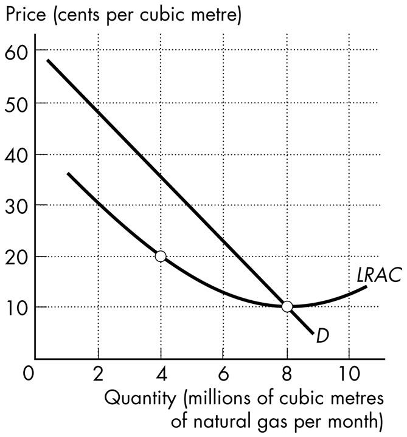

**Figure 13.1.1**

**16\) Refer to Figure 13.1.1. The quantity demanded by the market is 8**
million cubic metres a month. This market is

A\) a legal monopoly.

B\) served by a perfect price discriminating monopoly.

C\) served by many firms each making an economic profit.

D\) served by many firms each incurring an economic loss.

E\) a natural monopoly.

---
---
Answer: E

---

## 13.2 A Single-Price Monopoly\'s Output and Price Decision

*Use the figure below to answer the following question.*

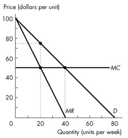

**Figure 13.2.1**

**1\) Refer to Figure 13.2.1. This single-price monopoly produces**
\_\_\_\_\_\_\_\_ units per day and charges a price of \$\_\_\_\_\_\_\_\_
per unit.

A\) zero; 0

B\) 20; 75

C\) 40; 50

D\) 20; 50

E\) 20; 20

---
---
Answer: B

---
**2\) To increase sales from 7 units to 8 units, a single-price monopolist**
must drop the price from \$7 per unit to \$6 per unit. What is marginal
revenue in this range?

A\) \$48

B\) \$6

C\) \$1

D\) -\$1

E\) None of the above.

---
---
Answer: D

---
Source: Study Guide

*\
Use the figure below to answer the following questions.*

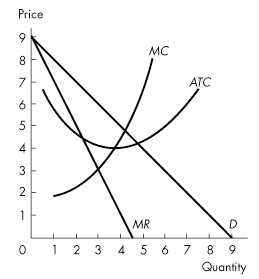

**Figure 13.2.2**

**3\) For the single-price monopoly shown in Figure 13.2.2, when profit is**
maximized, quantity is

A\) 3 and price is \$3.

B\) 3 and price is \$6.

C\) 4 and price is \$4.

D\) 4 and price is \$5.

E\) 5 and price is \$4.

---
---
Answer: B

---
Source: Study Guide

**4\) Refer to Figure 13.2.2. If the single-price monopoly shown in Figure**
## 13.2.2 is maximizing profit, what is total economic profit?

A\) \$3

B\) \$4

C\) \$6

D\) \$9

E\) None of the above.

---
---
Answer: C

---
Source: Study Guide

**5\) If a profit-maximizing monopoly is producing an output at which**
marginal cost exceeds marginal revenue, it

A\) should raise price and decrease output.

B\) should lower price and increase output.

C\) should lower price and decrease output.

D\) is incurring an economic loss.

E\) is maximizing profit.

---
---
Answer: A

---
Source: Study Guide

*Use the figure below to answer the following questions.*

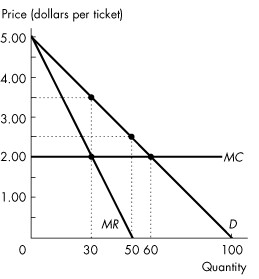

**Figure 13.2.3**

**6\) Refer to Figure 13.2.3. Assume this firm is a single-price monopoly.**
What is the profit-maximizing price to charge for the tickets?

A\) \$5.00

B\) \$4.00

C\) \$3.00

D\) \$2.00

E\) \$3.50

---
---
Answer: E

---
**7\) Refer to Figure 13.2.3. Assume this firm is a single-price monopoly.**
How many tickets does this monopolist sell to maximize economic profit?

A\) 20 tickets

B\) 30 tickets

C\) 50 tickets

D\) 60 tickets

E\) 100 tickets

---
---
Answer: B

---
*Use the figure below to answer the following question.*

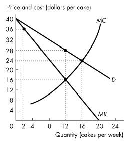

**Figure 13.2.4**

**8\) Refer to Figure 13.2.4. Grannie\'s is the only cake bakery on Coastal**
Island. The graph shows Grannie\'s demand curve, marginal revenue curve,
and marginal cost curve. Grannie\'s profit-maximizing price is
\_\_\_\_\_\_\_\_ a cake and its profit-maximizing output is
\_\_\_\_\_\_\_\_ cakes a week.

A\) \$28; 12

B\) \$16; 12

C\) \$36; 2

D\) \$16; 24

E\) \$24; 16

---
---
Answer: A

---
Source: MyEconLab

**9\) A monopoly \_\_\_\_\_\_\_\_ make positive economic profit in the long**
run because \_\_\_\_\_\_\_\_.

A\) can; barriers to entry prevent other firms from entering the market
and sharing the profit

B\) cannot; eventually demand will decrease and prices will fall

C\) cannot; other firms will enter the market until all firms are making
zero economic profit

D\) can; new technology constantly lowers costs for the monopoly firm and
for its competitors

E\) can; demand constantly increases and price constantly rises

---
---
Answer: A

---
Source: MyEconLab

*Use the table below to answer the following question.*

**Table 13.2.1**

+----------------------+--------------------+
| Price                | Quantity Demanded  |
|                      |                    |
| (dollars per bottle) | (bottles per hour) |
+----------------------+--------------------+
| 10                   | 0                  |
|                      |                    |
| 8                    | 1                  |
|                      |                    |
| 6                    | 2                  |
|                      |                    |
| 4                    | 3                  |
|                      |                    |
| 2                    | 4                  |
|                      |                    |
| 0                    | 5                  |
+----------------------+--------------------+

[ ]{.underline}

**10\) Refer to Table 13.2.1. Minnie\'s Mineral Springs, a single-price**
monopoly, faces the market demand schedule given in the table. Minnie
will not produce a quantity at which the market demand for water is
inelastic because when demand is inelastic she can \_\_\_\_\_\_\_\_ the
quantity produced, which \_\_\_\_\_\_\_\_.

A\) increase; increases total revenue, decreases total cost, and
increases economic profit

B\) increase; increases total revenue and increases total cost, but the
increase in total cost is less than the increase in total revenue

C\) decrease; increases total revenue, decreases total cost, and
increases economic profit

D\) decrease; decreases total revenue and decreases total cost, but the
decrease in total cost is less than the decrease in total revenue

E\) decrease; increases total revenue, does not change total cost, and
increases economic profit

---
---
Answer: C

---
Source: MyEconLab

**11\) A single-price monopolist\'s demand curve**

A\) is its marginal revenue curve.

B\) shows that demand for the good is perfectly elastic.

C\) is the same as the market demand curve.

D\) shows that demand for the good is perfectly inelastic.

E\) is horizontal.

---
---
Answer: C

---

**12\) For a single-price monopoly, the demand curve is**

A\) below the marginal revenue curve.

B\) the same as the marginal revenue curve.

C\) above the marginal revenue curve.

D\) the same as the total revenue curve.

E\) below the average total cost curve.

---
---
Answer: C

---

**13\) The marginal revenue curve for a single-price monopoly**

A\) is below its demand curve.

B\) is the same as the demand curve.

C\) lies above its demand curve.

D\) is horizontal.

E\) has a slope equal to the slope of the demand curve.

---
---
Answer: A

---

**14\) If marginal revenue equals zero, then demand at this level of output**
is

A\) perfectly inelastic.

B\) inelastic.

C\) unit elastic.

D\) elastic.

E\) perfectly elastic.

---
---
Answer: C

---

**15\) If the demand for its good or service is elastic, a monopoly\'s**

A\) total revenue is unchanged when the firm lowers its price.

B\) total revenue decreases when the firm lowers its price.

C\) marginal revenue is positive.

D\) marginal revenue is zero.

E\) marginal revenue is negative.

---
---
Answer: C

---

**16\) If the demand for its good or service is inelastic, a monopoly\'s**

A\) total revenue increases when the firm lowers its price.

B\) total revenue is unchanged when the firm lowers its price.

C\) marginal revenue is negative.

D\) marginal revenue is equal to zero.

E\) marginal revenue is positive.

---
---
Answer: C

---

**17\) A monopoly**

A\) faces a perfectly elastic demand.

B\) ignores the demand curve because it is the only seller. [
]{.underline}

C\) can raise the price it charges only if it decreases the quantity that
it sells.

D\) can raise the price it charges only if it increases the quantity that
it sells.

E\) faces a perfectly inelastic demand.

---
---
Answer: C

---

**18\) A single-price monopolist**

A\) maximizes economic profit by producing the quantity at which marginal
revenue equals marginal cost.

B\) maximizes economic profit by producing the quantity at which marginal
revenue equals average total cost.

C\) can increase the price and the quantity sold simultaneously.

D\) is not restricted by the law of demand.

E\) can sell as much as it wants at a given price because it is the only
seller.

---
---
Answer: A

---

## 13.3 Single-Price Monopoly and Competition Compared

*Use the figure below to answer the following questions.*

**Figure 13.3.1**

**1\) Refer to Figure 13.3.1. If this market were perfectly competitive,**
the output level would exceed the single-price monopoly output level by

A\) 20 units.

B\) 40 units.

C\) 60 units.

D\) zero. The perfectly competitive firm and the single-price monopoly
produce the same quantity because marginal cost is constant.

E\) 30 units.

---
---
Answer: A

---
**2\) Refer to Figure 13.3.1. The efficient quantity is**

A\) 20 units.

B\) 40 units.

C\) 60 units.

D\) 80 units.

E\) zero units.

---
---
Answer: B

---
**3\) Refer to Figure 13.3.1. If this market is a single-price monopoly,**
then

A\) it is efficient because the monopoly is maximizing economic profit.

B\) price is equal to marginal cost and the outcome is efficient.

C\) price is less than marginal cost, and consumer surplus is less than
in a perfectly competitive market.

D\) price is greater than the marginal cost and the outcome is
inefficient.

E\) the outcome is inefficient because the monopoly\'s costs are too
high.

---
---
Answer: D

---
**4\) The pursuit of wealth by capturing economic rent**

A\) is rent seeking.

B\) is illegal in Canada.

C\) is price discrimination.

D\) creates a legal monopoly.

E\) creates a natural monopoly.

---
---
Answer: A

---
*\
Use the figure below to answer the following questions.*

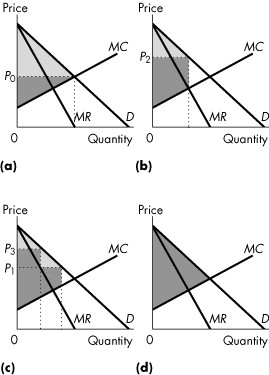

**Figure 13.3.2**

**5\) Consider Figure 13.3.2. Consider a perfectly competitive market. If**
the light grey area shows the consumer surplus, and the dark grey area
shows the producer surplus, which graph correctly represents this
market?

A\) (a)

B\) (b)

C\) (c)

D\) (d)

E\) (b) and (d)

---
---
Answer: A

---
**6\) Consider Figure 13.3.2. Consider a single-price monopoly. If the**
light grey area shows the consumer surplus, and the dark grey area shows
the producer surplus, which graph correctly represents this firm?

A\) (a)

B\) (b)

C\) (c)

D\) (d)

E\) (b) and (c)

---
---
Answer: B

---
**7\) Taking competitive rent seeking activity into account, the social**
cost of monopoly is equal to the

A\) deadweight loss from monopoly.

B\) monopoly\'s producer surplus.

C\) deadweight loss plus the monopoly\'s producer surplus.

D\) deadweight loss minus the monopoly\'s producer surplus.

E\) consumer surplus lost plus producer surplus lost.

---
---
Answer: C

---
Source: Study Guide

*\
Use the figure below to answer the following questions.*

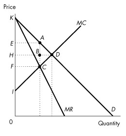

**Figure 13.3.3**

**8\) Consider the market demand curve in Figure 13.3.3. If the market is**
perfectly competitive, which area indicates consumer surplus?

A\) *AEK*

B\) *DHK*

C\) *DIK*

D\) *DIH*

E\) None of the above.

---
---
Answer: B

---
Source: Study Guide

**9\) Consider the market demand curve in Figure 13.3.3. If the market is**
perfectly competitive, which area indicates producer surplus?

A\) *AEK*

B\) *DHK*

C\) *DIK*

D\) *DIH*

E\) None of the above.

---
---
Answer: D

---
Source: Study Guide

**10\) Consider the market demand curve in Figure 13.3.3. If the market is**
perfectly competitive, which area indicates the deadweight loss?

A\) *ABD*

B\) *BCD*

C\) *KDI*

D\) *ADC*

E\) None of the above.

---
---
Answer: E

---
**11\) Consider the revenue and cost curves in Figure 13.3.3. If this is a**
single-price monopoly, what is consumer surplus?

A\) *EADH*

B\) *EABH*

C\) *ABD*

D\) *ACD*

E\) *KEA*

---
---
Answer: E

---
**12\) Consider the revenue and cost curves in Figure 13.3.3. What is the**
difference in consumer surplus between a single-price monopoly and a
perfectly competitive market?

A\) *EADH*

B\) *EABH*

C\) *ABD*

D\) *ACD*

E\) *FHDC*

---
---
Answer: A

---
**13\) Consider the revenue and cost curves in Figure 13.3.3. If this is a**
single-price monopoly, what area is producer surplus?

A\) *IHD*

B\) *KHD*

C\) *KEA*

D\) *IEAC*

E\) None of the above.

---
---
Answer: D

---
**14\) Consider the revenue and cost curves in Figure 13.3.3. What is the**
difference in producer surplus between a single-price monopoly and a
perfectly competitive market?

A\) *EADH*

B\) *EABH*

C\) *ABD*

D\) *ACD*

E\) *EABH - BCD*

---
---
Answer: E

---
**15\) Refer to Figure 13.3.3. What is the redistribution of surplus from**
consumers to the producer with a single-price monopoly, as compared to a
perfectly competitive market?

A\) *EADH*

B\) *EABH*

C\) *ABD*

D\) *ACD*

E\) *EABH - BCD*

---
---
Answer: B

---
**16\) Consider the cost and revenue curves in Figure 13.3.3. Which area**
indicates the deadweight loss from a single-price monopoly?

A\) *EACF*

B\) *ACD*

C\) *ABD*

D\) *BCD*

E\) None of the above.

---
---
Answer: B

---
Source: Study Guide

**17\) Rent seeking \_\_\_\_\_\_\_\_.**

A\) is a variable cost and with rent seeking the monopoly becomes more
efficient

B\) decreases average total cost and with rent seeking the monopoly
becomes more efficient

C\) increases deadweight loss above the original monopoly deadweight
loss, but the monopoly continues to produce the same inefficient
quantity

D\) decreases consumer surplus and with rent seeking the monopoly becomes
more efficient

E\) decreases deadweight loss

---
---
Answer: C

---
Source: MyEconLab

**18\) Consumer surplus is**

A\) positive in the case of a monopolist practising perfect price
discrimination.

B\) equal to price minus marginal cost.

C\) less in the case of a single-price monopoly than in the case of a
perfectly competitive industry.

D\) zero for a single-price monopolist.

E\) greater in a single-price monopoly than in a perfectly competitive
industry.

---
---
Answer: C

---

**19\) The creation of a monopoly results in gains to**

A\) producers at no expense to consumers.

B\) consumers at no expense to producers.

C\) producers at the expense of consumers.

D\) consumers at the expense of producers.

E\) producers and consumers at the expense of the government.

---
---
Answer: C

---

**20\) Rent seeking is best defined as**

A\) an attempt by landlords to get tenants.

B\) the pursuit of wealth by capturing economic rent.

C\) an attempt by individuals to avoid paying taxes.

D\) owners of a monopoly selling the firm at the highest possible price.

E\) none of the above.

---
---
Answer: B

---

**21\) Methods of rent seeking include which of the following?**

I. Buying a monopoly

II\. Creating a monopoly

III\. Price discrimination

A\) I and II

B\) I and III

C\) II and III

D\) III only

E\) II only

---
---
Answer: A

---

**22\) Which one of the following is *true* for a single-price monopolist**
but not for a perfectly competitive firm?

A\) The firm maximizes profit by setting marginal cost equal to marginal
revenue.

B\) The firm is a price-taker.

C\) The firm can sell any level of output at any price it sets.

D\) The firm\'s marginal cost is less than price.

E\) The firm\'s marginal revenue curve is horizontal.

---
---
Answer: D

---
*\
Use the figure below to answer the following questions.*

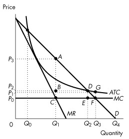

**Figure 13.3.4**

**23\) Consider the natural monopoly depicted in Figure 13.3.4. Total**
surplus is at a maximum when quantity is

A\) *Q*1 and price is *P*1.

B\) *Q*1 and price is *P*3.

C\) *Q*2 and price is *P*2.

D\) *Q*3 and price is *P*0.

E\) *Q*4 and price is 0.

---
---
Answer: D

---
**24\) Consider the natural monopoly depicted in Figure 13.3.4. What area**
in the graph represents the deadweight loss arising from an unregulated
monopoly?

A\) *ABD*

B\) *DGF*

C\) *DEF*

D\) *ACF*

E\) *CBDE*

---
---
Answer: D

---
**25\) One difference between perfectly competitive markets and a**
single-price monopoly is that

A\) marginal revenue equals marginal cost for perfectly competitive
firms, but not for single-price monopolists.

B\) marginal cost equals average variable cost for perfectly competitive
firms but not for single-price monopolists.

C\) price equals minimum average total cost for single-price monopolists
but not for perfectly competitive firms.

D\) marginal revenue equals price for perfectly competitive firms, but
not for single-price monopolists.

E\) none of the above

---
---
Answer: D

---

**26\) Which of the following markets will have the largest deadweight**
loss?

A\) a single-price monopoly

B\) a perfectly competitive market

C\) a perfectly price discriminating monopoly

D\) both B and C

E\) both A and C

---
---
Answer: A

---

## 13.4 Price Discrimination

*Use the figure below to answer the following question.*

**Figure 13.4.1**

**1\) Which area in Figure 13.4.1 indicates the deadweight loss from a**
perfect price-discriminating monopoly?

A\) *EACF*

B\) *ACD*

C\) *ABD*

D\) *BCD*

E\) None of the above.

---
---
Answer: E

---
Source: Study Guide

**2\) When perfect price discrimination occurs, which one of the following**
statements is *false* ?

A\) Buyers cannot resell the product.

B\) The firm can distinguish between buyers.

C\) The firm sets prices.

D\) The firm captures consumer surplus.

E\) The outcome is less efficient than with single-price monopoly.

---
---
Answer: E

---
Source: Study Guide

**3\) A monopoly can practise price discrimination when it**

A\) can segment the market according to the different prices the
consumers are willing to pay.

B\) is a price taker.

C\) has different marginal costs of production for different output
levels.

D\) has decreasing average variables cost.

E\) produces a good with close substitutes.

---
---
Answer: A

---
*Use the figure below to answer the following question.*

**Figure 13.4.2**

**4\) Refer to Figure 13.4.2. Assume this monopolist practises perfect**
price discrimination. This means that

A\) the monopoly\'s behaviour is illegal.

B\) one price is charged to young people and a different price to older
people.

C\) a different price can be charged to each buyer.

D\) price will rise as the number of buyers increases.

E\) the quantity sold will be less compared to the case of no price
discrimination.

---
---
Answer: C

---
**5\) Refer to Figure 13.4.2. Assume this monopolist practises perfect**
price discrimination. What is the lowest price charged for tickets?

A\) \$0

B\) \$1.00

C\) \$3.50

D\) \$3.00

E\) \$2.00

---
---
Answer: E

---
**6\) Refer to Figure 13.4.2. Assume this monopolist practises perfect**
price discrimination. How many tickets are sold?

A\) 20 tickets

B\) 60 tickets

C\) 40 tickets

D\) 100 tickets

E\) 80 tickets

---
---
Answer: B

---
**7\) Refer to Figure 13.4.2. Assume this monopolist practises perfect**
price discrimination. What is total revenue?

A\) \$110

B\) \$210

C\) \$310

D\) \$120

E\) \$105

---
---
Answer: B

---
**8\) If a firm practises perfect price discrimination,**

A\) its marginal cost curve is horizontal.

B\) it will maximize total revenue.

C\) it does not produce the quantity at which marginal revenue equals
marginal cost.

D\) it will produce the quantity at which the marginal revenue curve
intersects the average total cost curve.

E\) it will produce the quantity at which the marginal cost curve
intersects the demand curve.

---
---
Answer: E

---
*\
Use the table below to answer the following questions.*

**Table 13.4.1**

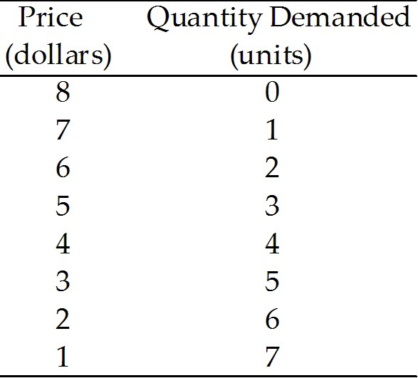

[ ]{.underline}

**9\) Refer to Table 13.4.1. If a perfect price-discriminating monopoly**
faces the demand schedule shown in Table 13.4.1 and if marginal cost is
constant at \$3, output is

A\) 2 units.

B\) 3 units.

C\) 4 units.

D\) 5 units.

E\) 6 units.

---
---
Answer: D

---
**10\) Table 13.4.1 shows the demand schedule faced by a monopoly. If the**
monopoly is a perfect price-discriminating monopoly the marginal revenue
from the sale of the 3rd unit of output is

A\) \$2.

B\) \$6.

C\) \$4.

D\) \$3.

E\) \$5.

---
---
Answer: E

---
**11\) Table 13.4.1 shows the demand schedule faced by a perfect**
price-discriminating monopoly. If 3 units are sold, total revenue is

A\) \$15.00.

B\) \$16.00.

C\) \$18.00.

D\) \$19.50.

E\) \$5.00.

---
---
Answer: C

---
**12\) The output of a (not perfect) price-discriminating monopoly is**

A\) less than a single-price monopoly.

B\) more than a single-price monopoly but less than a perfectly
competitive industry.

C\) the same amount as a perfectly competitive industry.

D\) more than a perfectly competitive industry.

E\) less than a single-price monopoly but more than a perfectly
competitive industry.

---
---
Answer: B

---
Source: Study Guide

**13\) A perfect price-discriminating monopoly produces**

A\) less than a single-price monopoly.

B\) more than a single-price monopoly but less than a perfectly
competitive industry.

C\) less than a monopoly that practices price discrimination but not
perfect price discrimination.

D\) more than a perfectly competitive industry.

E\) the same amount as a perfectly competitive industry.

---
---
Answer: E

---
**14\) A perfect price-discriminating monopoly**

A\) has a demand curve that is also its marginal revenue curve.

B\) maximizes total revenue.

C\) is inefficient.

D\) will produce the quantity at which the marginal cost curve intersects
its demand curve.

E\) both A & D are correct.

---
---
Answer: E

---
Source: Study Guide

**15\) Which of the following quotes by a store manager describes price**
discrimination in action?

A\) \"Since bulk goods are cheaper to package, I can offer a lower
price.\"

B\) \"I can get a 4-litre jug of milk from the supplier for less than
four 1-litre cartons, so I can sell it for less per litre.\"

C\) \"We offer our employees a 10 percent price discount.\"

D\) \"I offer discounts if you buy 12 apple juices in one box, although
it costs me the same as if I split it up and sell them separately.\"

E\) \"We set price equal to average variable cost.\"

---
---
Answer: D

---
*\
Use the figure below to answer the following question.*

**Figure 13.4.3**

**16\) Refer to Figure 13.4.3. The outcome is efficient if**

A\) the monopoly is able to perfectly price discriminate.

B\) the price consumers pay is equal to average total cost.

C\) the price consumers pay exceeds minimum average variable cost.

D\) the quantity produced is 80 units.

E\) the quantity produced is 20 units.

---
---
Answer: A

---
**17\) A perfect price-discriminating monopoly is**

A\) less efficient than a single-price monopoly.

B\) more efficient than a single-price monopoly, but less efficient than
a perfectly competitive industry.

C\) as efficient as a single-price monopoly.

D\) more efficient than a perfectly competitive industry.

E\) as efficient as a perfectly competitive industry.

---
---
Answer: E

---
*\
Use the figure below to answer the following questions.*

**Figure 13.4.4**

**18\) Refer to Figure 13.4.4. Consider a market with a monopoly that**
distinguishes between two groups of buyers. If the light grey area shows
the consumer surplus and the dark grey area shows the producer surplus,
which graphs correctly represents this firm?

A\) (a)

B\) (b)

C\) (c)

D\) (d)

E\) (b) and (d)

---
---
Answer: C

---
**19\) Refer to Figure 13.4.4. Consider a market with a perfect**
price-discriminating monopolist. If the light grey area shows the
consumer surplus and the dark grey area shows the producer surplus,
which graph correctly represents this firm?

A\) (a)

B\) (b)

C\) (c)

D\) (d)

E\) none of the graphs

---
---
Answer: D

---
*Use the figure below to answer the following questions.*

**Figure 13.4.5**

**20\) Consider the cost and revenue curves in Figure 13.4.5. If this is a**
perfect price-discriminating monopoly, what is consumer surplus?

A\) *EADH*

B\) *EABH*

C\) *ABD*

D\) *KEA*

E\) None of the above.

---
---
Answer: E

---
**21\) Refer to Figure 13.4.5. What is the redistribution of surplus from**
consumers to the producer with a perfect price-discriminating monopoly,
as compared to a perfectly competitive market?

A\) *EADH*

B\) *EABH*

C\) *ABD*

D\) *ACD*

E\) *KHD*

---
---
Answer: E

---
**22\) When a monopoly practices price discrimination \_\_\_\_\_\_\_\_.**

A\) it charges different prices to different consumers and transfers some
of the consumer surplus to economic profit

B\) it produces a smaller quantity than when it is a single-price
monopoly which decreases consumer surplus

C\) new firms enter the industry, so buyers have more goods from which to
choose and consumer surplus increases

D\) consumer surplus increases because the monopoly increases the
quantity available for sale

E\) firms exit the industry and consumer surplus decreases

---
---
Answer: A

---
Source: MyEconLab

**23\) Donna owns the only dog grooming salon on Lonely Island. If Donna**
can price discriminate between dog owners who are seniors and those who
are not, her economic profit will be \_\_\_\_\_\_\_\_ than if she does
not price discriminate and the number of dog groomings will be
\_\_\_\_\_\_\_\_ if she does not price discriminate.

A\) greater; more than

B\) greater; less than

C\) less; more than

D\) less; less than

E\) greater; the same as

---
---
Answer: A

---

**24\) The more perfectly a monopoly can price discriminate, the**

A\) smaller its output and the lower its profit.

B\) smaller its output and the higher its profit.

C\) larger its output and the lower its profit.

D\) larger its output and the higher its profit.

E\) none of the above.

---
---
Answer: D

---

**25\) Which of the following occurs with both perfectly**
price-discriminating and single-price monopolies?

A\) The amount of output is inefficient.

B\) All consumer surplus goes to the monopoly.

C\) Deadweight loss is created.

D\) There is a redistribution of consumer surplus to the monopoly.

E\) Demand is perfectly elastic.

---
---
Answer: D

---

**26\) Which of the following is true for a perfect price-discriminating**
monopoly?

A\) *P* = *MR* for each unit sold.

B\) *P* = *ATC* for each unit sold.

C\) *P* = *MC* for each unit sold.

D\) *P* \> *MC* for each unit sold.

E\) *P* \> *MR* for each unit sold.

---
---
Answer: A

---

**27\) If a monopolist can perfectly price discriminate, then**

A\) price equals average cost for each unit sold.

B\) price equals marginal cost for each unit sold.

C\) price equals marginal cost for the last unit sold.

D\) the firm can ignore the marginal cost curve.

E\) price is greater than marginal revenue for each unit sold.

---
---
Answer: C

---

**28\) For a monopoly able to practice perfect price discrimination, the**
market

A\) supply curve is horizontal.

B\) supply curve is the same as the marginal revenue curve.

C\) demand curve is the same as the marginal cost curve.

D\) demand curve is the same as the marginal revenue curve.

E\) demand curve is horizontal.

---
---
Answer: D

---

*Use the figure below to answer the following questions.*

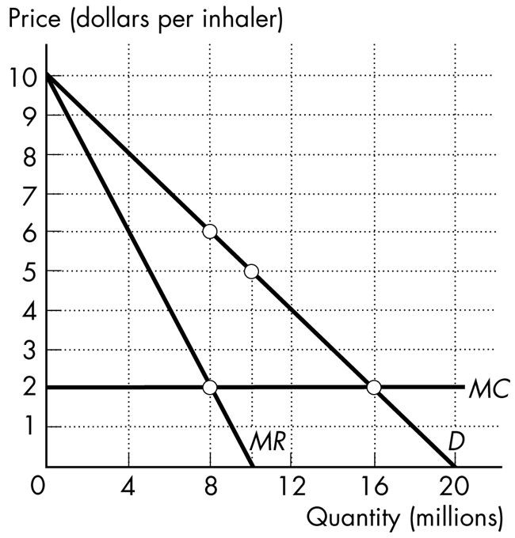

**Figure 13.4.6**

**29\) Prime Pharmaceuticals has developed a new asthma medicine, for which**
it has a patent. An inhaler can be produced at a constant marginal cost
of \$2 per inhaler. The demand curve, marginal revenue curve, and
marginal cost curve for this new asthma inhaler are shown in Figure
13.4.6. The patent gives Prime Pharmaceuticals a monopoly for its new
inhaler. If Prime Pharmaceuticals can perfectly price discriminate, then
it

A\) sells 16 million inhalers.

B\) charges a price of \$2 for each inhaler it sells.

C\) sells inhalers for \$6 each.

D\) makes zero economic profit.

E\) Both A and B are correct.

---
---
Answer: A

---

**30\) Prime Pharmaceuticals has developed a new asthma medicine, for which**
it has a patent. An inhaler can be produced at a constant marginal cost
of \$2 per inhaler. The demand curve, marginal revenue curve, and
marginal cost curve for this new asthma inhaler are shown in Figure
13.4.6. The patent gives Prime Pharmaceuticals a monopoly for its new
inhaler. If Prime Pharmaceuticals can perfectly price discriminate, then
consumer surplus is

A\) zero.

B\) \$24 million.

C\) \$64 million.

D\) \$44 million.

E\) \$32 million.

---
---
Answer: A

---

## 13.5 Monopoly Regulation

**1\) Rate of return regulation can end up serving the self-interest of the**
firm if

A\) there is a great demand for the good.

B\) there is a competitive struggle to determine which firms will supply
the market.

C\) the regulated firm overstates its costs of production.

D\) price is set at average total cost.

E\) the rate is set too low.

---
---
Answer: C

---
**2\) A monopolist under rate of return regulation has an incentive to**

A\) pad costs.

B\) produce more than the efficient quantity of output.

C\) charge a price equal to marginal cost.

D\) maximize consumer surplus.

E\) maximize shareholder profits

---
---
Answer: A

---
Source: Study Guide

**3\) A monopolist under marginal cost pricing has an incentive to**

A\) inflate costs.

B\) produce more than the efficient quantity of output.

C\) produce less than the efficient quantity of output.

D\) maximize consumer surplus.

E\) produce the efficient quantity of output.

---
---
Answer: E

---
*\
Use the information below to answer the following questions.*

**Fact 13.5.1**

Cascade Springs Inc. is a natural monopoly that bottles water from a
spring high in the Rocky Mountains. The total fixed cost it incurs is
\$80,000, and its marginal cost is 10 cents a bottle. The demand curve
for Cascade Springs bottled water is shown in the following figure:

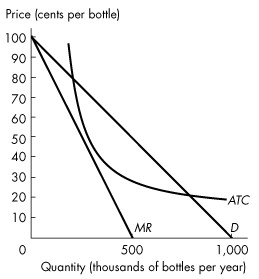

**Figure 13.5.1**

**4\) Refer to Figure 13.5.1. Suppose the industry is unregulated. In this**
case, output is

A\) 400,000 bottles per year.

B\) 450,000 bottles per year.

C\) 600,000 bottles per year.

D\) 700,000 bottles per year.

E\) 800,000 bottles per year.

---
---
Answer: B

---
**5\) Refer to Figure 13.5.1. Suppose the firm is regulated by the**
government that imposes marginal cost pricing. The price of a bottle of
water is

A\) \$0.

B\) \$0.50.

C\) \$0.30.

D\) \$0.10.

E\) \$0.20.

---
---
Answer: D

---
**6\) Refer to Figure 13.5.1. Suppose the government regulates the firm**
with average cost pricing. What is the price?

A\) \$0 a bottle

B\) \$0.50 a bottle

C\) \$0.30 a bottle

D\) \$0.10 a bottle

E\) \$0.20 a bottle

---
---
Answer: E

---
*Use the figure below to answer the following questions.*

**Figure 13.5.2**

**7\) Consider the natural monopoly depicted in Figure 13.5.2. If a**
regulator uses a marginal cost pricing rule to set price, what is the
quantity produced?

A\) 0

B\) *Q*0

C\) *Q*1

D\) *Q*2

E\) *Q*3

---
---
Answer: E

---
**8\) Consider the natural monopoly depicted in Figure 13.5.2. If a**
regulatory agency sets a price just sufficient for the firm to make zero
economic profit, what output will it produce?

A\) *Q*4

B\) *Q*0

C\) *Q*1

D\) *Q*2

E\) *Q*3

---
---
Answer: D

---
**9\) Consider the natural monopoly depicted in Figure 13.5.2. If a**
regulatory agency sets a price just sufficient for the firm to make zero
economic profit, and if the firm inflates its costs as much as possible,
the regulated price will be

A\) *P*0*.*

B\) *P*1*.*

C\) *P*2*.*

D\) *P*3*.*

E\) none of the above.

---
---
Answer: D

---
**10\) Consider the natural monopoly depicted in Figure 13.5.2. What area**
in the graph represents the deadweight loss arising from an average cost
pricing rule?

A\) *ABD*

B\) *DGF*

C\) *DEF*

D\) *ACF*

E\) *CBDE*

---
---
Answer: C

---
**11\) For the regulated natural monopoly, an average cost pricing rule**
sets price equal to

A\) marginal cost.

B\) total fixed cost.

C\) average variable cost.

D\) average fixed cost.

E\) average total cost.

---
---
Answer: E

---
**12\) A price cap is a price \_\_\_\_\_\_\_\_. A price cap might be a more**
effective way of regulating monopoly than rate of return regulation
because under rate of return regulation \_\_\_\_\_\_\_\_.

A\) ceiling; a firm incurs an economic loss

B\) floor; price is set equal to marginal cost

C\) ceiling; the firm\'s managers have an incentive to inflate costs

D\) floor; the firm\'s managers have an incentive to purchase more than
the efficient quantity of capital

E\) floor; the firm\'s managers have an incentive to inflate costs

---
---
Answer: C

---
Source: MyEconLab

**13\) An average cost pricing rule sets \_\_\_\_\_\_\_\_ equal to average**
total cost. An average cost pricing rule is not an efficient way of
regulating monopoly because at the quantity produced \_\_\_\_\_\_\_\_.

A\) price; marginal benefit exceeds marginal cost

B\) the return on capital; marginal benefit exceeds marginal cost

C\) marginal cost; marginal cost exceeds marginal benefit

D\) price equal to marginal revenue, which in long-run equilibrium is;
marginal cost exceeds marginal benefit

E\) marginal cost; marginal benefit exceeds marginal cost

---
---
Answer: A

---
Source: MyEconLab

**14\) Social interest theory predicts that the political process will seek**
to minimize

A\) producer surplus.

B\) consumer surplus.

C\) total surplus.

D\) deadweight loss.

E\) average total cost.

---
---
Answer: D

---

**15\) The capture theory holds that regulations are supplied to maximize**
\_\_\_\_\_\_\_\_.

A\) total sales

B\) economic profit

C\) marginal product

D\) consumer surplus

E\) marginal revenue

---
---
Answer: B

---

**16\) Under a marginal cost pricing rule, a regulated natural monopoly**

A\) makes an economic profit and a deadweight loss arises.

B\) makes an economic profit with no deadweight loss.

C\) incurs an economic loss with no deadweight loss.

D\) incurs an economic loss and a deadweight loss arises.

E\) breaks even.

---
---
Answer: C

---

**17\) Regulation of a natural monopoly will maximize the sum of consumer**
surplus and producer surplus if the firm is regulated with

A\) an average cost pricing rule.

B\) a rate of return regulation.

C\) a price cap.

D\) capture theory.

E\) a marginal cost pricing rule.

---
---
Answer: E

---
