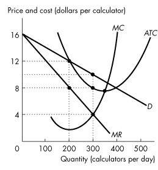
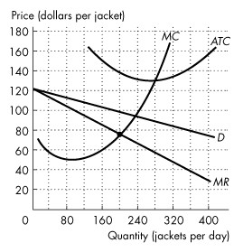

\pagenumbering{gobble}

**Chapter 14 Monopolistic Competition**

## 14.1 What Is Monopolistic Competition?

**1\) In monopolistic competition**

A\) firms practice product
B\) the goods produced by each firm are identical.

C\) firms do not have any control over the price of their products.

D\) there are barriers to entry.

E\) a small number of firms compete.

---
---
Answer: A

---

**2\) Toronto has a large number of retail stores that sell clothes. Each**
store has its own characteristics which The clothing business in Toronto is an example of

A\) a duopoly.

B\) an oligopoly.

C\) a perfectly competitive market.

D\) a monopoly.

E\) a monopolistically competitive market.

---
---
Answer: E

---

**3\) A firm in a monopolistically competitive market**

A\) faces an upward-sloping demand curve.

B\) faces a downward-sloping demand curve.

C\) practices product
D\) faces a horizontal demand curve.

E\) B and C are correct.

---
---
Answer: E

---

**4\) One factor that distinguishes a monopoly from monopolistic**
competition is that

A\) firms in monopolistic competition practice collusion.

B\) no barriers to entry exist in a monopoly.

C\) barriers to exit exist in monopolistic competition.

D\) close substitutes are available in monopolistic competition.

E\) firms are price-takers in monopolistic competition.

---
---
Answer: D

---

**5\) In monopolistic competition**

A\) there are two firms in the market.

B\) the size of one firm is small relative to the size of the industry.

C\) the size of one firm is large relative to the size of the industry.

D\) each firm is a price-taker.

E\) there is only one firm in the market.

---
---
Answer: B

---

**6\) If some firms in the industry make an economic profit, then**

A\) the industry cannot be perfectly competitive.

B\) the industry must be monopolistically competitive.

C\) rival firms will enter if there are no barriers to entry.

D\) the firms must practice product
E\) the industry must be an oligopoly.

---
---
Answer: C

---

**7\) A monopolistically competitive firm is able to influence the price of**
what it sells because of

A\) barriers to entry.

B\) economies of scale.

C\) product
D\) the fact there are many buyers.

E\) inelastic demand.

---
---
Answer: C

---

**8\) In monopolistic competition**

A\) firms can collude.

B\) each firm has a small market share.

C\) each firm pays attention to every other firm.

D\) firms make a profit in the long run.

E\) all of the above.

---
---
Answer: B

---

**9\) ACME, Inc. operates in a market structure in which there are many**
other firms that find it easy to enter or exit. ACME is operating in
\_\_\_\_\_\_\_\_ market.

A\) definitely a perfectly competitive

B\) a perfectly competitive or a monopolistically competitive

C\) definitely a monopolistically competitive

D\) neither a perfectly competitive nor a monopolistically competitive

E\) a monopolistic

---
---
Answer: B

---

**10\) The existence of a large number of firms in monopolistic competition**

A\) means that each firm has a small market share.

B\) makes it possible for each firm\'s price to deviate by a large amount
from the average price of the other firms.

C\) means that a firm must pay attention to the behaviour of all of its
competitors.

D\) All of the above answers are correct.

E\) None of the above answers are correct.

---
---
Answer: A

---

**11\) The key feature of monopolistic competition that distinguishes it**
from perfect competition is

A\) many sellers.

B\) barriers to entry.

C\) perfectly elastic demand.

D\) product
E\) none of the above.

---
---
Answer: D

---

**12\) In monopolistic competition, firms compete on the basis of**

A\) price only.

B\) price, quality, and marketing.

C\) marketing only.

D\) quality and marketing, but not price.

E\) quality only.

---
---
Answer: B

---

**13\) In monopolistic competition, each firm supplies a \_\_\_\_\_\_\_\_**
part of the total industry output and its actions \_\_\_\_\_\_\_\_ the
actions of the other firms.

A\) small; do not directly affect

B\) small; directly affect

C\) large; do not directly affect

D\) large; directly affect

E\) large; may or may not directly affect

---
---
Answer: A

---

**14\) Monopolistic competition monopolistic competition**

A\) firms maximize profits.

B\) firms set marginal revenue equal to marginal cost to maximize profit.

C\) firms are free to enter and exit.

D\) All of the above are monopolistically competitive firms.

E\) None of the above are monopolistically competitive firms.

---
---
Answer: C

---

**15\) Dole Co. operates in a monopolistically competitive market. Which of**
the following characterizes Dole Co.\'s market?

A\) Dole Co. supplies a small portion of the market\'s output.

B\) Dole Co.\'s product is slightly
C\) Dole Co. faced no barrier to entry when it decided to enter its
market.

D\) Dole Co. is unable to collude with other firms in the market.

E\) All of the above describe Dole Co.\'s market.

---
---
Answer: E

---

**16\) Which of the following goods is best described as being sold in a**
monopolistically competitive market?

A\) batteries

B\) wheat

C\) fast food

D\) postage stamps

E\) the local newspaper

---
---
Answer: C

---

**17\) Within a monopolistically competitive industry,**

A\) firms can freely enter and exit, and economic profit is zero in the
long run.

B\) firms can freely enter and exit, and economic profit is greater than
zero in the long run.

C\) there are some barriers to entry and exit, and economic profit is
zero in the long run.

D\) there are some barriers to entry and exit, and economic profit is
greater than zero in the long run.

E\) firms can freely enter and exit, and economic profit is zero in the
short run.

---
---
Answer: A

---

**18\) When comparing perfect competition and monopolistic competition, we**
find that

A\) firms in monopolistic competition produce identical products just as
do firms in perfect competition.

B\) firms in monopolistic competition face barriers to entry, unlike
firms in perfect competition.

C\) advertising plays a large role in monopolistic competition, unlike in
perfect competition.

D\) firms in monopolistic competition are price takers just as is the
case for firms in perfect competition.

E\) firms in monopolistic competition each have a large market share.

---
---
Answer: C

---

**19\) Which of the following best explains why firms in monopolistic**
competition face a downward- sloping demand curve while perfectly
competitive firms do not?

A\) Monopolistically competitive industries have only a few firms.

B\) Monopolistically competitive firms face barriers to entry.

C\) Only industries with free entry and exit have firms that face
horizontal demand curves.

D\) Firms in monopolistic competition are price takers.

E\) Firms in monopolistic competition sell a

---
---
Answer: E

---

**20\) Product**
A\) there are no substitutes for the product.

B\) the firm can sell all it wants at the given price.

C\) the market is a monopoly.

D\) the market is perfectly competitive.

E\) there are close but not perfect substitutes for the product.

---
---
Answer: E

---

**21\) Firefox, Internet Explorer, and Google Chrome browsers are an**
example of

A\) goods produced in perfectly competitive markets.

B\) goods produced by monopolies. [ ]{.underline}

C\) product
D\) goods that are identical.

E\) product similarity.

---
---
Answer: C

---

## 14.2 Price and Output in Monopolistic Competition

*Use the figure below to answer the following questions.*

**Figure 14.2.1**

**1\) Refer to Figure 14.2.1. If this firm is in monopolistic competition,**
it will produce an output level

A\) of 40 units.

B\) of 60 units.

C\) of 80 units.

D\) that is impossible to determine without information concerning the
rival firms.

E\) that is less than 40 units.

---
---
Answer: A

---

**2\) Refer to Figure 14.2.1. If this firm is in monopolistic competition,**
then it will charge a price

A\) of \$20 a unit.

B\) of \$50 a unit.

C\) of \$40 a unit.

D\) of \$30 a unit.

E\) that is impossible to determine without information concerning the
behaviour of the rival firms.

---
---
Answer: B

---

**3\) Refer to Figure 14.2.1. This firm in monopolistic competition will**

A\) make an economic profit in the short run.

B\) make zero economic profit in the short run.

C\) incur an economic loss.

D\) make an economic profit in the long run.

E\) incur an economic loss in the long run.

---
---
Answer: A

---

**4\) Refer to Figure 14.2.1. If this firm in monopolistic competition is**
in short-run equilibrium, then

A\) rival firms will enter the industry.

B\) all firms will exit the industry.

C\) economic profit of all firms in the industry is zero.

D\) it produces 60 units of output to maximize economic profit.

E\) the firm\'s profits can be expected to rise over time.

---
---
Answer: A

---

*\
Use the figure below to answer the following questions.*

**Figure 14.2.2**

**5\) Refer to Figure 14.2.2. To maximize economic profit, this firm in**
monopolistic competition will charge a price of

A\) \$15 a unit.

B\) \$25 a unit.

C\) \$20 a unit.

D\) \$32 a unit.

E\) \$35 a unit.

---
---
Answer: E

---

**6\) Refer to Figure 14.2.2. To maximize economic profit, this firm in**
monopolistic competition produces an output

A\) of 40 units.

B\) of 70 units.

C\) of 60 units.

D\) that cannot be determined without information concerning rival firms.

E\) of less than 40 units.

---
---
Answer: A

---

**7\) Refer to Figure 14.2.2. This firm**

A\) is incurring an economic loss.

B\) is in long-run equilibrium.

C\) is making an economic profit.

D\) must raise its price to maximize economic profit.

E\) will make more economic profit in the long run.

---
---
Answer: B

---

**8\) Refer to Figure 14.2.2. If this firm in monopolistic competition is**
maximizing economic profit,

A\) there will be entry of rival firms into the industry.

B\) rival firms will exit the industry.

C\) its profit will rise over time.

D\) this firm will exit the industry in the long run.

E\) none of the above.

---
---
Answer: E

---

*\
Use the figure below to answer the following questions.*

**Figure 14.2.3**

**9\) Refer to Figure 14.2.3. Which demand curve does this monopolistically**
competitive firm face in the long run?

A\) demand curve *D*1

B\) demand curve *D*2

C\) either demand curve *D*1 or *D*2

D\) neither demand curve *D*1 nor demand curve *D*2

E\) Any demand curve is possible, including *D*1 or *D*2.

---
---
Answer: B

---

**10\) Refer to Figure 14.2.3. Assume this firm faces demand curve *D*1.To**
maximize economic profit, this firm in monopolistic competition will
charge a price of \_\_\_\_\_\_\_\_ and produce an output of
\_\_\_\_\_\_\_\_ units.

A\) \$100; 200

B\) \$90; 220

C\) \$80; 200

D\) \$70; 100

E\) \$55; 140

---
---
Answer: A

---

**11\) Refer to Figure 14.2.3. Assume this firm faces demand curve *D*1. At**
the profit-maximizing output level, the firm

A\) incurs an economic loss.

B\) makes zero economic profit.

C\) makes an economic profit.

D\) makes less economic profit than that earned by firms in perfect
competition.

E\) makes an unknown economic profit that is impossible to determine
without information concerning the price charged by the rival firms.

---
---
Answer: C

---

**12\) Refer to Figure 14.2.3. Assume this firm faces demand curve *D*1. If**
this firm in monopolistic competition is maximizing profit,

A\) there will be entry of rival firms into the industry.

B\) rival firms will exit the industry.

C\) the market is efficient.

D\) this firm will exit the industry in the long run.

E\) its profit will rise over time.

---
---
Answer: A

---

**13\) Refer to Figure 14.2.3. Assume this firm faces demand curve *D*1. If**
the firm produced the efficient quantity, it would produce

A\) 100 units.

B\) 220 units.

C\) 200 units.

D\) 250 units.

E\) 140 units.

---
---
Answer: B

---

**14\) Refer to Figure 14.2.3. Assume this firm faces demand curve *D*2. To**
maximize economic profit, this firm in monopolistic competition will
charge a price of \_\_\_\_\_\_\_\_ and produce an output of
\_\_\_\_\_\_\_\_ units.

A\) \$40; 100

B\) \$90; 220

C\) \$80; 200

D\) \$55; 140

E\) \$70; 100

---
---
Answer: E

---

**15\) Refer to Figure 14.2.3. Assume this firm faces demand curve *D*2. At**
the profit-maximizing output level, the firm

A\) incurs an economic loss.

B\) makes zero economic profit.

C\) makes an economic profit.

D\) is not in a long-run equilibrium.

E\) is producing at its efficient scale.

---
---
Answer: B

---

**16\) Refer to Figure 14.2.3. Assume this firm faces demand curve *D*2. If**
this firm in monopolistic competition is maximizing economic profit,

A\) there will be entry of rival firms into the industry.

B\) rival firms will exit the industry.

C\) it is producing the efficient quantity.

D\) the number of firms in the industry will remain constant.

E\) economic profit will fall over time.

---
---
Answer: D

---

**17\) Refer to Figure 14.2.3. Assume this firm faces demand curve *D*2.**
When the firm produces the efficient quantity, it produces

A\) 100 units.

B\) 140 units.

C\) 200 units.

D\) 220 units.

E\) 250 units.

---
---
Answer: B

---

**18\) Refer to Figure 14.2.3. Assume this firm faces demand curve *D*2. If**
the firm produces the efficient quantity, it

A\) makes an economic profit.

B\) makes zero economic profit.

C\) incurs an economic loss.

D\) is in a long-run equilibrium.

E\) will face competition from new firms entering the industry.

---
---
Answer: C

---

**19\) In the long run, all firms in an industry that is monopolistically**
competitive

A\) produce at their efficient scale.

B\) set price equal to marginal cost.

C\) incur an economic profit.

D\) make an economic profit.

E\) make zero economic profit.

---
---
Answer: E

---

**20\) In the short-run, the similarity between a monopolist and a**
monopolistically competitive firm is that

A\) they both make the same decisions about the level of output and
output price.

B\) they both face an upward-sloping supply curve for their products.

C\) they both try to maximize their total revenues.

D\) they both try to minimize their average fixed costs.

E\) they set the price such that marginal revenue equals average total
cost.

---
---
Answer: A

---

**21\) Mrs. Smith\'s bakery shop is a firm in monopolistic competition. If**
in the short-run Mrs. Smith incurs an economic loss, she will keep
producing as long as

A\) price is less than average variable cost.

B\) price is equal to marginal cost.

C\) price is greater than or equal to average variable cost.

D\) marginal revenue is greater than or equal to average variable cost.

E\) marginal revenue is less than average variable cost.

---
---
Answer: C

---

**22\) Mrs. Smith\'s bakery shop is a firm in monopolistic competition. The**
firm\'s marginal revenue curve

A\) is upward sloping.

B\) is downward sloping and above the demand curve.

C\) is a horizontal line.

D\) is the same as the demand curve.

E\) is downward sloping and lies below the demand curve.

---
---
Answer: E

---

**23\) Mrs. Smith\'s bakery shop is a firm in monopolistic competition. She**
is currently selling a box of bread for \$16. The firm\'s marginal cost
is \$7 and marginal revenue is \$7. To maximize economic profit Mrs.
Smith

A\) shuts down.

B\) decreases output so that marginal revenue exceeds marginal cost.

C\) continues to produce the same level of output.

D\) increases output so that marginal cost exceeds marginal revenue.

E\) decreases output so that marginal cost equals the output price.

---
---
Answer: C

---

**24\) What will happen in the long run if firms in monopolistic**
competition incur economic loss?

A\) Firms will continue producing and endure the losses.

B\) Firms will leave the industry until the remaining firms make positive
economic profit.

C\) Firms will ask the government for financial aid.

D\) Firms will leave the industry until the remaining firms make zero
economic profit.

E\) The level of investment in this industry will increase to boost the
economy.

---
---
Answer: D

---

**25\) A firm has excess capacity if**

A\) it produces above its efficient scale.

B\) it produces below its efficient scale.

C\) it produces the same level as its efficient scale.

D\) it sells some of its factors of production.

E\) it improves the quality of its factors of production.

---
---
Answer: B

---

**26\) The real-estate industry is monopolistically competitive, so in this**
industry

A\) the market demand curve is a horizontal line.

B\) the market demand curve is upward sloping.

C\) there are few realtors in the market.

D\) excess capacity exists.

E\) excess capacity does not exist.

---
---
Answer: D

---

**27\) A firm\'s markup is**

A\) the firm\'s total profit.

B\) the firm\'s total cost.

C\) the amount by which price exceeds marginal cost.

D\) the amount by which price equals marginal cost.

E\) the amount by which price is less than marginal cost.

---
---
Answer: C

---

**28\) Markup**

A\) does not exist in monopoly.

B\) does not exist in monopolistic competition.

C\) exists in perfect competition.

D\) is the
E\) exists in both monopoly and monopolistic competition.

---
---
Answer: E

---

**29\) In monopolistically competitive industries,**

A\) firms compete on quality, price and marketing.

B\) the range of choice of products is the same as in perfectly
competitive industries.

C\) firms are insensitive to changes in consumer demand.

D\) all firms produce a quantity at which marginal cost is greater than
marginal benefit.

E\) all firms make an economic profit.

---
---
Answer: A

---

**30\) Excess capacity in monopolistically competitive firms occurs because**

A\) each firm faces a demand that is perfectly elastic.

B\) each firm builds a huge plant.

C\) the existence of slightly same purpose, causes a waste of precious natural resources.

D\) firms produce an output that is less than the output at minimum
average total cost.

E\) marginal cost is too high.

---
---
Answer: D

---

*\
Use the figure below to answer the following questions.*

**Figure 14.2.4**

**31\) Refer to Figure 14.2.4. The figure represents a monopolistically**
competitive firm in short-run equilibrium. What is the firm\'s level of
output?

A\) *Q*1

B\) *Q*2

C\) *Q*3

D\) *Q4*

E\) zero.

---
---
Answer: B

---

**32\) Refer to Figure 14.2.4. The figure represents a monopolistically**
competitive firm in short-run equilibrium. What price does the firm
charge?

A\) *P*2

B\) *P*1

C\) *P*4

D\) *P*3

E\) *P*5

---
---
Answer: C

---

**33\) Refer to Figure 14.2.4. The figure represents a monopolistically**
competitive firm in short-run equilibrium. In the long run,

A\) new firms enter, and each existing firm\'s demand curve shifts
leftward.

B\) new firms enter, and each existing firm\'s demand curve shifts
rightward.

C\) existing firms exit, and each remaining firm\'s demand curve shifts
leftward.

D\) existing firms exit, and each remaining firm\'s demand curve shifts
rightward.

E\) the equilibrium is the same as in the short run.

---
---
Answer: A

---

**34\) In the long run, a monopolistically competitive firm produces the**
output at which price equals

A\) marginal cost.

B\) marginal revenue.

C\) average variable cost.

D\) average total cost.

E\) B and D.

---
---
Answer: D

---

**35\) Consider a monopolistically competitive industry in long-run**
equilibrium. Suppose there is a large increase in wages that raises the
costs for all firms. What happens within each firm in the short run?

A\) They will be forced to close down due to the excess costs.

B\) They will continue producing as before, cushioned by their previous
excess profits.

C\) They will expand output and try to make up for lost profits.

D\) They will lower prices and try to steal customers away from their
rivals.

E\) They will decrease production and produce the quantity at which
marginal revenue equals the new (higher) marginal cost curve; this means
a rise in price.

---
---
Answer: E

---

**36\) Under monopolistic competition, long-run economic profit is zero**
because of

A\) product
B\) no barriers to entry.

C\) excess capacity.

D\) economic inefficiency.

E\) the downward-sloping demand curve facing each firm.

---
---
Answer: B

---

**37\) In the long run, a monopolistically competitive firm will make the**
same economic profit as

A\) a monopolistically competitive firm in the short run.

B\) a single-price monopoly.

C\) a price-discriminating monopoly.

D\) a perfectly competitive firm in long-run equilibrium.

E\) none of the above.

---
---
Answer: D

---

**38\) Which one of the following is true for perfect competition,**
monopolistic competition, and single-price monopoly?

A\) Each firm produces an identical good.

B\) Each firm makes zero long-run economic profit.

C\) The profit maximizing quantity occurs at the quantity at which *MC =
MR.*

D\) Easy entry and exit.

E\) None of the above.

---
---
Answer: C

---

**39\) In the long run, the firm in monopolistic competition**

A\) faces a perfectly elastic demand.

B\) produces more than the quantity at minimum *ATC*.

C\) produces less than the quantity at minimum *ATC*.

D\) produces the quantity at minimum *ATC*.

E\) makes an economic profit.

---
---
Answer: C

---

**40\) Which one of the following characteristics is *not* shared by**
single-price monopoly and monopolistic competition?

A\) Firms face a downward-sloping demand curve.

B\) Profit-maximizing quantity occurs where *MC = MR*.

C\) Price charged is the highest consumers are willing to pay.

D\) Firms make an economic profit in the long run.

E\) The marginal revenue curve lies below the demand curve.

---
---
Answer: D

---

**41\) Which one of the following characteristics is shared by perfect**
competition and monopolistic competition?

A\) Firms face a downward-sloping demand curve.

B\) Profit-maximizing quantity occurs where *MC = MR*.

C\) Long-run equilibrium price equals minimum *ATC*.

D\) Firms make an economic profit in the long run.

E\) None of the above.

---
---
Answer: B

---

**42\) Which of the following are true? The similarities between perfect**
competition and monopolistic competition include:

\(1) no barriers to entry.

\(2) profit-maximizing output occurs where *MC* = *MR.*

\(3) long-run economic profit equals zero.

A\) (1) only

B\) (2) only

C\) (1) and (2) only

D\) (2) and (3) only

E\) (1), (2), and (3)

---
---
Answer: E

---

**43\) Firms in monopolistic competition make zero economic profit in the**
long run because

A\) their costs rise over time.

B\) the demand they face decreases as rival firms offer slightly

C\) their marginal cost curves slope upward.

D\) the market eventually becomes perfectly competitive.

E\) both A and B are correct.

---
---
Answer: B

---

**44\) Choose the correct statement about firms in monopolistic**
competition.

A\) All firms make positive economic profit.

B\) The price is set equal to marginal cost to achieve maximum economic
profit.

C\) Price is lower than in perfect competition.

D\) Production always takes place at minimum average total cost.

E\) The price is always greater than the marginal cost.

---
---
Answer: E

---

**45\) Choose the correct statement about firms in monopolistic**
competition.

A\) A firm must lower its price to sell a greater quantity.

B\) A firm can never incur an economic loss.

C\) Price is never more than marginal cost.

D\) Firms offer identical products.

E\) The most a firm can make is zero economic profit.

---
---
Answer: A

---

**46\) For a monopolistically competitive firm to be making an economic**
profit,

A\) the production period must be the short run.

B\) the production period must be the long run.

C\) rival firms must not exist.

D\) its rivals must also be making an economic profit.

E\) barriers to entry must exist.

---
---
Answer: A

---

**47\) When firms in monopolistic competition incur an economic loss**

A\) firms enter the industry and produce better products.

B\) firms exit the industry, and demand increases for the products of the
firms that remain.

C\) firms exit the industry, and demand decreases for the firms that
remain in the industry.

D\) firms enter the industry, and demand increases for the firms that
were originally in the industry.

E\) the industry will eventually disappear.

---
---
Answer: B

---

**48\) When firms in monopolistic competition make an economic profit**

A\) firms enter the industry, which increases demand for the product of
the firms originally in the market.

B\) firms exit the industry, and demand increases for the products of the
firms that remain.

C\) firms exit the industry, and demand decreases for the firms that
remain in the industry.

D\) firms enter the industry, and demand decreases for the firms that
were originally in the industry.

E\) eventually the market will become a monopoly.

---
---
Answer: D

---

**49\) Firms in monopolistic competition have rivals that**

A\) will always match their price increases.

B\) will always match their price decreases but not their price
increases.

C\) all agree on a common price.

D\) set their price where the demand curve is tangent to the average cost
curve.

E\) set their price according to the demand they face.

---
---
Answer: E

---

**50\) For a firm in monopolistic competition, the marginal cost curve**
intersects the average total cost curve

A\) at the minimum average total cost.

B\) to the left of the minimum average total cost.

C\) to the right of the minimum average total cost.

D\) at no point.

E\) at the same quantity at which the marginal cost curve intersects the
marginal revenue curve.

---
---
Answer: A

---

**51\) Which of the following is *always* true regarding a**
profit-maximizing monopolistically competitive firm in short-run
equilibrium?

A\) *P* = *ATC*

B\) *P* = *MR*

C\) *MR* = *MC*

D\) *MC* = *ATC*

E\) *P* = *MC*

---
---
Answer: C

---

*\
Use the figure below to answer the following questions.*

**Figure 14.2.5**

**52\) Refer to Figure 14.2.5 The figure shows the situation facing Smart**
Digit, Inc., a firm in monopolistic competition that produces
calculators. What is the firm\'s economic profit per day?

A\) zero

B\) between \$1 and \$700

C\) between \$701 and \$900

D\) more than \$901

E\) less than zero

---
---
Answer: B

---

**53\) Refer to Figure 14.2.5. The figure shows the situation facing Smart**
Digit, Inc., a firm in monopolistic competition that produces
calculators. The firm\'s markup is \_\_\_\_\_\_\_\_ per calculator.

A\) zero

B\) \$2

C\) \$4

D\) \$6

E\) \$10

---
---
Answer: D

---

*\
Use the figure below to answer the following questions.*

**Figure 14.2.6**

**54\) Refer to Figure 14.2.6, which shows the demand curve, marginal**
revenue curve and cost curves faced by Gap. Gap maximizes its profit if
it sells \_\_\_\_\_\_\_\_ jackets per day.

A\) 200

B\) 240

C\) 275

D\) 140

E\) 280

---
---
Answer: A

---

**55\) Refer to Figure 14.2.6, which shows the demand curve, marginal**
revenue curve and cost curves faced by Gap. Gap maximizes its profit if
it charges \_\_\_\_\_\_\_\_ per jacket.

A\) \$100

B\) \$95

C\) \$75

D\) \$120

E\) \$90

---
---
Answer: A

---

**56\) Refer to Figure 14.2.6, which shows the demand curve, marginal**
revenue curve and cost curves faced by Gap. Gap\'s economic
\_\_\_\_\_\_\_\_ is \_\_\_\_\_\_\_\_ a day.

A\) loss; \$8,000

B\) loss; \$13,000

C\) profit; \$7,200

D\) profit; \$13,000

E\) loss; \$8,960

---
---
Answer: A

---

**57\) Consider a monopolistically competitive industry which is in**
long-run equilibrium. Which of the following is true?

A\) All firms charge a price equal to average total cost.

B\) All firms charge a price equal to marginal cost.

C\) All firms make an economic profit.

D\) The demand, average total cost, and marginal cost curves all
intersect at the same point.

E\) Firms have an incentive to enter the industry.

---
---
Answer: A

---

**58\) In the long-run, a firm in monopolistic competition produces at an**
output level where

A\) *P* \> *ATC* and *MR* = *MC*.

B\) *P* \> *ATC* and *MR* \> *MC*.

C\) *P* = *ATC* and *MR* = *MC*.

D\) *P* = *ATC* and *MR* \> *MC*.

E\) *P* \> *ATC* and *MC* \> *ATC*.

---
---
Answer: C

---

*\
Use the figure below to answer the following question.*

**Figure 14.2.7**

**59\) Refer to Figure 14.2.7. The figure shows the demand, marginal**
revenue, and cost curves for a monopolistically competitive firm in the
long run. The firm has excess capacity of

A\) 4 units.

B\) 8 units.

C\) 16 units.

D\) \$10.

E\) \$5.

---
---
Answer: B

---

**60\) Monopolistic competition might be efficient if**

A\) firms invested in technology that decreased the marginal cost of
production.

B\) more firms entered the industry.

C\) firms left the industry.

D\) the loss that arises because the quantity produced is less than the
efficient quantity is offset by the gain that arises from having a
greater degree of product variety.

E\) firms made more use of brand names.

---
---
Answer: D

---

**61\) A firm\'s efficient scale is the quantity at which \_\_\_\_\_\_\_\_**
is a minimum.

A firm has excess capacity if it produces \_\_\_\_\_\_\_\_ its efficient
scale.

In the long run, a firm in monopolistic competition produces less than
the efficient scale and has excess capacity because the firm faces a
\_\_\_\_\_\_\_\_ demand curve.

A\) average total cost; below; downward-sloping

B\) marginal cost; above; horizontal

C\) average total cost; above; downward-sloping

D\) marginal cost; below; horizontal

E\) average variable cost; below; downward-sloping

---
---
Answer: A

---

*Use the table below to answer the following question.*

**Table 14.2.1**

+--------------------------+------------------------+
| **Price**                | **Quantity demanded**  |
|                          |                        |
| (dollars per sweatshirt) | (sweatshirts per week) |
+--------------------------+------------------------+
| **0**                    | **100**                |
+--------------------------+------------------------+
| **20**                   | **80**                 |
+--------------------------+------------------------+
| **40**                   | **60**                 |
+--------------------------+------------------------+
| **60**                   | **40**                 |
+--------------------------+------------------------+
| **80**                   | **20**                 |
+--------------------------+------------------------+
| **100**                  | **0**                  |
+--------------------------+------------------------+

**62\) Refer to Table 14.2.1. Sara is a dot.com entrepreneur who sells**
sweatshirts. She pays \$1,000 a week for her Web server and Internet
connection. She pays the firm that makes the sweatshirts \$20 a
sweatshirt. Sara has no other costs. The table sets out the demand
schedule for Sara\'s sweatshirts.

Other firms \_\_\_\_\_\_\_\_ enter the Web sweatshirt business and
compete with Sara.

In the long run, the demand for Sara\'s sweatshirts \_\_\_\_\_\_\_\_ and
her economic profit \_\_\_\_\_\_\_\_.

A\) will; decreases; falls to zero

B\) will not; decreases; falls to zero

C\) will; increases; increases

D\) will not; increases; increases

E\) will; increases; falls to zero

---
---
Answer: A

---

**63\) Firms in monopolistic competition in the short run always**

A\) set price above marginal cost.

B\) make an economic profit.

C\) set price equal to marginal cost.

D\) produce at the minimum average total cost.

E\) break even.

---
---
Answer: A

---

**64\) The profit-maximizing condition for a firm in monopolistic**
competition is to produce the quantity at which

A\) marginal cost equals price.

B\) price equals marginal revenue.

C\) average total cost equals price.

D\) marginal cost equals marginal revenue.

E\) average variable cost equals price.

---
---
Answer: D

---

**65\) In monopolistic competition, firms can make an economic profit in**

A\) the short run but not in the long run.

B\) the short run and in the long run.

C\) the long run but not in the short run.

D\) neither the short run nor the long run.

E\) always in the short run and sometimes but not frequently in the long
run.

---
---
Answer: A

---

**66\) In long-run equilibrium, a firm in monopolistic competition**

A\) makes zero economic profit and operates with excess capacity.

B\) makes zero economic profit and produces above capacity output.

C\) makes a positive economic profit and operates with excess capacity.

D\) makes a positive economic profit and produces above capacity output.

E\) incurs an economic loss and exits the market.

---
---
Answer: A

---

## 14.3 Product Development and Marketing

**1\) An advantage of monopolistic competition over perfect competition is**

A\) economic profit.

B\) product variety.

C\) excess capacity.

D\) efficiency.

E\) economies of scale.

---
---
Answer: B

---

**2\) Because consumers value product variety,**

A\) society must be more efficient with monopolistic competition than
with perfect competition.

B\) the inefficiency of monopolistic competition is partially offset.

C\) in the long run, monopolistic competition firms make economic profit.

D\) monopolistically competitive industries are efficient.

E\) no two goods of the same type will have equal prices.

---
---
Answer: B

---

**3\) Selling costs**

A\) are variable costs that increase total cost.

B\) always increase demand for a firm\'s product.

C\) always decrease demand by increasing competition.

D\) always provide consumers with valuable services.

E\) include marketing expenditures on advertising and packaging.

---
---
Answer: E

---

**4\) Advertising by firms in monopolistic competition**

A\) does not provide consumers with useful information.

B\) increases the marginal cost of production.

C\) is inefficient.

D\) is a waste of valuable resources because firms are forced by the
entry of rival firms to be price takers.

E\) generates the perception among consumers that product exists.

---
---
Answer: E

---

**5\) The decision to undertake product development in monopolistic**
competition is made by comparing the

A\) marginal benefit of product development to the marginal cost of
product development.

B\) marginal revenue of product development to the average total cost of
product development.

C\) total revenue of product development to the total cost of product
development.

D\) firm\'s expenditure on product development to expenditures by
competing firms.

E\) none of the above.

---
---
Answer: A

---

**6\) In monopolistic competition, advertising costs**

A\) are fixed costs.

B\) can result in the firm producing an amount of output such that its
average total cost is lower than if it did not advertise.

C\) shift the *ATC* curve upward.

D\) all of the above answers are correct.

E\) none of the above answers are correct.

---
---
Answer: D

---

**7\) Advertising costs in monopolistic competition increase a firm\'s**

A\) total fixed cost.

B\) marginal cost.

C\) total variable cost.

D\) average variable cost.

E\) both A and B are correct.

---
---
Answer: A

---

**8\) If a firm spends \$600 on advertising, its**

A\) *ATC* and *MC* curves shift upward.

B\) *MC* curve shifts upward and its *ATC* curve does not shift.

C\) *ATC* curve shifts upward and its *MC* curve does not shift.

D\) *ATC* curve shifts upward and its *MC* curve shifts downward.

E\) *AFC* and *AVC* curves shift upward.

---
---
Answer: C

---

**9\) Advertising costs are \_\_\_\_\_\_\_\_ costs and the per unit cost of**
advertising \_\_\_\_\_\_\_\_ as production increases.

A\) fixed; increases

B\) variable; increases

C\) fixed; decreases

D\) variable; does not change

E\) variable; decreases

---
---
Answer: C

---

**10\) Expenditures on advertising**

A\) can lower average total cost if the advertising increases the
quantity sold by a large enough amount.

B\) cannot lower average total cost because when a firm advertises it
increases its costs.

C\) always lower average total cost because whenever a firm advertises,
it increases the quantity sold.

D\) are variable costs so do not affect the average total cost.

E\) lower total cost if the advertising increases the quantity sold by a
large enough amount.

---
---
Answer: A

---

**11\) Advertising costs of a monopolistically competitive firm are**

A\) greater than a monopoly and the same as a perfectly competitive firm.

B\) greater than a perfectly competitive firm.

C\) less than a perfectly competitive firm.

D\) the same as a monopoly.

E\) less than a monopoly.

---
---
Answer: B

---

**12\) A textbook publisher is in monopolistic competition. If the firm**
spends nothing on advertising, it can sell no books at \$100 a book, but
for each \$10 cut in price, the quantity of books it can sell increases
by 20 books a day. The firm\'s total fixed cost is \$2,400 a day. Its
average variable cost and marginal cost is a constant \$20 per book. If
the firm spends \$1,200 a day on advertising, it can increase the
quantity of books sold at each price by 50 percent. If the publisher
advertises, its profit maximizing level of output is

A\) 120 books per day.

B\) 80 books per day.

C\) 160 books per day.

D\) 100 books per day.

E\) 240 books per day.

---
---
Answer: A

---

**13\) A textbook publisher is in monopolistic competition. If the firm**
spends nothing on advertising, it can sell no books at \$100 a book, but
for each \$10 cut in price, the quantity of books it can sell increases
by 20 books a day. The firm\'s total fixed cost is \$2,400 a day. Its
average variable cost and marginal cost is a constant \$20 per book. If
the firm spends \$1,200 a day on advertising, it can increase the
quantity of books sold at each price by 50 percent. If the publisher
advertises, its profit maximizing price per book is

A\) \$40.

B\) \$50.

C\) \$60.

D\) \$70.

E\) \$20.

---
---
Answer: C

---

*\
Use the information below to answer the following question.*

**Fact 14.3.1**

Suppose that at one of the Talbot\'s shops, marginal cost of a coat is
constant at \$150, and total fixed cost is \$3,000 a day. The shop
maximizes its profit by selling 15 coats a day at \$500 per coat. Then
the shops nearby increase their advertising. The Talbot shop responds by
spending \$1,500 a day more on advertising its coats. As a result, its
profit-maximizing number of coats sold increases to 25 a day at \$400
per coat.

**14\) Refer to Fact 14.3.1. As a result of increased advertising,**
Talbot\'s markup

A\) decreases by \$100.

B\) increases by \$50.

C\) increases by \$75.

D\) decreases by \$60.

E\) decreases by an unknown amount.

---
---
Answer: A

---

**15\) Other than by adjusting price, the two main ways in which a firm in**
monopolistic competition competes with other firms are by
\_\_\_\_\_\_\_\_ and \_\_\_\_\_\_\_\_.

A\) innovation and product development; advertising

B\) taking surveys to discover the wants of its consumers; opening up new
retail outlets

C\) changing its method of production; relocating its factories to areas
with lower wage rates

D\) decreasing its workforce; using new technology

E\) advertising; producing the efficient quantity

---
---
Answer: A

---

**16\) Product innovation and development is efficient if the marginal**
social cost of a new and improved product \_\_\_\_\_\_\_\_ its marginal
social benefit.

In monopolistic competition marginal revenue is less than price, so
product innovation is probably \_\_\_\_\_\_\_\_ to its efficient level.

A\) is greater than; not pushed

B\) equals; pushed

C\) is greater than; pushed

D\) equals; not pushed

E\) is less than; not pushed

---
---
Answer: D

---

**17\) Advertising and brand names**

A\) are never efficient.

B\) can be efficient but are not always efficient.

C\) are equally efficient in monopolistically competitive markets and
perfectly competitive markets.

D\) are always efficient.

E\) are more efficient in perfectly competitive markets than in
monopolistically competitive markets.

---
---
Answer: B

---

*Use the information below to answer the following questions.*

**Fact 14.3.2**

Suppose that Tommy Hilfiger\'s marginal cost of a jacket is \$100 (a
constant marginal cost) and at one of the firm\'s shops, total fixed
cost is \$2,000 a day.

The profit-maximizing number of jackets sold in this shop is 20 a day.

Then the shops nearby start to advertise their jackets. The Tommy
Hilfiger shop now spends \$2,000 a day advertising its jackets, and its
profit-maximizing number of jackets sold jumps to 50 a day.

**18\) Refer to Fact.14.3.2. If advertising decreases demand and makes**
demand more elastic, the price of a Tommy Hilfiger jacket
\_\_\_\_\_\_\_\_. If advertising increases demand and makes demand less
elastic, the price of a Tommy Hilfiger jacket \_\_\_\_\_\_\_\_.

If price falls, markup \_\_\_\_\_\_\_\_.

If price rises, markup \_\_\_\_\_\_\_\_.

A\) falls; rises; rises; falls

B\) rises; falls; falls; rises

C\) falls; rises; falls; rises

D\) rises; falls; rises; falls

E\) falls; rises; does not change; does not change

---
---
Answer: C

---

**19\) Refer to Fact 14.3.2. Tommy Hilfiger uses advertising as a signal**
because

A\) when Tommy Hilfiger advertises, it forces its competitors to
advertise, which raises the competition\'s average total cost and
increases the possibility of the competition incurring an economic loss
and leaving the market.

B\) only firms that can afford advertising have longevity and will be
able to honor any future obligations to its customers.

C\) by spending large sums of advertising Tommy Hilfiger is signaling
that its jackets are high quality.

D\) advertising encourages people to spend regardless of the quality.

E\) advertising always increases demand and creates a more efficient
market.

---
---
Answer: C

---

**20\) Refer to Fact 14.3.2. Having a brand name helps Tommy Hilfiger**
increase its economic profit because

A\) the goal of a brand name is to encourage people to buy just one good.
After the initial purchases, Tommy Hilfiger can decrease quality and
produce goods at a lower average total cost, which increases economic
profit.

B\) in every type of market, consumers are most comfortable when buying
from a firm with a well-known brand name. And the greater the number of
consumers, the greater is the economic profit.

C\) a brand name provides an incentive to achieve high and consistent
quality, and consumers will purchase goods from Tommy Hilfiger rather
than from an unknown producer because they know what to expect from
Tommy Hilfiger.

D\) having a brand name usually leads to a monopoly.

E\) none of the above.

---
---
Answer: C

---

**21\) Calvin is a custom picture framer. His total fixed cost is \$110 a**
day, and his average variable cost is \$1 a frame. He is maximizing his
profit by selling 22 picture frames a day for \$6 a frame.

Few people know about Calvin\'s Framery. Calvin thinks that if he spends
\$10 a day on advertising, he can increase his market and sell 44
picture frames a day for \$6 a frame.

If Calvin\'s belief about the effect of advertising is correct, he

A\) cannot increase his economic profit by advertising because
advertising increases his average total cost.

B\) cannot increase his economic profit by advertising because
advertising increases his total cost.

C\) can increase his economic profit by advertising.

D\) can increase his economic profit by advertising only if he raises the
price of a picture frame.

E\) can increase his economic profit by advertising only if he can lower
his total variable cost.

---
---
Answer: C

---

**22\) Firms in monopolistic competition constantly develop new products in**
an effort to [ ]{.underline}

A\) increase the demand for their product.

B\) make the demand for their product unit elastic.

C\) increase the marginal cost of their product.

D\) decrease average total cost.

E\) decrease average fixed cost.

---
---
Answer: A

---

**23\) Excess capacity and high advertising expenditures are encountered in**

A\) monopoly.

B\) oligopoly.

C\) monopolistic competition.

D\) perfect competition.

E\) all markets.

---
---
Answer: C

---

**24\) Monopolistically competitive firms engaging in advertising will**
[definitely]{.underline} achieve which of the following?

A\) an increase in demand

B\) an increase in average total cost

C\) an increase in total cost

D\) Both B and C are correct.

E\) A, B, and C are correct.

---
---
Answer: C

---
