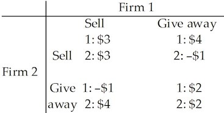

\pagenumbering{gobble}
**Chapter 15 Oligopoly**

## 15.1 What Is Oligopoly

**1\) The market structure in which natural or legal barriers prevent the**
entry of new firms and a small number of firms compete is

A\) monopoly.

B\) monopolistic competition.

C\) perfect competition.

D\) oligopoly.

E\) duopoly.

---
---
Answer: D

---

**2\) Suppose that industry *A* consists of four firms who collectively**
control 96 percent of total sales in the market. We can conclude that
industry *A* is

A\) perfectly competitive.

B\) a duopoly.

C\) monopolistically competitive.

D\) an oligopoly.

E\) a monopoly.

---
---
Answer: D

---

**3\) Which one the following industries is the best example of an**
oligopoly?

A\) the market for wheat

B\) the fast-food industry

C\) the automobile industry

D\) the clothing industry

E\) the restaurant industry

---
---
Answer: C

---

**4\) Which one of the following industries is the best example of an**
oligopoly?

A\) the battery industry

B\) the sporting goods industry

C\) the footwear industry

D\) the cosmetics industry

E\) the power industry

---
---
Answer: A

---

**5\) Which one of the following characteristics applies to oligopolistic**
markets?

A\) There is a large number of firms.

B\) The absence of barriers to entry of firms.

C\) Firms are large relative to the size of the market.

D\) All firms are price takers.

E\) Firms produce only

---
---
Answer: C

---

**6\) Which one of the following characteristics applies to oligopolistic**
markets?

A\) There is free entry of rival firms.

B\) Firms are so large relative to the market that they do not have to
consider the behaviour of rival firms.

C\) Firms are mutually independent because there are many firms in the
industry.

D\) Firms have to consider the behaviour of their rivals since their
rivals are also large relative to the size of the market as a whole.

E\) Economic profit of each firm equals zero.

---
---
Answer: D

---

**7\) Why might only a few firms dominate an oligopolistic industry?**

A\) A natural or legal barrier to entry exists.

B\) Perfectly elastic demand makes small-scale operation economically
inefficient.

C\) Decreasing returns to scale may make small-scale firms more
advantageous.

D\) Inelastic market demand leads to the domination of the industry by a
few firms.

E\) It is due to the outcome of the prisoners\' dilemma.

---
---
Answer: A

---

**8\) Firm *X* is competing in an oligopolistic industry. When firm *X***
increases its price

A\) then rival firm *Y* will always increase its price.

B\) then rival firm *Y* will increase its market share if firm *Y* also
increases its price.

C\) then the behaviour of rival firm *Y* will have no impact on the
market share of firm *X*.

D\) the market as a whole will become less profitable.

E\) the rival firm *Y* will increase its market share if firm *Y* keeps a
constant price.

---
---
Answer: E

---

**9\) Which is *not* a characteristic of oligopoly?**

A\) Each firm faces a downward-sloping demand curve.

B\) Firms are profit-maximizers.

C\) The sales of one firm will not have a significant effect on other
firms.

D\) There is more than one firm in the industry.

E\) Firms set prices.

---
---
Answer: C

---

**10\) If the efficient scale of production only allows three firms to**
supply a market, the market is a

A\) three-firm monopoly.

B\) cost-based oligopoly.

C\) natural oligopolgy.

D\) monopolistic competition.

E\) competitive monopoly.

---
---
Answer: C

---

**11\) A cartel is a group of firms which agree to**

A\) behave competitively.

B\) raise the price of their products.

C\) lower the price of their products.

D\) increase the amount they produce.

E\) cheat on each other.

---
---
Answer: B

---

**12\) Because an oligopoly has a small number of firms**

A\) each firm can act like a monopoly.

B\) the firms may legally form a cartel.

C\) the HHI for the industry is small.

D\) the four-firm concentration ratio for the industry is small.

E\) the firms are interdependent.

---
---
Answer: E

---

**13\) Complete the following sentence. A duopoly is**

A\) a market where three dominant firms collude to decide the
profit-maximizing price.

B\) a market where two firms compete for profit and market share.

C\) the same as a monopoly.

D\) not an oligopoly.

E\) a market with two distinct products.

---
---
Answer: B

---

**14\) A duopoly occurs when \_\_\_\_\_\_\_\_.**

A\) there are only two producers of a particular good competing in the
same market

B\) there are two producers of two goods competing in an oligopoly market

C\) there are numerous producers of two goods competing in a competitive
market

D\) the one producer of two goods sells the goods in a monopoly market

E\) a competitive market produces two goods

---
---
Answer: A

---

*\
Use the figure below to answer the following question.*

**Figure 15.1.1**

In the figure, *D* is the demand curve for taxi rides in a town, and
*ATC* is the average total cost curve of a taxi company.

**15\) Refer to Figure 15.1.1. In the scenario above, the market is:**

A\) A natural duopoly

B\) A natural oligopoly with three firms

C\) A natural monopoly

D\) Monopolistically competitive

E\) perfectly competitive

---
---
Answer: A

---

**16\) A monopolistically competitive firm is like an oligopolistic firm**
insofar as

A\) both face perfectly elastic demand.

B\) both can earn an economic profit in the long run.

C\) both have *MR* curves that lie beneath their demand curves.

D\) neither is protected by high barriers to entry.

E\) both are price takers.

---
---
Answer: C

---

**17\) An oligopoly is a market structure in which there**

A\) are a few buyers but many sellers.

B\) are no barriers to entry.

C\) are many independent sellers.

D\) are a few goods sold by many sellers.

E\) is a temptation to collude.

---
---
Answer: E

---

**18\) The distinguishing features of oligopoly are \_\_\_\_\_\_\_\_ and**
\_\_\_\_\_\_\_\_ in the industry.

A\) no barriers to entry; a small number of firms

B\) barriers to entry; a large number of firms

C\) no barriers to entry; a large number of firms

D\) barriers to entry; one firm

E\) barriers to entry; a small number of firms

---
---
Answer: E

---

**19\) Oligopoly is similar to**

A\) perfect competition because both market types produce identical
goods.

B\) perfect competition because both firms in both market types make zero
economic profit in the long run. [ ]{.underline}

C\) monopoly because both market types have barriers to entry.

D\) monopoly because both market types have a single firm.

E\) monopolistic competition because firms in both markets face a
perfectly elastic demand.

---
---
Answer: C

---

**20\) In an oligopoly market, the Herfindahl-Hirschman Index is usually**

A\) below 1,800.

B\) zero. [ ]{.underline}

C\) above 1,800.

D\) equal to 10,000.

E\) between 100 and 1,000.

---
---
Answer: C

---

## 15.2 Oligopoly Games

**1\) All games share four common features. They are**

A\) costs, prices, profit, and strategies.

B\) revenues, elasticity, profit, and payoffs.

C\) rules, strategies, profit, and outcome.

D\) patents, copyrights, barriers to entry, and rules.

E\) rules, strategies, payoffs, and outcome.

---
---
Answer: E

---

**2\) Prisoners\' dilemma describes a case where**

A\) collusion of the participants leads to the best solution from their
point of view.

B\) rivalry among a large number of rivals leads to lower overall profit.

C\) one prisoner has no chance to be acquitted since there is no other
prisoner to support his testimony.

D\) a prisoner has no incentive to confess to his crime, and stands a
greater chance of not going to prison.

E\) rivalry of the participants leads to the worst solution from their
point of view.

---
---
Answer: E

---

*\
Use the table below to answer the following questions.*

**Table 15.2.1**

**3\) Refer to Table 15.2.1. This table includes the sentences that Bob and**
Joe will receive if convicted. They have been apprehended by the police
under the suspicion of committing armed robbery. The two are immediately
separated and questioned about the case. Which one of the following
observations is correct?

A\) Bob would be smart to confess no matter what Joe does.

B\) Joe would be smart not to confess no matter what Bob does.

C\) Both Bob and Joe would be better off not confessing if they both do
not confess.

D\) Both Bob and Joe would be better off \"coming clean\" and confessing
to their crime.

E\) Both Bob and Joe have a dominant strategy of not confessing.

---
---
Answer: C

---

**4\) Refer to Table 15.2.1. This table includes the sentences that Bob and**
Joe will receive if convicted. They have been apprehended by the police
under the suspicion of committing armed robbery. The two are immediately
separated and questioned about the case. Which one of the following
observations is correct?

A\) If Joe confesses, Bob would be better off not confessing.

B\) If Bob confesses, Joe would be better off confessing.

C\) The outcome of the game, assuming Joe and Bob cannot collude, is they
will both go free.

D\) If Joe does not confess, Bob would be better off confessing.

E\) The outcome of the game, assuming Joe and Bob cannot collude, is they
will both confess.

---
---
Answer: B

---

**5\) Which one of the following is *not* a feature common to all games?**

A\) rules

B\) collusion

C\) strategies

D\) payoffs

E\) an outcome

---
---
Answer: B

---

**6\) In the prisoners\' dilemma with players Art and Bob, each prisoner**
would be best off if

A\) both prisoners confess.

B\) both prisoners deny.

C\) Art denies and Bob confesses.

D\) Bob denies and Art confesses.

E\) none of the above is done.

---
---
Answer: B

---

**7\) In the prisoners\' dilemma, with players Art and Bob, the dominant**
strategy equilibrium is that

A\) both prisoners confess.

B\) neither prisoner confesses.

C\) Art denies and Bob confesses.

D\) indeterminate.

E\) Bob denies and Art confesses.

---
---
Answer: A

---

**8\) A dominant strategy equilibrium occurs when**

A\) there is a clear strategy for each player independent of the other
player\'s actions.

B\) each player takes the best possible action given the other player\'s
action.

C\) each player complies with the collusive agreement.

D\) you cooperate until the other player cheats, and then you cheat
forever.

E\) none of the above.

---
---
Answer: A

---

**9\) A Nash equilibrium occurs when**

A\) there is a clear strategy for each player independent of the other
player\'s actions.

B\) each player takes the best possible action given the other player\'s
action.

C\) each player complies with the collusive agreement.

D\) you cooperate until the other player cheats, and then you cheat
forever.

E\) none of the above.

---
---
Answer: B

---

**10\) For a cartel to succeed,**

A\) it does not need the cooperation of a majority of firms in the
industry.

B\) there must be free entry of rival firms.

C\) consumers must have alternative products available to satisfy the
same need.

D\) no major producer can remain outside the agreement of the cartel.

E\) the industry must have an elastic demand.

---
---
Answer: D

---

**11\) Once a cartel determines the profit-maximizing price,**

A\) all members of the cartel have a strong incentive to abide by the
agreed-upon price.

B\) each member will face the temptation to cheat on the cartel price to
increase its sales and profit.

C\) changes in the output of any member firms will have no impact on the
market price.

D\) entry into the industry of rival firms will have no impact on the
profit of the cartel.

E\) entry into the industry of rival firms will raise cartel profit as
long as the new firms join the cartel.

---
---
Answer: B

---

**12\) In a cartel, the incentive to cheat is significant because**

A\) each individual member has the incentive to restrict its own output
to maximize profit.

B\) the marginal cost is equal to the cartel price at the
profit-maximizing output level.

C\) each firm has the incentive to lower its price to sell more than the
allotted amount.

D\) each firm has the incentive to cheat by raising its price to maximize
profit.

E\) price is less than marginal cost for each member of the cartel.

---
---
Answer: C

---

**13\) If there is a successful collusive agreement in a duopoly to**
maximize profit,

A\) the market price will equal the marginal cost of production.

B\) the market price will equal the average total cost of production.

C\) the price will be the same as the price in a perfectly competitive
market.

D\) the price will be the monopoly price.

E\) the market marginal revenue will be the same as the demand curve.

---
---
Answer: D

---

**14\) If a duopoly collusive agreement is made that maximizes joint**
profit,

A\) each of the duopolists has no incentive to cheat on the agreement.

B\) each duopolist has the incentive to cheat on the duopoly agreement by
lowering the price.

C\) each duopolist has the incentive to cheat on the agreement by
increasing the price to make monopoly profit.

D\) there is no concern over the entrance of potential rivals, since they
cannot decrease the duopolists\' profit.

E\) the dominant strategy is to collude.

---
---
Answer: B

---

**15\) Consider a duopoly with collusion. If the duopoly maximizes profit,**

A\) each firm will produce the same amount.

B\) each firm will produce its maximum output possible.

C\) industry marginal revenue will equal industry marginal cost at the
level of total output.

D\) industry demand will equal industry marginal cost at the level of
total output.

E\) none of the above.

---
---
Answer: C

---

**16\) The firms Trick and Gear form a cartel to collude to maximize**
profit. If this game is nonrepeated, the Nash equilibrium is

A\) both firms cheat on the agreement.

B\) both firms comply with the agreement.

C\) Trick cheats, while Gear complies with the agreement.

D\) Gear cheats, while Trick complies with the agreement.

E\) unknown.

---
---
Answer: A

---

*\
Use the table below to answer the following questions.*

**Table 15.2.2**

**17\) Table 15.2.2 gives the payoff matrix in terms of economic profit for**
firms *A* and *B* when there are two strategies facing each firm: (1)
charge a low price, or (2) charge a high price. The equilibrium in this
game (played once) will be a dominant strategy equilibrium because

A\) firm *B* will reduce profit by more than *A* if both charge a lower
price.

B\) firm *B* is the dominant firm.

C\) the best strategy for each firm does not depend on the strategy
chosen by the other firm.

D\) there is no credible threat by either firm to \"punish\" the other if
it breaks the agreement.

E\) all of the above.

---
---
Answer: C

---

**18\) Table 15.2.2 gives the payoff matrix in terms of economic profit for**
firms *A* and *B* when there are two strategies facing each firm: (1)
charge a low price, or (2) charge a high price. Refer to the nonrepeated
game in the table. In Nash equilibrium, firm *A* will make an economic
profit of

A\) -\$10.

B\) \$2.

C\) \$10.

D\) \$20.

E\) \$5.

---
---
Answer: B

---

**19\) Table 15.2.2 gives the payoff matrix in terms of economic profit for**
firms *A* and *B* when there are two strategies facing each firm: (1)
charge a low price, or (2) charge a high price. Refer to the nonrepeated
game in the table. If both firms could successfully collude, what would
be firm *A*\'s economic profit?

A\) -\$10

B\) \$2

C\) \$10

D\) \$20

E\) \$5

---
---
Answer: C

---

**20\) Consider a cartel consisting of several firms that is maximizing**
total profit. If one firm cheats on the cartel agreement by cutting its
price and increasing its output, the best response of the other firms is
to

A\) cancel the cheating firm\'s membership in the cartel.

B\) continue to sell at the agreed-upon price.

C\) raise their price to recapture lost profit.

D\) cut their prices as well.

E\) cut output to keep total cartel output at its original level.

---
---
Answer: D

---

**21\) It is Which one of the following is the most important reason?**

A\) Each firm has an incentive to collude.

B\) Other firms will enter the industry.

C\) Firms in the cartel will want to raise the price.

D\) Consumers will eventually decide not to buy the cartel\'s output.

E\) Each firm has an incentive to cheat.

---
---
Answer: E

---

**22\) There exists an incentive to cheat on a collusive agreement as long**
as

A\) price equals marginal cost.

B\) price equals marginal revenue.

C\) price exceeds marginal cost.

D\) price is above minimum average total cost.

E\) none of the above.

---
---
Answer: C

---

*\
Use the table below to answer the following question.*

**Table 15.2.3**

**23\) Refer to Table 15.2.3. Store X and Store Y must decide whether or**
not to lower their prices. The table gives the economic profit made by
Store X and Store Y. Which one of the following observations is correct?

A\) Both Store *X* and Store *Y* have a dominant strategy of raising
their prices.

B\) If Store X lowers its prices and Store Y does not, Store X will earn
a \$20 profit.

C\) If Store Y lowers its prices, Store X will be better off not lowering
its prices.

D\) Both Store X and Store Y would be better off if they could collude
and agree to not lower prices.

E\) Both Store X and Store Y have a dominant strategy of lowering their
prices.

---
---
Answer: D

---

**24\) In the research and development game of chicken**

A\) the best strategy for each player is to undertake research and
development.

B\) the best strategy is for neither player to undertake research and
development.

C\) the equilibrium is for only one firm to undertake research and
development.

D\) the equilibrium is unique.

E\) no solution can be found.

---
---
Answer: C

---

*\
Use the table below to answer the following questions.*

**Table 15.2.4**

**25\) Refer to Table 15.2.4 The marketers of Budweiser Light beer and**
Miller Lite beer must decide whether or not to offer new advertising
campaigns promoting their products. The payoffs in the table are the
economic profit made by Bud and Miller. Which one of the following
observations is correct?

A\) This is not a game described as a prisoners\' dilemma.

B\) If Bud offers a new advertising campaign and Miller does not, Bud
will make a \$200 profit.

C\) Miller has a dominant strategy but Bud does not.

D\) Both Bud and Miller would be better off if they could collude and
both offer new ads.

E\) If Miller offers a new advertising campaign and Bud does not, Bud
will make a \$100 profit.

---
---
Answer: B

---

**26\) Refer to Table 15.2.4. The marketers of Budweiser Light beer and**
Miller Lite beer must decide whether or not to offer new advertising
campaigns promoting their products. The payoffs in the table are the
economic profit made by Bud and Miller. Which one of the following
observations is correct?

A\) This game has no dominant strategies.

B\) This game has no Nash equilibrium.

C\) Miller has a dominant strategy but Bud does not.

D\) Bud has a dominant strategy but Miller does not.

E\) Bud and Miller each have a dominant strategy.

---
---
Answer: E

---

**27\) Refer to Table 15.2.4. The marketers of Budweiser Light beer and**
Miller Lite beer must decide whether or not to offer new advertising
campaigns promoting their products. The payoffs in the table are the
economic profit made by Bud and Miller. Which one of the following
observations is correct?

A\) The equilibrium of the game is that both firms will conduct new
advertising campaigns.

B\) The equilibrium of the game is that neither firm will conduct a new
advertising campaign.

C\) The equilibrium solution has Bud conducting a new advertising
campaign, but not Miller.

D\) The equilibrium solution has Miller conducting a new advertising
campaign, but not Bud.

E\) There is no equilibrium to this game---the industry will have
alternating cycles of advertising and no advertising.

---
---
Answer: A

---

**28\) Refer to Table 15.2.4. The marketers of Budweiser Light beer and**
Miller Lite beer must decide whether or not to offer new advertising
campaigns promoting their products. The payoffs in the table are the
economic profit made by Bud and Miller. Which one of the following
observations is correct?

A\) This is a game described as a prisoners\' dilemma.

B\) If Bud offers a new advertising campaign and Miller does not, Bud
will earn a \$100 profit.

C\) If Bud offers a new advertising campaign, then Miller will be better
off by not offering a new advertising campaign.

D\) Both Bud and Miller would be better off if they could collude and
agree to coordinate their new advertising campaigns.

E\) If Miller does not offer a new advertising campaign, then Bud is
better off if it doesn\'t offer a new advertising campaign.

---
---
Answer: A

---

*\
Use the table below to answer the following questions.*

**Table 15.2.5**

**29\) Refer to Table 15.2.5. Two software firms have developed an**
identical new software application. They are debating whether to give
the new application away free and then sell add-ons or sell the
application at \$30 a copy. The payoff matrix is above and the payoffs
are profits in millions of dollars. What is Firm 1\'s best strategy?

A\) Give away the application regardless of what Firm 2 does.

B\) Sell the application at \$30 a copy regardless of what Firm 2 does.

C\) Give away the application only if Firm 2 sells the application.

D\) Give away the application only if Firm 2 gives away the application.

E\) Sell the application only if Firm 2 sells the application.

---
---
Answer: A

---

**30\) Refer to Table 15.2.5. Two software firms have developed an**
identical new software application. They are debating whether to give
the new application away free and then sell add-ons or sell the
application at \$30 a copy. The payoff matrix is above and the payoffs
are profits in millions of dollars. What is the Nash equilibrium of the
game?

A\) Both Firm 1 and 2 will sell the software application at \$30 a copy.

B\) Both Firm 1 and 2 will give the software application away free.

C\) Firm 1 will give the application away free and Firm 2 will sell it at
\$30.

D\) There is no Nash equilibrium to this game.

E\) Firm 1 will sell the application for \$30 and Firm 2 will give it
away.

---
---
Answer: B

---

*\
Refer to the table below to answer the following question.*

**Table 15.2.6**

**31\) Refer to Table 15.2.6. Firms A and B can conduct research and**
development (R&D) or not conduct it. R&D is costly but can increase the
quality of the product and increase sales. The payoff matrix is the
economic profits of the two firms and is given above, where the numbers
are millions of dollars. A\'s best strategy is to

A\) conduct R&D regardless of what B does.

B\) not conduct R&D regardless of what B does.

C\) conduct R&D only if B conducts R&D.

D\) conduct R&D only if B does not conduct R&D.

E\) not conduct R&D only if B does not conduct R&D.

---
---
Answer: A

---

**32\) Refer to Table 15.2.6. Firms A and B can conduct research and**
development (R&D) or not conduct it. R&D is costly but can increase the
quality of the product and increase sales. The payoff matrix is the
economic profits of the two firms and is given above, where the numbers
are millions of dollars. The Nash equilibrium occurs when

A\) both A and B conduct R&D.

B\) only A conducts R&D.

C\) only B conducts R&D.

D\) neither A nor B conduct R&D.

E\) there is no Nash equilibrium.

---
---
Answer: A

---

*\
Refer to the table below to answer the following questions.*

**Table 15.2.7**

**33\) Refer to Table 15.2.7. Disney and Fox must decide when to release**
their next films. The revenues received by each studio depends in part
on when the other studio releases its film. Each studio can release its
film at Thanksgiving or at Christmas. The revenues received by each
studio, in millions of dollars, are given in the payoff matrix above.
Which of the following statements correctly describes Fox\'s strategy
given what Disney\'s release choice may be?

A\) If Disney chooses a Thanksgiving release, Fox should choose a
Christmas release.

B\) If Disney chooses a Christmas release, Fox should choose a
Thanksgiving release.

C\) Fox should release on Christmas regardless of what Disney does.

D\) Fox should release on Thanksgiving regardless of what Disney does.

E\) Both answers A and B are correct.

---
---
Answer: E

---

**34\) Refer to Table 15.2.7. Disney and Fox must decide when to release**
their next films. The revenues received by each studio depends in part
on when the other studio releases its film. Each studio can release its
film at Thanksgiving or at Christmas. The revenues received by each
studio, in millions of dollars, are given in the payoff matrix above.
Which of the following statements correctly describes Disney\'s strategy
given what Fox\'s release choice may be?

A\) If Fox chooses a Thanksgiving release, Disney should choose a
Christmas release.

B\) If Fox chooses a Christmas release, Disney should choose a
Thanksgiving release.

C\) Disney should release on Thanksgiving regardless of what Fox does.

D\) Disney should release on Christmas regardless of what Fox does.

E\) Both answers A and B are correct.

---
---
Answer: E

---

*\
Refer to the table below to answer the following questions.*

**Table 15.2.8**

**35\) Refer to Table 15.2.8. Libertyville has two optometrists, Dr. Smith**
and Dr. Jones. Each optometrist can choose to advertise his service or
not. The incomes of each optometrist, in thousands of dollars, are given
in the payoff matrix above. Which of the following statements correctly
describes Dr. Smith\'s strategy given what Dr. Jones may do?

A\) Dr. Smith advertises no matter what Dr. Jones does.

B\) Dr. Smith does not advertise no matter what Dr. Jones does.

C\) Dr. Smith advertises only if Dr. Jones doesn\'t advertise.

D\) Dr. Smith advertises only if Dr. Jones advertises.

E\) Dr. Smith does not advertise if Dr. Jones advertises.

---
---
Answer: A

---

**36\) Refer to Table 15.2.8. Libertyville has two optometrists, Dr. Smith**
and Dr. Jones. Each optometrist can choose to advertise his service or
not. The incomes of each optometrist, in thousands of dollars, are given
in the payoff matrix above. Which of the following statements correctly
describes Dr. Jones\' strategy given what Dr. Smith may do?

A\) Dr. Jones advertises no matter what Dr. Smith does.

B\) Dr. Jones does not advertise no matter what Dr. Smith does.

C\) Dr. Jones advertises only if Dr. Smith doesn\'t advertise.

D\) Dr. Jones advertises only if Dr. Smith advertises.

E\) Dr. Jones does not advertise if Dr. Smith advertises.

---
---
Answer: A

---

**37\) Refer to Table 15.2.8. Libertyville has two optometrists, Dr. Smith**
and Dr. Jones. Each optometrist can choose to advertise his service or
not. The incomes of each optometrist, in thousands of dollars, are given
in the payoff matrix above. Which of the following statements correctly
categorizes the Nash equilibrium for the game?

A\) The game has a Nash equilibrium in which both optometrists advertise.

B\) The game has a Nash equilibrium in which both optometrists do not
advertise.

C\) The game has a Nash equilibrium in which Dr. Smith advertises and Dr.
Jones does not advertise.

D\) The game has a Nash equilibrium in which Dr. Smith does not advertise
and Dr. Jones does advertise.

E\) The game has no Nash equilibrium.

---
---
Answer: A

---

*Refer to the table below to answer the following question.*

**Table 15.2.9**

**38\) Refer to Table 15.2.9. Two students are assigned a group project.**
Each has the option to work or not work to achieve a high grade. The
payoffs are shown in the above table. Student 1

A\) works only if student 2 works.

B\) works regardless of the decision made by student 2.

C\) does not work if student 2 works.

D\) does not work regardless of what student 2 decides.

E\) works only if student 2 does not work.

---
---
Answer: B

---

*\
Refer to the table below to answer the following questions.*

**Table 15.2.10**

**39\) Refer to Table 15.2.10. Firm A and Firm B are the only producers of**
soap powder. They collude and agree to share the market equally. The
payoff matrix shows the game they play. The equilibrium of the game is
that Firm A \_\_\_\_\_\_\_\_ and Firm B \_\_\_\_\_\_\_\_.

A\) complies; cheats

B\) cheats; complies

C\) complies; complies

D\) cheats; cheats

E\) makes an economic profit; incurs an economic loss

---
---
Answer: D

---

**40\) Refer to Table 15.2.10. Firm A and Firm B are the only producers of**
soap powder. They collude and agree to share the market equally. The
equilibrium \_\_\_\_\_\_\_\_ a dominant strategy equilibrium because the
strategy in this game is for a firm \_\_\_\_\_\_\_\_.

A\) is; to comply regardless of the other firm\'s choice

B\) is not; to comply when the other firm cheats and to cheat when the
other firm complies

C\) is; to cheat regardless of the other firm\'s choice

D\) is not; to comply when the other firm complies and to cheat when the
other firm cheats

E\) is; to comply when the other firm cheats and to cheat when the other
firm complies

---
---
Answer: C

---

**41\) The equilibrium strategy for each firm in a duopolist\'s dilemma is**
to \_\_\_\_\_\_\_\_. Firms \_\_\_\_\_\_\_\_ succeed in raising price and
profits because each firm \_\_\_\_\_\_\_\_.

A\) comply; do not; makes a smaller economic profit if it complies with
the agreement, but complying with the agreement is in the social
interest, and most firms support the social interest

B\) comply; do; makes greater economic profit if it complies with the
agreement, regardless of how the other firm acts

C\) cheat; do not; makes greater economic profit if it cheats on the
agreement, regardless of how the other firm acts

D\) cheats; do; makes greater economic profit if it cheats on the
agreement, regardless of how the other firm acts

E\) cheat; do; refuses to sell at any price below the monopoly price

---
---
Answer: C

---

**42\) In a prisoners\' dilemma game, which of the following strategies**
gives the best outcome for *both* prisoners?

A\) Both prisoners deny.

B\) Both prisoners confess.

C\) One player confesses and the other player denies.

D\) Both prisoners hire good lawyers.

E\) none of the above

---
---
Answer: A

---

**43\) Caven and John have been arrested by the police, who have evidence**
that will convict them of robbing a bank. If convicted, each will
receive a sentence of 6 years for the robbery. During questioning, the
police suspect that Caven and John are responsible for a series of bank
robberies. If both confess to the series, each will receive 12 years in
jail. If only one confesses, he will receive 4 years and the one who
does not confess will receive 14 years. What is the equilibrium for this
game?

A\) Both deny.

B\) Caven confesses and John denies.

C\) John confesses and Caven denies.

D\) Both confess.

E\) None of the above

---
---
Answer: D

---

**44\) Two firms, Alpha and Beta, produce identical computer hard drives.**
They have identical costs, and the hard drives they produce are
identical. The industry is a natural duopoly. Alpha and Beta enter into
a collusive agreement, according to which they split the market equally.
If both firms comply with the agreement,

A\) together they will produce the monopoly quantity and make the
monopoly economic profit.

B\) the price of a hard drive will equal marginal cost.

C\) each firm will make zero economic profit.

D\) the oligopoly will produce more hard drives than a profit-maximizing
monopoly would produce.

E\) the oligopoly will produce fewer hard drives than a profit-maximizing
monopoly would produce.

---
---
Answer: A

---

**45\) Two firms, Alpha and Beta, produce identical computer hard drives.**
They have identical costs, and the hard drives they produce are
identical. The industry is a natural duopoly. Alpha and Beta enter into
a collusive agreement, according to which they split the market equally.
If both firms cheat on the agreement so the market is the same as a
competitive market,

A\) each firm makes zero economic profit in the long run.

B\) each firm makes the monopoly profit.

C\) the oligopoly will produce fewer hard drives than a profit-maximizing
monopoly would produce.

D\) the oligopoly will produce the same number of hard drives as a
profit-maximizing monopoly would produce.

E\) each firm incurs an economic loss and exits the market in the long
run.

---
---
Answer: A

---

**46\) The maximum *total* economic profit that can be made by colluding**
duopolists [ ]{.underline}

A\) equals the economic profit made by a monopoly.

B\) exceeds the economic profit made by a monopoly.

C\) is less than the economic profit made by a monopoly.

D\) is zero.

E\) cannot be determined.

---
---
Answer: A

---

## 15.3 Repeated Games and Sequential Games

**1\) Consider a \"prisoners\' dilemma\" game consisting of two firms in**
collusion to maximize profit. However, the game is repeated indefinitely
and each player employs a tit-for-tat strategy. The equilibrium
described here is called a

A\) credible strategy equilibrium.

B\) dominant player equilibrium.

C\) duopoly equilibrium.

D\) trigger strategy equilibrium.

E\) cooperative equilibrium.

---
---
Answer: E

---

*Use the table below to answer the following question.*

**Table 15.3.1**

**2\) Consider the game shown in Table 15.3.1 based on potential gas prices**
between two competitors. The game is played repeatedly and the result is
a cooperative equilibrium. The payoffs in the table show the economic
profit of the firms. The most likely outcome is

A\) a cycle of first \$0.95/litre, then \$1.15/litre, etc.

B\) Hare sets her prices at \$1.15/litre, and Turtle sets his at
\$0.95/litre.

C\) Hare sets her prices at \$0.95/litre, and Turtle sets his at
\$1.15/litre.

D\) both set their prices at \$1.15/litre.

E\) both set their prices at \$0.95/litre.

---
---
Answer: D

---

**3\) Limit pricing is the practice of**

A\) limiting the amount that can be purchased to drive up prices.

B\) threatening to go to the limit in a price war if someone enters your
market.

C\) charging a monopoly price, but producing a quantity greater than the
quantity at which *MC = MR*.

D\) setting the price at the highest level that inflicts a loss on the
entrant.

E\) charging a price higher than the monopoly price, but producing a
quantity greater than the quantity at which *MC = MR*.

---
---
Answer: D

---

**4\) Consider the cartel of Trick and Gear. The game is repeated**
indefinitely and each firm employs a tit-for-tat strategy. The
equilibrium is

A\) both firms cheat on the agreement.

B\) both firms comply with the agreement.

C\) Trick cheats and Gear complies with the agreement.

D\) Gear cheats and Trick complies with the agreement.

E\) unknown.

---
---
Answer: B

---

**5\) Consider the cartel of Trick and Gear. The game is repeated**
indefinitely and each firm employs a tit-for-tat strategy. The
equilibrium is called

A\) a credible strategy equilibrium.

B\) a dominant player equilibrium.

C\) a duopoly equilibrium.

D\) a trigger strategy equilibrium.

E\) a cooperative equilibrium.

---
---
Answer: E

---

**6\) Which of the following quotes shows limit pricing in the widget**
industry?

A\) \"I am producing extra widgets, even though it costs me short-run
profit, to stop Wally\'s Widgets from expanding into my market.\"

B\) \"I am producing more widgets than Wally and I agreed to in our talk
last week.\"

C\) \"If only Wally and I could agree on a higher price, we could make
more profit.\"

D\) \"I have been spending extra on research and development of my new
two-way widget.\"

E\) none of the above

---
---
Answer: A

---

**7\) Which of the following quotes shows a contestable market in the**
widget industry?

A\) \"I am producing extra widgets, even though it costs me short-run
profits, to stop Wally\'s Widgets from expanding into my market.\"

B\) \"I am producing more widgets than Wally and I agreed to in our talk
last week.\"

C\) \"If only Wally and I could agree on a higher price, we could make
more profits.\"

D\) \"I have been spending extra on research and development of my new
two-way widget.\"

E\) none of the above

---
---
Answer: A

---

**8\) Which of the following quotes shows cheating on a cartel in the**
widget industry?

A\) \"I am producing extra widgets, even though it costs me short-run
profit, to stop Wally\'s Widgets from expanding into my market.\"

B\) \"I am producing more widgets than Wally and I agreed to in our talk
last week.\"

C\) \"If only Wally and I could agree on a higher price, we could make
more profit.\"

D\) \"I have been spending extra on research and development of my new
two-way widget.\"

E\) none of the above

---
---
Answer: B

---

**9\) Limit pricing refers to**

A\) the highest price a monopolist can set.

B\) the highest price that just inflicts a loss on a potential entrant.

C\) a strategy used by entering firms in contestable markets.

D\) the lowest price a duopoly can set.

E\) none of the above.

---
---
Answer: B

---

**10\) A contestable market exists whenever**

A\) two or more firms are competing.

B\) the Herfindahl-Hirschman Index exceeds 1,800.

C\) the four-firm concentration ratio exceeds 50 percent.

D\) a monopoly contests entry into its markets.

E\) potential entry holds down prices.

---
---
Answer: E

---

**11\) When a firm cooperates if the other cooperates, but plays the Nash**
equilibrium strategy forever if the other cheats, the strategy is a

A\) dominant strategy.

B\) trigger strategy.

C\) tit-for-tat strategy.

D\) wimp\'s strategy.

E\) cooperative strategy.

---
---
Answer: B

---

**12\) A tit-for-tat strategy can be used**

A\) in a single-play game or a repeated game.

B\) in a single-play game but not a repeated game.

C\) in a repeated game but not a single-play game.

D\) in neither a repeated game nor a single-play game.

E\) only when there is no Nash equilibrium.

---
---
Answer: C

---

**13\) A trigger strategy can be used**

A\) in a single-play game or a repeated game.

B\) in a single-play game but not a repeated game.

C\) in a repeated game but not a single-play game.

D\) in neither a single-play game nor a repeated game.

E\) only when there is no Nash equilibrium.

---
---
Answer: C

---

**14\) A strategy in which a player cooperates in the current period if the**
other player cooperated in the previous period, but the player cheats in
the current period if the other player cheated in the previous period is
called a

A\) tit-for-tat strategy.

B\) trigger strategy.

C\) duopoly strategy.

D\) dominant firm strategy.

E\) Nash strategy.

---
---
Answer: A

---

**15\) A trigger strategy is one in which a player**

A\) cooperates in the current period if the other player cooperated in
the previous period, but cheats in the current period *only* if the
other player cheated in the previous period.

B\) cheats in the current period if the other player cooperated in the
previous period, but cooperates in the current period if the other
player cheated in the previous period.

C\) cooperates in the current period if the other player has always
cooperated, but cheats forever if the other player ever cheats.

D\) cheats in the current period if the other player has always cheated,
but cooperates forever if the other player has ever cooperated.

E\) None of the above.

---
---
Answer: C

---

**16\) Sarah\'s Soothing Diapers, Inc. and Orville\'s Odorless Diapers,**
Inc. are duopolists, who have agreed to collude. Orville has decided
that he will comply with the collusive agreement as long as Sarah
cooperated in the previous period. But if Sarah cheated in the previous
period, Orville will punish Sarah by cheating in the current period.
Orville\'s strategy is referred to as a

A\) Nash strategy.

B\) tit-for-tat strategy.

C\) trigger strategy.

D\) monkey-see, monkey-do strategy.

E\) dominant firm strategy.

---
---
Answer: B

---

**17\) A market with a single firm but no barriers to entry is known as**

A\) a natural monopoly.

B\) a contestable market.

C\) a perfectly competitive market.

D\) monopolistic competition.

E\) an oligopoly

---
---
Answer: B

---

**18\) A market in which firms can enter and leave so easily that firms in**
the market face competition from potential entrants is called a

A\) contestable market.

B\) cartel.

C\) limit pricing market.

D\) monopolistic competition market.

E\) natural oligopoly

---
---
Answer: A

---

**19\) Which of the following statements is *TRUE* about contestable**
markets?

A\) There are significant barriers to entry.

B\) Firms earn large economic profits.

C\) Each firm faces a perfectly elastic demand.

D\) There are few firms in the industry.

E\) None of the above.

---
---
Answer: D

---

**20\) A contestable market is similar to a perfectly competitive market in**
that there

A\) are barriers to entry.

B\) are no barriers to entry.

C\) can be only one firm in the market.

D\) will be no entry if the existing firm makes an economic profit.

E\) is a perfectly elastic demand.

---
---
Answer: B

---

**21\) In a contestable market the Herfindahl-Hirschman Index is**
\_\_\_\_\_\_\_\_ and the market behaves as if it is \_\_\_\_\_\_\_\_.

A\) low; perfectly competitive

B\) low; a monopoly

C\) high; perfectly competitive

D\) high; a monopoly

E\) zero; perfectly competitive

---
---
Answer: C

---

**22\) In a repeated game, punishments that result in heavy damages are an**
incentive for players to adopt the strategies that result in a
\_\_\_\_\_\_\_\_ equilibrium.

A\) contestable

B\) strategic

C\) complementary

D\) cooperative

E\) satisfying

---
---
Answer: D

---

## 15.4 Anti-Combine Law

**1\) Anti-combine law attempts to**

A\) support prices.

B\) establish Crown corporations.

C\) prevent monopoly behaviour.

D\) establish fair trade laws.

E\) deregulate monopolies.

---
---
Answer: C

---

**2\) Canada\'s anti-combine law dates back to the**

A\) 1880s.

B\) 1910s.

C\) 1930s.

D\) 1960s.

E\) 1980s.

---
---
Answer: A

---

**3\) Canada\'s anti-combine law is enforced by**

A\) a Competition Tribunal.

B\) the courts.

C\) Parliament.

D\) A and B.

E\) A and C.

---
---
Answer: D

---

**4\) The Competition Act distinguishes between business practices that are**
criminal and noncriminal. Which of the following are criminal practices?

A\) conspiracy to fix prices

B\) bid-rigging

C\) resale price maintenance

D\) false advertising

E\) all of the above

---
---
Answer: E

---

**5\) Choose the statement below that is *incorrect*.**

A\) The Competition Act distinguishes between practices that are criminal
and practices that are noncriminal.

B\) The Director of the Competition Bureau sends alleged violations of a
noncriminal nature to Parliament for examination.

C\) The Competition Act of 1986 established a Competition Bureau.

D\) The Competition Act of 1986 established a Competition Tribunal.

E\) Canada\'s anti-combine law dates from 1889.

---
---
Answer: B

---

**6\) Anti-combine law \_\_\_\_\_\_\_\_.**

A\) can work in the public interest to maximize total surplus or in the
self-interest of producers to maximize producer surpluses

B\) always works in the self-interest of producers to maximize producer
surpluses

C\) always works in the public interest to maximize total surplus

D\) encourages oligopolies to exhibit more monopolistic behaviours

E\) is always prosecuted in Canada\'s criminal courts

---
---
Answer: A

---

**7\) All of the following except \_\_\_\_\_\_\_\_ are noncriminal offences**
under the Competition Act.

A\) refusal to deal

B\) mergers

C\) false advertising

D\) abuse of a dominant market position

E\) exclusive dealing

---
---
Answer: C

---

**8\) A merger is unlikely to be approved if \_\_\_\_\_\_\_\_.**

A\) there are fewer than 6 firms in a market

B\) it prevents or substantially lessens competition

C\) the good produced in the market has been deemed a necessity

D\) the industry is government regulated

E\) All of the above.

---
---
Answer: B

---

**9\) The act of parliament that provides our anti-combine law is**
\_\_\_\_\_\_\_\_.

A\) the Anti-Combine Act of 1986

B\) the Anti-Combine Act of 1889

C\) the Competition Act of 1986

D\) the Competition Act of 1889

E\) the Competition Act of 1967

---
---
Answer: C

---
